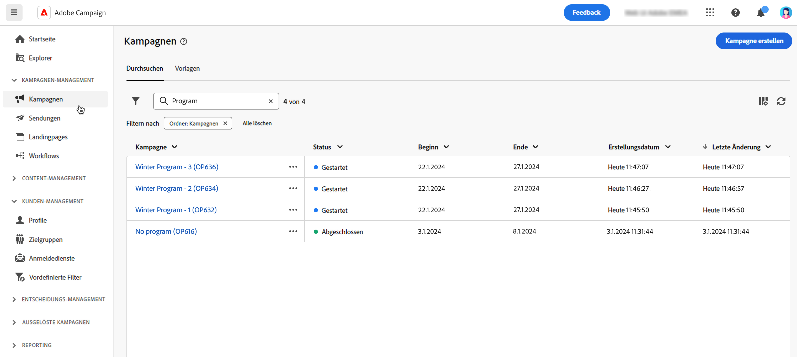

# Erste Schritte mit Kampagnen {#campaigns}

>[!CONTEXTUALHELP]
>id="acw_homepage_card5"
>title="Kanalübergreifende Kampagnen erstellen und senden"
>abstract="Mit den Adobe Campaign-Funktionen können Sie zentralisierte Kundendaten verwalten, Kundenkommunikation und Kampagnen erstellen und personalisierte Erlebnisse über verschiedene Kanäle hinweg erstellen: E-Mail, Push und SMS."

Verwenden Sie Adobe Campaign, um kanalübergreifende Kampagnen zu erstellen. Mit den Orchestrierungsfunktionen der Marketing-Kampagnen können Sie Kundendaten verwalten und zentralisieren, Kundenkommunikation und Kampagnen entwerfen und personalisierte Erlebnisse über verschiedene Kanäle hinweg erstellen. In dieser Version sind die Kanäle E-Mail, Push und SMS verfügbar.

Erstellen und führen Sie E-Mail-Kampagnen mit hohem Volumen aus, um personalisierte Nachrichten für alle Plattformen und Bildschirmgrößen bereitzustellen.
Messen Sie die Effektivität Ihrer Sendungen mit detaillierten Berichten wie Öffnungen, Klicks, Weiterleitungen und mehr. Mit den Segmentierungsfunktionen von Adobe Campaign können Sie Abfragen für eine Datenbank mit hohem Datenvolumen ausführen und einfach Segmente für dynamisches Marketing definieren, die perfekt auf Ihre Kampagnen abgestimmt sind.

## Erstellen einer Cross-Channel-Kampagne {#cross-channel-campaign}

>[!CONTEXTUALHELP]
>id="acw_campaign_creation_workflow"
>title="Liste der Workflows"
>abstract="Liste der für Ihre Kampagne verfügbaren Workflows. Verwenden Sie die Schaltfläche „Workflow erstellen“, um einen Workflow zu Ihrer Kampagne hinzuzufügen."

In einer Cross-Channel-Kampagne nutzt eine einzelne Marketing-Kommunikation verschiedene Kanäle. Daten werden zwischen den Kanälen übergeben. Der Kunde erhält die Kommunikation über mehrere Kanäle, beispielsweise aufgrund seiner Interaktion mit der vorherigen Kommunikation.

## Definieren von Kampagneneigenschaften {#campaign-properties}

>[!CONTEXTUALHELP]
>id="acw_campaign_creation_properties"
>title="Kampagnenerstellungs-Eigenschaften"
>abstract="Definieren Sie Eigenschaften und Metadaten für die Kampagne."

>[!CONTEXTUALHELP]
>id="acw_campaign_properties"
>title="Eigenschaften der Kampagne"
>abstract="Definieren Sie Kampagneneinstellungen und Metadaten."

Die Kampagneneigenschaften werden bei der Erstellung einer neuen Kampagne angezeigt.

Sie können auf die Kampagneneigenschaften auch über das Symbol **Kampagneneinstellungen konfigurieren** neben dem Kampagnentitel zugreifen.

Auf diesem Bildschirm können Sie Folgendes ändern:

## Definieren des Kampagnenkalenders {#campaign-schedule}

>[!CONTEXTUALHELP]
>id="acw_campaign_creation_schedule"
>title="Kampagnenerstellungs-Zeitplan"
>abstract="Wählen Sie im Bereich „Planung“ Ihrer Kampagneneigenschaften den gewünschten Zeitraum aus. Die Kampagne beginnt, wenn das Anfangsdatum erreicht wird."

Verwenden Sie den Bereich **Planung** in den Kampagneneigenschaften, um den Zeitrahmen auszuwählen. Die Kampagne beginnt, wenn das Anfangsdatum erreicht wird.

Anfangs- und Enddatum werden in der Kampagnenliste angezeigt und können als Filter verwendet werden.

Um Ihren Kampagnenkalender zu filtern, öffnen Sie die Filter und verwenden Sie den Abschnitt **Anfangsdatum – Enddatum**:

