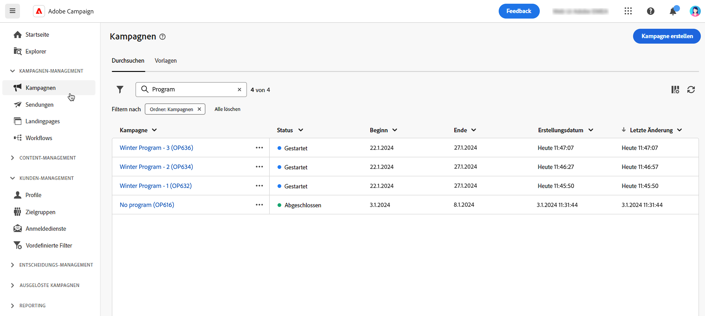
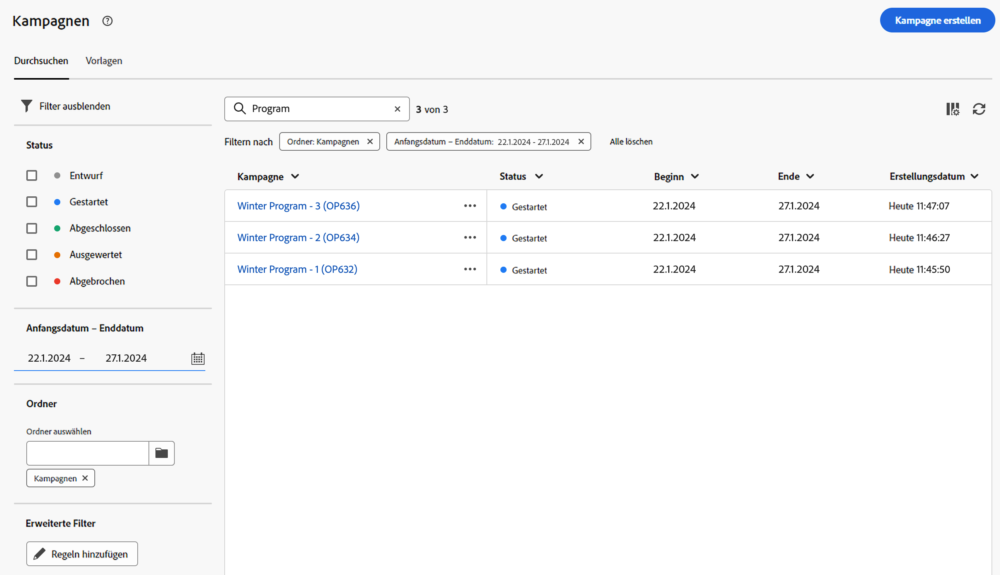
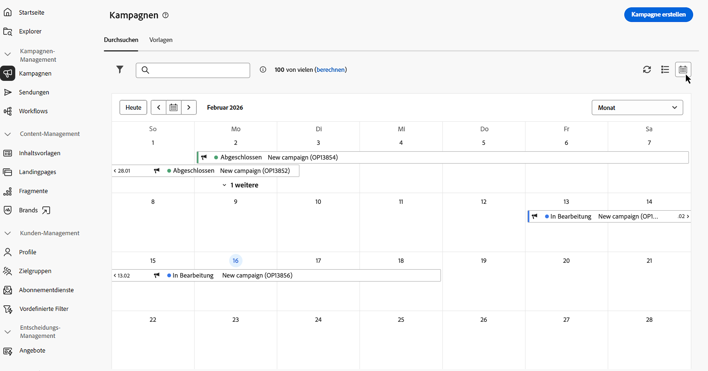
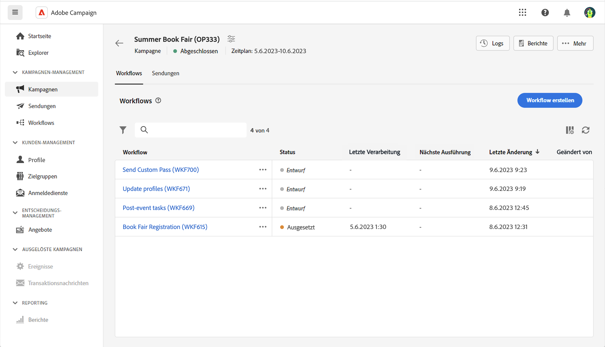
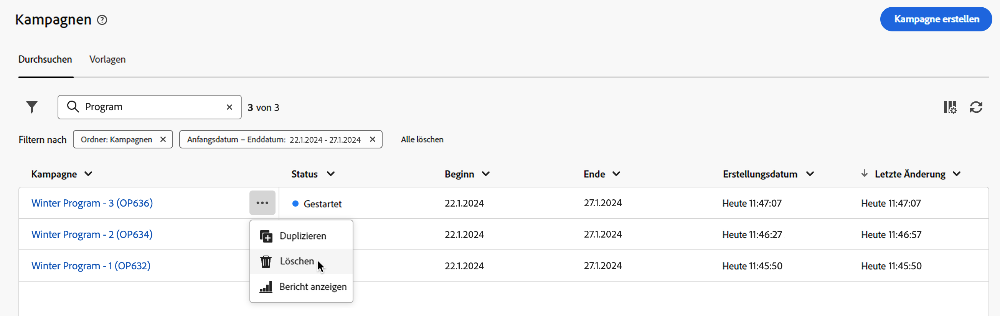
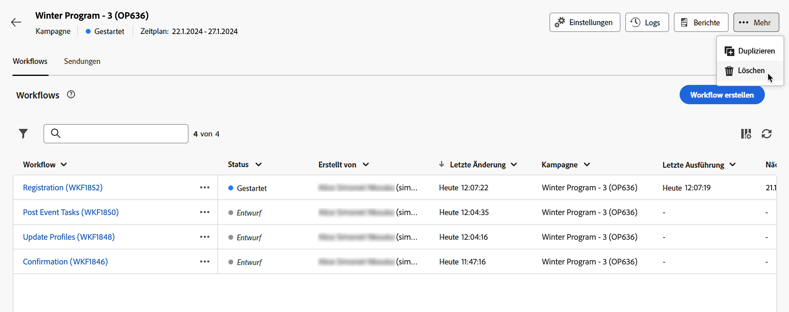

# Zugreifen auf und Verwalten von Kampagnen {#manage-campaigns}

>[!CONTEXTUALHELP]
>id="acw_campaign_schedule"
>title="Kampagnenzeitplan"
>abstract="Legen Sie Ihren Kampagnenzeitplan fest oder ändern Sie ihn."

Um auf Ihre Kampagnen zuzugreifen und sie zu verwalten, klicken Sie auf das Menü **[!UICONTROL Kampagnen]** in der linken Navigation. Zwei Registerkarten sind verfügbar:

* Die Registerkarte **Durchsuchen** enthält alle vorhandenen Kampagnen. Sie können auf eine Kampagne klicken, um ihr Dashboard zu öffnen, oder eine neue Kampagne erstellen, indem Sie auf die Schaltfläche **Kampagne erstellen** klicken. Weitere Informationen finden Sie in diesem [Abschnitt](create-campaigns.md#create-campaigns).

* Auf der Registerkarte **Vorlagen** sind alle verfügbaren Kampagnenvorlagen aufgeführt. Sie können eine vorhandene Vorlage anzeigen oder eine neue erstellen. [Weitere Informationen](#manage-campaign-templates)

## Kampagnenbestand {#inventory}

In der Registerkarte **[!UICONTROL Durchsuchen]** finden Sie Informationen zum Status der aktuellen Kampagne, Start- und Enddatum, Erstellungsdatum, Datum der letzten Änderung etc. Sie können die angezeigten Spalten anpassen, indem Sie rechts oben in der Liste auf das Symbol **Spalte für ein benutzerdefiniertes Layout konfigurieren** klicken. So können Sie Spalten hinzufügen oder entfernen und Informationen in der Kampagnenliste neu anordnen.

### Durchsuchen und Filtern des Bestands {#search-and-filter}

Für eine einfachere Suche in der Liste sind eine Suchleiste und Filter verfügbar. [Weitere Informationen](../get-started/user-interface.md#list-screens). Sie können beispielsweise nach Ihrem Kampagnenkalender filtern. Öffnen Sie das Panel „Filter“ und verwenden Sie den Abschnitt **Anfangsdatum – Enddatum**:

### Zeitleistenansicht {#timeline}

Standardmäßig wird auf dem Kampagnenbildschirm die **Listenansicht** (Bestand) angezeigt. Mit dem Anzeige-Umschalter können Sie jederzeit zur **Timeline-Ansicht** wechseln. Beide Ansichten zeigen dieselben Kampagnen und nutzen dieselben Filter und Suchen. Wenn Sie in einer Ansicht die Filter ändern oder Suchvorgänge durchführen, spiegelt die andere Ansicht dieselbe Auswahl wider.

Die Timeline-Ansicht hilft Ihnen bei der Visualisierung und Verwaltung Ihrer Kampagnen im Zeitverlauf. Sie können alle Ihre Kampagnen in einem zeitbasierten Format anzeigen, sodass Sie Ihre Marketing-Aktivitäten einfacher planen, terminieren und koordinieren können.

**Funktionsweise der Timeline:**

* In der Timeline werden Ihre Kampagnen entsprechend ihrem Start- und Enddatum angezeigt. Kampagnen, die sich über mehrere Tage erstrecken, werden über die relevanten Datumsbereiche hinweg angezeigt.
* Sie können nach Woche, Monat oder Tag navigieren. Verwenden Sie die Datumsauswahl oder die Pfeilschaltflächen, um zwischen Zeiträumen zu wechseln. Mit der Schaltfläche **Heute** können Sie schnell zum aktuellen Datum zurückkehren.
* Wenn Sie eine Kampagne auswählen, wird auf der rechten Seite ein Panel mit Kampagnendetails geöffnet: Status, Start- und Enddatum, Liste der Workflows und Liste der Sendungen. Sie können vom Panel aus zu diesen Workflows und Sendungen navigieren.
* Wenn viele Kampagnen auf dasselbe Datum fallen, werden in Bearbeitung befindliche Kampagnen in der Anzeige priorisiert.
* Wenn viele Kampagnen auf einen einzelnen Tag fallen (z. B. in der Monatsansicht), können Sie den Tag mit dem Steuerelement **Mehr** erweitern, um die vollständige Menge für diesen Tag anzuzeigen, oder zur Wochen- oder Tagesansicht wechseln, um weitere Details anzuzeigen.

## Kampagnen-Dashboard {#campaign-dashboard}

>[!CONTEXTUALHELP]
>id="acw_campaign_delivery_list"
>title="Liste der Sendungen in der Kampagne"
>abstract="Die Registerkarte **Sendungen** listet jeden mit der Kampagne verbundenen Versand auf. Klicken Sie auf den Namen eines Versands, um ihn zu bearbeiten. Verwenden Sie die Schaltfläche „Versand erstellen“, um einen neuen Versand für diese Kampagne hinzuzufügen."

>[!CONTEXTUALHELP]
>id="acw_campaign_workflow_list"
>title="Workflow-Liste in einer Kampagne"
>abstract="Die Registerkarte **Workflows** enthält alle mit der aktuellen Kampagne verknüpften Workflows."

Klicken Sie in der Kampagnenliste auf der Registerkarte **Durchsuchen** auf den Namen einer Kampagne, um deren Details anzuzeigen.

Der Status und der Zeitplan der Kampagne werden oben im Bildschirm angezeigt. Verwenden Sie die Schaltfläche **Einstellungen**, um die Eigenschaften Ihrer Kampagne zu aktualisieren, z. B. das Label, den Ordner und die Beschreibung. Sie können die Planung Ihrer Kampagne auch über den Einstellungsbildschirm ändern. Weiterführende Informationen zur Kampagnenplanung finden Sie in [diesem Abschnitt](create-campaigns.md#campaign-schedule).

Verwenden Sie auf dem Kampagnen-Dashboard die Schaltflächen **Protokolle** und **Berichte**, um Ihre Kampagne zu überwachen. Weitere Informationen finden Sie in diesem [Abschnitt](create-campaigns.md#create-campaigns).

Für jede Kampagne zeigt das Dashboard zwei Hauptregisterkarten: „Workflows“ und „Sendungen“.

* Auf der Registerkarte **Workflows** werden alle mit der Kampagne verknüpften Workflows aufgelistet. Auf dieser Registerkarte können Sie auch einen neuen Workflow innerhalb der Kampagne erstellen. Weitere Informationen finden Sie in diesem [Abschnitt](create-campaigns.md#create-campaigns).

* Die Registerkarte **Sendungen** listet alle in der aktuellen Kampagne erstellten Sendungen auf. Sie können auch einen neuen Versand innerhalb der Kampagne erstellen. Weitere Informationen finden Sie in diesem [Abschnitt](create-campaigns.md#create-campaigns).

>[!NOTE]
>
>Auf der Registerkarte **Sendungen** werden alle mit der Kampagne verbundenen Sendungen angezeigt. Sendungen, die in einem Workflow erstellt wurden, können dort jedoch nicht gelöscht werden. Um einen im Rahmen eines Workflows erstellten Versand zu löschen, löschen Sie die Versandaktivität aus dem Workflow. [Weitere Informationen](../msg/gs-messages.md#delivery-delete).

## Löschen einer Kampagne {#campaign-delete}

Sie haben zwei Möglichkeiten, eine Kampagne zu löschen:

* Klicken Sie in der Kampagnenliste auf die Schaltfläche mit den Auslassungspunkten und wählen Sie dann **Löschen** aus.

  

* Klicken Sie in der Kampagne selbst auf die Schaltfläche **Mehr** und wählen Sie dann **Löschen** aus.

  

## Duplizieren einer Kampagne {#campaign-duplicate}

Sie haben zwei Möglichkeiten, eine Kampagne zu duplizieren:

* Klicken Sie in der Kampagnenliste auf die Schaltfläche mit den Auslassungspunkten und wählen Sie dann **Duplizieren** aus.

* Klicken Sie in der Kampagne selbst auf die Schaltfläche **Mehr** und wählen Sie dann **Duplizieren** aus.

Bestätigen Sie in beiden Fällen die Duplizierung, um die neue Kampagne zu erstellen. Das Label der Kampagne lautet **Kopie von`<label of the initial campaign>`**. Gehen Sie zu den Kampagneneinstellungen, um diesen Titel zu aktualisieren.

## Arbeiten mit Kampagnenvorlagen {#manage-campaign-templates}

Kampagnenvorlagen enthalten vorkonfigurierte Einstellungen, die zum Erstellen neuer Kampagnen wiederverwendet werden können. Für die ersten Schritte steht Ihnen eine Reihe integrierter Vorlagen zur Verfügung. Sie können Ihre Kampagnenvorlagen erstellen und konfigurieren und dann Kampagnen aus diesen Vorlagen erstellen.

Eine Kampagnenvorlage kann die folgenden Informationen speichern:

* Die **Kampagneneinstellungen**
* Die **Kampagnenplanung**
* Workflow-Vorlagen
* Versandvorlagen

Gehen Sie wie folgt vor, um eine Kampagnenvorlage zu erstellen:

1. Klicken Sie auf das Menü **[!UICONTROL Kampagnen]**, navigieren Sie zur Registerkarte **Vorlagen** und klicken Sie auf die Schaltfläche **[!UICONTROL Vorlage erstellen]**.
1. Wählen Sie die **Vorlage** aus, die verwendet werden soll. Auf diese Weise können Sie Ihre neue Vorlage auf der Grundlage einer zuvor erstellten Vorlage erstellen.
1. Geben Sie einen Titel für Ihre Vorlage an.
1. Ändern Sie bei bei Bedarf die folgenden **zusätzlichen Optionen**: interner Name, Ordner, Zuweisung, Beschreibung und Art.
1. Definieren Sie den **Zeitplan** für Ihre Kampagne. Erfahren Sie in [diesem Abschnitt](create-campaigns.md#campaign-schedule), wie Sie Ihre Kampagnenplanung festlegen.
1. Wählen Sie **Erstellen** aus.
1. Fügen Sie Ihrer Kampagne Workflows und Versandvorlagen hinzu.
