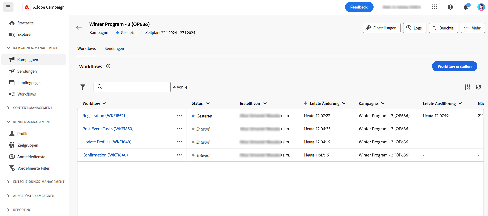

# Zugreifen auf und Verwalten von Kampagnen{#manage-campaigns}

>[!CONTEXTUALHELP]
>id="acw_campaign_schedule"
>title="Kampagnenzeitplan"
>abstract="Legen Sie Ihren Kampagnenzeitplan fest oder ändern Sie ihn."

Um auf Ihre Kampagnen zuzugreifen und sie zu verwalten, klicken Sie auf das **[!UICONTROL Kampagnen]** im linken Navigationsmenü.

## Kampagnenliste {#access-campaigns}

In der Kampagnenliste stehen zwei Registerkarten zur Verfügung:

* Die Registerkarte **Durchsuchen** enthält alle vorhandenen Kampagnen. Sie können auf eine Kampagne klicken, um ihr Dashboard zu öffnen, oder eine neue Kampagne erstellen, indem Sie auf die Schaltfläche **Kampagne erstellen** klicken. Weitere Informationen finden Sie in [diesem Abschnitt](create-campaigns.md#create-campaigns).

* Auf der Registerkarte **Vorlagen** sind alle verfügbaren Kampagnenvorlagen aufgeführt. Sie können eine vorhandene Vorlage anzeigen oder eine neue erstellen. [Weitere Informationen](#manage-campaign-templates)

Standardmäßig zeigt jede Kampagne in der Liste Informationen zu ihrem aktuellen Status, Start- und Enddatum, Erstellungsdatum, letzten Änderungszeitpunkt usw. an.

Sie können die angezeigten Spalten anpassen, indem Sie auf das Symbol **Spalte für ein benutzerdefiniertes Layout konfigurieren** in der oberen rechten Ecke der Liste klicken. Auf diese Weise können Sie Spalten hinzufügen oder entfernen und die Informationen in der Kampagnenliste neu anordnen.

Darüber hinaus stehen eine Suchleiste und Filter zur Verfügung, um die Suche innerhalb der Liste zu erleichtern. [Weitere Informationen](../get-started/user-interface.md#list-screens).

Sie können beispielsweise nach Ihrem Kampagnenkalender filtern. Öffnen Sie das Panel „Filter“ und verwenden Sie den Abschnitt **Anfangsdatum – Enddatum**:

## Kampagnen-Dashboard {#campaign-dashboard}

>[!CONTEXTUALHELP]
>id="acw_campaign_delivery_list"
>title="Liste der Sendungen in der Kampagne"
>abstract="Die Registerkarte **Sendungen** listet jeden mit der Kampagne verbundenen Versand auf. Klicken Sie auf den Namen eines Versands, um ihn zu bearbeiten. Verwenden Sie die Schaltfläche „Versand erstellen“, um einen neuen Versand für diese Kampagne hinzuzufügen."

Im **Durchsuchen** auf einen Kampagnennamen klicken, um dessen Details anzuzeigen.

Der Status und der Zeitplan der Kampagne werden oben im Bildschirm angezeigt. Sie können die **Einstellungen** -Schaltfläche, um die Eigenschaften Ihrer Kampagne zu aktualisieren, z. B. Titel, Ordner und Beschreibung. Sie können den Kampagnenkalender auch im Einstellungsbildschirm ändern. Weitere Informationen zum Kampagnenkalender finden Sie unter [diesem Abschnitt](create-campaigns.md#campaign-schedule).

Verwenden Sie im Kampagnen-Dashboard die **Protokolle** und **Berichte** -Schaltflächen zur Überwachung Ihrer Kampagne. Weitere Informationen finden Sie hier . [Abschnitt](create-campaigns.md#create-campaigns)

Für jede Kampagne werden im Dashboard zwei Hauptregisterkarten angezeigt: Workflows und Sendungen.

* Die **Workflows** enthält alle mit der Kampagne verbundenen Workflows. In dieser Registerkarte können Sie auch einen neuen Workflow innerhalb der Kampagne erstellen. Weitere Informationen finden Sie in [diesem Abschnitt](create-campaigns.md#create-campaigns).

* Die **Sendungen** enthält alle in der aktuellen Kampagne erstellten Sendungen. Sie können auch einen neuen Versand innerhalb der Kampagne erstellen. Weitere Informationen finden Sie in [diesem Abschnitt](create-campaigns.md#create-campaigns).

>[!NOTE]
>
>Auf der Registerkarte **Sendungen** werden alle mit der Kampagne verbundenen Sendungen angezeigt. Sendungen, die in einem Workflow erstellt wurden, können dort jedoch nicht gelöscht werden. Um einen im Rahmen eines Workflows erstellten Versand zu löschen, ist die Löschung der Versandaktivität aus dem Workflow erforderlich. [Weitere Informationen](../msg/gs-messages.md#delivery-delete).

## Kampagne löschen {#campaign-delete}

Sie haben zwei Möglichkeiten, eine Kampagne zu löschen:

* Klicken Sie in der Kampagnenliste auf die Suchschaltfläche und wählen Sie **Löschen**

  

* Klicken Sie in der Kampagne selbst auf die Schaltfläche **Mehr** Schaltfläche und wählen Sie **Löschen**

  

## Kampagnen duplizieren {#campaign-duplicate}

Sie haben zwei Möglichkeiten, eine Kampagne zu duplizieren:

* Klicken Sie in der Kampagnenliste auf die Suchschaltfläche und wählen Sie **Duplizieren**

* Klicken Sie in der Kampagne selbst auf die Schaltfläche **Mehr** Schaltfläche und wählen Sie **Duplizieren**

Bestätigen Sie in beiden Fällen die Duplizierung, um die neue Kampagne zu erstellen. Titel der Kampagne **Kopie von`<label of the initial campaign`**. Navigieren Sie zu den Kampagneneinstellungen , um diesen Titel zu aktualisieren.

## Arbeiten mit Kampagnenvorlagen{#manage-campaign-templates}

Kampagnenvorlagen enthalten vorkonfigurierte Einstellungen, die zum Erstellen neuer Kampagnen wiederverwendet werden können. Für die ersten Schritte steht Ihnen eine Reihe integrierter Vorlagen zur Verfügung. Sie können Ihre Kampagnenvorlagen erstellen und konfigurieren und dann Kampagnen aus diesen Vorlagen erstellen.

Eine Kampagnenvorlage kann die folgenden Informationen speichern:

* die Kampagne **Einstellungen**
* die Kampagne  **Zeitplan**
* Workflow-Vorlagen
* Versandvorlagen

Gehen Sie wie folgt vor, um eine Kampagnenvorlage zu erstellen:

1. Klicken Sie auf das Menü **[!UICONTROL Kampagnen]**, navigieren Sie zur Registerkarte **Vorlagen** und klicken Sie auf die Schaltfläche **[!UICONTROL Vorlage erstellen]**.
1. Wählen Sie die **Vorlage** aus, die verwendet werden soll. Auf diese Weise können Sie Ihre neue Vorlage auf der Grundlage einer zuvor erstellten Vorlage erstellen.
1. Geben Sie einen Titel für Ihre Vorlage an.
1. Bei Bedarf können Sie die folgenden **zusätzlichen Optionen** ändern: interner Name, Ordner, Zuweisung, Beschreibung und Art.
1. Definieren Sie den **Zeitplan** für Ihre Kampagne. Erfahren Sie in [diesem Abschnitt](create-campaigns.md#campaign-schedule), wie Sie Ihren Kampagnenzeitplan festlegen.
1. Klicken Sie auf **Erstellen**.
1. Fügen Sie Ihrer Kampagne Workflows und Versandvorlagen hinzu.
