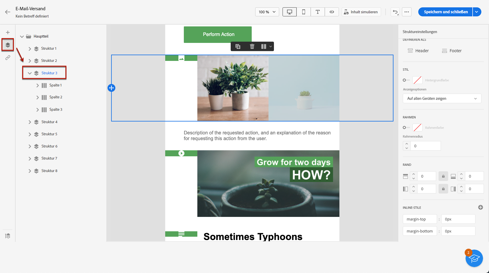
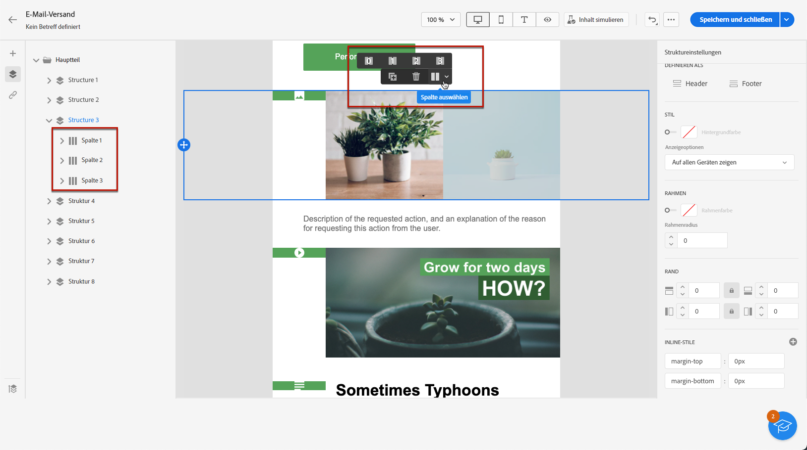
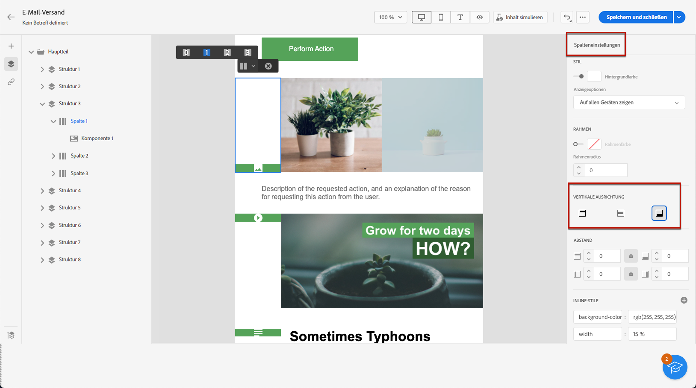
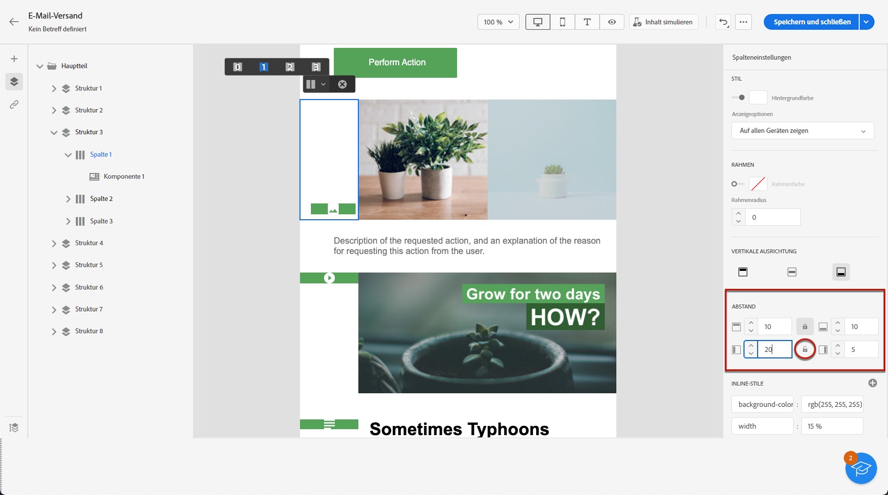

# Anpassen der senkrechten Ausrichtung und des Abstands {#alignment-and-padding}

>[!NOTE]
>
>Diese Dokumentation wird derzeit erstellt und häufig aktualisiert. Die endgültige Version dieses Inhalts wird im Januar 2023 vorliegen.

In diesem Beispiel passen wir den Abstand und die senkrechte Ausrichtung innerhalb einer Strukturkomponente an, die aus drei Spalten besteht.

1. Wählen Sie eine Strukturkomponente direkt in der E-Mail oder unter Verwendung des **[!UICONTROL Navigationbaums]** im linken Bereich aus.

   

1. Wählen Sie in der kontextbezogenen Symbolleiste mithilfe der Option **[!UICONTROL Spalte auswählen]** die gewünschte Spalte aus. Sie können sie auch im Strukturbaum auf der linken Seite auswählen.

   

1. Die bearbeitbaren Parameter für diese Spalte werden im Menü **[!UICONTROL Spalteneinstellungen]** auf der rechten Seite angezeigt. Passen Sie die **[!UICONTROL senkrechte Ausrichtung]** im entsprechenden Abschnitt an.

   

   Wählen Sie beispielsweise **[!UICONTROL Unten]**. Die Inhaltskomponente wird an den unteren Rand der Spalte verschoben.

1. Definieren Sie unter **[!UICONTROL Abstand]** den oberen Abstand innerhalb der Spalte und legen Sie den linken und rechten Abstand für diese Spalte fest.

   >[!NOTE]
   >
   >Klicken Sie auf das Schlosssymbol, um die Synchronisation zwischen dem oberen/unteren oder linken/rechten Abstand aufzuheben.

   

1. Gehen Sie analog mit den anderen Ausrichtungs- und Abstandseinstellungen der Spalten vor.

1. Speichern Sie Ihre Änderungen.
