# Personalisieren Ihrer Marke {#brands-personalize}

Um ein umfassendes Marken-Kit zu erstellen, das die Konsistenz Ihrer Inhalte und Kanäle sicherstellt, konfigurieren Sie die folgenden vier Registerkarten, wobei jede einen anderen Aspekt Ihrer Markenidentität behandelt:

* **[!UICONTROL Über die Marke]** legt die Identität und die Werte Ihrer Marke fest.
* **[!UICONTROL Schreibstil]** definiert Sprach- und Inhaltsstandards.
* **[!UICONTROL Visueller Inhalt]** legt Richtlinien für Bilder und Design fest.

Nach der Konfiguration können Sie Ihre Markenrichtlinien verwenden, um die Qualität der Inhalte und die Markenausrichtung zu überprüfen. [Erfahren Sie mehr über die Validierung der Inhaltsqualität](brands-score.md#validate-quality)

## Informationen zur Marke {#about-brand}

Verwenden Sie die Registerkarte **[!UICONTROL Informationen zur Marke]**, um die Kernidentität Ihrer Marke festzulegen und ihren Zweck, ihre Persönlichkeit, ihre Tagline und andere bestimmende Attribute zu definieren.

1. Füllen Sie zunächst die grundlegenden Informationen für Ihre Marke in der Kategorie **[!UICONTROL Schlüsseldetails]** aus:

   * **[!UICONTROL Marken-Kit-Name]**: Geben Sie den Namen Ihres Marken-Kits ein.

   * **[!UICONTROL Verwendung]**: Geben Sie Szenarien oder Kontexte an, in denen dieses Marken-Kit verwendet werden soll.

   * **[!UICONTROL Markenname]**: Geben Sie den offiziellen Namen der Marke ein.

   * **[!UICONTROL Markenbeschreibung]**: Geben Sie einen Überblick darüber, wofür was diese Marke steht.

   * **[!UICONTROL Tagline (Standard)]**: Fügen Sie die primäre Tagline hinzu, die der Marke zugeordnet ist.

     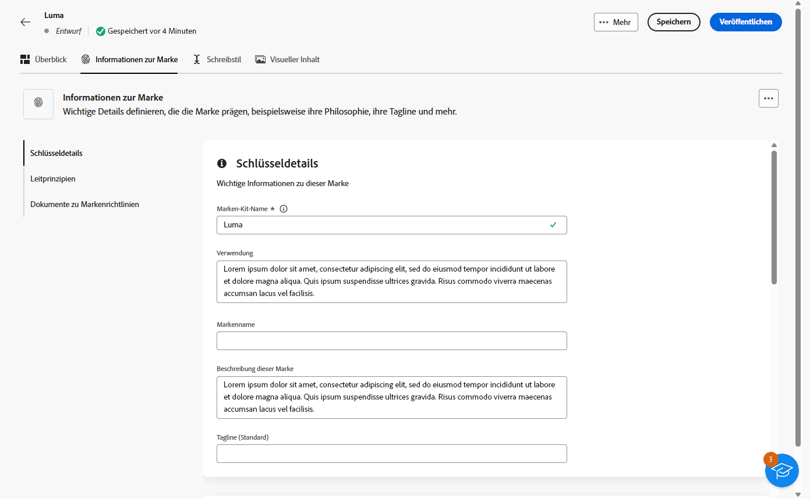

1. Erläutern Sie in der Kategorie **[!UICONTROL Leitprinzipien]** die Kernausrichtung und Philosophie Ihrer Marke:

   * **[!UICONTROL Mission]**: Beschreiben Sie den Zweck Ihrer Marke.

   * **[!UICONTROL Vision]**: Beschreiben Sie Ihr langfristiges Ziel bzw. Ihren gewünschten zukünftigen Status.

   * **[!UICONTROL Marktpositionierung]**: Erklären Sie, wie Ihre Marke auf dem Markt positioniert ist.

   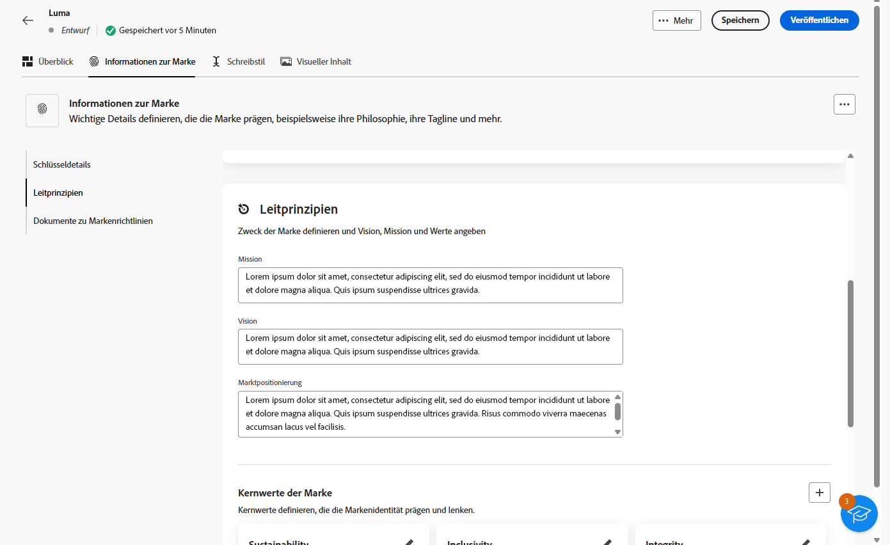

1. Klicken Sie in der Kategorie **[!UICONTROL Kernwerte der Marke]** auf , um die Kernwerte der Marke hinzuzufügen und die Details auszufüllen:

   * **[!UICONTROL Wert]**: Benennen Sie einen Kernwert der Marke.

   * **[!UICONTROL Beschreibung]**: Erklären Sie, was dieser Wert für Ihre Marke bedeutet.

   * **[!UICONTROL Verhalten]**: Beschreiben Sie die Aktionen oder Einstellungen, die diesen Wert in der Praxis widerspiegeln.

   * **[!UICONTROL Manifestationen]**: Nennen Sie Beispiele dafür, wie dieser Wert im realen Branding ausgedrückt wird.

     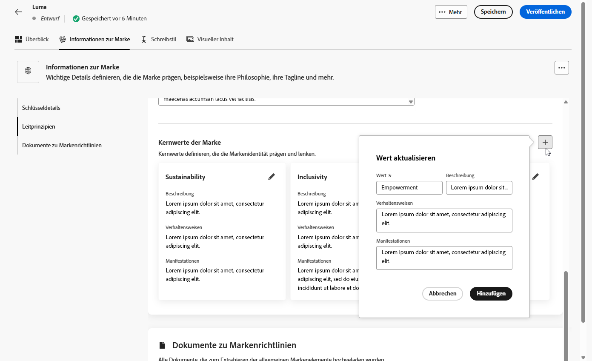

1. Klicken Sie bei Bedarf auf das Symbol , um einen Kernwert Ihrer Marke zu aktualisieren oder zu löschen.

   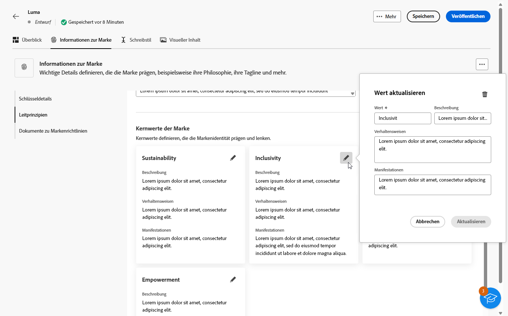

Jetzt können Sie Ihre Marke weiter personalisieren oder [die Marke veröffentlichen](#create-brand-kit).

## Schreibstil {#writing-style}

Im Abschnitt **[!UICONTROL Schreibstil]** werden die Standards für das Schreiben von Inhalten beschrieben. Außerdem wird erläutert, wie Sprache, Formatierung und Struktur verwendet werden sollten, um Klarheit, Kohärenz und Konsistenz in allen Materialien zu gewährleisten.

+++ Verfügbare Kategorien und Beispiele

<table>
  <thead>
    <tr>
      <th>Kategorie</th>
      <th>Unterkategorie</th>
      <th>Beispiel für die Richtlinie</th>
      <th>Beispiel für Ausschlüsse</th>
    </tr>
  </thead>
  <tbody>
    <tr>
      <td rowspan="4">Inhaltserstellungsstandards</td>
      <td>Markenbotschaftsstandards</td>
      <td>Heben Sie Innovation und Customer-first-Messaging hervor.</td>
      <td>Heben Sie nicht zu viele Produktfunktionen hervor.</td>
    </tr>
    <tr>
      <td>Tagline-Nutzung</td>
      <td>Platzieren Sie die Tagline auf allen Digital-Marketing-Assets unter dem Logo.</td>
      <td>Ändern oder übersetzen Sie die Tagline nicht.</td>
    </tr>
    <tr>
      <td>Kernbotschaften</td>
      <td>Heben Sie die wichtigsten Vorteile hervor, z. B. die gesteigerte Produktivität.</td>
      <td>Machen Sie keine nicht im Zusammenhang stehenden Wertversprechen.</td>
    </tr>
    <tr>
      <td>Benennungsstandards</td>
      <td>Verwenden Sie einfache, beschreibende Namen wie „ProScheduler“.</td>
      <td>Verwenden Sie keine komplexen Begriffe oder Sonderzeichen.</td>
    </tr>
    <tr>
      <td rowspan="5">Stil für Markenkommunikation</td>
      <td>Eigenschaften der Markenpersönlichkeit</td>
      <td>Freundlich und offen.</td>
      <td>Seien Sie nicht pessimistisch.</td>
    </tr>
    <tr>
      <td>Schreibtechnik</td>
      <td>Formulieren Sie kurze und aussagekräftige Sätze.</td>
      <td>Verwenden Sie nicht zu viel Jargon.</td>
    </tr>
    <tr>
      <td>Situationsbezogener Ton</td>
      <td>Behalten Sie in Krisensituationen einen professionellen Ton bei.</td>
      <td>Seien Sie in der Support-Kommunikation nicht abweisend.</td>
    </tr>
    <tr>
      <td>Richtlinien zur Wortwahl</td>
      <td>Verwenden Sie Worte wie „innovativ“ und „intelligent“.</td>
      <td>Vermeiden Sie Worte wie „billig“ oder „Hack“.</td>
    </tr>
    <tr>
      <td>Sprachstandards</td>
      <td>Befolgen Sie die Konventionen für amerikanisches Englisch.</td>
      <td>Vermischen Sie britische und amerikanische Rechtschreibung nicht.</td>
    </tr>
    <tr>
      <td rowspan="3">Standards zur Einhaltung gesetzlicher Vorschriften</td>
      <td>Markenstandards</td>
      <td>Verwenden Sie immer die Symbole ™ oder ®.</td>
      <td>Lassen Sie keine rechtlichen Symbole weg, wo diese erforderlich sind.</td>
    </tr>
    <tr>
      <td>Copyright-Standards</td>
      <td>Verwenden Sie Copyright-Hinweise auf Marketing-Materialen.</td>
      <td>Verwenden Sie keine Inhalte von Dritten ohne deren Erlaubnis.</td>
    </tr>
    <tr>
      <td>Haftungsausschlussstandards</td>
      <td>Platzieren Sie Haftungsausschlüsse gut lesbar auf digitalen Assets.</td>
      <td>Verstecken Sie Haftungsausschlüsse nicht in nicht sichtbaren Bereichen.</td>
    </tr>
</table>

+++

 

So personalisieren Sie den **[!UICONTROL Schreibstil]**:

1. Klicken Sie auf der Registerkarte **[!UICONTROL Schreibstil]** auf , um eine Richtlinie, eine Ausnahme oder einen Ausschluss hinzuzufügen.

1. Geben Sie die Richtlinie, die Ausnahme oder den Ausschluss ein. Sie können auch **[!UICONTROL Beispiele]** hinzufügen, um die Anwendung besser zu veranschaulichen.

   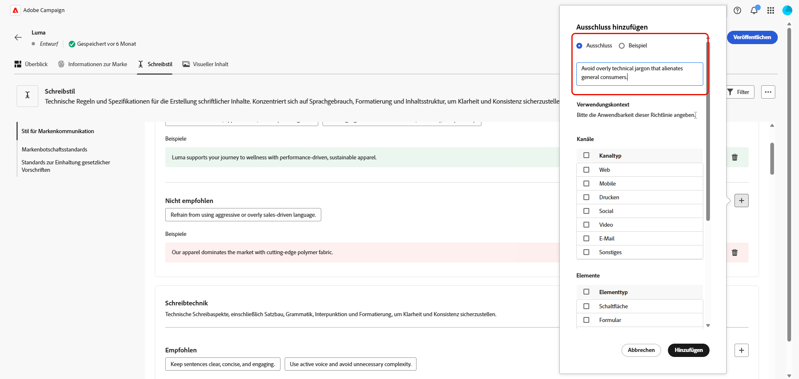

1. Geben Sie den **[!UICONTROL Verwendungskontext]** für die Richtlinie, die Ausnahme oder den Ausschluss an:

   * **[!UICONTROL Kanaltyp]**: Wählen Sie aus, wo die Richtlinie, die Ausnahme oder der Ausschluss gelten soll. Beispielsweise soll möglicherweise ein bestimmter Schreibstil nur in E-Mail-, Mobile-, Print- oder anderen Kommunikationskanälen verwendet werden.

   * **[!UICONTROL Elementtyp]**: Geben Sie an, für welches Inhaltselement die Regel gilt. Das können Elemente wie Überschriften, Schaltflächen, Links oder andere Komponenten in Ihrem Inhalt sein.

   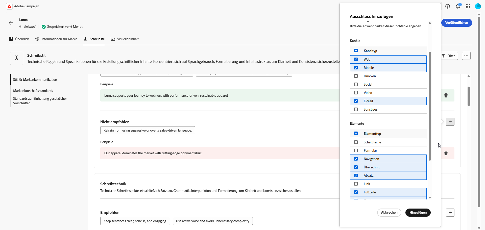

1. Nachdem Sie die Richtlinie, die Ausnahme oder den Ausschluss eingerichtet haben, klicken Sie auf **[!UICONTROL Hinzufügen]**.
1. Wählen Sie bei Bedarf eine Richtlinie oder einen Ausschluss zum Aktualisieren oder Löschen aus.

1. Klicken Sie auf , um Ihr Beispiel zu bearbeiten, oder auf das Symbol , um es zu löschen.

   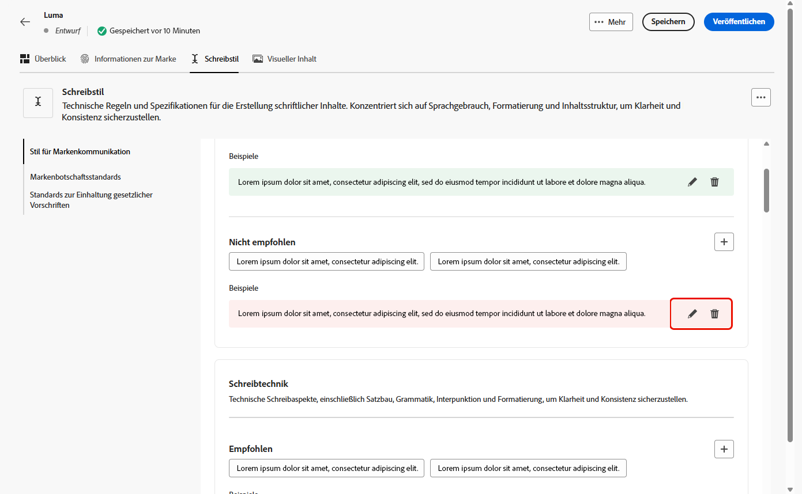

Jetzt können Sie Ihre Marke weiter personalisieren oder sie [veröffentlichen](#create-brand-kit).

## Visueller Inhalt {#visual-content}

Im Abschnitt **[!UICONTROL Visueller Inhalt]** werden die Standards für Bilder und Design definiert. Es werden die Spezifikationen detailliert beschrieben, die für die Aufrechterhaltung eines einheitlichen und konsistenten Looks einer Marke erforderlich sind.

+++ Verfügbare Kategorien und Beispiele

<table>
  <thead>
    <tr>
      <th>Kategorie</th>
      <th>Beispiel für die Richtlinie</th>
      <th>Beispiel für Ausschlüsse</th>
    </tr>
  </thead>
  <tbody>
    <tr>
      <td>Fotografiestandards</td>
      <td>Verwenden Sie natürliche Beleuchtung für Außenaufnahmen.</td>
      <td>Vermeiden Sie übermäßig bearbeitete oder verpixelte Bilder.</td>
    </tr>
    <tr>
      <td>Illustrationsstandards</td>
      <td>Verwenden Sie klaren, minimalistischen Stil.</td>
      <td>Vermeiden Sie übermäßig komplexen Stil.</td>
    </tr>
    <tr>
      <td>Symbolstandards</td>
      <td>Verwenden Sie ein konsistentes 24-Pixel-Rastersystem.</td>
      <td>Vermischen Sie keine unterschiedlichen Symbolabmessungen, verwenden Sie keine inkonsistenten Strichstärken und weichen Sie nicht von Rasterregeln ab.</td>
    </tr>
    <tr>
      <td>Nutzungsrichtlinien</td>
      <td>Wählen Sie Lifestyle-Bilder, die reale Kundinnen und Kunden bei der Verwendung des Produkts in professionellen Umgebungen zeigen.</td>
      <td>Verwenden Sie keine Bilder, die dem Markenton widersprechen oder aus dem Kontext gerissen erscheinen.</td>
    </tr>
</table>

+++

 

So personalisieren Sie **[!UICONTROL visuelle Inhalte]**:

1. Klicken Sie auf der Registerkarte **[!UICONTROL Visueller Inhalt]** auf , um eine Richtlinie, einen Ausschluss oder ein Beispiel hinzuzufügen.

1. Geben Sie die Richtlinie, den Ausschluss oder das Beispiel ein. 

   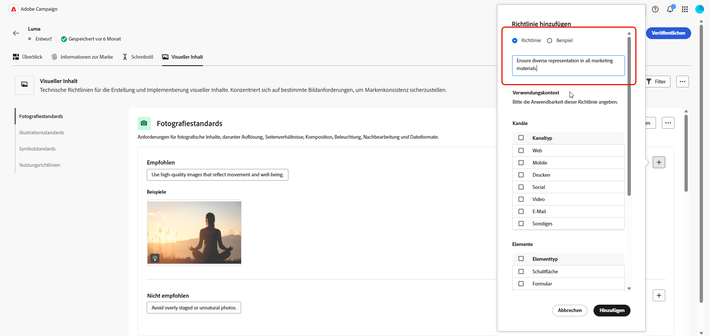

1. Geben Sie den **[!UICONTROL Verwendungskontext]** für die Richtlinie oder den Ausschluss an:

   * **[!UICONTROL Kanaltyp]**: Wählen Sie aus, wo die Richtlinie, die Ausnahme oder der Ausschluss gelten soll. Beispielsweise soll möglicherweise ein bestimmter Schreibstil nur in E-Mail-, Mobile-, Print- oder anderen Kommunikationskanälen verwendet werden.

   * **[!UICONTROL Elementtyp]**: Geben Sie an, für welches Inhaltselement die Regel gilt. Das können Elemente wie Überschriften, Schaltflächen, Links oder andere Komponenten in Ihrem Inhalt sein.

     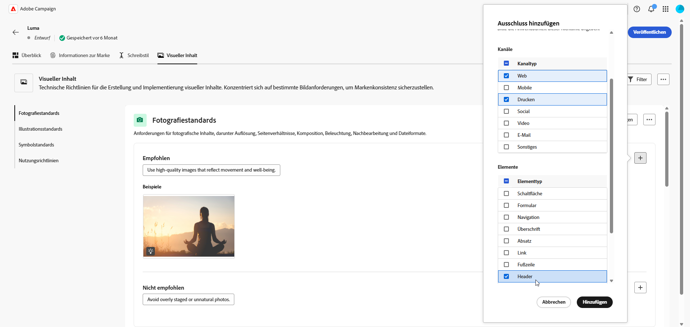

1. Nachdem Sie die Richtlinie, die Ausnahme oder den Ausschluss eingerichtet haben, klicken Sie auf **[!UICONTROL Hinzufügen]**.

1. Um ein Bild hinzuzufügen, das die korrekte Verwendung zeigt, wählen Sie **[!UICONTROL Beispiel]** und klicken Sie auf **[!UICONTROL Bild auswählen]**. Sie können auch ein Bild mit falscher Verwendung als Ausschlussbeispiel hinzufügen.

   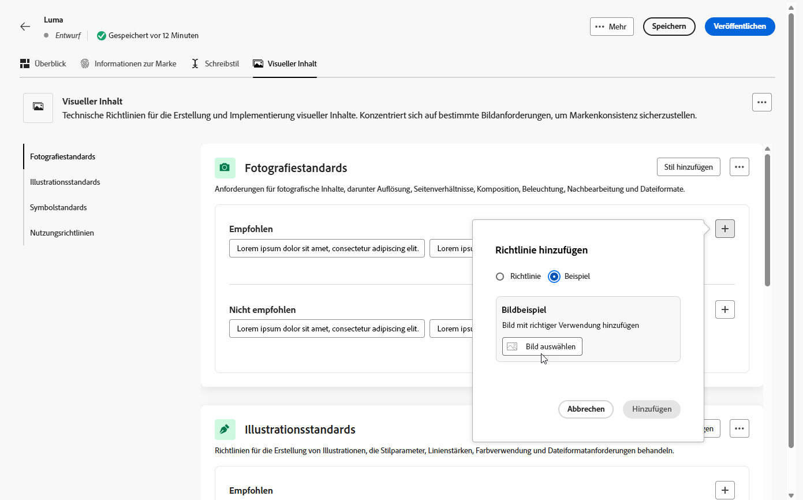

1. Wählen Sie eine Richtlinie oder einen Ausschluss zum Aktualisieren oder Löschen aus.

1. Wählen Sie eine Richtlinie oder einen Ausschluss zum Aktualisieren aus. Klicken Sie zum Löschen auf das Symbol .

   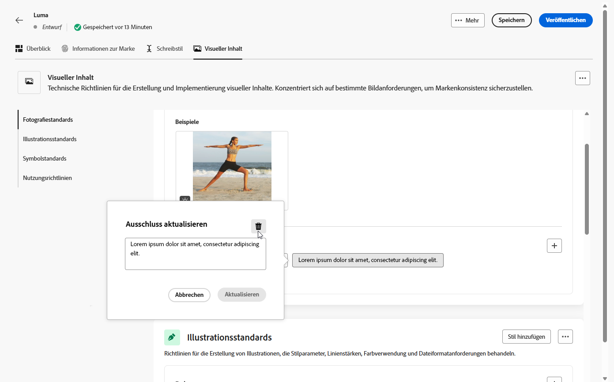

Jetzt können Sie Ihre Marke weiter personalisieren oder sie [veröffentlichen](#create-brand-kit).

<!--
## Colors {#colors}

The **[!UICONTROL Colors]** section the standards for your brand's color system, outlining how colors are selected, organized, and applied across experiences. It ensures consistent use of primary, secondary, accent, and neutral colors to maintain a cohesive, accessible, and recognizable brand identity.

+++ Available categories and examples

<table>
  <thead>
    <tr>
      <th>Category</th>
      <th>Guidelines Example</th>
      <th>Exclusions Example</th>
    </tr>
  </thead>
  <tbody>
    <tr>
      <td>Primary colors</td>
      <td>Use primary brand colors for logos, headers, and main call-to-action elements.</td>
      <td>Do not substitute or modify primary brand colors.</td>
    </tr>
    <tr>
      <td>Secondary colors</td>
      <td>Use secondary colors to support layouts, illustrations, and UI components.</td>
      <td>Do not let secondary colors overpower primary brand colors.</td>
    </tr>
    <tr>
      <td>Accent colors</td>
      <td>Use accent colors sparingly for buttons, links, and alerts.</td>
      <td>Do not use accent colors for large background areas.</td>
    </tr>
    <tr>
      <td>Neutral colors</td>
      <td>Use neutral colors for text, dividers, borders, and subtle UI elements.</td>
      <td>Avoid using neutrals with poor contrast or heavy color casts.</td>
    </tr>
    <tr>
      <td>Background colors</td>
      <td>Use light or neutral backgrounds to ensure readability and visual clarity.</td>
      <td>Do not place text or logos on low-contrast backgrounds.</td>
    </tr>
    <tr>
      <td>Additional colors</td>
      <td>Use additional colors only for data visualization or approved campaigns.</td>
      <td>Do not introduce unapproved or off-brand colors.</td>
    </tr>
    <tr>
      <td>Color scales</td>
      <td>Use approved tints and shades for UI states such as hover, active, and disabled.</td>
      <td>Do not create unofficial shades or gradients.</td>
    </tr>
    <tr>
      <td>Usage guidelines</td>
      <td>Maintain consistent color usage and accessible contrast across all assets.</td>
      <td>Do not mix conflicting palettes or apply colors inconsistently.</td>
    </tr>
</table>

+++

 

To personalize your **[!UICONTROL Colors]**:

1. From the **[!UICONTROL Colors]** tab, click  to add a color, guideline or exclusion. 

1. Enter your color information to define it accurately:

    * **Color name**: Provide a clear, descriptive name to identify the color within your brand system.

    * **Color value**: Choose your color using the hue picker or enter precise values using RGB, HEX, or Pantone name/code to ensure consistency across digital and print assets.

    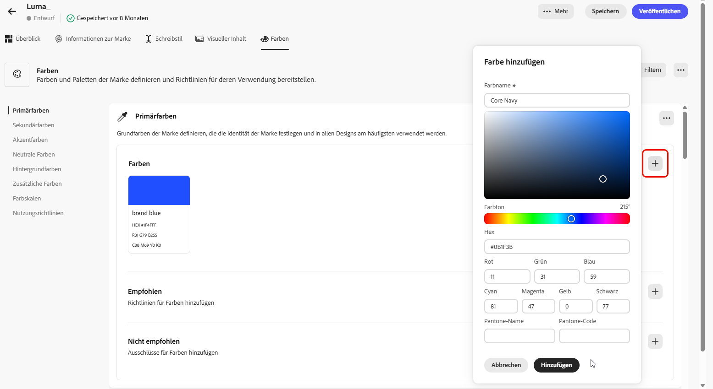

1. Review your selection to confirm accuracy and visual consistency and click **[!UICONTROL Add]** to save your color.

1. Then, enter your guideline or exclusion.

1. Specify the Usage context for your guideline or exclusion:

    * **[!UICONTROL Channel type]**: Choose where this guideline, exception, or exclusion should apply. For example, you may want a specific writing style to appear only in Email, Mobile, Prints, or other communication channels.

    * **[!UICONTROL Element type]**: Specify which content element the rule applies to. This could include elements such as Headings, Buttons, Links, or other components within your content.

      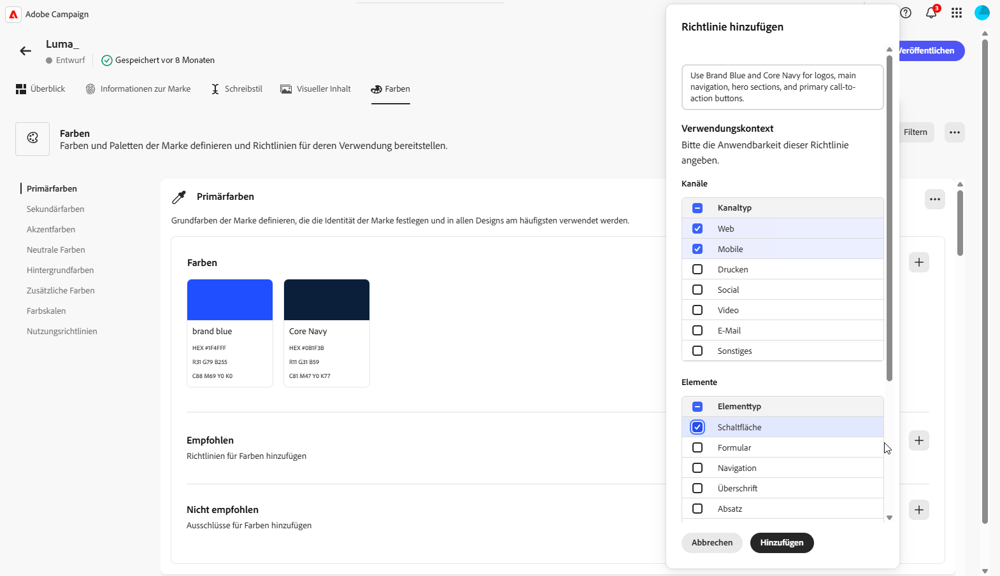
  
1. Once your guideline, exception, or exclusion is set up, click **[!UICONTROL Add]**. 

1. If needed, select one of your guideline or exclusion to update or delete.

1. Select one your guideline or exclusion to update it. Click the icon to delete it. 

    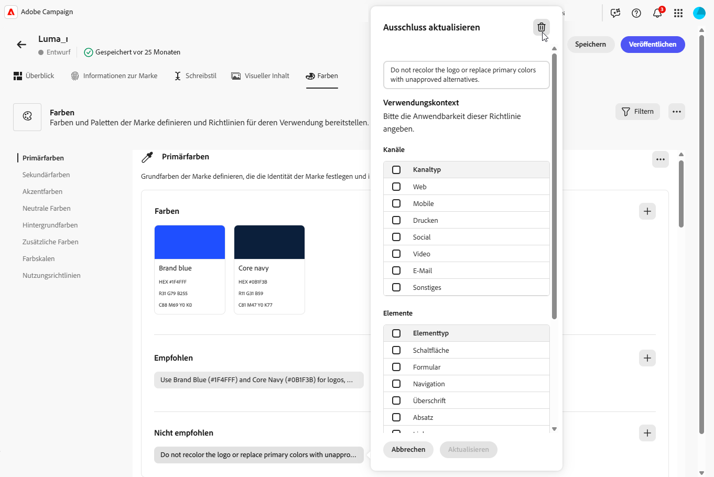

1. Click **[!UICONTROL Add group]** to define additional colors for your brand or to add a color scale group.

You can now further personalize your brand or [publish your brand](brands.md#create-brand-kit).

-->