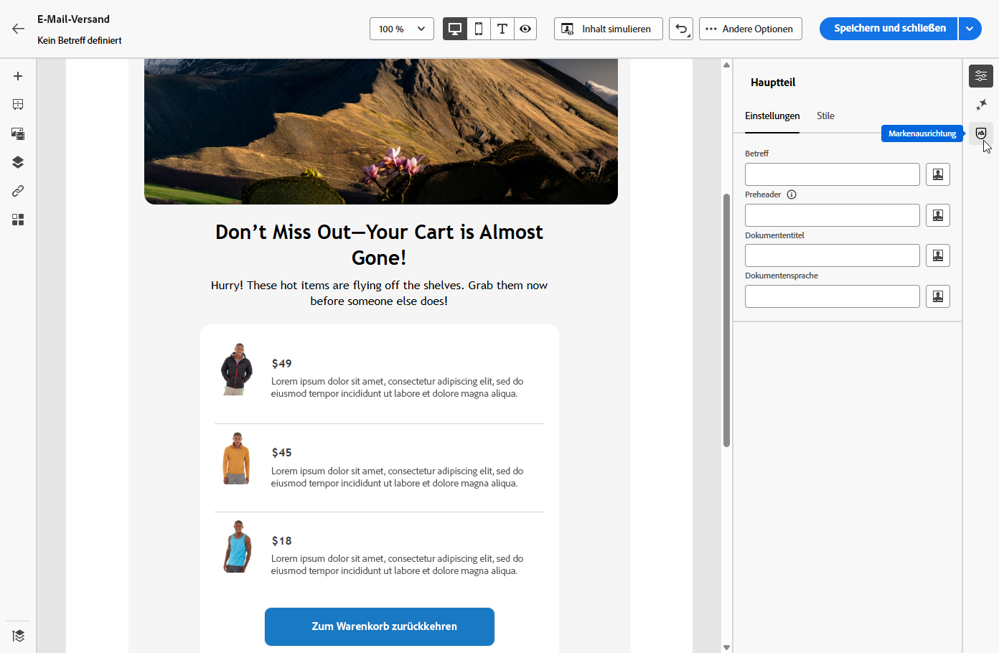
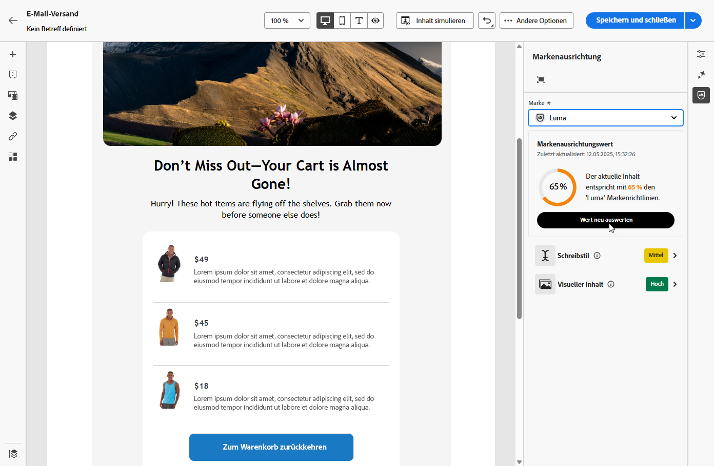
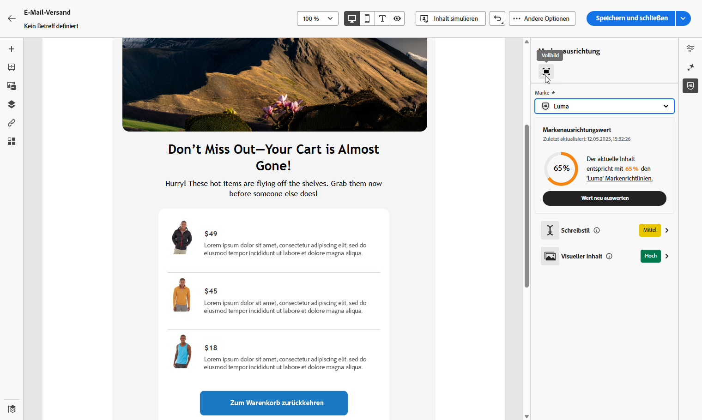
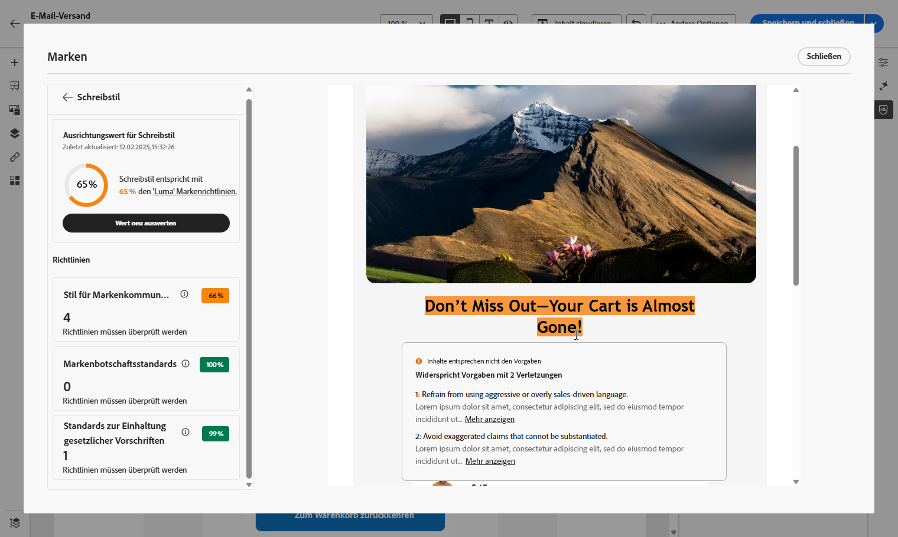

# Markenausrichtung (Beta){#brands-score}

>[!AVAILABILITY]
>
>Diese Funktion wird als private Betaversion veröffentlicht. Sie wird in zukünftigen Versionen nach und nach allen Kundinnen und Kunden zur Verfügung stehen.
>Sie müssen der [Benutzervereinbarung“ zustimmen](https://www.adobe.com/de/legal/licenses-terms/adobe-dx-gen-ai-user-guidelines.html){target="_blank"} bevor Sie den KI-Assistenten verwenden können. Weitere Informationen erhalten Sie vom Adobe-Support.

Die Funktion „Markenausrichtung“ soll Ihnen dabei helfen, Inhalte zu erstellen, zu überprüfen und zu verwalten, die Ihren Markenrichtlinien entsprechen. Er sorgt für Konsistenz in Ton, Messaging und visueller Identität in all Ihren E-Mail-Kampagnen und dient gleichzeitig als Qualitätsprüfung vor der Live-Schaltung Ihres Inhalts.

## Validieren von Inhalten mit Markenausrichtung {#validate-content}

Sobald [Ihre Marke eingerichtet und veröffentlicht wurde](brands.md) bewerten Sie Ihre Markenausrichtungsbewertung direkt in Ihrer E-Mail-Kampagne, um sicherzustellen, dass Ihr Inhalt mit Ihren Markenrichtlinien übereinstimmt:

1. Erstellen Sie Ihre [E-Mail-Kampagne](../email/create-email.md).

1. Öffnen Sie das Menü **[!UICONTROL Markenausrichtung]** im E-Mail-Designer.

   Ihre Inhalte werden automatisch mit Ihrer Standardmarke abgeglichen. [Erfahren Sie, wie Sie eine Standardmarke zuweisen](brands.md).

   

1. Um eine andere Marke zu verwenden, wählen Sie diese aus dem Dropdown-Menü **[!UICONTROL Marke]** und klicken Sie auf **[!UICONTROL Punktzahl neu bewerten]**.

   

1. Durchsuchen Sie die **Markenausrichtungsbewertung** (Hoch, Medium, Niedrig) und prüfen Sie das detaillierte Feedback.

1. Klicken Sie auf das -Symbol, um weitere Einblicke in Ihre Punktzahl zu erhalten.

   

1. Wählen Sie eine gekennzeichnete Richtlinie aus, um spezifisches Feedback und Vorschläge anzuzeigen.

   

1. Bearbeiten Sie Ihre Inhalte auf der Grundlage der Empfehlungen zur Verbesserung der Markenausrichtung.

1. Bewerten Sie den Inhalt manuell neu, nachdem Sie Änderungen vorgenommen haben, um Ihren Alignment-Score zu aktualisieren.
