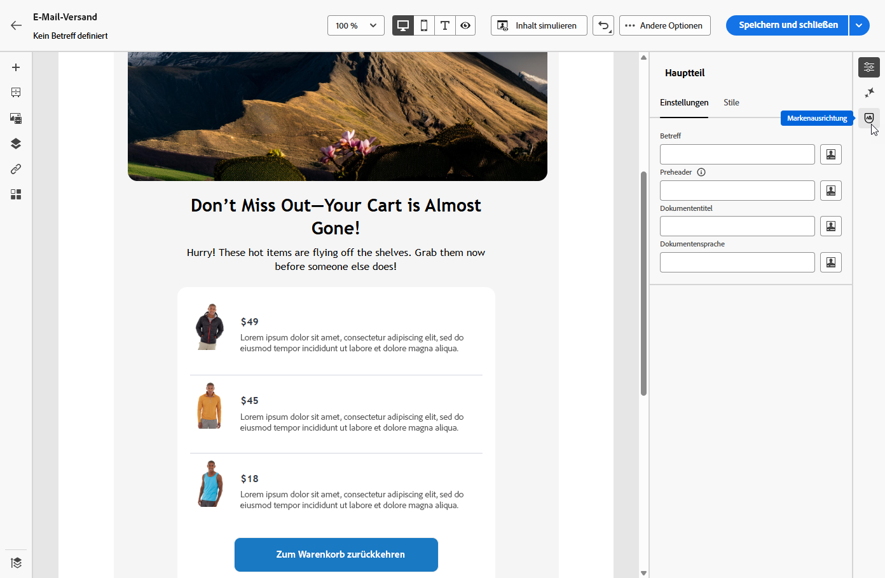
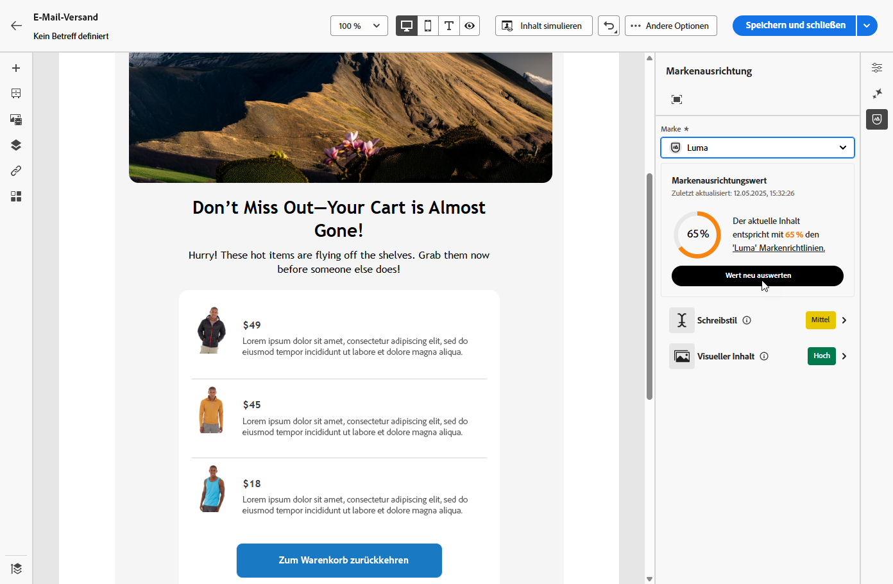
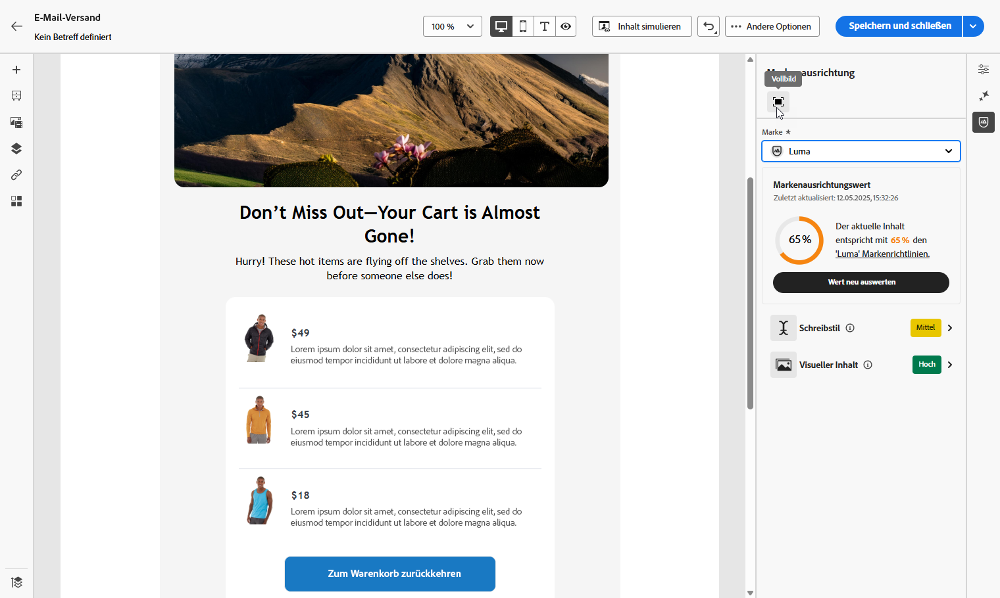
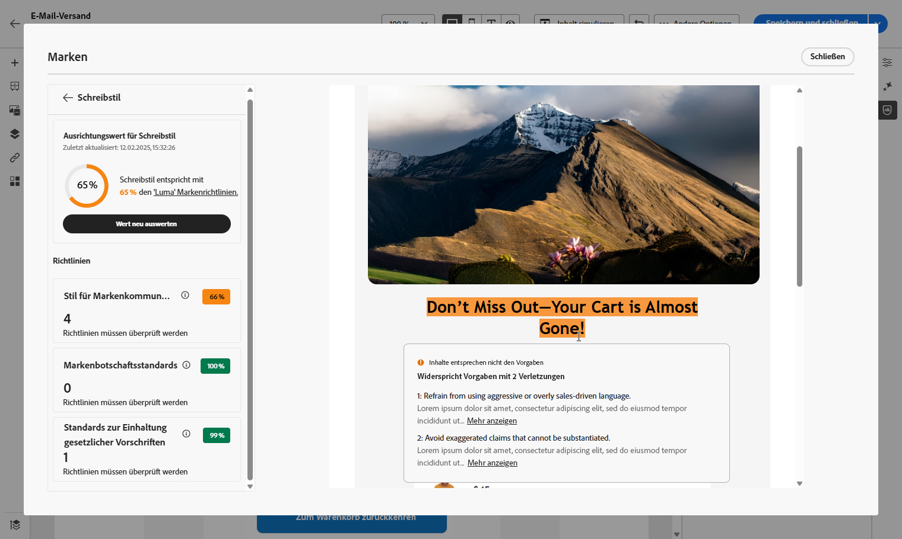
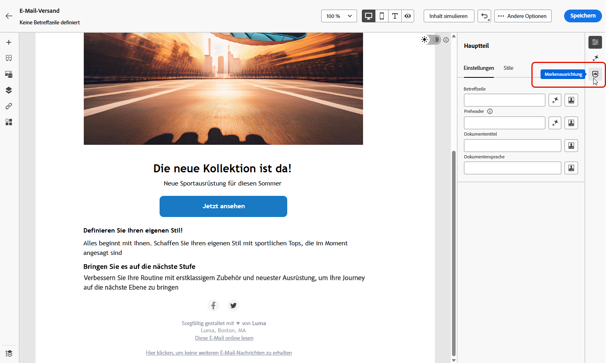
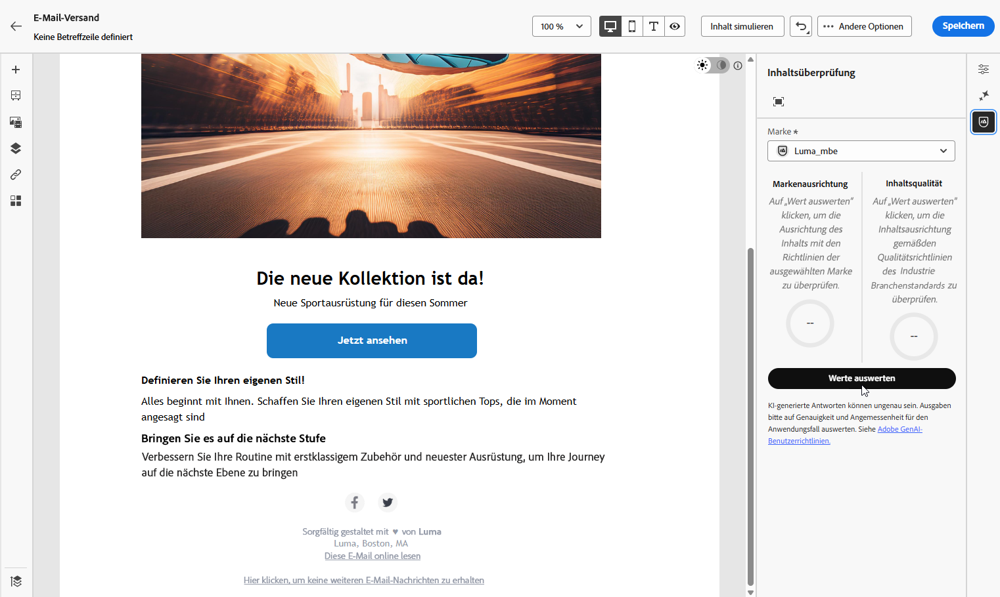
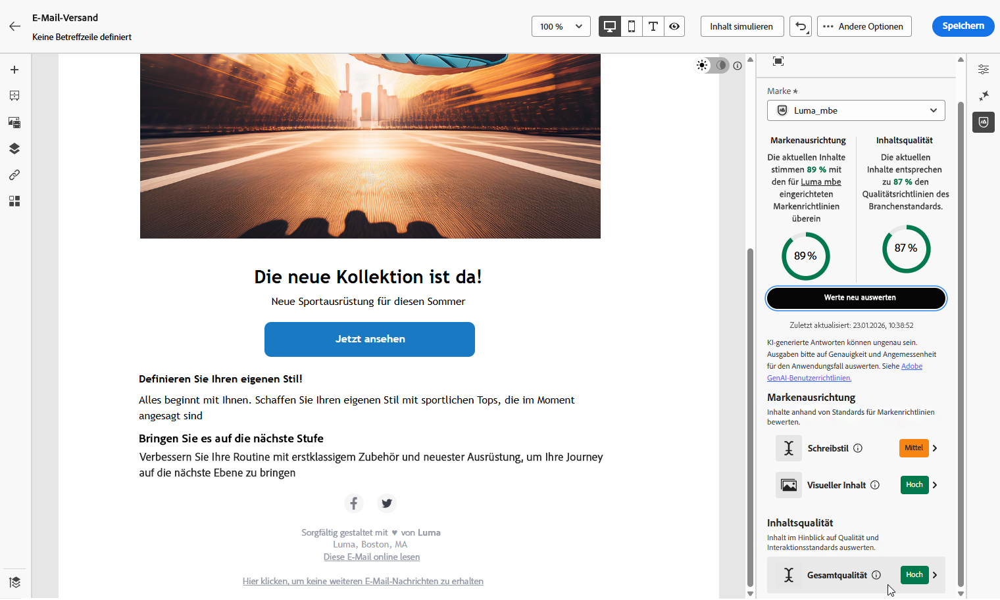
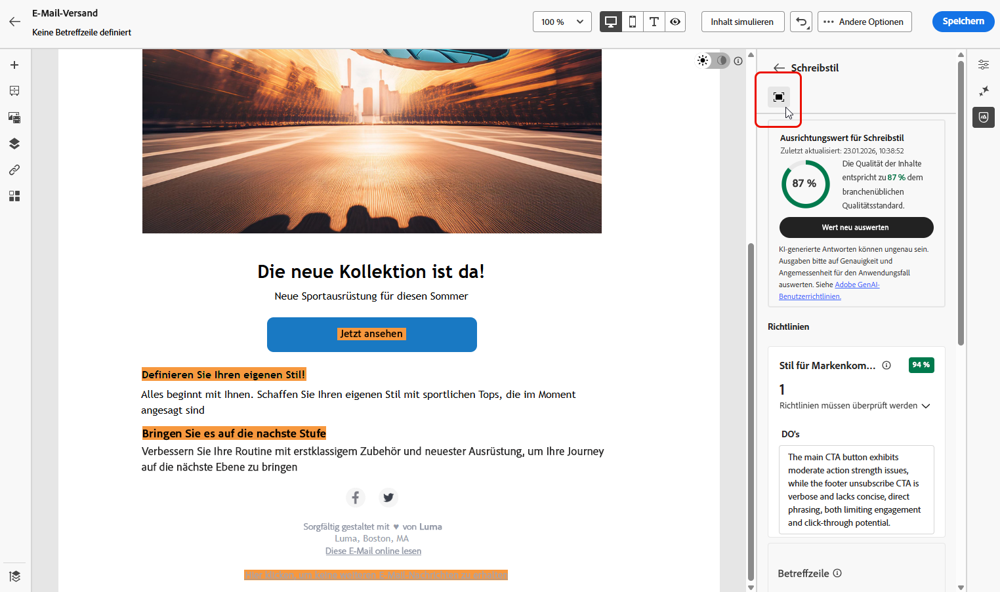
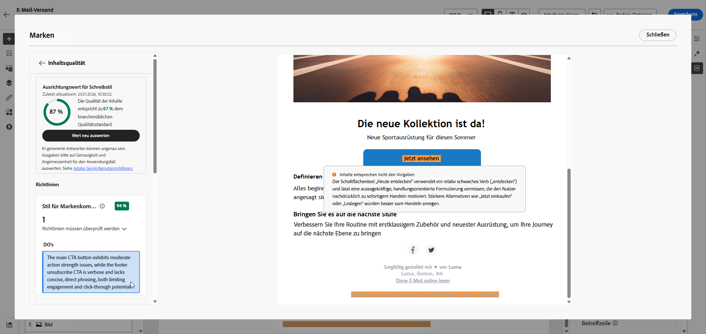

# Inhalt auswerten {#brands-score}

>[!AVAILABILITY]
>
>Sie müssen einer [Benutzervereinbarung](https://www.adobe.com/de/legal/licenses-terms/adobe-dx-gen-ai-user-guidelines.html){target="_blank"} zustimmen, bevor Sie den KI-Assistenten verwenden können. Weitere Informationen erhalten Sie beim Adobe-Support.

Die Funktion zur Inhaltsüberprüfung bietet umfassende Tools zur Bewertung, mit denen Sie messen können, wie gut Ihre Kampagnen mit Ihren Markenrichtlinien übereinstimmen und die Qualitätsstandards für Inhalte in allen Kommunikationsbereichen beibehalten:

* **Markenausrichtung**: Überprüfen und verwalten Sie Inhalte, die Ihren Markenrichtlinien entsprechen. Dadurch wird Konsistenz in Ton, Messaging und visueller Identität in Ihren E-Mail-Kampagnen sichergestellt.
* **Qualitätsprüfung**: Validieren Sie Ihre Inhalte vor der Live-Schaltung, um hohe Standards und Markenintegrität zu gewährleisten.

## Inhalte mit Markenausrichtung validieren {#validate-content}

Bewerten Sie Ihre Markenausrichtungsbewertung direkt in Ihrer E-Mail-Kampagne, wenn [Ihre Marke eingerichtet und veröffentlicht ist](brands.md), um sicherzustellen, dass Ihre Inhalte mit Ihren Markenrichtlinien übereinstimmen:

1. Erstellen Sie Ihre [E-Mail-Kampagne](../email/create-email.md).

1. Öffnen Sie das Menü **[!UICONTROL Markenausrichtung]** im E-Mail-Designer.

   Ihre Inhalte werden automatisch mit Ihrer Standardmarke abgeglichen. [Erfahren Sie, wie Sie eine Standardmarke zuweisen](brands.md).

   

1. Zum Abgleich mit einer anderen Marke wählen Sie diese aus dem Dropdown-Menü **[!UICONTROL Marke]** und klicken auf **[!UICONTROL Wert neu auswerten]**.

   

1. Durchsuchen Sie die **Markenausrichtungsbewertung** (hoch, mittel, niedrig) und prüfen Sie das detaillierte Feedback.

1. Klicken Sie auf das Symbol , um weitere Erkenntnisse zu Ihrer Bewertung zu erhalten.

   

1. Wählen Sie eine markierte Richtlinie aus, um spezifisches Feedback und Vorschläge anzuzeigen.

   

1. Bearbeiten Sie Ihre Inhalte auf Grundlage der Empfehlungen zur Verbesserung der Markenausrichtung.

1. Bewerten Sie den Inhalt manuell neu, nachdem Sie Änderungen vorgenommen haben, um Ihre Ausrichtungsbewertung zu aktualisieren.

## Validieren der Inhaltsqualität {#validate-quality}

>[!NOTE]
>
>Die Bewertung der Inhaltsqualität ist unabhängig von den Markenrichtlinien. Auch wenn eine Marke im Dropdown-Menü ausgewählt wird, werden ihre Richtlinien nicht auf die Qualitätsprüfung angewendet. Die Markenauswahl ist nur für die Bewertung der Markenausrichtung relevant.

Zusätzlich zur Markenausrichtung können Sie die allgemeine Inhaltsqualität bewerten, um potenzielle Probleme mit Lesbarkeit, Inhaltskohärenz und Effektivität zu identifizieren, unabhängig von Ihren Markenrichtlinien.

So bewerten Sie die Qualität Ihrer Inhalte:

1. Erstellen Sie Ihren [E-Mail-Versand](../email/create-email.md).

1. Öffnen Sie das Menü **[!UICONTROL Markenausrichtung]** in der E-Mail-Designer.

   

1. Klicken Sie **[!UICONTROL Bewertung auswerten]**, um sowohl die Markenausrichtung als auch die Inhaltsqualitätswerte zu generieren.

   

1. Navigieren Sie zur Registerkarte **[!UICONTROL Gesamtqualität]**, um Einblicke und Empfehlungen zur Inhaltsqualität zu erhalten.

   

1. Klicken Sie auf das , um eine detaillierte Ansicht Ihrer Qualitätsbewertung zu erhalten.

   

1. Wählen Sie ein markiertes Element aus, um spezifisches Feedback und umsetzbare Verbesserungsvorschläge anzuzeigen. Die Bewertungen basieren auf den folgenden Kategorien:

   * **[!UICONTROL Effektivität von CTA]**: Wertet aus, wie gut Ihr call-to-action Ihre Leser dazu motiviert, die gewünschte Aktion durchzuführen.
   * **[!UICONTROL Betreffzeile]**: Bewertet Klarheit, Relevanz und Aufmerksamkeit erregende Qualität, um E-Mail-Öffnungen zu fördern.
   * **[!UICONTROL Lesbarkeit]**: Misst, wie einfach und ansprechend Ihre Inhalte für Leser sind.
   * **[!UICONTROL Spam-Prüfung]**: Identifiziert gängige Spam-Trigger, die die Zustellbarkeit beeinträchtigen können.
   * **[!UICONTROL Inhaltskohärenz]**: Stellt sicher, dass Ihre Inhalte reibungslos fließen und auf dem Thema bleiben.
   * **[!UICONTROL Korrekturlesen]**: Überprüft Rechtschreibung, Grammatik und Klarheit.

   

1. Bearbeiten Sie Ihre Inhalte anhand der Empfehlungen, um die Lesbarkeit, Inhaltskohärenz und Gesamtqualität zu verbessern.

1. Klicken Sie **[!UICONTROL Bewertung erneut bewerten]**, nachdem Sie Änderungen vorgenommen haben, um Ihren Qualitätswert zu aktualisieren.
