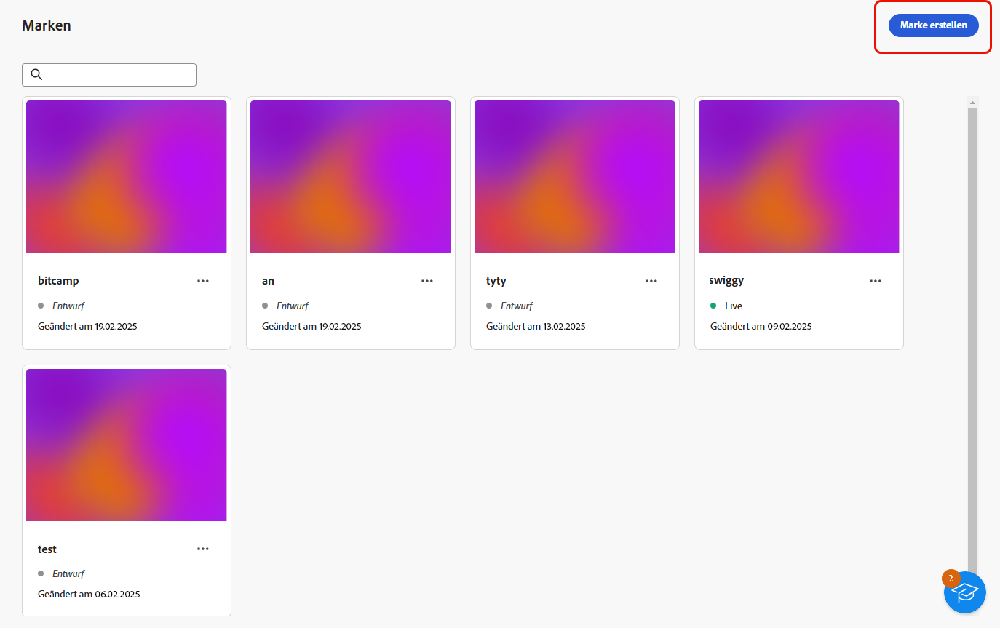
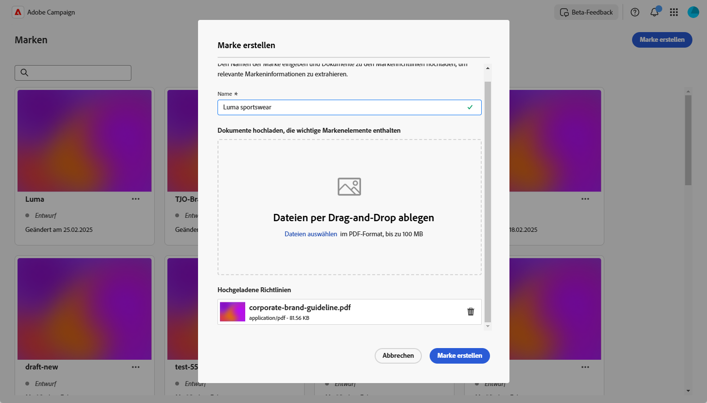
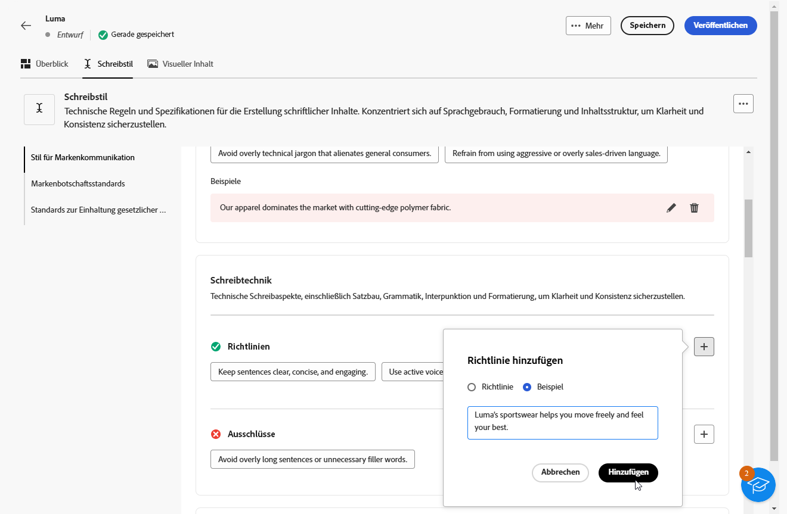
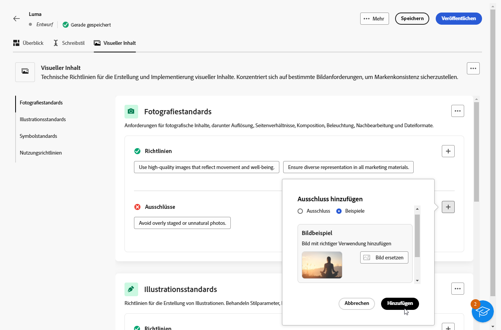
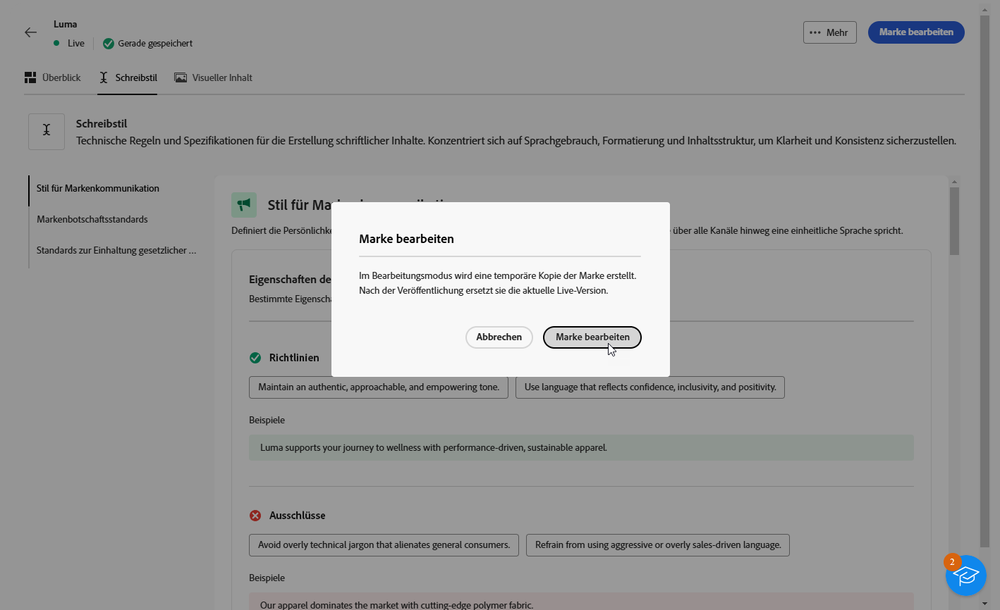
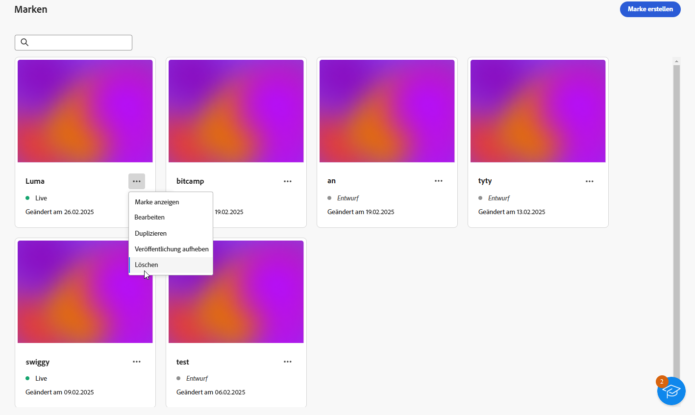

# Marken erstellen und verwalten {#brands}

>[!AVAILABILITY]
>
>Diese Funktion wird als private Betaversion veröffentlicht. Es wird in zukünftigen Versionen schrittweise für alle Kunden verfügbar sein.

Markenrichtlinien sind ein umfassendes Set von Regeln und Standards, die die visuelle und verbale Identität einer Marke definieren. Sie dienen als Referenz, um eine konsistente Markendarstellung über alle Marketing- und Kommunikationskanäle hinweg sicherzustellen.

In [!DNL Adobe Campaign Web] können Sie jetzt Ihre Markeninformationen manuell eingeben und organisieren oder Dokumente zu Markenrichtlinien hochladen, um die Daten automatisch zu extrahieren.

## Zugriff auf Marken {#generative-access}

Um auf das **[!UICONTROL Marken]**-Menü in [!DNL Adobe Campaign Web] zugreifen zu können, müssen Benutzenden die Produktprofile **[!UICONTROL Administrator (]**) und **[!UICONTROL Brand Kit]** zugewiesen werden, um Marken zu erstellen und zu verwalten. Für den schreibgeschützten Zugriff benötigen Benutzende das Produktprofil [!UICONTROL KI]Assistent“.

[Weitere Informationen](https://experienceleague.adobe.com/de/docs/campaign/campaign-v8/admin/permissions/manage-permissions)

+++  Erfahren Sie, wie Sie markenbezogene Berechtigungen zuweisen

1. Greifen Sie auf der Startseite von ](https://adminconsole.adobe.com/enterprise)0}Admin Console auf Ihr Campaign-Produkt zu.[

   

1. Wählen Sie die **[!DNL Product profile]** abhängig von der Berechtigungsstufe aus, die Sie Ihrem Benutzer gewähren möchten.

   

1. Klicken Sie auf **[!DNL Add users]** , um das ausgewählte Produktprofil zuzuweisen.

   

1. Geben Sie den Namen, die Benutzergruppe oder die E-Mail-Adresse der Benutzenden ein.

1. Klicken Sie auf **Speichern**, um Änderungen anzuwenden.

Die Berechtigungen aller Benutzer, die dieser Rolle bereits zugewiesen sind, werden automatisch aktualisiert.

+++

## Marke erstellen {#create-brand-kit}

Gehen Sie wie folgt vor, um Ihre Markenrichtlinien zu erstellen und zu verwalten.

Um Ihre Markenrichtlinien zu erstellen und zu verwalten, können Sie die Details entweder selbst eingeben oder Ihr Dokument mit den Markenrichtlinien hochladen, damit die Informationen automatisch extrahiert werden:

1. Wählen Sie im Menü **[!UICONTROL Content]** die Option **[!UICONTROL Marken]** aus.

1. Klicken Sie im Menü **[!UICONTROL Marken]** auf **[!UICONTROL Marke erstellen]**.

   

1. Geben Sie einen **[!UICONTROL Namen]** für Ihre Marke ein.

1. Datei per Drag-and-Drop ziehen oder auswählen, um Ihre Markenrichtlinien hochzuladen und automatisch relevante Markeninformationen zu extrahieren. Klicken Sie **[!UICONTROL Marke erstellen]**.

   Der Informationsextraktionsprozess beginnt jetzt. Beachten Sie, dass dieser Vorgang mehrere Minuten dauern kann.

   

1. Ihre Standards für Inhalt und visuelle Erstellung werden jetzt automatisch ausgefüllt. Durchsuchen Sie die verschiedenen Registerkarten, um die Informationen nach Bedarf anzupassen.

1. Klicken Sie auf **[!UICONTROL Registerkarte]** Schreibstil“ auf  , um eine Richtlinie oder einen Ausschluss einschließlich Beispielen hinzuzufügen.

   

1. Klicken Sie auf der Registerkarte **[!UICONTROL Visueller]**) auf  , um eine weitere Richtlinie oder einen Ausschluss hinzuzufügen.

1. Um ein Bild hinzuzufügen, das die korrekte Verwendung zeigt, wählen Sie **[!UICONTROL Beispiele]** und klicken Sie auf **[!UICONTROL Bild auswählen]**. Sie können auch ein Bild mit falscher Verwendung als Ausschlussbeispiel hinzufügen.

   

1. Klicken Sie nach der Konfiguration auf **[!UICONTROL Speichern]** und dann auf **[!UICONTROL Veröffentlichen]**, um Ihre Markenrichtlinie im KI-Assistenten verfügbar zu machen.

1. Um Änderungen an Ihrer veröffentlichten Marke vorzunehmen, klicken Sie auf **[!UICONTROL Marke bearbeiten]**.

   >[!NOTE]
   >
   >Dadurch wird eine temporäre Kopie im Bearbeitungsmodus erstellt, die die Live-Version nach der Veröffentlichung ersetzt.

   

1. Öffnen Sie im Dashboard **[!UICONTROL Marken]** das erweiterte Menü, indem Sie auf das  klicken, um Folgendes zu tun:

   * Marke anzeigen
   * Bearbeiten
   * Duplizieren
   * Veröffentlichen
   * Veröffentlichung aufheben
   * Löschen

   

Ihre Markenrichtlinien sind jetzt über die Dropdown-Liste **[!UICONTROL Marke]** im Menü KI-Assistent verfügbar, sodass Inhalte und Assets generiert werden können, die mit Ihren Spezifikationen übereinstimmen. [Weitere Informationen zum KI-Assistenten](gs-generative.md)

