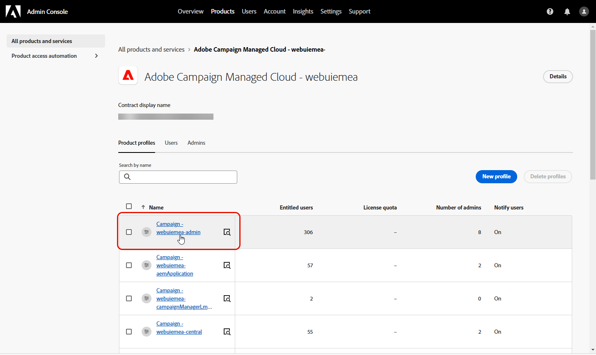
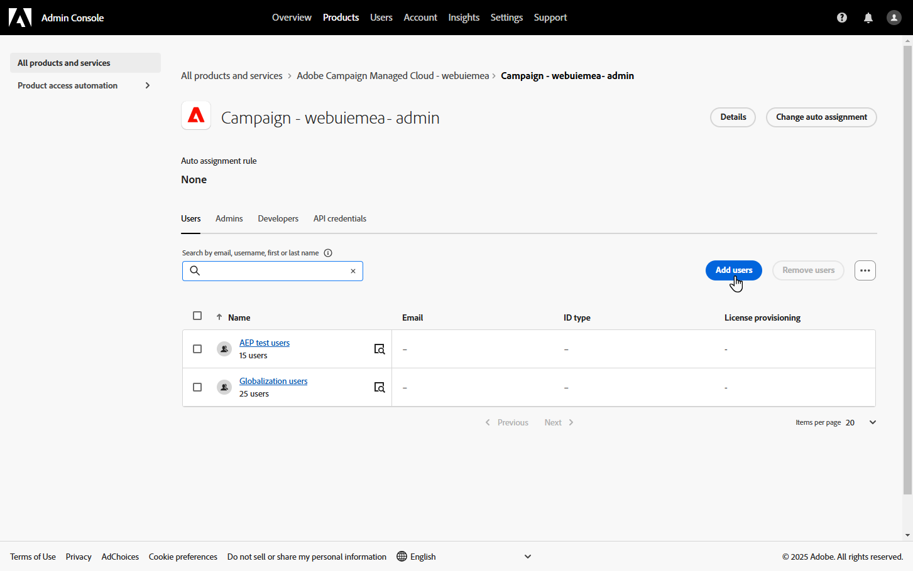
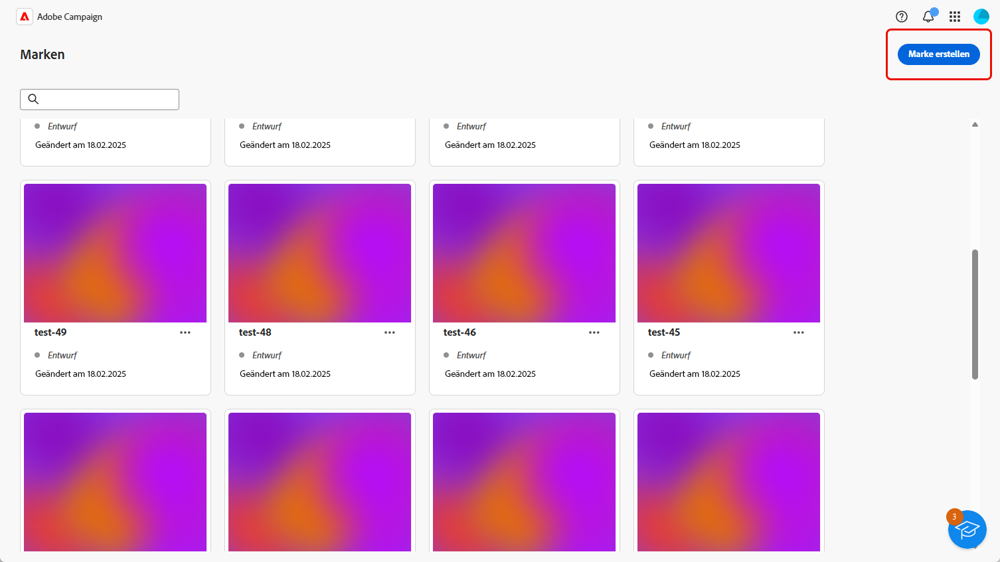
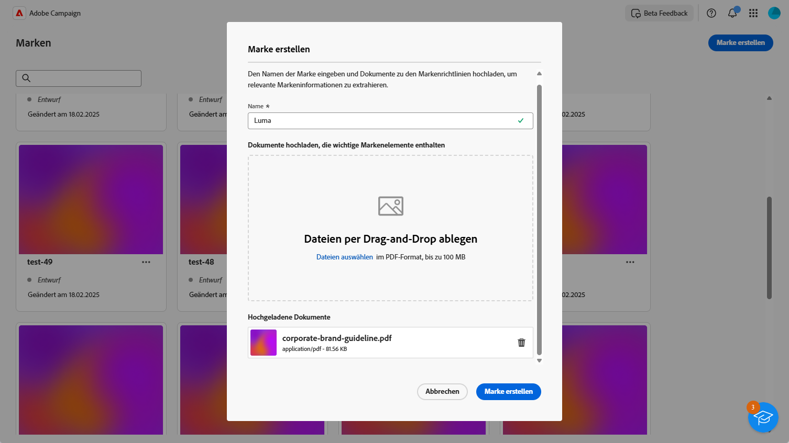
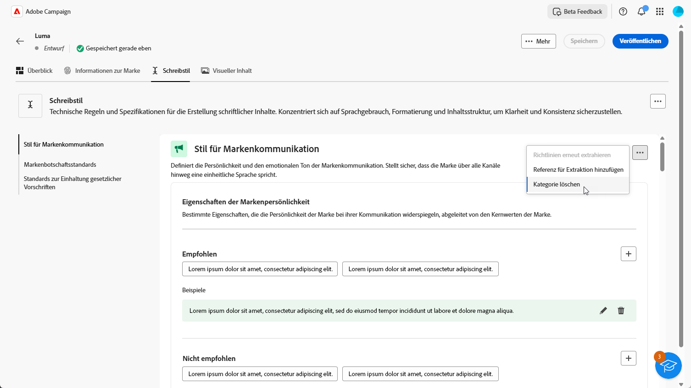
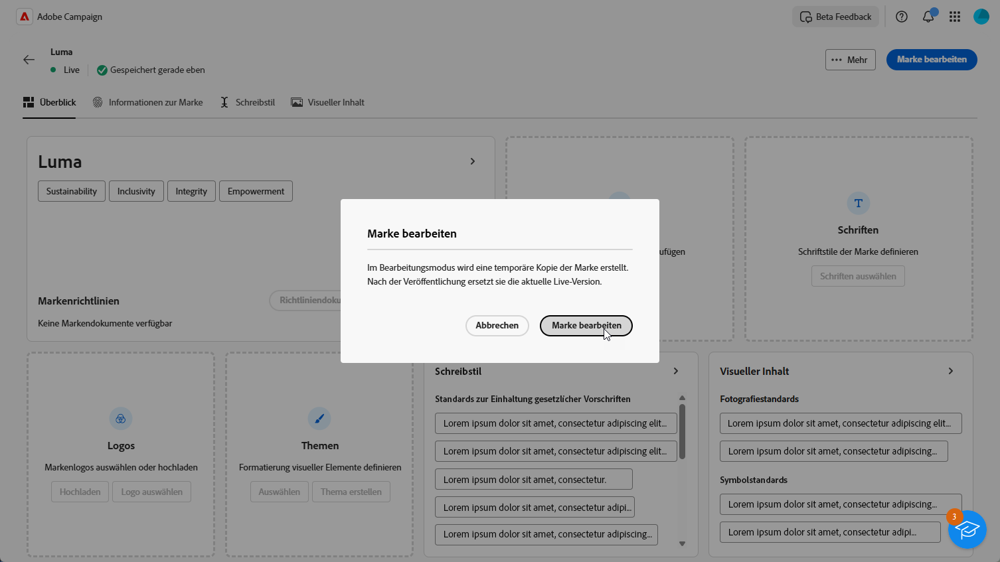
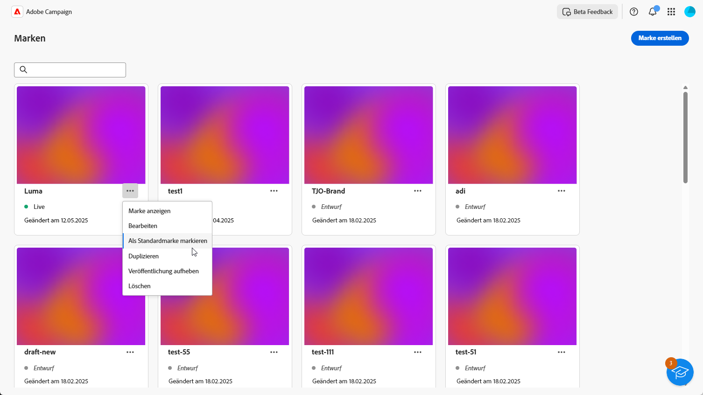

# Erstellen und Verwalten von Marken {#brands}

Markenrichtlinien sind ein umfassender Satz von Regeln und Standards, die die visuelle und verbale Identität einer Marke definieren. Sie dienen als Referenz, um eine konsistente Markendarstellung auf allen Marketing- und Kommunikationskanälen sicherzustellen.

In [!DNL Adobe Campaign Web] können Benutzende Markeninformationen manuell eingeben und organisieren oder Dokumente zu Markenrichtlinien hochladen, um die Daten automatisch zu extrahieren.

## Zugriff auf Marken {#generative-access}

Für den Zugriff auf das Menü **[!UICONTROL Marken]** in [!DNL Adobe Campaign Web] müssen Benutzenden die Produktprofile **[!UICONTROL Administrator (admin)]** und **[!UICONTROL Marken-Kit]** zugewiesen werden, damit sie Marken erstellen und verwalten können. Für den schreibgeschützten Zugriff benötigen Benutzende das Produktprofil [!UICONTROL KI-Assistent]. [Weitere Informationen](https://experienceleague.adobe.com/de/docs/campaign/campaign-v8/admin/permissions/manage-permissions)

+++ Erfahren Sie, wie Sie markenbezogene Berechtigungen zuweisen.

1. Greifen Sie auf der Startseite der [Admin Console](https://adminconsole.adobe.com/enterprise) auf Ihr Campaign-Produkt zu.

   

1. Wählen Sie das **[!DNL Product profile]** basierend auf der Berechtigungsstufe aus, die Sie Ihrer Benutzerin oder Ihrem Benutzer gewähren möchten.

   

1. Klicken Sie zum Zuweisen des ausgewählten Produktprofils auf **[!DNL Add users]**.

   

1. Geben Sie den Namen, die Benutzergruppe oder die E-Mail-Adresse der Benutzerin oder des Benutzers ein.

1. Klicken Sie zum Anwenden der Änderungen auf **Speichern**.

Für alle Benutzenden, die dieser Rolle bereits zugewiesen sind, werden die Berechtigungen automatisch aktualisiert.

+++

## Erstellen Ihrer Marke {#create-brand-kit}

Gehen Sie wie folgt vor, um Ihre Markenrichtlinien zu erstellen und zu verwalten:

Benutzende können die Details entweder manuell eingeben oder ein Dokument mit den Markenrichtlinien hochladen, damit die Informationen automatisch extrahiert werden:

1. Klicken Sie im Menü **[!UICONTROL Marken]** auf **[!UICONTROL Marke erstellen]**.

   

1. Geben Sie einen **[!UICONTROL Namen]** für Ihre Marke ein.

1. Ziehen oder wählen Sie eine Datei, um Ihre Markenrichtlinien hochzuladen und automatisch relevante Markeninformationen zu extrahieren. Klicken Sie auf **[!UICONTROL Marke erstellen]**.

   Der Informationsextraktionsprozess beginnt jetzt. Beachten Sie, dass dieser Vorgang mehrere Minuten dauern kann.

   

1. Ihre Standards für Content und visuelle Erstellung werden jetzt automatisch ausgefüllt. Durchsuchen Sie die verschiedenen Registerkarten, um die Informationen nach Bedarf anzupassen. [Weitere Informationen](#personalize)

1. Im erweiterten Menü jedes Abschnitts oder jeder Kategorie können Sie Verweise hinzufügen, um relevante Markeninformationen automatisch zu extrahieren.

   Um vorhandene Inhalte zu entfernen, verwenden Sie die Optionen **[!UICONTROL Abschnitt löschen]** oder **[!UICONTROL Kategorie löschen]**.

   

1. Klicken Sie nach der Konfiguration auf **[!UICONTROL Speichern]** und dann auf **[!UICONTROL Veröffentlichen]**, um Ihre Markenrichtlinie im KI-Assistenten verfügbar zu machen.

1. Um Änderungen an Ihrer veröffentlichten Marke vorzunehmen, klicken Sie auf **[!UICONTROL Marke bearbeiten]**.

   >[!NOTE]
   >
   >Dadurch wird eine temporäre Kopie im Bearbeitungsmodus erstellt, die die Live-Version nach der Veröffentlichung ersetzt.

   

1. Öffnen Sie im Dashboard **[!UICONTROL Marken]** das erweiterte Menü, indem Sie auf das Symbol  klicken, um Folgendes zu tun:

   * Marke anzeigen
   * Bearbeiten
   * Markieren als Standardmarke
   * Duplizieren
   * Veröffentlichen
   * Veröffentlichung aufheben
   * Löschen

   

Ihre Markenrichtlinien sind jetzt über die Dropdown-Liste **[!UICONTROL Marke]** im Menü des KI-Assistenten verfügbar. Dadurch kann der KI-Assistent Inhalte und Assets generieren, die mit Ihren Spezifikationen übereinstimmen. [Weitere Informationen zum KI-Assistenten](../content/generative-gs.md)

Sie können Ihre Markenrichtlinien auch verwenden, um die Qualität Ihrer Inhalte und die Markenausrichtung zu bewerten. [Erfahren Sie mehr über die Validierung der Inhaltsqualität](brands-score.md#validate-quality)

### Festlegen einer Standardmarke {#default-brand}

Sie können eine Standardmarke festlegen, die bei der Generierung von Inhalten und der Berechnung von Ausrichtungswerten während der Kampagnenerstellung automatisch angewendet wird.

Um eine Standardmarke festzulegen, navigieren Sie zum Dashboard **[!UICONTROL Marken]**. Öffnen Sie das erweiterte Menü, indem Sie auf das Symbol  klicken, und wählen Sie **[!UICONTROL Als Standardmarke markieren]** aus.

