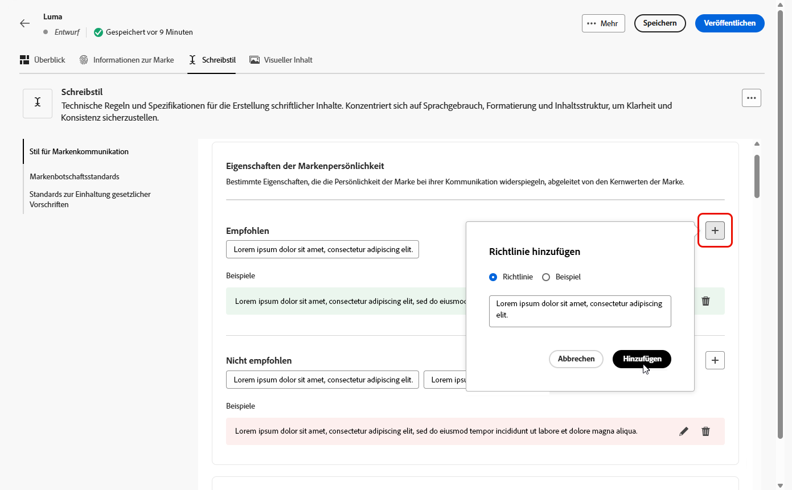

# Erstellen und Verwalten Ihrer Marken {#brands}

Markenrichtlinien sind ein umfassender Satz von Regeln und Standards, die die visuelle und verbale Identität einer Marke definieren. Sie dienen als Referenz, um eine konsistente Markendarstellung auf allen Marketing- und Kommunikationskanälen sicherzustellen.

In [!DNL Adobe Campaign Web] können Benutzende Markeninformationen manuell eingeben und organisieren oder Dokumente zu Markenrichtlinien hochladen, um die Daten automatisch zu extrahieren.

## Zugriff auf Marken {#generative-access}

Für den Zugriff auf das Menü **[!UICONTROL Marken]** in [!DNL Adobe Campaign Web] müssen Benutzenden die Produktprofile **[!UICONTROL Administrator (admin)]** und **[!UICONTROL Marken-Kit]** zugewiesen werden, damit sie Marken erstellen und verwalten können. Für den schreibgeschützten Zugriff benötigen Benutzende das Produktprofil [!UICONTROL KI-Assistent].

[Weitere Informationen](https://experienceleague.adobe.com/de/docs/campaign/campaign-v8/admin/permissions/manage-permissions)

+++ Erfahren Sie, wie Sie markenbezogene Berechtigungen zuweisen.

1. Greifen Sie auf der Startseite der [Admin Console](https://adminconsole.adobe.com/enterprise) auf Ihr Campaign-Produkt zu.

   

1. Wählen Sie das **[!DNL Product profile]** basierend auf der Berechtigungsstufe aus, die Sie Ihrer Benutzerin oder Ihrem Benutzer gewähren möchten.

   

1. Klicken Sie zum Zuweisen des ausgewählten Produktprofils auf **[!DNL Add users]**.

   

1. Geben Sie den Namen, die Benutzergruppe oder die E-Mail-Adresse der Benutzerin oder des Benutzers ein.

1. Klicken Sie zum Anwenden der Änderungen auf **Speichern**.

Für alle Benutzenden, die dieser Rolle bereits zugewiesen sind, werden die Berechtigungen automatisch aktualisiert.

+++

## Erstellen Ihrer Marke {#create-brand-kit}

Gehen Sie wie folgt vor, um Ihre Markenrichtlinien zu erstellen und zu verwalten:

Benutzende können die Details entweder manuell eingeben oder ein Dokument mit den Markenrichtlinien hochladen, damit die Informationen automatisch extrahiert werden:

1. Klicken Sie im Menü **[!UICONTROL Marken]** auf **[!UICONTROL Marke erstellen]**.

   

1. Geben Sie einen **[!UICONTROL Namen]** für Ihre Marke ein.

1. Ziehen oder wählen Sie eine Datei, um Ihre Markenrichtlinien hochzuladen und automatisch relevante Markeninformationen zu extrahieren. Klicken Sie auf **[!UICONTROL Marke erstellen]**.

   Der Informationsextraktionsprozess beginnt jetzt. Beachten Sie, dass dieser Vorgang mehrere Minuten dauern kann.

   

1. Ihre Standards für Content und visuelle Erstellung werden jetzt automatisch ausgefüllt. Durchsuchen Sie die verschiedenen Registerkarten, um die Informationen nach Bedarf anzupassen. [Weitere Informationen](#personalize)

1. Im erweiterten Menü jedes Abschnitts oder jeder Kategorie können Sie Verweise hinzufügen, um relevante Markeninformationen automatisch zu extrahieren.

   Um vorhandene Inhalte zu entfernen, verwenden Sie die Optionen **[!UICONTROL Abschnitt löschen]** oder **[!UICONTROL Kategorie löschen]**.

   

1. Klicken Sie nach der Konfiguration auf **[!UICONTROL Speichern]** und dann auf **[!UICONTROL Veröffentlichen]**, um Ihre Markenrichtlinie im KI-Assistenten verfügbar zu machen.

1. Um Änderungen an Ihrer veröffentlichten Marke vorzunehmen, klicken Sie auf **[!UICONTROL Marke bearbeiten]**.

   >[!NOTE]
   >
   >Dadurch wird eine temporäre Kopie im Bearbeitungsmodus erstellt, die die Live-Version nach der Veröffentlichung ersetzt.

   

1. Öffnen Sie im Dashboard **[!UICONTROL Marken]** das erweiterte Menü, indem Sie auf das Symbol  klicken, um Folgendes zu tun:

   * Marke anzeigen
   * Bearbeiten
   * Markieren als Standardmarke
   * Duplizieren
   * Veröffentlichen
   * Veröffentlichung aufheben
   * Löschen

   

Ihre Markenrichtlinien sind jetzt über die Dropdown-Liste **[!UICONTROL Marke]** im Menü des KI-Assistenten verfügbar. Dadurch kann der KI-Assistent Inhalte und Assets generieren, die mit Ihren Spezifikationen übereinstimmen. [Weitere Informationen zum KI-Assistenten](../content/generative-gs.md)

### Festlegen einer Standardmarke {#default-brand}

Sie können eine Standardmarke festlegen, die bei der Generierung von Inhalten und der Berechnung von Ausrichtungswerten während der Kampagnenerstellung automatisch angewendet wird.

Um eine Standardmarke festzulegen, navigieren Sie zum Dashboard **[!UICONTROL Marken]**. Öffnen Sie das erweiterte Menü, indem Sie auf das Symbol  klicken, und wählen Sie **[!UICONTROL Als Standardmarke markieren]** aus.

## Personalisieren Ihrer Marke {#personalize}

### Informationen zur Marke {#about-brand}

Verwenden Sie die Registerkarte **[!UICONTROL Informationen zur Marke]**, um die Kernidentität Ihrer Marke festzulegen und ihren Zweck, ihre Persönlichkeit, ihre Tagline und andere bestimmende Attribute zu definieren.

1. Füllen Sie zunächst die grundlegenden Informationen für Ihre Marke in der Kategorie **[!UICONTROL Schlüsseldetails]** aus:

   * **[!UICONTROL Marken-Kit-Name]**: Geben Sie den Namen Ihres Marken-Kits ein.

   * **[!UICONTROL Verwendung]**: Geben Sie Szenarien oder Kontexte an, in denen dieses Marken-Kit verwendet werden soll.

   * **[!UICONTROL Markenname]**: Geben Sie den offiziellen Namen der Marke ein.

   * **[!UICONTROL Markenbeschreibung]**: Geben Sie einen Überblick darüber, wofür was diese Marke steht.

   * **[!UICONTROL Tagline (Standard)]**: Fügen Sie die primäre Tagline hinzu, die der Marke zugeordnet ist.

     

1. Erläutern Sie in der Kategorie **[!UICONTROL Leitprinzipien]** die Kernausrichtung und Philosophie Ihrer Marke:

   * **[!UICONTROL Mission]**: Beschreiben Sie den Zweck Ihrer Marke.

   * **[!UICONTROL Vision]**: Beschreiben Sie Ihr langfristiges Ziel bzw. Ihren gewünschten zukünftigen Status.

   * **[!UICONTROL Marktpositionierung]**: Erklären Sie, wie Ihre Marke auf dem Markt positioniert ist.

   

1. Klicken Sie in der Kategorie **[!UICONTROL Kernwerte der Marke]** auf , um die Kernwerte der Marke hinzuzufügen und die Details auszufüllen:

   * **[!UICONTROL Wert]**: Benennen Sie einen Kernwert der Marke.

   * **[!UICONTROL Beschreibung]**: Erklären Sie, was dieser Wert für Ihre Marke bedeutet.

   * **[!UICONTROL Verhalten]**: Beschreiben Sie die Aktionen oder Einstellungen, die diesen Wert in der Praxis widerspiegeln.

   * **[!UICONTROL Manifestationen]**: Nennen Sie Beispiele dafür, wie dieser Wert im realen Branding ausgedrückt wird.

     

1. Klicken Sie bei Bedarf auf das Symbol , um einen Kernwert Ihrer Marke zu aktualisieren oder zu löschen.

   

Jetzt können Sie Ihre Marke weiter personalisieren oder [die Marke veröffentlichen](#create-brand-kit).

### Schreibstil {#writing-style}

Im Abschnitt **[!UICONTROL Schreibstil]** werden die Standards für das Schreiben von Inhalten beschrieben. Außerdem wird erläutert, wie Sprache, Formatierung und Struktur verwendet werden sollten, um Klarheit, Kohärenz und Konsistenz in allen Materialien zu gewährleisten.

+++ Verfügbare Kategorien und Beispiele

<table>
  <thead>
    <tr>
      <th>Kategorie</th>
      <th>Unterkategorie</th>
      <th>Beispiel für die Richtlinie</th>
      <th>Beispiel für Ausschlüsse</th>
    </tr>
  </thead>
  <tbody>
    <tr>
      <td rowspan="4">Inhaltserstellungsstandards</td>
      <td>Markenbotschaftsstandards</td>
      <td>Heben Sie Innovation und Customer-first-Messaging hervor.</td>
      <td>Heben Sie nicht zu viele Produktfunktionen hervor.</td>
    </tr>
    <tr>
      <td>Tagline-Nutzung</td>
      <td>Platzieren Sie die Tagline auf allen Digital-Marketing-Assets unter dem Logo.</td>
      <td>Ändern oder übersetzen Sie die Tagline nicht.</td>
    </tr>
    <tr>
      <td>Kernbotschaften</td>
      <td>Heben Sie die wichtigsten Vorteile hervor, z. B. die gesteigerte Produktivität.</td>
      <td>Machen Sie keine nicht im Zusammenhang stehenden Wertversprechen.</td>
    </tr>
    <tr>
      <td>Benennungsstandards</td>
      <td>Verwenden Sie einfache, beschreibende Namen wie „ProScheduler“.</td>
      <td>Verwenden Sie keine komplexen Begriffe oder Sonderzeichen.</td>
    </tr>
    <tr>
      <td rowspan="5">Stil für Markenkommunikation</td>
      <td>Eigenschaften der Markenpersönlichkeit</td>
      <td>Freundlich und offen.</td>
      <td>Seien Sie nicht pessimistisch.</td>
    </tr>
    <tr>
      <td>Schreibtechnik</td>
      <td>Formulieren Sie kurze und aussagekräftige Sätze.</td>
      <td>Verwenden Sie nicht zu viel Jargon.</td>
    </tr>
    <tr>
      <td>Situationsbezogener Ton</td>
      <td>Behalten Sie in Krisensituationen einen professionellen Ton bei.</td>
      <td>Seien Sie in der Support-Kommunikation nicht abweisend.</td>
    </tr>
    <tr>
      <td>Richtlinien zur Wortwahl</td>
      <td>Verwenden Sie Worte wie „innovativ“ und „intelligent“.</td>
      <td>Vermeiden Sie Worte wie „billig“ oder „Hack“.</td>
    </tr>
    <tr>
      <td>Sprachstandards</td>
      <td>Befolgen Sie die Konventionen für amerikanisches Englisch.</td>
      <td>Vermischen Sie britische und amerikanische Rechtschreibung nicht.</td>
    </tr>
    <tr>
      <td rowspan="3">Standards zur Einhaltung gesetzlicher Vorschriften</td>
      <td>Markenstandards</td>
      <td>Verwenden Sie immer die Symbole ™ oder ®.</td>
      <td>Lassen Sie keine rechtlichen Symbole weg, wo diese erforderlich sind.</td>
    </tr>
    <tr>
      <td>Copyright-Standards</td>
      <td>Verwenden Sie Copyright-Hinweise auf Marketing-Materialen.</td>
      <td>Verwenden Sie keine Inhalte von Dritten ohne deren Erlaubnis.</td>
    </tr>
    <tr>
      <td>Haftungsausschlussstandards</td>
      <td>Platzieren Sie Haftungsausschlüsse gut lesbar auf digitalen Assets.</td>
      <td>Verstecken Sie Haftungsausschlüsse nicht in nicht sichtbaren Bereichen.</td>
    </tr>
</table>

+++

 

So personalisieren Sie den **[!UICONTROL Schreibstil]**:

1. Klicken Sie auf der Registerkarte **[!UICONTROL Schreibstil]** auf , um eine Richtlinie, eine Ausnahme oder einen Ausschluss hinzuzufügen.

1. Geben Sie Richtlinie, Ausnahme oder Ausschluss ein. Sie können auch &quot;**[!UICONTROL &quot;]**, um die Anwendung besser zu veranschaulichen.

   

1. Geben Sie den **[!UICONTROL Nutzungskontext]** für Ihre Richtlinie, Ausnahme oder Ausschluss an:

   * **[!UICONTROL Kanaltyp]**: Wählen Sie aus, wo diese Richtlinie, Ausnahme oder Ausnahme gelten soll. Beispielsweise soll ein bestimmter Schreibstil nur in E-Mail-, Mobile-, Druck- oder anderen Kommunikationskanälen angezeigt werden.

   * **[!UICONTROL Elementtyp]**: Geben Sie an, für welches Inhaltselement die Regel gilt. Dazu können Elemente wie Überschriften, Schaltflächen, Links oder andere Komponenten in Ihrem Inhalt gehören.

   

1. Nachdem Sie Ihre Richtlinie, Ausnahme oder Ausnahme eingerichtet haben, klicken Sie auf **[!UICONTROL Hinzufügen]**.
1. Wählen Sie bei Bedarf eine der Richtlinien oder einen Ausschluss aus, die aktualisiert oder gelöscht werden sollen.

1. Klicken Sie auf , um Ihr Beispiel zu bearbeiten, oder auf das Symbol , um es zu löschen.

   

Jetzt können Sie Ihre Marke weiter personalisieren oder sie [veröffentlichen](#create-brand-kit).

### Visueller Inhalt {#visual-content}

Im Abschnitt **[!UICONTROL Visueller Inhalt]** werden die Standards für Bilder und Design definiert. Es werden die Spezifikationen detailliert beschrieben, die für die Aufrechterhaltung eines einheitlichen und konsistenten Looks einer Marke erforderlich sind.

+++ Verfügbare Kategorien und Beispiele

<table>
  <thead>
    <tr>
      <th>Kategorie</th>
      <th>Beispiel für die Richtlinie</th>
      <th>Beispiel für Ausschlüsse</th>
    </tr>
  </thead>
  <tbody>
    <tr>
      <td>Fotografiestandards</td>
      <td>Verwenden Sie natürliche Beleuchtung für Außenaufnahmen.</td>
      <td>Vermeiden Sie übermäßig bearbeitete oder verpixelte Bilder.</td>
    </tr>
    <tr>
      <td>Illustrationsstandards</td>
      <td>Verwenden Sie klaren, minimalistischen Stil.</td>
      <td>Vermeiden Sie übermäßig komplexen Stil.</td>
    </tr>
    <tr>
      <td>Symbolstandards</td>
      <td>Verwenden Sie ein konsistentes 24-Pixel-Rastersystem.</td>
      <td>Vermischen Sie keine unterschiedlichen Symbolabmessungen, verwenden Sie keine inkonsistenten Strichstärken und weichen Sie nicht von Rasterregeln ab.</td>
    </tr>
    <tr>
      <td>Nutzungsrichtlinien</td>
      <td>Wählen Sie Lifestyle-Bilder, die reale Kundinnen und Kunden bei der Verwendung des Produkts in professionellen Umgebungen zeigen.</td>
      <td>Verwenden Sie keine Bilder, die dem Markenton widersprechen oder aus dem Kontext gerissen erscheinen.</td>
    </tr>
</table>

+++

 

So personalisieren Sie **[!UICONTROL visuelle Inhalte]**:

1. Klicken Sie auf der Registerkarte **[!UICONTROL Visueller Inhalt]** auf , um eine Richtlinie, einen Ausschluss oder ein Beispiel hinzuzufügen.

1. Geben Sie Ihre Richtlinie, Ihren Ausschluss oder Ihr Beispiel ein.

   

1. Geben Sie den **[!UICONTROL Nutzungskontext]** für Ihre Richtlinie oder Ihren Ausschluss an:

   * **[!UICONTROL Kanaltyp]**: Wählen Sie aus, wo diese Richtlinie, Ausnahme oder Ausnahme gelten soll. Beispielsweise soll ein bestimmter Schreibstil nur in E-Mail-, Mobile-, Druck- oder anderen Kommunikationskanälen angezeigt werden.

   * **[!UICONTROL Elementtyp]**: Geben Sie an, für welches Inhaltselement die Regel gilt. Dazu können Elemente wie Überschriften, Schaltflächen, Links oder andere Komponenten in Ihrem Inhalt gehören.

     

1. Nachdem Sie Ihre Richtlinie, Ausnahme oder Ausnahme eingerichtet haben, klicken Sie auf **[!UICONTROL Hinzufügen]**.

1. Um ein Bild hinzuzufügen, das die korrekte Verwendung zeigt, wählen Sie **[!UICONTROL Beispiel]** und klicken Sie auf **[!UICONTROL Bild auswählen]**. Sie können auch ein Bild mit falscher Verwendung als Ausschlussbeispiel hinzufügen.

   

1. Wählen Sie eine Richtlinie oder einen Ausschluss zum Aktualisieren oder Löschen aus.

1. Wählen Sie eine Richtlinie oder einen Ausschluss zum Aktualisieren aus. Klicken Sie zum Löschen auf das Symbol .

   

Jetzt können Sie Ihre Marke weiter personalisieren oder sie [veröffentlichen](#create-brand-kit).
