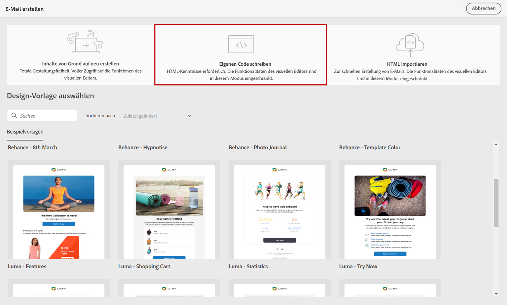
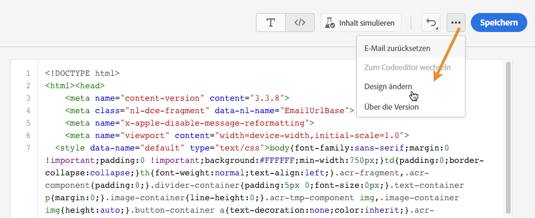
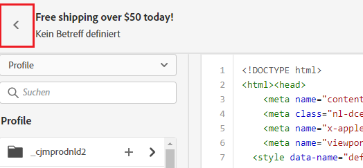

# Codieren Sie Ihre eigenen Inhalte {#code-content}

>[!NOTE]
>
>Diese Dokumentation wird derzeit erstellt und häufig aktualisiert. Die endgültige Version dieses Inhalts wird im Januar 2023 vorliegen.

Verwenden Sie den Modus **[!UICONTROL Eigenen Code erstellen]**, um unformatierte HTML zu importieren und/oder Ihren E-Mail-Inhalt zu codieren. Diese Methode erfordert HTML-Kenntnisse.

1. Wählen Sie auf der Startseite von E-Mail-Designer die Option **[!UICONTROL Eigenen Code schreiben]**.

   

1. Geben Sie Ihren rohen HTML-Code ein oder fügen Sie ihn ein.

1. Verwenden Sie den linken Bereich, um die Personalisierungsfunktionen zu nutzen.

1. Wenn Sie den E-Mail-Designer öffnen möchten, um Ihre E-Mail von einem neuen Design aus zu starten, wählen Sie **[!UICONTROL Design ändern]** aus dem Optionen-Menü

   

1. Klicken Sie auf die Schaltfläche **[!UICONTROL Inhalt simulieren]**, um Design und Personalisierung der Nachricht mithilfe von Testprofilen zu überprüfen.

1. Sobald Ihr Code fertig ist, klicken Sie auf **[!UICONTROL Speichern]**. Gehen Sie dann zurück zum Bildschirm zur Nachrichtenerstellung, um Ihre Nachricht fertigzustellen.

   
