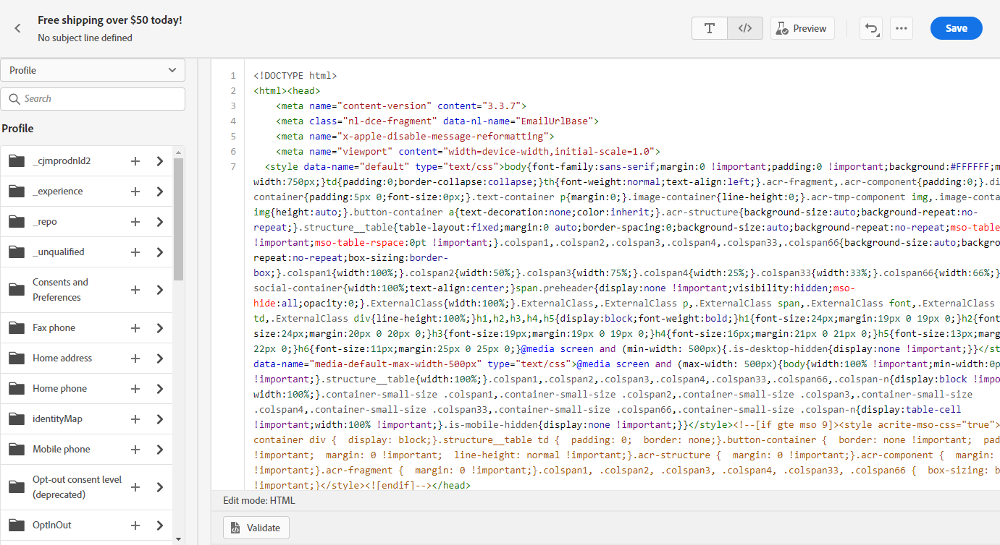

# Code Ihres eigenen Inhalts {#code-content}

>[!NOTE]
>
>Diese Dokumentation wird derzeit erstellt und häufig aktualisiert. Die endgültige Version dieses Inhalts wird im Januar 2023 vorliegen.

Verwenden Sie die **[!UICONTROL Eigene Code]** -Modus, um unformatierten HTML zu importieren und/oder Ihren E-Mail-Inhalt zu kodieren. Diese Methode erfordert HTML-Kenntnisse.

➡️ [Entdecken Sie diese Funktion im Video](#video)

>[!CAUTION]
>
> Bei Verwendung dieser Methode können keine Bilder aus Adobe Experience Manager Assets Essentials referenziert werden. Die in Ihrem HTML-Code referenzierten Bilder müssen an einem öffentlichen Speicherort gespeichert werden.

1. Wählen Sie auf der Startseite von Email Designer die Option **[!UICONTROL Eigene Code]**.

   

1. Geben Sie Ihren rohen HTML-Code ein oder fügen Sie ihn ein.

1. Verwenden Sie den linken Bereich, um [!DNL Journey Optimizer] Personalisierungsfunktionen.

   

1. Wenn Sie Email Designer öffnen möchten, um Ihre E-Mail von einem neuen Entwurf aus zu starten, wählen Sie **[!UICONTROL Entwurf ändern]** aus dem Menü &quot;Optionen&quot;aus.

   

1. Klicken Sie auf **[!UICONTROL Vorschau]** -Schaltfläche, um den Nachrichtenentwurf und die Personalisierung mithilfe von Testprofilen zu überprüfen.

   

1. Sobald Ihr Code fertig ist, klicken Sie auf **[!UICONTROL Speichern]** Gehen Sie dann zurück zum Bildschirm zur Nachrichtenerstellung , um die Nachricht abzuschließen.

   
