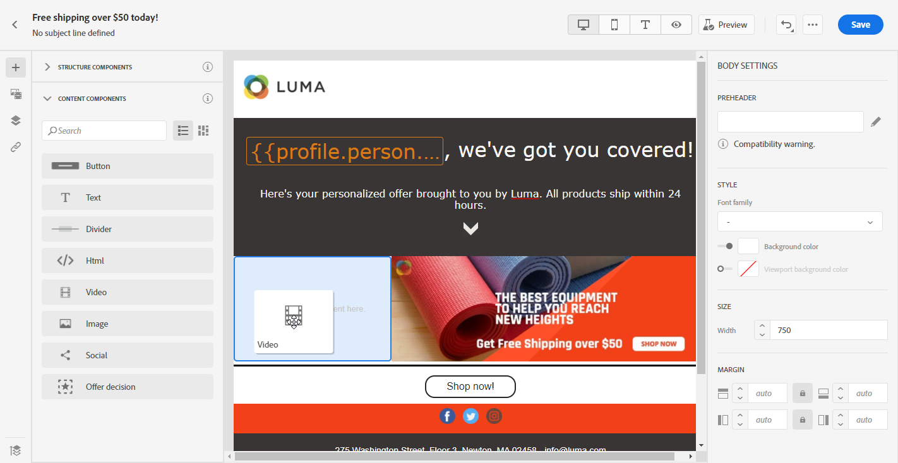

# Verwenden der Inhaltskomponenten von Email Designer {#content-components}

>[!NOTE]
>
>Diese Dokumentation wird derzeit erstellt und häufig aktualisiert. Die endgültige Version dieses Inhalts wird im Januar 2023 vorliegen.

>[!CONTEXTUALHELP]
>id="ac_content_components_email"
>title="Über Inhaltskomponenten"
>abstract="Inhaltskomponenten sind leere Platzhalter für Inhalte, mit denen Sie das Layout einer E-Mail erstellen können."

>[!CONTEXTUALHELP]
>id="ac_content_components_landing_page"
>title="Über Inhaltskomponenten"
>abstract="Inhaltskomponenten sind leere Platzhalter für Inhalte, mit denen Sie das Layout einer Landingpage erstellen können."

>[!CONTEXTUALHELP]
>id="ac_content_components_fragment"
>title="Über Inhaltskomponenten"
>abstract="Inhaltskomponenten sind leere Platzhalter für Inhalte, mit denen Sie das Layout eines Fragments erstellen können."

>[!CONTEXTUALHELP]
>id="ac_content_components_template"
>title="Über Inhaltskomponenten"
>abstract="Inhaltskomponenten sind leere Platzhalter für Inhalte, mit denen Sie das Layout einer Vorlage erstellen können."

Wenn Sie Ihren E-Mail-Inhalt von Grund auf neu erstellen, **[!UICONTROL Inhaltskomponenten]** ermöglicht es Ihnen, Ihre E-Mail mit leeren, rohen Komponenten weiter zu personalisieren, die Sie nach der Platzierung in einer E-Mail verwenden können.
Sie können beliebig viele **[!UICONTROL Inhaltskomponenten]** wie in einem **[!UICONTROL Strukturkomponente]** definiert das Layout Ihrer E-Mail.

## Schaltfläche {#buttons}

Verwenden Sie die **[!UICONTROL Schaltfläche]** -Komponente, um mehrere Schaltflächen in Ihre E-Mail einzufügen und Ihre E-Mail-Zielgruppe auf eine andere Seite umzuleiten.

1. Von **[!UICONTROL Inhaltskomponenten]**, per Drag &amp; Drop **[!UICONTROL Schaltfläche]** in **[!UICONTROL Strukturkomponente]**.

   

1. Klicken Sie auf die neu hinzugefügte Schaltfläche, um den Text zu personalisieren und Zugriff auf die **[!UICONTROL Komponenteneinstellungen]** im rechten Bereich des E-Mail-Designers.

   

1. Im **[!UICONTROL Link]** des **[!UICONTROL Komponenteneinstellungen]** Fügen Sie die URL hinzu, zu der Ihre Audience umgeleitet werden soll, wenn Sie auf die Schaltfläche klicken.

1. Wählen Sie aus, wie Ihre Zielgruppe mit der **[!UICONTROL Target]** Dropdown-Liste:

   * **[!UICONTROL Keines]**: öffnet den Link im selben Frame, in dem er angeklickt wurde (Standard).
   * **[!UICONTROL Leer]**: öffnet den Link in einem neuen Fenster oder auf einer neuen Registerkarte.
   * **[!UICONTROL Selbst]**: öffnet den Link im selben Frame, in dem er angeklickt wurde.
   * **[!UICONTROL Übergeordnet]**: öffnet den Link im übergeordneten Frame.
   * **[!UICONTROL Oben]**: öffnet den Link im vollständigen Textkörper des Fensters.

   

1. Sie können Ihre Schaltfläche nun weiter personalisieren, indem Sie die **[!UICONTROL Stil]**, **[!UICONTROL Marge]** und **[!UICONTROL Rahmen]** zum Beispiel.

## Text {#text}

Verwenden Sie die **[!UICONTROL Text]** -Komponente, um Text in Ihre E-Mail einzufügen. Sie können die Farbe, den Stil und die Größe des Textes in den **[!UICONTROL Komponenteneinstellungen]** anpassen.

1. In **[!UICONTROL Inhaltskomponenten]**, per Drag &amp; Drop **[!UICONTROL Text]** in **[!UICONTROL Strukturkomponente]**.

   

1. Klicken Sie auf die neu hinzugefügte Komponente, um den Text zu personalisieren und Zugriff auf die **[!UICONTROL Komponenteneinstellungen]** im rechten Bereich des E-Mail-Designers.

1. Ändern Sie den Text mit den folgenden in der Symbolleiste verfügbaren Optionen:

   

   * **[!UICONTROL Textstil ändern]**: fett, kursiv, unterstrichen oder durchgestrichen auf Ihren Text anwenden.
   * **Ausrichtung ändern**: Wählen Sie für Ihren Text eine linke, rechte, mittlere oder ausgehende Ausrichtung.
   * **[!UICONTROL Liste erstellen]**: Fügen Sie Ihrem Text eine Aufzählungs- oder Zahlenliste hinzu.
   * **[!UICONTROL Überschrift festlegen]**: Fügen Sie Ihrem Text bis zu sechs Überschriftenebenen hinzu.
   * **Schriftgröße**: Wählen Sie die Schriftgröße Ihres Textes in Pixel aus.
   * **[!UICONTROL Bild bearbeiten]**: Fügen Sie Ihrer Textkomponente ein Bild oder ein Asset hinzu.
   * **[!UICONTROL Quellcode anzeigen]**: den Quellcode Ihres Textes anzeigen. Sie kann nicht geändert werden.
   * **[!UICONTROL Duplizieren]**: Fügen Sie eine Kopie Ihrer Textkomponente hinzu.
   * **[!UICONTROL Löschen]**: Löschen Sie die ausgewählte Textkomponente aus Ihrer E-Mail.
   * **[!UICONTROL Personalisierung hinzufügen]**: Fügen Sie Personalisierungsfelder hinzu, um den Inhalt aus Ihren Profildaten anzupassen.
   * **[!UICONTROL Bedingten Inhalt aktivieren]**: Fügen Sie bedingte Inhalte hinzu, um den Inhalt der Komponente an die Zielprofile anzupassen.

1. Passen Sie die **[!UICONTROL Textfarbe]**, **[!UICONTROL Schriftfamilie]** und **[!UICONTROL Größe]** im **[!UICONTROL Komponenteneinstellungen]**.

   

## Trennlinie {#divider}

Verwenden Sie die **[!UICONTROL Trennlinie]** -Komponente, um eine Trennlinie einzufügen, um das Layout und den Inhalt Ihrer E-Mail zu organisieren.
Sie können die Farbe, den Stil und die Größe der Trennlinie in den **[!UICONTROL Komponenteneinstellungen]** auswählen.

## HTML {#HTML}

Verwenden Sie die **[!UICONTROL HTML]** zum Kopieren und Einfügen der verschiedenen Teile Ihrer bestehenden HTML. Damit können Sie kostenfrei modulare HTML-Komponenten erstellen.

Um die Kompatibilität von externen Inhalten mit Email Designer zu gewährleisten, empfiehlt Adobe, eine Nachricht von Grund auf neu zu erstellen und den Inhalt aus der existierenden E-Mail in Komponenten zu kopieren.

1. In **[!UICONTROL Inhaltskomponenten]**, per Drag &amp; Drop **[!UICONTROL HTML]** in **[!UICONTROL Strukturkomponente]**.

   

1. Klicken Sie auf die neu hinzugefügte Komponente und dann auf **[!UICONTROL Quellcode anzeigen]** , um Ihre HTML hinzuzufügen.

   

1. Kopieren Sie den HTML-Code, den Sie Ihrer E-Mail hinzufügen möchten, und klicken Sie auf **[!UICONTROL Speichern]**.

1. Sie können jetzt Ihre HTML weiter personalisieren, indem Sie die **[!UICONTROL Stil]**, **[!UICONTROL Marge]** und **[!UICONTROL Rahmen]** z. B. durch Hinzufügen eines Links zur Umleitung Ihrer Audience zu einem anderen Inhalt.

## Bild {#image}

Verwenden Sie die **[!UICONTROL Bild]** -Komponente, um eine Bilddatei von Ihrem Computer in Ihre E-Mail einzufügen.

1. In **[!UICONTROL Inhaltskomponenten]**, per Drag &amp; Drop **[!UICONTROL Bild]** in **[!UICONTROL Strukturkomponente]**.

   

1. Klicken **[!UICONTROL Durchsuchen]** , um eine Bilddatei aus Ihren Assets auszuwählen.

   Weitere Informationen finden Sie unter [!DNL Assets Essentials], siehe [Adobe Experience Manager Assets Essentials-Dokumentation](https://experienceleague.adobe.com/docs/experience-manager-assets-essentials/help/introduction.html){target=&quot;_blank&quot;}.

1. Klicken Sie auf die neu hinzugefügte Komponente, um mit der Konfiguration Ihrer **[!UICONTROL Inhaltskomponenten]** und Zugriff auf die **[!UICONTROL Komponenteneinstellungen]** im rechten Bereich des E-Mail-Designers.

1. Richten Sie Ihre Bildeigenschaften ein:

   * **[!UICONTROL Bildtitel]** ermöglicht die Definition eines Titels für das Bild.
   * **[!UICONTROL Alternativtext]** ermöglicht die Definition der Ihrem Bild zugeordneten Beschriftung. Dies entspricht dem alt-HTML-Attribut.

   

1. Sie können Ihr Bild nun weiter personalisieren, indem Sie die **[!UICONTROL Stil]**, **[!UICONTROL Marge]** und **[!UICONTROL Rahmen]** z. B. durch Hinzufügen eines Links zur Umleitung Ihrer Audience zu einem anderen Inhalt.

## Video {#Video}

>[!CONTEXTUALHELP]
>id="ac_edition_video_email"
>title="Videoeinstellungen"
>abstract="Verwenden Sie diese Komponente, um ein Video in Ihre E-Mail einzufügen. Beachten Sie, dass Videos nicht auf allen E-Mail-Clients funktionieren. Wir empfehlen, ein Reservebild festzulegen."

>[!CONTEXTUALHELP]
>id="ac_edition_video_landing_page"
>title="Videoeinstellungen"
>abstract="Verwenden Sie diese Komponente, um ein Video in Ihre Landingpage einzufügen. Beachten Sie, dass Videos nicht in allen Nachrichten-Clients funktionieren. Wir empfehlen, ein Reservebild festzulegen."

>[!CONTEXTUALHELP]
>id="ac_edition_video_fragment"
>title="Videoeinstellungen"
>abstract="Verwenden Sie diese Komponente, um ein Video in Ihr Fragment einzufügen. Beachten Sie, dass Videos nicht in allen Nachrichten-Clients funktionieren. Wir empfehlen, ein Reservebild festzulegen."

>[!CONTEXTUALHELP]
>id="ac_edition_video_template"
>title="Videoeinstellungen"
>abstract="Verwenden Sie diese Komponente, um ein Video in Ihre Vorlage einzufügen. Beachten Sie, dass Videos nicht in allen Nachrichten-Clients funktionieren. Wir empfehlen, ein Reservebild festzulegen."

Verwenden Sie die **[!UICONTROL Video]** -Komponente, um ein Video über einen URL-Link in Ihre E-Mail einzufügen.

1. In **[!UICONTROL Inhaltskomponenten]**, per Drag &amp; Drop **[!UICONTROL Video]** in **[!UICONTROL Strukturkomponente]**.

   

1. Klicken Sie auf die neu hinzugefügte Komponente, um mit der Konfiguration Ihrer **[!UICONTROL Inhaltskomponenten]** und Zugriff auf die **[!UICONTROL Komponenteneinstellungen]** im rechten Bereich des E-Mail-Designers.

1. Im **[!UICONTROL Video-Link]** des **[!UICONTROL Komponenteneinstellungen]**, fügen Sie Ihre Video-URL hinzu.

   

1. Sie können eine **[!UICONTROL Posterbild]** in Ihr Video ein, um ein Bild anzugeben, das angezeigt werden soll, bis Ihre Zielgruppe auf die Wiedergabeschaltfläche klickt.

1. Sie können Ihr Bild nun weiter personalisieren, indem Sie die **[!UICONTROL Stil]**, **[!UICONTROL Marge]** und **[!UICONTROL Rahmen]** zum Beispiel.

## Social {#social}

Verwenden Sie die **[!UICONTROL Social]** -Komponente, um Links zu Social-Media-Seiten in Ihre E-Mail einzufügen.

1. In **[!UICONTROL Inhaltskomponenten]**, per Drag &amp; Drop **[!UICONTROL Social]** in **[!UICONTROL Strukturkomponente]**.

   

1. Klicken Sie auf die neu hinzugefügte Komponente, um mit der Konfiguration Ihrer **[!UICONTROL Inhaltskomponenten]** und Zugriff auf die **[!UICONTROL Komponenteneinstellungen]** im rechten Bereich des E-Mail-Designers.

1. Im **[!UICONTROL Social]** des **[!UICONTROL Komponenteneinstellungen]** auswählen, welche sozialen Medien Sie hinzufügen oder entfernen möchten.

   

1. Wählen Sie die Größe Ihrer Symbole im **[!UICONTROL Bildgröße]** -Feld.

1. Klicken Sie auf jedes Ihrer Social-Media-Symbole, um die **[!UICONTROL URL]** an die Ihre Zielgruppe umgeleitet wird.

   

1. Sie können bei Bedarf auch die Symbole der einzelnen sozialen Medien im **[!UICONTROL Bild]** -Feld.

1. Sie können jetzt Ihre Social-Media-Symbole weiter personalisieren, indem Sie die **[!UICONTROL Stil]**, **[!UICONTROL Marge]** und **[!UICONTROL Rahmen]**.

## Angebotsentscheidung {#offer-decision}

Verwenden Sie die **[!UICONTROL Angebotsentscheidung]** -Komponente verwenden, um Entscheidungen (zuvor als Angebotsaktivitäten bezeichnet) in Ihre Nachrichten einzufügen. Entscheidungen nutzen die Entscheidungsverwaltung, um das beste Angebot für Ihre Kunden auszuwählen.
