# Verwenden der Inhaltskomponenten von E-Mail-Designer {#content-components}

>[!CONTEXTUALHELP]
>id="ac_content_components_email"
>title="Über Inhaltskomponenten"
>abstract="Inhaltskomponenten sind leere Platzhalter für Inhalte, mit denen Sie das Layout einer E-Mail gestalten können."

>[!CONTEXTUALHELP]
>id="ac_content_components_landing_page"
>title="Über Inhaltskomponenten"
>abstract="Inhaltskomponenten sind leere Platzhalter für Inhalte, mit denen Sie das Layout einer Landingpage gestalten können."

>[!CONTEXTUALHELP]
>id="ac_content_components_fragment"
>title="Über Inhaltskomponenten"
>abstract="Inhaltskomponenten sind leere Platzhalter für Inhalte, mit denen Sie das Layout eines Fragments gestalten können."

>[!CONTEXTUALHELP]
>id="ac_content_components_template"
>title="Über Inhaltskomponenten"
>abstract="Inhaltskomponenten sind leere Platzhalter für Inhalte, mit denen Sie das Layout einer Vorlage gestalten können."

## Hinzufügen von Inhaltskomponenten {#add-content-components}

Gehen Sie wie folgt vor, um Ihrer E-Mail Inhaltskomponenten hinzuzufügen und diese an Ihre Anforderungen anzupassen.

1. Verwenden Sie in E-Mail-Designer einen vorhandenen Inhalt oder ziehen Sie per Drag-and-Drop **[!UICONTROL Strukturkomponenten]** in einen leeren Inhalt, um das Layout Ihrer E-Mail zu definieren. [Weitere Informationen](create-email-content.md)

1. Um den Abschnitt **[!UICONTROL Inhaltskomponenten]** zu öffnen, wählen Sie die entsprechende Schaltfläche im linken Bereich von E-Mail-Designer aus.

   

1. Platzieren Sie die Inhaltskomponenten Ihrer Wahl mittels Drag-and-Drop in den relevanten Strukturkomponenten.

   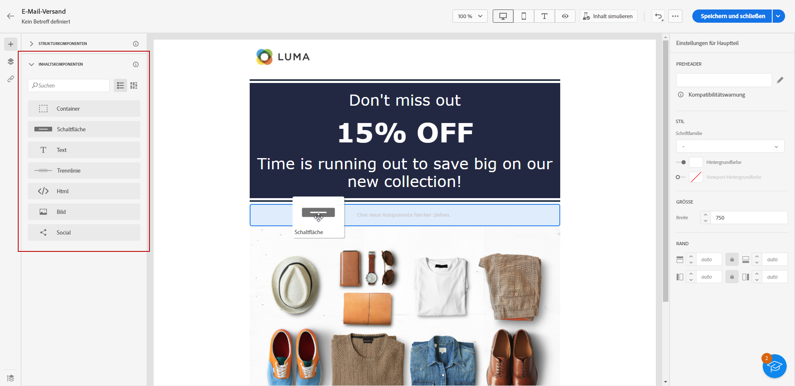

   >[!NOTE]
   >
   >Sie können zu einer einzelnen Strukturkomponente und zu jeder Spalte einer Strukturkomponente mehrere Komponenten hinzufügen.

1. Passen Sie die Stilattribute für jede Komponente im Bereich **[!UICONTROL Komponenteneinstellungen]** auf der rechten Seite an. Beispielsweise können Sie den Textstil, den Abstand oder den Rand jeder Komponente ändern. [Weitere Informationen zu Ausrichtung und Abstand](alignment-and-padding.md)

   

Wenn Sie Ihre E-Mail-Inhalte von Grund auf neu erstellen, können Sie sie mithilfe von **[!UICONTROL Inhaltskomponenten]** durch das Einfügen unbearbeiteter, leerer Komponenten personalisieren.
Sie können beliebig viele **[!UICONTROL Inhaltskomponenten]** in eine **[!UICONTROL Strukturkomponente]**, die das Layout Ihrer E-Mail definiert, einfügen.

## Container {#container}

Sie können einen einfachen Container hinzufügen, in den Sie eine weitere Inhaltskomponente einfügen können. Auf diese Weise können Sie einen bestimmten Stil auf den Container anwenden, der sich von der darin verwendeten Komponente unterscheidet.

Sie können in diesen Container beispielsweise die Komponente **[!UICONTROL Container]** und anschließend die Komponente [Schaltfläche](#button) einfügen. Dann können Sie einen bestimmten Hintergrund für den Container und einen anderen für die Schaltfläche verwenden.

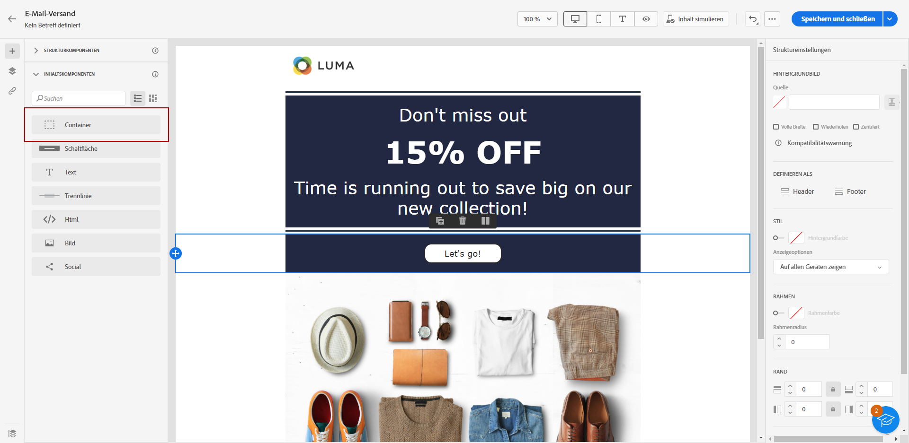

## Schaltfläche {#buttons}

Verwenden Sie die Komponente **[!UICONTROL Schaltfläche]**, um eine oder mehrere Schaltflächen in Ihre E-Mail einzufügen und Ihre E-Mail-Audience auf eine bestimmte Seite weiterzuleiten.

1. Platzieren Sie die Komponente **[!UICONTROL Schaltfläche]** von den **[!UICONTROL Inhaltskomponenten]** per Drag-and-Drop in eine **[!UICONTROL Strukturkomponente]**.

   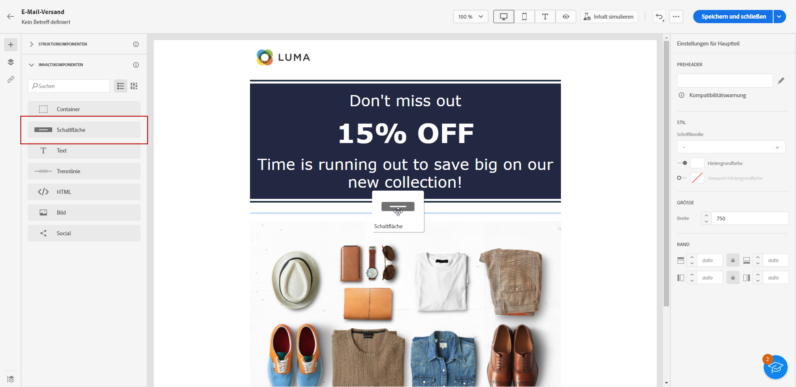

1. Klicken Sie auf die neu hinzugefügte Schaltfläche, um den Text anzupassen und um auf die **[!UICONTROL Komponenteneinstellungen]** im rechten Bereich von E-Mail-Designer zuzugreifen.

   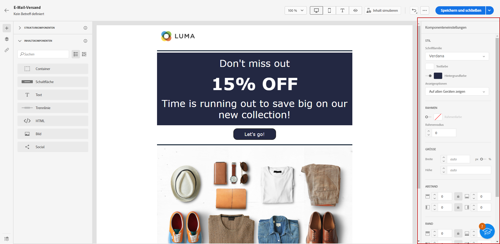

1. Fügen Sie im Feld **[!UICONTROL Link]** die URL hinzu, zu der Sie Benutzende beim Anklicken der Schaltfläche umleiten möchten.

1. Wählen Sie mit der Dropdown-Liste die **[!UICONTROL Zielgruppe]** aus, mit der Ihre Audience umgeleitet werden soll:

   * **[!UICONTROL Keine]**: öffnet den Link im selben Fenster, in dem er angeklickt wurde (Standard).
   * **[!UICONTROL Leer]**: Öffnet den Link in einem neuen Fenster oder einer neuen Registerkarte.
   * **[!UICONTROL Selbst]**: Öffnet den Link im selben Fenster, in dem er angeklickt wurde.
   * **[!UICONTROL Übergeordnet]**: Öffnet den Link im übergeordneten Fenster.
   * **[!UICONTROL Beliebteste]**: Öffnet den Link im Textkörper des Fensters.

   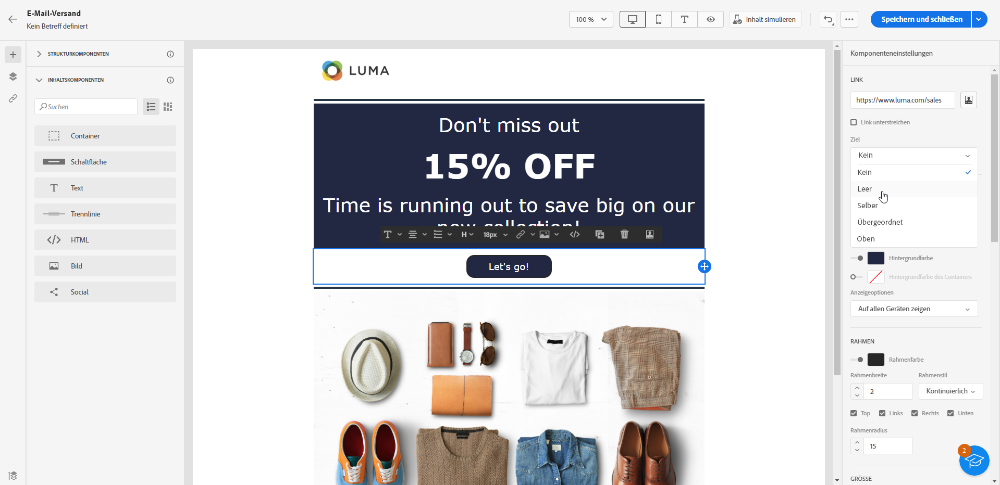

1. Sie können Ihre Schaltfläche weiter personalisieren, indem Sie Stilattribute wie **[!UICONTROL Rahmen]**, **[!UICONTROL Größe]**,**[!UICONTROL Rand]** usw. im Bereich **[!UICONTROL Komponenteneinstellungen]** ändern.

## Text {#text}

Verwenden Sie die Komponente **[!UICONTROL Text]**, um Text in Ihre E-Mail einzufügen und den Stil (Rahmen, Größe, Abstand usw.) mithilfe des Bereichs **[!UICONTROL Komponenteneinstellungen]** anzupassen.

1. Platzieren Sie aus **[!UICONTROL Inhaltskomponenten]** per Drag-and-Drop **[!UICONTROL Text]** in einer **[!UICONTROL Strukturkomponente]**.

   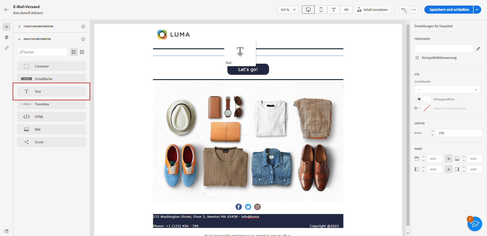

1. Klicken Sie auf die neu hinzugefügte Komponente, um den Text zu personalisieren und auf die **[!UICONTROL Komponenteneinstellungen]** im rechten Bereich von E-Mail Designer zugreifen zu können.

1. Ändern Sie den Text mit den folgenden in der Symbolleiste verfügbaren Optionen:

   

   * **[!UICONTROL Textstil ändern]**: Fett, Kursiv, Unterstreichen oder Durchstreichen auf Ihren Text anwenden.
   * **Ausrichtung ändern**: Wählen Sie für Ihren Text zwischen linksbündig ausrichten, rechtsbündig ausrichten, zentriert oder Blocksatz.
   * **[!UICONTROL Liste erstellen]**: Eine Aufzählungs- oder nummerierte Liste zu Ihrem Text hinzufügen.
   * **[!UICONTROL Überschrift festlegen]**: Bis zu sechs Überschriftenebenen zu Ihrem Text hinzufügen.
   * **Schriftgröße**: Wählen Sie die Schriftgröße Ihres Textes in Pixel aus.
   * **[!UICONTROL Bild bearbeiten]**: Ein Bild oder ein Medienelement zu Ihrer Textkomponente hinzufügen.
   * **[!UICONTROL Quell-Code anzeigen]**: Den Quell-Code Ihres Textes anzeigen. Es kann nicht geändert werden.
   * **[!UICONTROL Duplizieren]**: Eine Kopie der Textkomponente hinzufügen.
   * **[!UICONTROL Löschen]**: Die ausgewählte Textkomponente aus der E-Mail löschen.
   * **[!UICONTROL Personalisierung hinzufügen]**: Personalisierungsfelder hinzufügen, um den Inhalt aus Ihren Profildaten anzupassen.
   * **[!UICONTROL Bedingten Inhalt aktivieren]**: Einen bedingten Inhalt hinzufügen, um den Inhalt der Komponente an die Zielprofile anzupassen.

1. Andere Stilattribute wie Textfarbe, Schriftfamilie, Rahmen, Abstand, Rand usw. können Sie im Bedienfeld **[!UICONTROL Komponenteneinstellungen]** anpassen.

   

## Trennlinie {#divider}

Verwenden Sie die Komponente **[!UICONTROL Trennlinie]**, um das Layout und den Inhalt Ihrer E-Mail durch eine Trennlinie zu strukturieren.

Sie können Stilattribute wie Zeilenfarbe, Stil und Höhe in den **[!UICONTROL Komponenteneinstellungen]** anpassen.

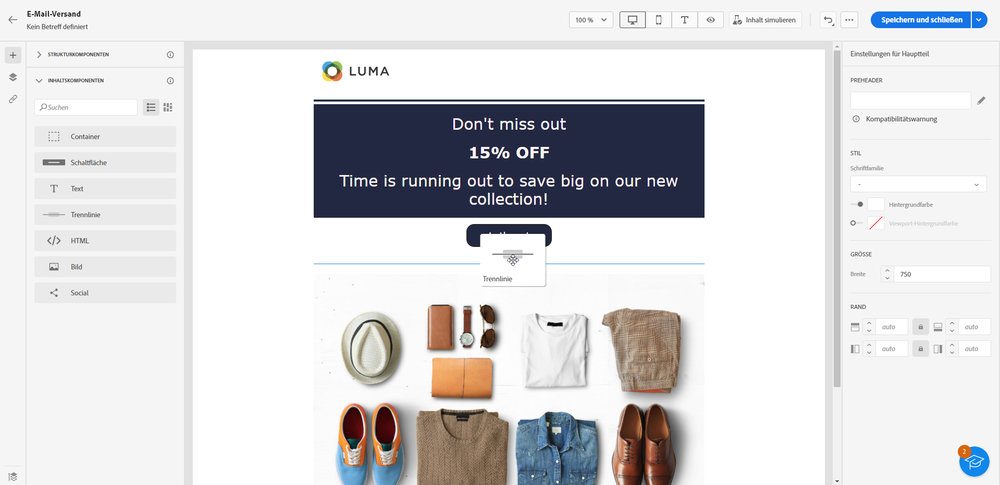

## HTML {#HTML}

Verwenden Sie die Komponente **[!UICONTROL HTML]**, um die unterschiedlichen Teile Ihrer existierenden HTML-Datei zu kopieren und einzufügen. Dadurch können Sie kostenfreie modulare HTML-Komponenten erstellen, um externe Inhalte wiederzuverwenden.

1. Ziehen Sie aus den **[!UICONTROL Inhaltskomponenten]** die **[!UICONTROL HTML]**-Komponente per Drag-and-Drop in eine **[!UICONTROL Strukturkomponente]**.

   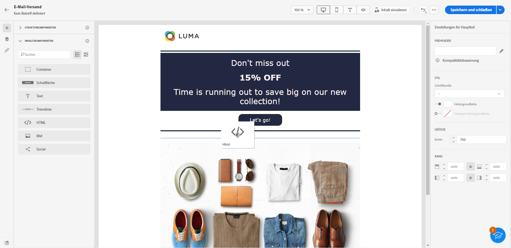

1. Klicken Sie auf die neu hinzugefügte Komponente und dann in der kontextbezogenen Symbolleiste auf **[!UICONTROL Quell-Code anzeigen]**, um Ihren HTML-Code hinzuzufügen.

   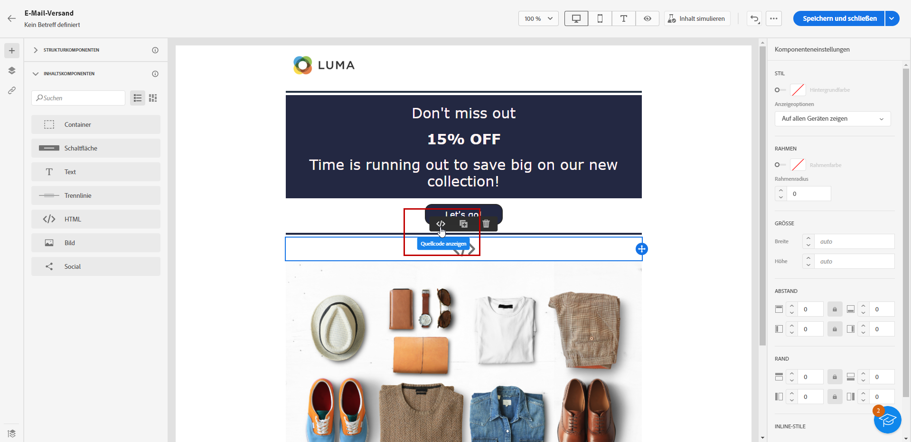

>[!NOTE]
>
>Um die Kompatibilität von externen Inhalten mit E-Mail-Designer zu gewährleisten, empfiehlt Adobe, eine neue Nachricht zu erstellen und den Inhalt aus der existierenden E-Mail in Komponenten einzufügen.

## Bild {#image}

Verwenden Sie die Komponente **[!UICONTROL Bild]**, um eine Bilddatei von Ihrem Computer in Ihre E-Mail einzufügen.

1. Ziehen Sie aus den **[!UICONTROL Inhaltskomponenten]** das **[!UICONTROL Bild]** per Drag-and-Drop in eine **[!UICONTROL Strukturkomponente]**.

   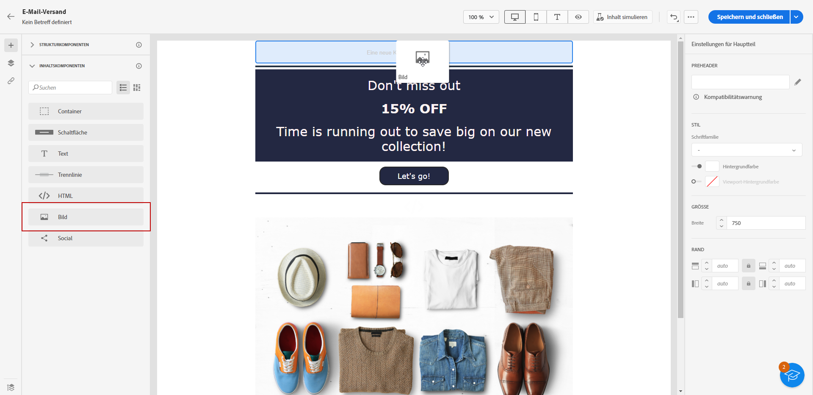

1. Klicken Sie auf **[!UICONTROL Durchsuchen]**, um eine Bilddatei aus Ihren Assets auszuwählen.

1. Klicken Sie auf die neu hinzugefügte Komponente und richten Sie Ihre Bildeigenschaften mithilfe des Bedienfelds **[!UICONTROL Komponenteneinstellungen]** ein:

   * **[!UICONTROL Bildtitel]** ermöglicht Ihnen, den Titel für das Bild zu definieren.
   * **[!UICONTROL Alternativtext]** ermöglicht Ihnen, die zugeordnete Beschriftung zu Ihrem Bild zu definieren. Dies entspricht dem Alt-HTML-Attribut.

   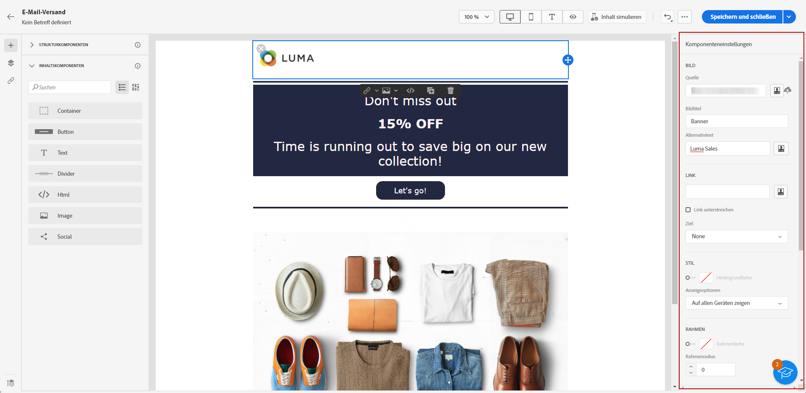

1. Über den Bereich **[!UICONTROL Komponenteneinstellungen]** können Sie die anderen Stilattribute wie Rand, Umrandung usw. anpassen oder einen Link hinzufügen, um Ihre Audience zu einem anderen Inhalt weiterzuleiten.

## Social {#social}

Verwenden Sie die Komponente **[!UICONTROL Social]**, um Links zu Social-Media-Seiten in Ihre E-Mail einzufügen.

1. Ziehen Sie aus den **[!UICONTROL Inhaltskomponenten]** die Komponente **[!UICONTROL Social]** per Drag-and-Drop in eine **[!UICONTROL Strukturkomponente]**.

1. Klicken Sie auf die neu hinzugefügte Komponente.

1. Im Feld **[!UICONTROL Social]** der **[!UICONTROL Komponenteneinstellungen]** können Sie auswählen, welche Social Media Sie hinzufügen oder entfernen möchten.

   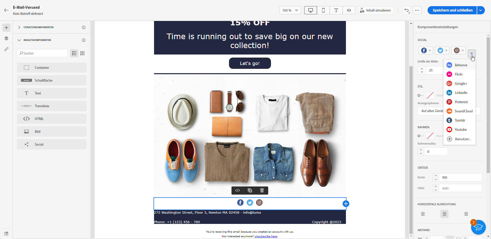

1. Wählen Sie die Größe Ihrer Symbole im Feld **[!UICONTROL Bildgröße]** .

1. Klicken Sie auf jedes Ihrer Social Media-Symbole, um die **[!UICONTROL URL]** zu konfigurieren, zu der Ihre Audience weitergeleitet wird.

   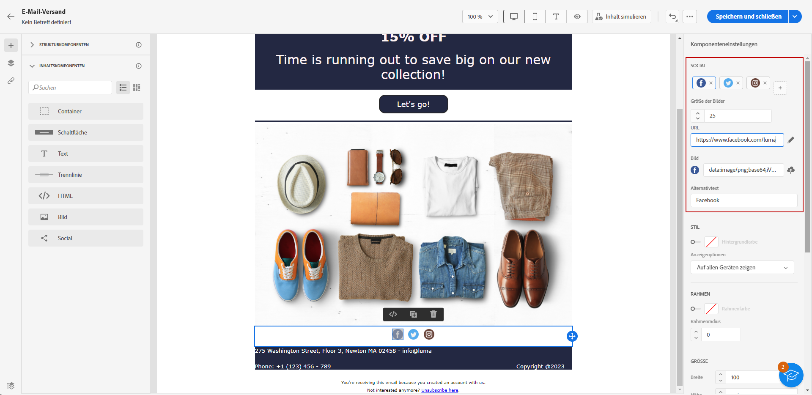

1. Bei Bedarf können Sie auch die Symbole der einzelnen Social Media im Feld **[!UICONTROL Bild]** ändern,

1. Passen Sie die anderen Stilattribute wie Stil, Rand, Rahmen usw. an, indem Sie das Bedienfeld **[!UICONTROL Komponenteneinstellungen]** verwenden.
