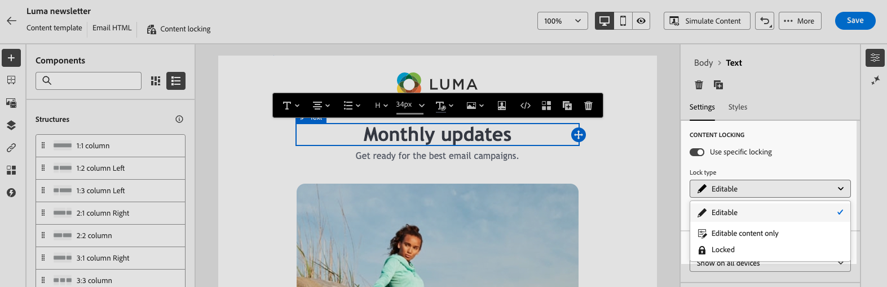
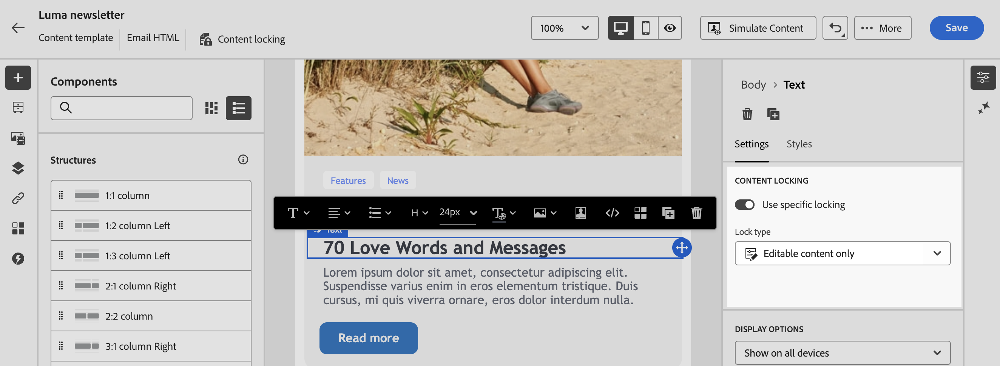

# Sperren von Inhalt in E-Mail-Vorlagen {#lock-content-email-templates}

>[!CONTEXTUALHELP]
>id="ajo_locking_governance"
>title="Governance"
>abstract="Aktivieren Sie Governance, um Inhalte in der Vorlage zu sperren, entweder durch Sperren der gesamten Vorlage oder durch Sperren bestimmter Strukturen und Komponenten. Auf diese Weise können Sie unbeabsichtigte Bearbeitungen oder Löschungen verhindern, sodass Sie das Anpassen von Vorlagen besser steuern und die Effizienz sowie Zuverlässigkeit Ihrer E-Mail-Kampagnen optimieren können."

>[!CONTEXTUALHELP]
>id="ajo_locking_mode"
>title="Modus"
>abstract="Wählen Sie den gewünschten Sperrmodus für die Vorlage aus. Mit **Inhaltssperre** können Sie bestimmte Inhaltsabschnitte in der Vorlage sperren. Mit der Funktion **Schreibgeschützt** können Sie den gesamten Inhalt der Vorlage sperren, um Änderungen zu vermeiden."

>[!CONTEXTUALHELP]
>id="ajo_locking_content_addition"
>title="Aktivieren von Inhaltszusätzen"
>abstract="Schalten Sie diese Option ein, um festzulegen, wie Benutzende mit der Vorlage interagieren können. Wählen Sie **Hinzufügen von Struktur und Inhalten zulassen** aus, damit Benutzende Strukturen zwischen vorhandenen Strukturen und Inhaltskomponenten oder Fragmente in bearbeitbaren Strukturen hinzufügen können. Mit **Nur Hinzufügen von Inhalten zulassen** können Benutzende Inhaltskomponenten oder Fragmente in bearbeitbaren Strukturen hinzufügen, ohne Strukturen hinzufügen oder duplizieren zu können."

>[!CONTEXTUALHELP]
>id="ajo_email_locking_activated"
>title="Governance aktiviert"
>abstract="Die Inhaltssperre ist aktiviert und verhindert Änderungen."

>[!CONTEXTUALHELP]
>id="ajo_email_locking_read_only"
>title="Schreibgeschützt"
>abstract="Dieser Inhalt befindet sich im schreibgeschützten Modus und kann nicht geändert werden."

Mit Adobe Campaign können Sie Inhalte in E-Mail-Vorlagen sperren, indem Sie entweder die gesamte Vorlage oder bestimmte Strukturen und Komponenten sperren. Dadurch werden unbeabsichtigte Änderungen oder Löschungen verhindert, was Ihnen mehr Kontrolle über die Vorlagenanpassung gibt und die Effizienz und Zuverlässigkeit Ihrer E-Mail-Kampagnen verbessert.
<!--
>[!IMPORTANT]
>
>Content locking is an editor-level feature for authors and does not guarantee the content will remain unedited when imported or created through API.-->

Inhaltssperren können entweder auf der Ebene **Struktur** oder auf der Ebene **Komponente** angewendet werden. Im Folgenden finden Sie die wichtigsten Prinzipien, die auf Struktur- und Komponentenebene beim Sperren von Inhalten in Ihrer Vorlage gelten:

* Wenn eine Struktur gesperrt ist:

   * Alle Inhalte in dieser Struktur sind ebenfalls standardmäßig gesperrt.
   * Der Struktur kann kein Inhalt hinzugefügt werden.
   * Standardmäßig können Sie die Struktur nicht löschen. Sie können diese Einschränkung außer Kraft setzen, indem Sie die Option „Löschen zulassen“ aktivieren.
   * Einzelne Inhaltskomponenten innerhalb der gesperrten Struktur können als bearbeitbar festgelegt werden.

* Wenn eine Struktur bearbeitbar ist (Struktur nicht gesperrt):

   * Einzelne Inhaltskomponenten können in dieser Struktur gesperrt werden.
   * Standardmäßig können Sie eine Komponente nicht löschen, wenn sie gesperrt ist oder wenn die Option „Nur bearbeitbare Inhalte sperren“ ausgewählt ist. Sie können diese Einschränkung außer Kraft setzen, indem Sie die Option „Löschen zulassen“ aktivieren.

>[!AVAILABILITY]
>
>Benutzende mit der Berechtigung zum Erstellen von Inhaltsvorlagen können die Inhaltssperre aktivieren.

<!--
➡️ [Discover this feature in video](#video)-->

## E-Mail-Vorlage sperren {#define}

### Inhaltssperrung aktivieren {#enable}

Sie können die Inhaltssperre für eine E-Mail-Vorlage direkt in der E-Mail-Designer aktivieren, unabhängig davon, ob Sie eine neue Vorlage erstellen oder eine vorhandene bearbeiten. Führen Sie folgende Schritte aus:

1. Öffnen oder erstellen Sie eine E-Mail-Vorlage und rufen Sie den Bildschirm zur Inhaltsbearbeitung in der [E-Mail-Designer](../email/get-started-email-designer.md) auf.

1. Aktivieren Sie **[!UICONTROL Bereich]** Hauptteil“ auf der rechten Seite die Option **[!UICONTROL Governance]** .

1. Wählen Sie aus **[!UICONTROL Dropdown]** Liste Modus den gewünschten Sperrmodus für die Vorlage aus:

   * **[!UICONTROL Inhaltssperrung]**: Sperren bestimmter Inhaltsabschnitte in der Vorlage. Standardmäßig können alle Strukturen und Komponenten bearbeitet werden. Anschließend können Sie einzelne Elemente selektiv sperren.
   * **[!UICONTROL Schreibgeschützt]**: Sperren Sie den gesamten Inhalt der Vorlage, um Änderungen zu verhindern.

   

1. Wenn Sie den Modus **[!UICONTROL Inhaltssperrung]** ausgewählt haben, können Sie weiter definieren, wie Benutzer mit der Vorlage interagieren können. Schalten Sie die Option **[!UICONTROL Hinzufügen von Inhalten aktivieren]** ein und wählen Sie eine der folgenden Optionen:

   * **[!UICONTROL Zulassen von Struktur und Hinzufügen von Inhalten]**: Benutzer können Strukturen zwischen vorhandenen Strukturen hinzufügen und Inhaltskomponenten oder Fragmente innerhalb bearbeitbarer Strukturen hinzufügen.

   * **[!UICONTROL Nur Inhaltshinzufügen zulassen]**: Benutzer können Inhaltskomponenten oder Fragmente in bearbeitbaren Strukturen hinzufügen, aber keine Strukturen hinzufügen oder duplizieren.

1. Nach Auswahl des Sperrmodus können Sie festlegen, welche Strukturen und/oder Komponenten gesperrt werden sollen, wenn Sie den **[!UICONTROL Inhaltssperrmodus]** ausgewählt haben:

   * [Erfahren Sie, wie Sie Strukturen sperren](#lock-structures)
   * [Erfahren Sie, wie Sie Komponenten sperren](#lock-components)

   Wenn Sie den Modus **[!UICONTROL Schreibgeschützt]** ausgewählt haben, fahren Sie mit dem Fertigstellen und Speichern Ihrer Vorlage wie gewohnt fort.

Sie können die **[!UICONTROL Governance]**-Einstellungen jederzeit beim Entwerfen Ihrer Vorlage anpassen, indem Sie den Vorlagentext auswählen. Klicken Sie dazu auf den **[!UICONTROL Textkörper]** in der Navigationsleiste oben im rechten Bereich.

### Sperren von Strukturen {#lock-structures}

>[!CONTEXTUALHELP]
>id="ajo_locking_structure"
>title="Inhaltssperre in Struktur"
>abstract="Um die Struktur in der Vorlage zu sperren, wählen Sie **Gesperrt** aus dem Dropdown-Menü **Sperrtyp** aus. Standardmäßig können Benutzende gesperrte Strukturen nicht löschen. Sie können diese Einschränkung überschreiben, indem Sie die Option **[!UICONTROL Löschen zulassen]** aktivieren."

So sperren Sie eine Struktur in Ihrer Vorlage:

1. Wählen Sie die Struktur aus, die Sie sperren möchten.

1. Wählen Sie in **[!UICONTROL Dropdown]** Liste „Sperrtyp“ die Option **[!UICONTROL Gesperrt]**.

   

   >[!NOTE]
   >
   >Standardmäßig können Benutzende gesperrte Strukturen nicht löschen. Sie können diese Einschränkung überschreiben, indem Sie die Option **[!UICONTROL Löschen zulassen]** aktivieren.

Nach dem Sperren einer Struktur können keine weiteren Inhaltskomponenten oder Fragmente dupliziert oder hinzugefügt werden. Alle Komponenten innerhalb einer gesperrten Struktur sind ebenfalls standardmäßig gesperrt. So machen Sie eine Komponente in einer gesperrten Struktur bearbeitbar:

1. Wählen Sie die Komponente aus, die Sie entsperren möchten.

1. Schalten Sie die Option **[!UICONTROL Spezifische Sperre verwenden]** ein.

1. Wählen Sie in **[!UICONTROL Dropdown]** Liste „Sperrtyp“ die Option **[!UICONTROL Bearbeitbar]**. Um die Inhaltsbearbeitung beim Sperren von Stilen zu ermöglichen, wählen Sie **[!UICONTROL Nur bearbeitbare Inhalte]** aus. [Erfahren Sie, wie Sie Komponenten sperren](#lock-components)

   

### Sperren von Komponenten {#lock-components}

>[!CONTEXTUALHELP]
>id="ajo_locking_component"
>title="Verwenden der spezifischen Sperre in der Komponente"
>abstract="Um die Komponente in der Vorlage zu sperren, aktivieren Sie die Option **Spezifische Sperre verwenden**. Wählen Sie im Dropdown-Menü **[!UICONTROL Sperrtyp]** Ihre bevorzugte Sperroption aus: **Nur bearbeitbare Inhalte** ermöglicht es, die Stile der Komponente zu sperren, lässt jedoch die Inhaltsbearbeitung zu, während **Gesperrt** sowohl den Inhalt als auch die Stile der Komponente vollständig sperrt."

So sperren Sie eine bestimmte Komponente in einer Struktur:

1. Wählen Sie die Komponente aus und aktivieren **[!UICONTROL die Option „Spezifische]** verwenden“ im rechten Bereich.

1. Wählen Sie in **[!UICONTROL Dropdown-Liste]** Sperrtyp“ Ihre bevorzugte Sperroption aus:

   

   * **[!UICONTROL Nur bearbeitbare Inhalte]**: Sperren der Stile der Komponente, aber Bearbeitung der Inhalte möglich.
   * **[!UICONTROL Gesperrt]**: Sperren Sie sowohl den Inhalt als auch die Stile der Komponente vollständig.

   >[!NOTE]
   >
   >Der **[!UICONTROL Bearbeitbare]** Sperrtyp ermöglicht Benutzern das Bearbeiten einer Komponente, auch innerhalb einer gesperrten Struktur. [Erfahren Sie, wie Sie Strukturen sperren](#lock-structures)

1. Standardmäßig können Benutzende gesperrte Komponenten nicht löschen. Sie können das Löschen aktivieren, indem Sie die Option **[!UICONTROL Löschen zulassen]** aktivieren.

### Identifizieren gesperrter Inhalte {#identify}

Um gesperrte Strukturen und Komponenten in Ihrer Vorlage leicht zu identifizieren, verwenden Sie **[!UICONTROL Navigationsbaum]** im Menü links. Dieses Menü bietet einen visuellen Überblick über alle Vorlagenelemente, wobei gesperrte Elemente mit einem Sperrsymbol und bearbeitbare Elemente mit einem Bleistiftsymbol hervorgehoben werden.

Im folgenden Beispiel ist Governance für den Vorlagentext aktiviert. *Struktur 2* ist mit *Komponente 1* bearbeitbar gesperrt, während *Struktur 3* vollständig gesperrt ist.

## Verwenden von Vorlagen mit gesperrten Inhalten {#use}

>[!CONTEXTUALHELP]
>id="ajo_email_editable_areas"
>title="Markieren bearbeitbarer Bereiche"
>abstract="Je nach Typ der auf die Vorlage angewendeten Sperre können Sie verschiedene Aktionen für die Strukturen und Komponenten der Vorlage ausführen. Um alle bearbeitbaren Bereiche in der Vorlage schnell zu identifizieren, schalten Sie die Option **[!UICONTROL Bearbeitbare Bereiche markieren]** ein."

Bei Verwendung einer Vorlage mit gesperrtem Inhalt wird im rechten Bereich eine Meldung angezeigt.

Je nach Typ der auf die Vorlage angewendeten Sperre können Sie verschiedene Aktionen für die Strukturen und Komponenten der Vorlage ausführen. Um alle bearbeitbaren Bereiche in der Vorlage schnell zu identifizieren, schalten Sie die Option **[!UICONTROL Bearbeitbare Bereiche markieren]** ein.

In der folgenden Vorlage können beispielsweise alle Bereiche bearbeitet werden, mit Ausnahme des oberen Bildes, das gesperrt wurde, sodass Sie es nicht bearbeiten oder entfernen können.

Detaillierte Informationen zu den verschiedenen Sperrtypen, die angewendet werden können, finden Sie in den folgenden Abschnitten:

* [Sperren von Strukturen](#lock-structures)
* [Sperren von Komponenten](#lock-components)

Im Folgenden finden Sie einige Beispiele für E-Mail-Editionen und die zugehörigen Konfigurationen zum Sperren von Inhalten, die eingerichtet wurden:

| Typ der Inhaltssperre | Vorlagenkonfiguration | E-Mail-Bearbeitung |
| ------- | ------- | ------- |
| Schreibgeschützte Inhaltsvorlage | {zoomable="yes"} | {zoomable="yes"} |
| Vollständiger Inhalt kann bearbeitet werden, Benutzende können jedoch keine Struktur oder Komponente hinzufügen | {zoomable="yes"} | {zoomable="yes"} |
| Gesperrte Struktur, die nicht gelöscht werden kann | {zoomable="yes"} | {zoomable="yes"} |
| Komponente mit gesperrten Stilen. Benutzer können nur den Inhalt ändern. | {zoomable="yes"} | {zoomable="yes"} |
| Bearbeitbare Komponente in einer gesperrten Struktur. | {zoomable="yes"} | {zoomable="yes"} |

<!--
TO REPLACE WITH VIDEO FOR CAMPAIGN IF/WHEN CREATED

## How-to video {#video}

Learn how to lock content in email templates.

>[!VIDEO](https://video.tv.adobe.com/v/3451616?quality=12&captions=ger)-->
