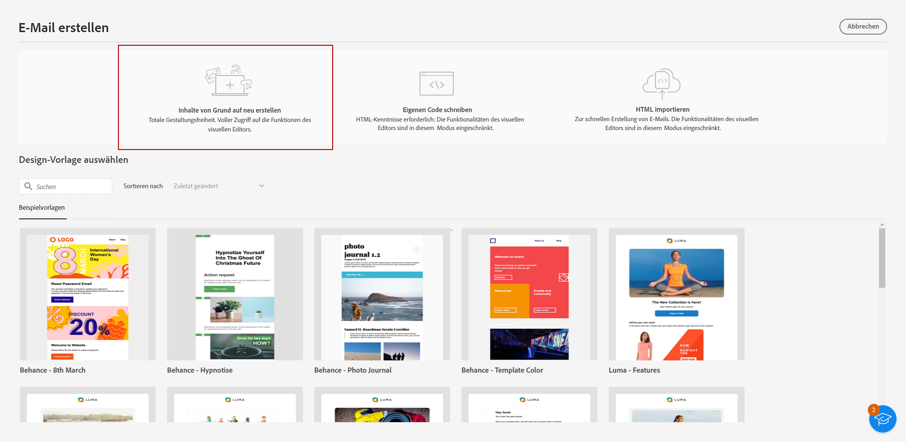
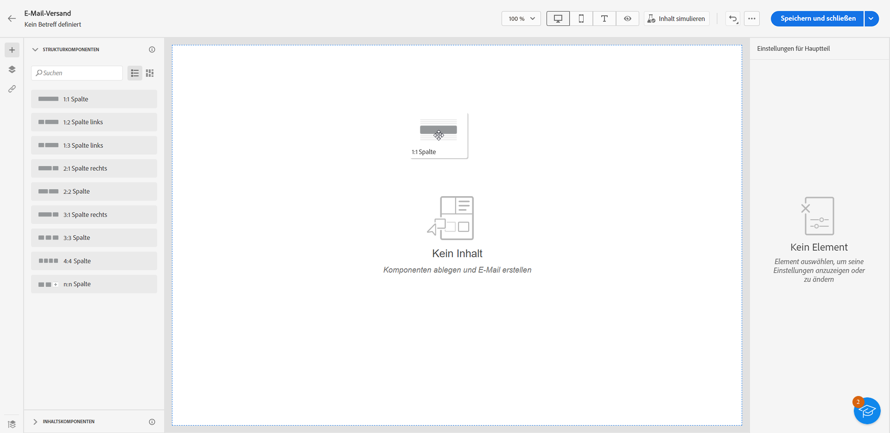
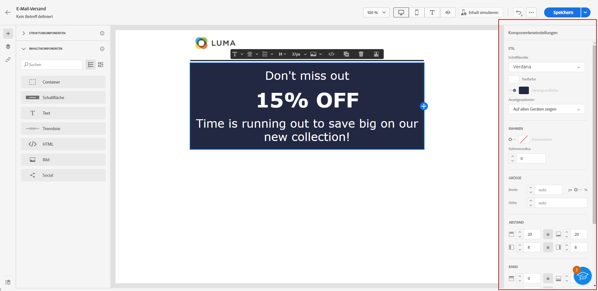
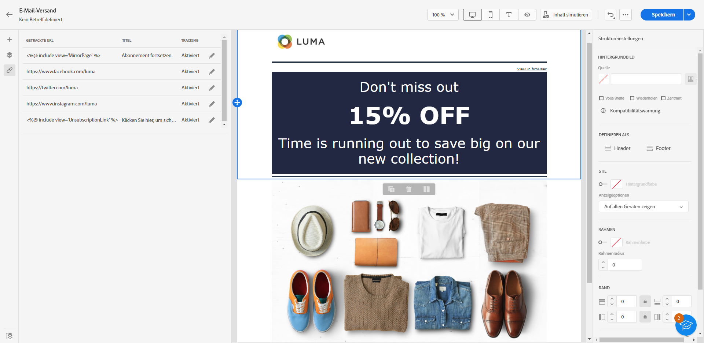
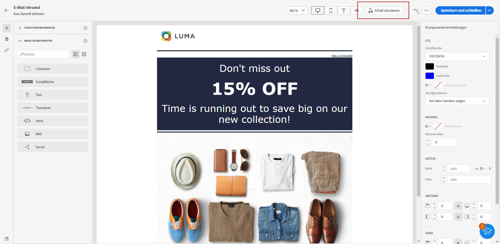

# Beginnen von Grund auf {#create-email-content}

>[!CONTEXTUALHELP]
>id="ac_structure_components_email"
>title="Über Strukturkomponenten"
>abstract="Strukturkomponenten definieren das Layout der E-Mail."

>[!CONTEXTUALHELP]
>id="ac_structure_components_landing_page"
>title="Über Strukturkomponenten"
>abstract="Strukturkomponenten definieren das Layout der Landingpage."

>[!CONTEXTUALHELP]
>id="ac_structure_components_fragment"
>title="Über Strukturkomponenten"
>abstract="Strukturkomponenten definieren das Layout des Fragments."

>[!CONTEXTUALHELP]
>id="ac_structure_components_template"
>title="Über Strukturkomponenten"
>abstract="Strukturkomponenten definieren das Layout der Vorlage."

>[!CONTEXTUALHELP]
>id="ac_edition_columns_email"
>title="Definieren von E-Mail-Spalten"
>abstract="Mit E-Mail-Designer können Sie das Layout Ihrer E-Mail einfach definieren, indem Sie die Spaltenstruktur definieren."

>[!CONTEXTUALHELP]
>id="ac_edition_columns_landing_page"
>title="Definieren der Landingpage-Spalten"
>abstract="Mit E-Mail-Designer können Sie das Layout Ihrer Landingpage einfach definieren, indem Sie die Spaltenstruktur festlegen."

>[!CONTEXTUALHELP]
>id="ac_edition_columns_fragment"
>title="Definieren der Fragmentspalten"
>abstract="Mit E-Mail-Designer können Sie das Layout Ihres Fragements einfach definieren, indem Sie die Spaltenstruktur festlegen."

>[!CONTEXTUALHELP]
>id="ac_edition_columns_template"
>title="Definieren der Vorlagenspalten"
>abstract="Mit E-Mail-Designer können Sie das Layout Ihrer Vorlage einfach definieren, indem Sie die Spaltenstruktur festlegen."

E-Mail-Designer bietet eine einfache Möglichkeit, die Struktur Ihrer E-Mail zu bestimmen. Durch das Hinzufügen und Verschieben von strukturellen Elementen durch einfaches Drag-and-Drop können Sie den Textkörper Ihrer E-Mail in Sekundenschnelle entwerfen.

Gehen Sie wie folgt vor, um mit der Erstellung Ihres E-Mail-Inhalts zu beginnen:

1. Wählen Sie auf der Startseite von E-Mail-Designer die Option **[!UICONTROL Erstellen von neuen Inhalten]** aus.

   

1. Beginnen Sie mit der Gestaltung Ihres E-Mail-Inhalts, indem Sie **[!UICONTROL Strukturkomponenten]** per Drag-and-Drop auf die Arbeitsfläche ziehen, um das Layout Ihrer E-Mail zu definieren.

   >[!NOTE]
   >
   >Die Stapelung von Spalten ist nicht mit allen E-Mail-Programmen kompatibel. Wenn dies nicht unterstützt wird, werden Spalten nicht gestapelt.

   <!--Once placed in the email, you cannot move nor remove your components unless there is already a content component or a fragment placed inside. This is not true in AJO - TBC?-->

   

1. Fügen Sie so viele **[!UICONTROL Strukturkomponenten]** wie nötig hinzu und bearbeiten Sie deren Einstellungen im entsprechenden Bereich auf der rechten Seite.

   Wählen Sie die Komponente **[!UICONTROL n:n Spalte]** aus, um die Anzahl der Spalten zu definieren (3 bis 10). Sie können auch die Breite jeder Spalte ändern, indem Sie den Pfeil am unteren Rand einer jeden Spalte verschieben.

   >[!NOTE]
   >
   >Die Größe einer Spalte muss immer mindestens 10 % der Gesamtbreite der Strukturkomponente betragen. Sie können nur leere Spalten entfernen.

1. Erweitern Sie den Bereich **[!UICONTROL Inhaltskomponenten]** und fügen Sie beliebig viele Elemente zu einer oder mehreren Strukturkomponenten hinzu. [Weitere Informationen über Inhaltskomponenten](content-components.md)

1. Jede Komponente kann mithilfe der **[!UICONTROL Komponenteneinstellungen]** auf der rechten Seite weiter angepasst werden. Beispielsweise können Sie den Textstil, den Abstand oder den Rand jeder Komponente ändern. [Weitere Informationen über Ausrichtung und Abstand](alignment-and-padding.md)

   

1. Fügen Sie Personalisierungsfelder ein, um den Inhalt Ihrer E-Mail mit Profildaten anzupassen. [Weitere Informationen über die Personalisierung von Inhalten](../personalization/personalize.md)

1. Klicken Sie auf die Registerkarte **[!UICONTROL Links]** im linken Fensterbereich, um alle URLs Ihrer Inhalte anzuzeigen, die getrackt werden müssen. Sie können bei Bedarf deren **[!UICONTROL Tracking-Typ]** oder **[!UICONTROL Kennzeichnung]** ändern und **[!UICONTROL Kategorien]** hinzufügen. [Weitere Informationen über Links und Nachrichten-Tracking](message-tracking.md)

   

1. Bei Bedarf können Sie Ihre E-Mail weiter personalisieren, indem Sie im erweiterten Menü auf **[!UICONTROL Zum Code-Editor wechseln]** klicken. [Weitere Informationen über den Code-Editor](code-content.md)

   >[!CAUTION]
   >
   >Nach dem Wechsel zum Code-Editor können Sie für diese E-Mail nicht mehr zum visuellen Designer zurückkehren.

1. Sobald Ihr Inhalt bereit ist, klicken Sie auf **[!UICONTROL Inhalt simulieren]**, um das E-Mail-Rendering zu überprüfen. Sie können zwischen der Desktop- oder der mobilen Ansicht wählen. [Weitere Informationen über die Vorschau Ihrer E-Mail](../preview-test/preview-test.md)

   

1. Wenn Ihre E-Mail bereit ist, klicken Sie auf **[!UICONTROL Speichern]**.

