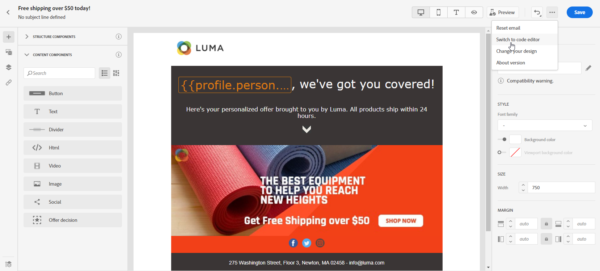
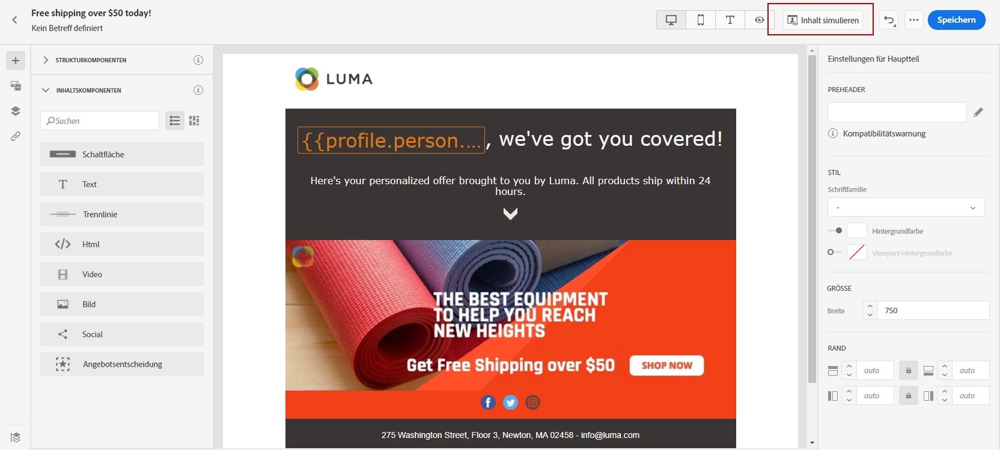

# Neu beginnen {#create-email-content}

>[!NOTE]
>
>Diese Dokumentation wird derzeit erstellt und häufig aktualisiert. Die endgültige Version dieses Inhalts wird im Januar 2023 vorliegen.

>[!CONTEXTUALHELP]
>id="ac_structure_components_email"
>title="Über Strukturkomponenten"
>abstract="Strukturkomponenten definieren das Layout der E-Mail."

>[!CONTEXTUALHELP]
>id="ac_structure_components_landing_page"
>title="Über Strukturkomponenten"
>abstract="Strukturkomponenten definieren das Layout der Landingpage."

>[!CONTEXTUALHELP]
>id="ac_structure_components_fragment"
>title="Über Strukturkomponenten"
>abstract="Strukturkomponenten definieren das Layout des Fragments."

>[!CONTEXTUALHELP]
>id="ac_structure_components_template"
>title="Über Strukturkomponenten"
>abstract="Strukturkomponenten definieren das Layout der Vorlage."

>[!CONTEXTUALHELP]
>id="ac_edition_columns_email"
>title="Definieren von E-Mail-Spalten"
>abstract="Mit Email Designer können Sie das Layout Ihrer E-Mail einfach definieren, indem Sie die Spaltenstruktur definieren."

>[!CONTEXTUALHELP]
>id="ac_edition_columns_landing_page"
>title="Landingpage-Spalten definieren"
>abstract="Mit Email Designer können Sie das Layout Ihrer Landingpage einfach definieren, indem Sie die Spaltenstruktur definieren."

>[!CONTEXTUALHELP]
>id="ac_edition_columns_fragment"
>title="Fragmentspalten definieren"
>abstract="Mit Email Designer können Sie das Layout Ihres Fragments einfach definieren, indem Sie die Spaltenstruktur definieren."

>[!CONTEXTUALHELP]
>id="ac_edition_columns_template"
>title="Vorlagenspalten definieren"
>abstract="Mit Email Designer können Sie das Layout Ihrer Vorlage einfach definieren, indem Sie die Spaltenstruktur definieren."

Email Designer bietet eine einfache Möglichkeit, die Struktur Ihrer E-Mail zu bestimmen. Durch das Hinzufügen und Verschieben von strukturellen Elementen durch einfaches Drag &amp; Drop können Sie Ihrer E-Mail in Sekundenschnelle die gewünschte Form verleihen.

Gehen Sie wie folgt vor, um mit der Erstellung Ihres E-Mail-Inhalts mit E-Mail-Designer zu beginnen:

1. Wählen Sie auf der Startseite von Email Designer die **[!UICONTROL Design von Grund auf neu]** -Option.

   

1. Beginnen Sie mit der Erstellung Ihres E-Mail-Inhalts durch Drag &amp; Drop **[!UICONTROL Strukturkomponenten]** um das Layout Ihrer E-Mail zu definieren.

   >[!NOTE]
   >
   >Beachten Sie, dass das Stapeln von Spalten nicht mit allen E-Mail-Programmen kompatibel ist. Wenn dies nicht unterstützt wird, werden Spalten nicht gestapelt.
   >
   >Sobald die Komponenten in der E-Mail platziert sind, können sie nicht mehr verschoben oder entfernt werden, außer es befindet sich bereits eine Inhaltskomponente oder ein Fragment darin.

   

1. Fügen Sie so viele hinzu wie **[!UICONTROL Strukturkomponenten]** nach Bedarf.

   Wählen Sie die Komponente **[!UICONTROL n:n Spalte]** aus, um die Anzahl der Spalten zu definieren (3 bis 10). Sie können auch die Breite jeder Spalte ändern, indem Sie den Pfeil am unteren Rand einer jeden Spalte verschieben.

   >[!NOTE]
   >
   >Die Größe einer Spalte muss immer mindestens 10 % der Gesamtbreite der Strukturkomponente betragen. Sie können nur leere Spalten entfernen.

1. Aus dem **[!UICONTROL Inhaltskomponenten]** in der Dropdown-Liste können Sie beliebig viele **[!UICONTROL Inhaltskomponenten]** wie Sie in Ihrer Strukturkomponente benötigen. [Weitere Informationen zu Inhaltskomponenten](content-components.md).

   

1. Jede Komponente kann mit der **[!UICONTROL Komponenteneinstellungen]** Abschnitt. Sie können beispielsweise den Textstil, den Abstand oder den Rand Ihrer Komponente ändern. [Weitere Informationen zur Ausrichtung und zum Abstand](adjusting-vertical-alignment-and-padding.md).

   

1. Aus dem **[!UICONTROL Asset-Auswahl]** können Sie direkt Assets hinzufügen, die in der Datei **[!UICONTROL Asset-Bibliothek]** zu Ihrer E-Mail hinzufügen.

   Doppelklicken Sie auf den Ordner, der Ihre Assets enthält, und ziehen Sie das Asset, das Sie Ihrer E-Mail hinzufügen möchten, per Drag-and-Drop.

   

1. Fügen Sie Personalisierungsfelder hinzu, um den Inhalt aus Ihren Profildaten anzupassen.

   

1. Fügen Sie dynamische Inhalte hinzu, um den Inhalt auf der Grundlage von bedingten Regeln an die Zielprofile anzupassen.

   

1. Im **[!UICONTROL Links]** im linken Bereich die Liste aller getrackten URLs Ihres Inhalts überprüfen. Sie können die **[!UICONTROL Tracking-Typ]**, **[!UICONTROL Titel]** und **[!UICONTROL Tags]** bei Bedarf.

   

   >[!NOTE]
   >
   >Weitere Informationen zu Links und zum Nachrichten-Tracking finden Sie in [diese Seite](message-tracking.md).

1. Bei Bedarf können Sie zum Code-Editor wechseln, um Ihre E-Mail weiter zu personalisieren, indem Sie auf **[!UICONTROL Wechseln zum Code-Editor]** aus dem erweiterten Menü. Weitere Informationen zum Code-Editor finden Sie unter [diese Seite](code-content.md#).

   >[!NOTE]
   >
   >Sie können den visuellen Designer für diese E-Mail nicht verwenden, nachdem Sie zum Code-Editor gewechselt haben.

   

1. Klicken **[!UICONTROL Vorschau anzeigen]** , um Ihr E-Mail-Rendering zu überprüfen. Sie können die Desktop- oder Mobilansicht auswählen.

   

1. Wenn Ihre E-Mail fertig ist, klicken Sie auf **[!UICONTROL Speichern und schließen]**.

