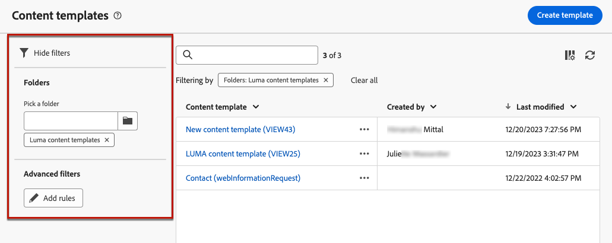

# Arbeiten mit Inhaltsvorlagen {#content-templates}

>[!CONTEXTUALHELP]
>id="acw_contenttemplate_menu"
>title="eigenen Inhalt definieren"
>abstract="Erstellen Sie eine eigenständige benutzerdefinierte Vorlage von Grund auf, damit Ihr Inhalt über mehrere E-Mails hinweg wiederverwendet werden kann."

Für einen beschleunigten und verbesserten Design-Prozess können Sie eigenständige Vorlagen erstellen, um benutzerdefinierte Inhalte einfach in allen [!DNL Adobe Campaign].

Diese Funktion ermöglicht es inhaltsorientierten Benutzern, an eigenständigen Vorlagen zu arbeiten, sodass Marketing-Benutzer diese in ihren E-Mail-Kampagnen wiederverwenden und anpassen können.

>[!NOTE]
>
>Derzeit nur **email** Inhaltsvorlagen werden unterstützt.

## Aufrufen und Verwalten von Vorlagen {#access-manage-templates}

>[!CONTEXTUALHELP]
>id="acw_contenttemplate_edition"
>title="Bearbeiten des Vorlageninhalts"
>abstract="Klicken Sie auf **Inhalt bearbeiten** Schaltfläche zum Aktualisieren Ihres Inhalts mit Email Designer."

Um auf die Liste der Inhaltsvorlagen zuzugreifen, wählen Sie **[!UICONTROL Content Management]** > **[!UICONTROL Inhaltsvorlagen]** über das Menü links.

Alle Vorlagen, die erstellt wurden - entweder aus einer E-Mail mit der [Als Vorlage speichern](#save-as-template) entweder über die **[!UICONTROL Inhaltsvorlagen]** Menü - angezeigt.

<!--You can sort content templates by creation or modification date. You can also choose to display only the items that you created or modified.-->

Sie können nach [Ordner](../get-started/permissions.md#folders) über die Dropdown-Liste oder das Hinzufügen von Regeln mithilfe der [Abfragemodellierung](../query/query-modeler-overview.md).

Um einen Vorlageninhalt zu bearbeiten, klicken Sie in der Liste auf das gewünschte Element. Sie haben folgende Möglichkeiten:

* Bearbeiten Sie die Eigenschaften.

* Klicken Sie auf **[!UICONTROL Inhalt bearbeiten]** -Schaltfläche zum Aktualisieren Ihres Inhalts mit [Email Designer](get-started-email-designer.md).

Um eine Vorlage zu löschen, wählen Sie die entsprechende Option aus dem **[!UICONTROL Mehr Aktionen]** Menü.

>[!NOTE]
>
>Wenn eine Vorlage gelöscht wird, sind die mit dieser Vorlage erstellten Sendungen nicht betroffen.

## Erstellen von Inhaltsvorlagen {#create-content-templates}

>[!CONTEXTUALHELP]
>id="acw_contenttemplate_design"
>title="Inhaltsvorlage – Design"
>abstract="Inhaltsvorlage – Design"

>[!CONTEXTUALHELP]
>id="acw_contenttemplate_selection"
>title="Inhaltsvorlage – Auswahl"
>abstract="Inhaltsvorlage – Auswahl"

Es gibt zwei Möglichkeiten, Inhaltsvorlagen zu erstellen:

* Erstellen Sie eine neue Inhaltsvorlage mithilfe der linken Leiste **[!UICONTROL Inhaltsvorlagen]** Menü. [Weitere Informationen dazu](#create-template-from-scratch)

* Speichern Sie beim Entwerfen einer E-Mail Ihren E-Mail-Inhalt als Vorlage. [Weitere Informationen dazu](#save-as-template)

Nach der Speicherung können Sie diese Vorlage jetzt beim Erstellen einer beliebigen [email](../email/create-email.md) Innerhalb [!DNL Adobe Campaign]. [Weitere Informationen dazu](use-email-templates.md)

>[!NOTE]
>
>* Änderungen an Inhaltsvorlagen werden nicht in E-Mails übernommen.
>
>* Wenn Vorlagen in einer E-Mail verwendet werden, wirken sich Änderungen an Ihrem E-Mail-Inhalt nicht auf die zuvor verwendete Inhaltsvorlage aus.

### Vorlage ganz neu erstellen {#create-template-from-scratch}

>[!CONTEXTUALHELP]
>id="acw_contenttemplate_properties"
>title="Vorlageneigenschaften definieren"
>abstract="Wenn Sie eine Vorlage von Grund auf neu erstellen, definieren Sie bei Bedarf die Eigenschaften, die abgerufen werden sollen."

Gehen Sie wie folgt vor, um eine neue Inhaltsvorlage zu erstellen.

1. Greifen Sie über die **[!UICONTROL Content Management]** > **[!UICONTROL Inhaltsvorlagen]** Menü links.

1. Auswählen **[!UICONTROL Vorlage erstellen]**.

   

1. Füllen Sie die Vorlagendetails aus. Sie können den Ordner auswählen, in dem Sie Ihre Vorlage speichern möchten. Standardmäßig werden Inhaltsvorlagen in einem dedizierten Knoten der Adobe Campaign-Hierarchie gespeichert: **[!UICONTROL Explorer]** > **[!UICONTROL Ressourcen]** > **[!UICONTROL Vorlagen]** > **[!UICONTROL Inhaltsvorlagen]**. [Erfahren Sie, wie Sie Ordner erstellen](../get-started/permissions.md#folders)

   

   >[!NOTE]
   >
   >Derzeit ist nur der **Email** Kanal und **HTML** -Typen werden unterstützt.

1. Klicks **[!UICONTROL Erstellen]** und wählen Sie aus den verschiedenen Optionen aus, wie Sie Ihre Vorlage entwerfen möchten:

   * [E-Mail von Grund auf neu erstellen](create-email-content.md) über die Benutzeroberfläche von Email Designer.

   * [Rohes HTML kopieren oder kopieren und einfügen](code-content.md) direkt in Email Designer.

   * [Vorhandenen HTML-Inhalt importieren](existing-content.md) aus einer Datei oder einem ZIP-Ordner.

   * Verwenden Sie vorhandenen Inhalt aus einer Liste integrierter oder benutzerdefinierter Vorlagen. Die Schritte zur Verwendung einer Inhaltsvorlage in einer E-Mail werden im Abschnitt [diesem Abschnitt](use-email-templates.md).

   

1. Die [Email Designer](get-started-email-designer.md) angezeigt. Bearbeiten Sie den Inhalt nach Bedarf auf die gleiche Weise wie für jede E-Mail, je nach ausgewählter Option.

   <!--You can test your content if needed. [Learn how](#test-template)-->

1. Sobald Ihre Vorlage fertig ist, klicken Sie auf **[!UICONTROL Speichern]**.

   Klicken Sie bei Bedarf auf den Pfeil neben dem Vorlagennamen, um zum **[!UICONTROL Details]** und bearbeiten Sie die Vorlage.

   

Diese Vorlage kann jetzt beim Erstellen von E-Mails in verwendet werden [!DNL Adobe Campaign]. [Weitere Informationen dazu](use-email-templates.md)

### Speichern von E-Mail-Inhalten als Vorlage {#save-as-template}

Sobald Sie [eine E-Mail gestaltet haben](create-email-content.md), können Sie diesen Inhalt als Vorlage speichern, um ihn später wiederzuverwenden. Gespeicherte Vorlagen stehen allen in Ihrer Adobe Campaign-Umgebung zur Verfügung.

Gehen Sie wie folgt vor, um E-Mail-Inhalte als Vorlage zu speichern:

1. Klicken Sie im Email Designer auf die **[!UICONTROL Mehr]** rechts oben auf dem Bildschirm.

1. Wählen Sie im Dropdown-Menü **[!UICONTROL Als Inhaltsvorlage speichern]** aus.

   

1. Geben Sie einen Namen für diese Vorlage ein und speichern Sie sie.

   

Sie können diese Vorlage nun verwenden, um einen neuen Inhalt zu erstellen. Sie ist im Abschnitt **[!UICONTROL Gespeicherte Vorlagen]** in Email Designer. [Weitere Informationen dazu](use-email-templates.md)

Die Vorlage wird im **[!UICONTROL Inhaltsvorlagen]** Liste, auf die über die [!DNL Adobe Campaign] dediziertes Menü. Es wird zu einer eigenständigen Inhaltsvorlage, auf die wie jedes andere Element in der Liste zugegriffen, bearbeitet und gelöscht werden kann. [Weitere Informationen](#access-manage-templates)

>[!NOTE]
>
>Änderungen an dieser neuen Vorlage werden nicht an die E-Mail weitergeleitet, aus der sie stammen. Wenn der ursprüngliche Inhalt in dieser E-Mail bearbeitet wird, wird die neue Vorlage ebenfalls nicht geändert.

<!--
Test your content template {#test-template}

You can test the rendering of any email content template, whether created from scratch or from an email. To do so, follow the steps below.

1. Access the content template list through the **[!UICONTROL Content Management]** > **[!UICONTROL Content Templates]** menu and select any template.

1. Click **[!UICONTROL Edit content]** from the **[!UICONTROL Template properties]**.

1. Click **[!UICONTROL Simulate Content]** and select a test profile to check your email rendering. You can choose the desktop or mobile view. [Learn more](../content-management/preview-test.md)

    

1. You can send a proof to test your content and have it approved by some internal users before using it in a journey or a campaign.

    * To do so, click the **[!UICONTROL Send proof]** button and follow the steps described in [this section](../content-management/proofs.md).
    
    * Before sending the proof, you must select the [email surface](../configuration/channel-surfaces.md) that will be used to test your content.

        

>[!CAUTION]
>
>Currently tracking is not supported when testing email content templates, meaning that tracking events, UTM parameters and landing page links will not be effective in the proofs that are being sent from a template. To test tracking, [use the content template](
use-email-templates.md) in an email and [send a proof](../content-management/preview-test.md#send-proofs).-->

