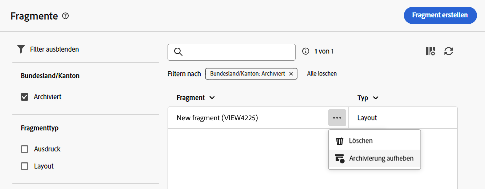

# Erstellen von Inhaltsfragmenten {#fragments}

>[!CONTEXTUALHELP]
>id="acw_fragments_create"
>title="Definieren Ihrer eigenen Inhaltsfragmente"
>abstract="Definieren Sie die Fragmenteigenschaften und den Fragmenttyp, den Sie erstellen möchten. Anschließend können Sie den E-Mail-Designer oder den Ausdruckseditor verwenden, um den Inhalt Ihres Fragments zu konfigurieren."

<!-- pas vu dans l'UI-->

>[!CONTEXTUALHELP]
>id="acw_fragments_properties"
>title="Fragmenteigenschaften"
>abstract="Geben Sie den Titel des Fragments ein. Bei Bedarf können Sie weitere Optionen definieren, z. B. den internen Namen des Fragments, dessen Ordner und eine Beschreibung."

>[!CONTEXTUALHELP]
>id="acw_fragments_type"
>title="Typ des Inhaltsfragments"
>abstract="Wählen Sie den Fragmenttyp aus, den Sie erstellen möchten. **Visuelle Fragmente** sind vordefinierte visuelle Bausteine, die Sie in mehreren E-Mail-Sendungen oder in Inhaltsvorlagen wiederverwenden können. **Ausdrucksfragmente** sind vordefinierte Ausdrücke, die über einen dedizierten Eintrag im Ausdruckseditor verfügbar sind."

Es gibt zwei Möglichkeiten, Inhaltsfragmente zu erstellen:

* Erstellen Sie ein Fragment mithilfe des dediziertes Menüs **[!UICONTROL Fragmente]** von Grund auf neu. [Weitere Informationen dazu](#create-from-scratch)
* Speichern Sie beim Entwerfen von Inhalten einen Teil Ihres Inhalts als Fragment. [Weitere Informationen](#save-as-fragment)

  >[!NOTE]
  >
  >Diese Funktion ist nur für visuelle Fragmente verfügbar. Ausdrucksfragmente werden ausschließlich über das Menü **Fragmente** erstellt.

Nach dem Speichern ist das Inhaltsfragment für die Verwendung in jedem Versand oder jeder Inhaltsvorlage verfügbar.

## Erstellen eines Inhaltsfragments von Grund auf {#create-from-scratch}

Gehen Sie wie folgt vor, um ein Inhaltsfragment von Grund auf neu zu erstellen.

1. [Rufen Sie die Fragmentliste](#access-manage-fragments) über das linke Menü unter **[!UICONTROL Content-Management]** > **[!UICONTROL Fragmente]** auf und wählen Sie **[!UICONTROL Fragment erstellen]** aus.

   

1. Geben Sie den Titel des Fragments ein. Definieren Sie bei Bedarf zusätzliche Optionen wie den internen Namen des Fragments, seinen Ordner und eine Beschreibung.

1. Wählen Sie den zu erstellenden Fragmenttyp aus: **Visual Fragment** oder **Expression Fragment**. [Lernen Sie die Unterschiede zwischen visuellen und Ausdrucksfragmenten kennen](fragments.md)

   

   >[!AVAILABILITY]
   >
   >Für visuelle Fragmente ist eine Aktualisierung auf Campaign v8.6.4 erforderlich. Weitere Informationen finden Sie in den [Versionshinweisen zur Client Console von Campaign v8](https://experienceleague.adobe.com/de/docs/campaign/campaign-v8/releases/release-notes).

1. Klicken Sie auf die Schaltfläche **Erstellen**.

   * Für **visuelle Fragmente** wird der [E-Mail-Designer](../email/get-started-email-designer.md) angezeigt. Bearbeiten Sie den Inhalt nach Bedarf auf die gleiche Weise wie für jede E-Mail innerhalb einer Kampagne und klicken Sie dann auf die Schaltfläche **Speichern und schließen**. Bilder, Links, Personalisierungsfelder und dynamische Inhalte hinzufügen.

     

   * Für **Ausdrucksfragmente** wird der Ausdruckseditor geöffnet. Verwenden Sie die Personalisierungs- und Authoring-Funktionen von , um den Inhalt zu erstellen, und klicken Sie dann auf **Bestätigen**. [Erfahren Sie mehr über die Arbeit mit dem Ausdruckseditor](../personalization/personalize.md)

     

1. Sobald der Inhalt fertig ist, klicken Sie auf **Speichern**.

Dieses Inhaltsfragment kann nun beim Erstellen von Sendungen oder [Inhaltsvorlagen](../email/use-email-templates.md) in Campaign verwendet werden. In den folgenden Abschnitten erfahren Sie, wie Sie visuelle Fragmente und Ausdrucksfragmente verwenden:
* [Hinzufügen visueller Fragmente zu E-Mails](use-visual-fragments.md)
* [Hinzufügen von Ausdrucksfragmenten zum Ausdruckseditor](use-expression-fragments.md)

## Inhalt als visuelles Fragment speichern {#save-as-fragment}

>[!CONTEXTUALHELP]
>id="acw_fragments_save"
>title="Als Fragment speichern"
>abstract="Um Inhalte als visuelles Fragment zu speichern, wählen Sie die in das Fragment einzuschließenden Elemente aus, einschließlich Personalisierungsfeldern und dynamischem Inhalt. Es können nur angrenzende Abschnitte ausgewählt werden. Leere Strukturen oder andere Inhaltsfragmente können nicht ausgewählt werden. Der Inhalt wird dann zu einem eigenständigen Fragment, wird der Fragmentliste hinzugefügt und kann über das dedizierte Menü aufgerufen werden. Dieses Fragment kann beim Erstellen von E-Mails oder Inhaltsvorlagen in Campaign verwendet werden."

<!--pas vu dans l'UI-->

Jeder E-Mail-Inhalt kann zur späteren Wiederverwendung als visuelles Fragment gespeichert werden. Speichern Sie beim Entwerfen [Inhaltsvorlage](../email/use-email-templates.md) oder eines [E-Mail](../email/get-started-email-designer.md)-Versands einen Teil des Inhalts als visuelles Fragment. Gehen Sie dazu wie folgt vor:

1. Klicken [ in „E](../email/get-started-email-designer.md)Mail-Designer&quot; auf die Schaltfläche **Mehr** oben rechts im Bildschirm.

1. Wählen Sie im Dropdown-Menü die Option **[!UICONTROL Als Fragment speichern]** aus.

   

1. Der Bildschirm **[!UICONTROL Als Fragment speichern]** wird angezeigt. Wählen Sie die Elemente aus, die in das Fragment aufgenommen werden sollen, einschließlich Personalisierungsfeldern und dynamischem Inhalt.

   >[!CAUTION]
   >
   >Es können nur angrenzende Abschnitte ausgewählt werden. Leere Strukturen oder andere Inhaltsfragmente können nicht ausgewählt werden.

   

1. Klicken Sie auf **[!UICONTROL Erstellen]**. Geben Sie den Fragmentnamen an und speichern Sie es.

   

   Dieser Inhalt ist jetzt ein eigenständiges Fragment, das der [Fragmentliste“ hinzugefügt ](#manage-fragments) und über das dedizierte Menü aufgerufen werden kann. Verwenden Sie dieses Fragment beim Erstellen von [E](../email/get-started-email-designer.md)Mails oder [Inhaltsvorlagen](../email/use-email-templates.md) in Campaign. [Weitere Informationen](../content/use-visual-fragments.md)

>[!NOTE]
>
>Änderungen am neuen Fragment werden nicht auf die E-Mail oder Vorlage übertragen, aus der es bzw. sie stammt. Wenn der ursprüngliche Inhalt in der E-Mail oder Vorlage bearbeitet wird, wird das neue Fragment ebenfalls nicht geändert.

## Verwalten Ihrer Inhaltsfragmente {#manage-fragments}

Sie können ein Inhaltsfragment aus der Fragmentliste bearbeiten, aktualisieren, duplizieren oder löschen.

### Bearbeiten und Aktualisieren eines Inhaltsfragments {#edit-fragments}

Gehen Sie wie folgt vor, um ein Inhaltsfragment zu bearbeiten:

1. Klicken Sie in der Liste **[!UICONTROL Fragmente]** auf den Namen des zu bearbeitenden Fragments.
1. Klicken Sie auf **Inhalt bearbeiten**, um den Inhalt des Fragments zu öffnen.

   

1. Nehmen Sie die erforderlichen Änderungen vor und speichern Sie die Änderungen.

>[!CAUTION]
>
>Änderungen an einem Fragment werden an die Sendungen oder Vorlagen weitergegeben, die es verwenden.

### Löschen eines Inhaltsfragments {#delete-fragments}

Gehen Sie wie folgt vor, um ein Inhaltsfragment zu löschen:

1. Navigieren Sie zur Fragmentliste und klicken Sie neben dem zu löschenden Fragment auf die Schaltfläche **[!UICONTROL Mehr Aktionen]**.
1. Klicken Sie auf **Löschen** und bestätigen Sie den Vorgang.

   

>[!CAUTION]
>
>Beim Löschen eines Fragments werden Sendungen und Vorlagen, in denen es verwendet wird, aktualisiert. Das Fragment wird aus dem Inhalt entfernt, aber dennoch referenziert. Um den Fragmentinhalt in diesen Sendungen und Vorlagen zu behalten, unterbrechen Sie die Vererbung, bevor Sie das Fragment löschen[ (wie in diesem Abschnitt beschrieben](use-visual-fragments.md#break-inheritance).

### Archivieren eines Inhaltsfragments {#archive}

Sie können die Fragmentliste bereinigen, indem Sie Fragmente archivieren, die für Ihre Marke nicht mehr relevant sind. Klicken Sie dazu auf die Schaltfläche **[!UICONTROL Mehr Aktionen]** neben dem gewünschten Fragment und wählen Sie **[!UICONTROL Archivieren]** aus. Das Fragment wird aus der Fragmentliste entfernt, sodass es in zukünftigen E-Mails oder Vorlagen nicht mehr von Benutzenden verwendet werden kann.

Verwenden Sie für den Zugriff auf archivierte Fragmente das Filterfenster, um sie anzuzeigen. Um die Archivierung eines Fragments aufzuheben, klicken Sie auf die Schaltfläche **[!UICONTROL Mehr Aktionen]** und wählen Sie **[!UICONTROL Archivierung aufheben]** aus.

>[!NOTE]
>
>Wenn Sie ein in einem Inhalt verwendetes Fragment archivieren, ist dieser Inhalt nicht betroffen.

### Duplizieren eines Inhaltsfragments {#duplicate-fragments}

Sie können ein Inhaltsfragment einfach duplizieren, um ein neues zu erstellen. Gehen Sie wie folgt vor, um ein vorhandenes Fragment zu duplizieren:

1. Navigieren Sie zur Fragmentliste und klicken Sie neben dem zu duplizierenden Fragment auf die Schaltfläche **[!UICONTROL Mehr Aktionen]**.
1. Klicken Sie auf **Duplizieren** und bestätigen Sie den Vorgang.
1. Geben Sie den Titel des neuen Fragments ein und speichern Sie die Änderungen.

   Das Fragment wird der Liste der Inhaltsfragmente hinzugefügt. Bearbeiten und konfigurieren Sie ihn nach Bedarf.