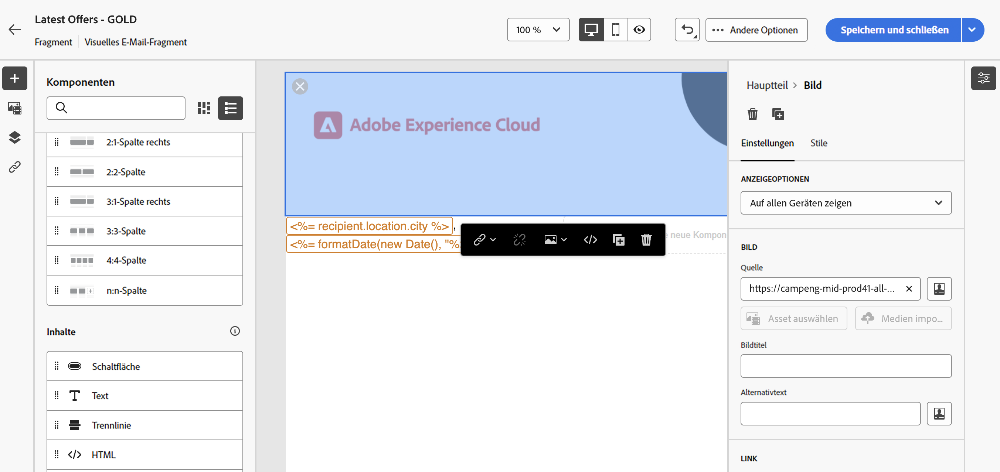
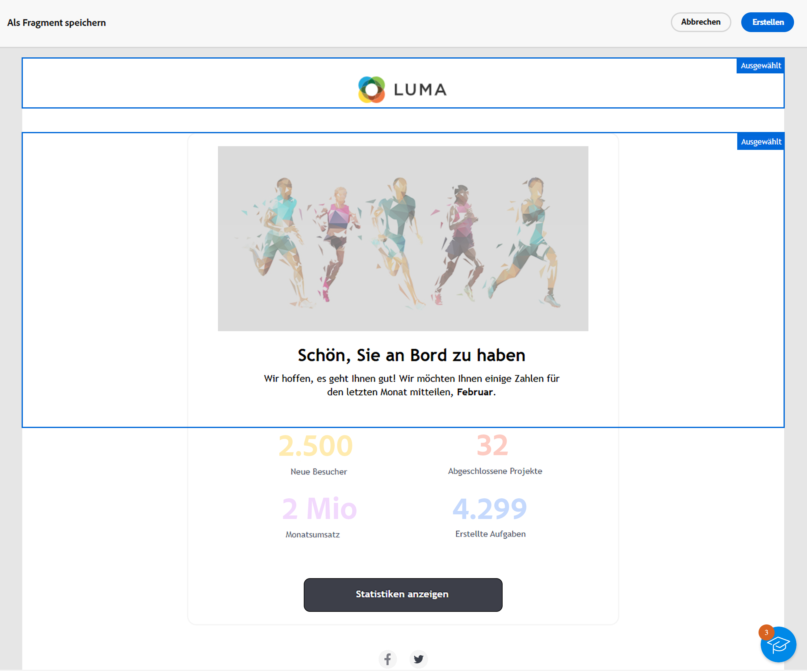

# Erstellen von Inhaltsfragmenten {#fragments}

>[!CONTEXTUALHELP]
>id="acw_fragments_create"
>title="Eigene Inhaltsfragmente definieren"
>abstract="Definieren Sie die Fragmenteigenschaften und den Fragmenttyp, den Sie erstellen möchten. Sie können dann den E-Mail-Designer oder den Ausdruckseditor verwenden, um den Inhalt Ihres Fragments zu konfigurieren."

<!-- pas vu dans l'UI-->

>[!CONTEXTUALHELP]
>id="acw_fragments_properties"
>title="Fragmente – Eigenschaften"
>abstract="Geben Sie den Titel des Fragments ein. Bei Bedarf können Sie weitere Optionen definieren, z. B. den internen Namen des Fragments, dessen Ordner und eine Beschreibung."

>[!CONTEXTUALHELP]
>id="acw_fragments_type"
>title="Typ des Inhaltsfragments"
>abstract="Wählen Sie den Fragmenttyp aus, den Sie erstellen möchten. **Visuelle Fragmente** sind vordefinierte visuelle Bausteine, die Sie über mehrere E-Mail-Sendungen oder Inhaltsvorlagen hinweg wiederverwenden können. **Ausdrucksfragmente** sind vordefinierte Ausdrücke, die über einen dedizierten Eintrag im Ausdruckseditor verfügbar sind."

Es gibt zwei Möglichkeiten, Inhaltsfragmente zu erstellen:

* Erstellen Sie ein Fragment mithilfe des dediziertes Menüs **[!UICONTROL Fragmente]** von Grund auf neu. [Weitere Informationen dazu](#create-from-scratch)
* Speichern Sie beim Entwerfen von Inhalten einen Teil des Inhalts als Fragment. [Weitere Informationen dazu](#save-as-fragment)

  >[!NOTE]
  >
  >Diese Funktion ist nur für visuelle Fragmente verfügbar. Ausdrucksfragmente werden ausschließlich über das Menü **Fragmente** erstellt.

Nach dem Speichern ist Ihr Inhaltsfragment für die Verwendung in jedem Versand oder jeder Inhaltsvorlage verfügbar.

## Neues Inhaltsfragment erstellen {#create-from-scratch}

Gehen Sie wie folgt vor, um ein neues Inhaltsfragment zu erstellen.

1. [Greifen Sie über das linke Menü **[!UICONTROL Content Management]** > **[!UICONTROL Fragmente]** auf die Fragmentliste](#access-manage-fragments) zu und wählen Sie **[!UICONTROL Fragment erstellen]** aus.

   

1. Geben Sie den Titel des Fragments ein. Bei Bedarf können Sie weitere Optionen definieren, z. B. den internen Namen des Fragments, dessen Ordner und eine Beschreibung.

1. Wählen Sie den Typ des Fragments aus, das Sie erstellen möchten: **Visual Fragment** oder **Ausdrucksfragment**. [Lernen Sie die Unterschiede zwischen visuellen und Ausdrucksfragmenten kennen](fragments.md)

   

   >[!AVAILABILITY]
   >
   >Visuelle Fragmente sind in der eingeschränkten Verfügbarkeit (LA) verfügbar. Sie sind Kundinnen und Kunden vorbehalten, die **von Adobe Campaign Standard zu Adobe Campaign v8** migrieren, und können nicht in anderen Umgebungen bereitgestellt werden.

1. Klicken Sie auf die Schaltfläche **Erstellen**.

   * Für **visuelle Fragmente** wird der [E-Mail-Designer](../email/get-started-email-designer.md) angezeigt. Bearbeiten Sie den Inhalt nach Bedarf, wie Sie es für jede E-Mail innerhalb einer Kampagne tun würden, und klicken Sie dann auf die Schaltfläche **Speichern und schließen** . Sie können Bilder, Links, Personalisierungsfelder und dynamische Inhalte hinzufügen.

     

   * Für **Ausdrucksfragmente** wird der Ausdruckseditor geöffnet. Nutzen Sie die Personalisierungs- und Authoring-Funktionen, um Ihren Inhalt zu erstellen, und klicken Sie dann auf **Bestätigen**. [Erfahren Sie mehr über die Arbeit mit dem Ausdruckseditor](../personalization/personalize.md)

     

1. Sobald Ihr Inhalt fertig ist, klicken Sie auf **Speichern**.

Das Inhaltsfragment kann jetzt beim Erstellen eines Versands oder einer [Inhaltsvorlage](../email/use-email-templates.md) in Campaign verwendet werden. In diesem Abschnitt erfahren Sie, wie Sie Visualisierungs- und Ausdrucksfragmente verwenden:
* [Hinzufügen visueller Fragmente zu E-Mails](use-visual-fragments.md)
* [Ausdrucksfragment zum Ausdruckseditor hinzufügen](use-expression-fragments.md)

## Inhalt als visuelles Fragment speichern {#save-as-fragment}

>[!CONTEXTUALHELP]
>id="acw_fragments_save"
>title="Als Fragment speichern"
>abstract="Um einen Inhalt als visuelles Fragment zu speichern, wählen Sie die Elemente aus, die Sie in das Fragment aufnehmen möchten, einschließlich Personalisierungsfeldern und dynamischem Inhalt. Sie können nur nebeneinander liegende Abschnitte auswählen. Sie können keine leere Struktur oder ein anderes Inhaltsfragment auswählen. Dieser Inhalt ist dann ein eigenständiges Fragment , das der Fragmentliste hinzugefügt und über das dedizierte Menü zugänglich ist. Sie können dieses Fragment beim Erstellen einer E-Mail- oder Inhaltsvorlage in Campaign verwenden."

<!--pas vu dans l'UI-->

Alle E-Mail-Inhalte können zur späteren Wiederverwendung als visuelles Fragment gespeichert werden. Beim Entwerfen einer [Inhaltsvorlage](../email/use-email-templates.md) oder eines [E-Mail-Versands](../email/get-started-email-designer.md) können Sie einen Teil des Inhalts als visuelles Fragment speichern. Gehen Sie dazu wie folgt vor:

1. Klicken Sie in [E-Mail-Designer](../email/get-started-email-designer.md) oben rechts auf dem Bildschirm auf **Mehr**.

1. Wählen Sie im Dropdown-Menü die Option **[!UICONTROL Als Fragment speichern]** aus.

   

1. Der Bildschirm **[!UICONTROL Als Fragment speichern]** wird angezeigt. Hier können Sie die Elemente auswählen, die in das Fragment aufgenommen werden sollen, einschließlich Personalisierungsfelder und dynamischer Inhalte.

   >[!CAUTION]
   >
   >Sie können nur nebeneinander liegende Abschnitte auswählen. Sie können keine leere Struktur oder ein anderes Inhaltsfragment auswählen.

   

1. Klicken Sie auf **[!UICONTROL Erstellen]**. Geben Sie den Fragmentnamen an und speichern Sie es.

   

   Dieser Inhalt ist jetzt ein eigenständiges Fragment, das zur [Fragmentliste](#manage-fragments) hinzugefügt wurde und das über das dedizierte Menü aufgerufen werden kann. Sie können dieses Fragment nun beim Erstellen von [E-Mails](../email/get-started-email-designer.md) oder [Inhaltsvorlagen](../email/use-email-templates.md) in Campaign verwenden. [Weitere Informationen dazu](../content/use-visual-fragments.md)

>[!NOTE]
>
>Änderungen an diesem neuen Fragment werden nicht in der E-Mail oder Vorlage übernommen, aus der es stammt. Wenn der ursprüngliche Inhalt in dieser E-Mail oder Vorlage bearbeitet wird, wird das neue Fragment nicht gleichermaßen geändert.—>

## Inhaltsfragmente verwalten {#manage-fragments}

Sie können ein Inhaltsfragment aus der Fragmentliste bearbeiten, aktualisieren, duplizieren oder löschen.

### Inhaltsfragment bearbeiten und aktualisieren {#edit-fragments}

Gehen Sie wie folgt vor, um ein Inhaltsfragment zu bearbeiten.

1. Klicken Sie in der Liste **[!UICONTROL Fragmente]** auf den Namen des zu bearbeitenden Fragments.
1. Klicken Sie auf die Schaltfläche **Inhalt bearbeiten**, um den Inhalt dieses Fragments zu öffnen.

   

1. Nehmen Sie die erforderlichen Änderungen vor und speichern Sie diese.

>[!CAUTION]
>
>Jede Änderung an einem Fragment wird für die Sendungen oder Vorlagen übernommen, die es verwenden.

### Inhaltsfragment löschen {#delete-fragments}

Gehen Sie wie folgt vor, um ein Inhaltsfragment zu löschen:

1. Navigieren Sie zur Fragmentliste und klicken Sie neben dem zu löschenden Fragment auf die Schaltfläche **[!UICONTROL Mehr Aktionen]**.
1. Klicken Sie auf **Löschen** und bestätigen Sie den Vorgang.

   

>[!CAUTION]
>
>Beim Löschen eines Fragments werden die Sendungen und Vorlagen mit diesem aktualisiert: Das Fragment wird aus dem Inhalt entfernt, aber dennoch referenziert. Um den Fragmentinhalt in diesen Sendungen und Vorlagen zu behalten, müssen Sie die Vererbung unterbrechen, bevor Sie das Fragment löschen, [wie in diesem Abschnitt beschrieben](use-visual-fragments.md#break-inheritance).

### Inhaltsfragment duplizieren {#duplicate-fragments}

Sie können ein Inhaltsfragment einfach duplizieren, um ein neues zu erstellen. Gehen Sie wie folgt vor, um ein vorhandenes Fragment zu duplizieren:

1. Navigieren Sie zur Fragmentliste und klicken Sie neben dem zu duplizierenden Fragment auf die Schaltfläche **[!UICONTROL Mehr Aktionen]**.
1. Klicken Sie auf **Duplizieren** und bestätigen Sie den Vorgang.
1. Geben Sie den Titel des neuen Fragments ein und speichern Sie die Änderungen.

   Das Fragment wird der Liste der Inhaltsfragmente hinzugefügt. Sie können sie bearbeiten und nach Bedarf konfigurieren.
