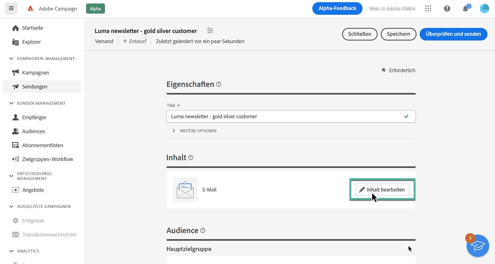
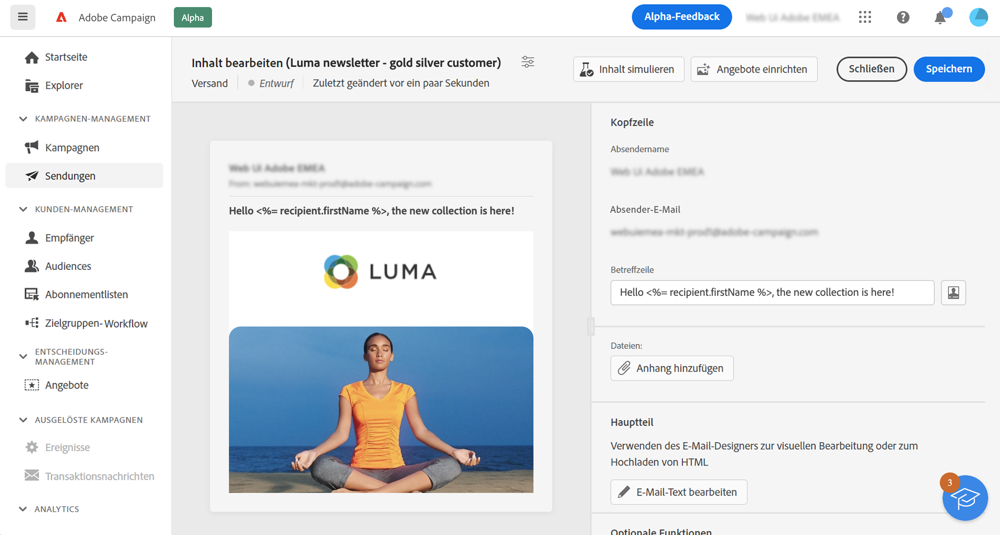

# Bearbeiten des E-Mail-Inhalts {#configure-content}

>[!CONTEXTUALHELP]
>id="acw_deliveries_email_content"
>title="Erstellen des E-Mail-Inhalts"
>abstract="In diesem Abschnitt können Sie den Inhalt Ihrer E-Mail erstellen und mit dem E-Mail-Designer ein optimiertes Aussehen kreieren."

>[!CONTEXTUALHELP]
>id="acw_deliveries_email_header"
>title="E-Mail-Kopfzeile"
>abstract="TBC"

>[!CONTEXTUALHELP]
>id="acw_deliveries_email_attachment"
>title="E-Mail-Anhang"
>abstract="TBC"

>[!CONTEXTUALHELP]
>id="acw_deliveries_email_options"
>title="Tracking-Optionen"
>abstract="TBC"

Um den Inhalt einer E-Mail zu erstellen, klicken Sie im E-Mail-Erstellungsbildschirm auf die Schaltfläche **[!UICONTROL Inhalt bearbeiten]**.

Auf diesem Bildschirm können Sie den Inhalt Ihrer E-Mail definieren und auf E-Mail-Designer zugreifen, um sie zu entwerfen.

Gehen Sie wie folgt vor, um den Inhalt Ihrer E-Mail zu definieren:

1. Überprüfen Sie die Informationen **[!UICONTROL Name des Absenders]** und **[!UICONTROL E-Mail des Absenders]**. Diese Felder sind schreibgeschützt und werden in der bei der E-Mail-Erstellung ausgewählten E-Mail-Vorlage konfiguriert.

1. Definieren Sie den **[!UICONTROL Betreff]** der E-Mail. Geben Sie dazu Ihren Betreff direkt in das entsprechende Feld ein oder öffnen Sie den Ausdruckseditor, um das Hinzufügen einer Personalisierung mit verschiedenen Attributen und Inhaltsbausteinen oder Angeboten zu definieren. [Erfahren Sie, wie Sie Inhalte personalisieren](../personalization/personalize.md)

1. Wenn Sie mit Ihrer E-Mail Angebote versenden möchten, wählen Sie diese über die Schaltfläche **[!UICONTROL Angebote einrichten]** aus. Sie können sie dann mithilfe von Personalisierungsfeldern in die E-Mail einfügen. [Erfahren Sie, wie Sie Angebote senden](offers.md)

1. Klicken Sie auf die Schaltfläche **[!UICONTROL E-Mail-Text bearbeiten]**, um den Inhalt der E-Mail zu strukturieren und zu gestalten. Weitere Informationen zum Entwerfen von E-Mail-Inhalten finden Sie in diesen Abschnitten:

   * [Erfahren Sie, wie Sie E-Mails entwerfen](create-email-content.md)
   * [Gestalten Ihrer Inhalte](get-started-email-style.md)

1. Wenn Sie eine Datei an die E-Mail anhängen möchten, klicken Sie auf die Schaltfläche **[!UICONTROL Anlage hinzufügen]** und wählen Sie eine oder mehrere Dateien aus.

   Zur Vermeidung von Leistungsproblemen wird empfohlen, nicht mehr als einen Anhang pro E-Mail hinzuzufügen.

   <!--limitation on size + number of files?-->

1. Standardmäßig ist für den Versand Tracking aktiviert. Sie können diese Option über den Abschnitt **[!UICONTROL Optionale Funktionen]** deaktivieren. [Erfahren Sie, wie Sie Links hinzufügen und das Tracking verwalten](message-tracking.md)

Nachdem Sie den Inhalt Ihrer E-Mail definiert haben, können Sie vor dem Versand mit der Schaltfläche **[!UICONTROL Inhalt simulieren]** überprüfen, wie die E-Mail dargestellt wird. [Erfahren Sie, wie Sie Ihre E-Mail in der Vorschau anzeigen und testen können](../preview-test/preview-test.md)
