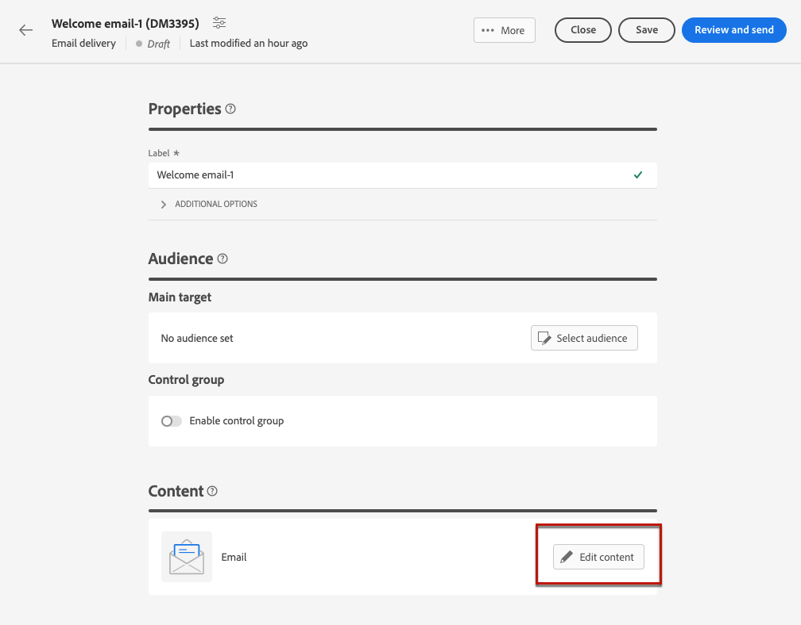

# E-Mail-Inhalt konfigurieren {#edit-content}

>[!CONTEXTUALHELP]
>id="acw_deliveries_email_content"
>title="Erstellen des E-Mail-Inhalts"
>abstract="In diesem Abschnitt können Sie den Inhalt Ihrer E-Mail erstellen und mit dem E-Mail-Designer ein optimiertes Aussehen kreieren."

>[!CONTEXTUALHELP]
>id="acw_deliveries_email_header"
>title="E-Mail-Parameter"
>abstract="Die Werte Von Name und Von E-Mail werden in der E-Mail-Vorlage definiert. Die Betreffzeile kann mit dem Ausdruckseditor personalisiert werden."

>[!CONTEXTUALHELP]
>id="acw_deliveries_email_attachment"
>title="E-Mail-Anhang"
>abstract="Wählen Sie eine oder mehrere Dateien aus, die in Ihre Nachricht eingefügt werden sollen."

>[!CONTEXTUALHELP]
>id="acw_deliveries_email_options"
>title="Tracking-Optionen"
>abstract="Standardmäßig ist für den Versand Tracking aktiviert. Sie können diese Option hier deaktivieren."

Um den Inhalt einer E-Mail zu erstellen, klicken Sie auf die Schaltfläche **[!UICONTROL Inhalt bearbeiten]** -Schaltfläche in der [E-Mail-Versand-Dashboard](../email/create-email.md) angezeigt.

Auf dem sich öffnenden Bildschirm können Sie grundlegende Details definieren, einige zusätzliche Aktionen ausführen, wie z. B. Anlagen hinzufügen oder Angebote einrichten, und auf die [Email Designer](#start-authoring) , um Ihren Inhalt zu erstellen.

Gehen Sie wie folgt vor, um den Inhalt Ihrer E-Mail zu bearbeiten:

1. Im **[!UICONTROL Name des Empfängers]** verwenden Sie einen Namen, der von den Empfängern leicht identifiziert werden kann, z. B. den Namen Ihrer Marke, um die Öffnungsrate Ihrer Sendungen zu erhöhen.

   Um das Benutzererlebnis zu verbessern, können Sie den Namen einer Person einfügen, wie z. B. „Emma von Megastore“.

1. Im **[!UICONTROL Aus E-Mail]** -Adressfeld verwenden, stellen Sie sicher, dass die Adressdomäne mit der Subdomain übereinstimmt, die Sie der Adobe zugewiesen haben.

   >[!NOTE]
   >
   >    Sie können den Teil vor dem &quot;@&quot; ändern, aber nicht die Domain-Adresse.

   <!--In the Reply address text fields, the sender's address is used by default for replies. However, Adobe recommends using an existing real address such as your brand's customer care. In this case, if a recipient sends a reply, the customer care will be able to handle it.-->

1. Definieren Sie den **[!UICONTROL Betreff]** der E-Mail. Geben Sie Ihren Betreff direkt in das dedizierte Feld ein oder öffnen Sie den Ausdruckseditor, um eine Personalisierung mit verschiedenen Attributen und Inhaltsbausteinen oder Angeboten hinzuzufügen. [Erfahren Sie, wie Sie Inhalte personalisieren](../personalization/personalize.md)

1. Wenn Sie eine Datei an die E-Mail anhängen möchten, klicken Sie auf die Schaltfläche **[!UICONTROL Anlage hinzufügen]** und wählen Sie eine oder mehrere Dateien aus.

   >[!NOTE]
   >
   >    Zur Vermeidung von Leistungsproblemen wird empfohlen, nicht mehr als einen Anhang pro E-Mail hinzuzufügen.

   <!--limitation on size + number of files?-->

1. Wenn Sie mit Ihrer E-Mail Angebote versenden möchten, wählen Sie diese über die Schaltfläche **[!UICONTROL Angebote einrichten]** aus.

   Sie können sie dann mithilfe von Personalisierungsfeldern in die E-Mail einfügen. [Erfahren Sie, wie Sie Angebote senden](offers.md)

1. Klicken Sie auf **[!UICONTROL Bearbeiten des E-Mail-Hauptteils]** -Schaltfläche, um den Inhalt der E-Mail mithilfe der [Email Designer](#start-authoring). Weitere Informationen zum Entwerfen von E-Mail-Inhalten finden Sie in diesen Abschnitten:

   * [Erfahren Sie, wie Sie E-Mails entwerfen](create-email-content.md)
   * [Gestalten Ihrer Inhalte](get-started-email-style.md)

1. Standardmäßig ist für den Versand Tracking aktiviert. Sie können diese Option im Bereich **[!UICONTROL Optionale Funktionen]** deaktivieren. [Erfahren Sie, wie Sie Links hinzufügen und das Tracking verwalten](message-tracking.md)

1. Nachdem Sie den Inhalt Ihrer E-Mail definiert haben, können Sie vor dem Versand mit der Schaltfläche **[!UICONTROL Inhalt simulieren]** überprüfen, wie die E-Mail dargestellt wird. [Erfahren Sie, wie Sie Ihre E-Mail in der Vorschau anzeigen und testen können](../preview-test/preview-test.md)

