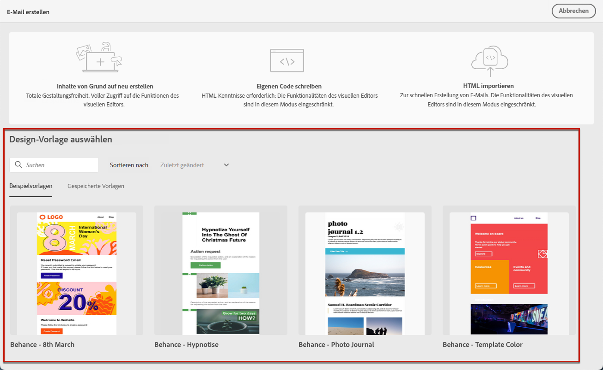
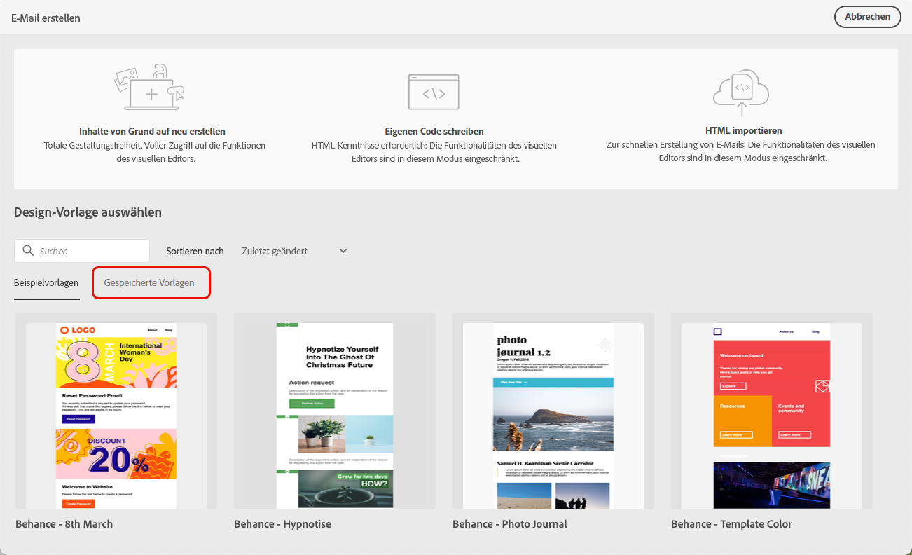
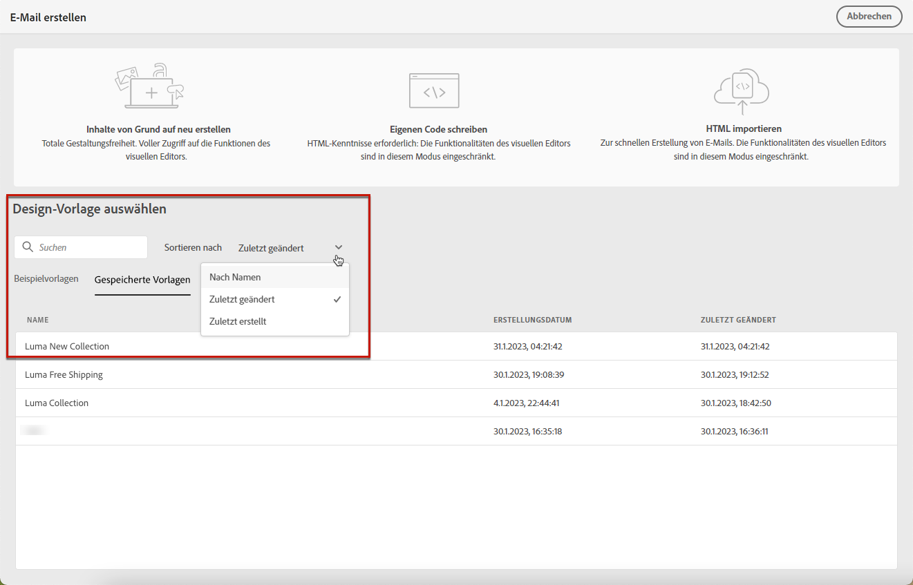
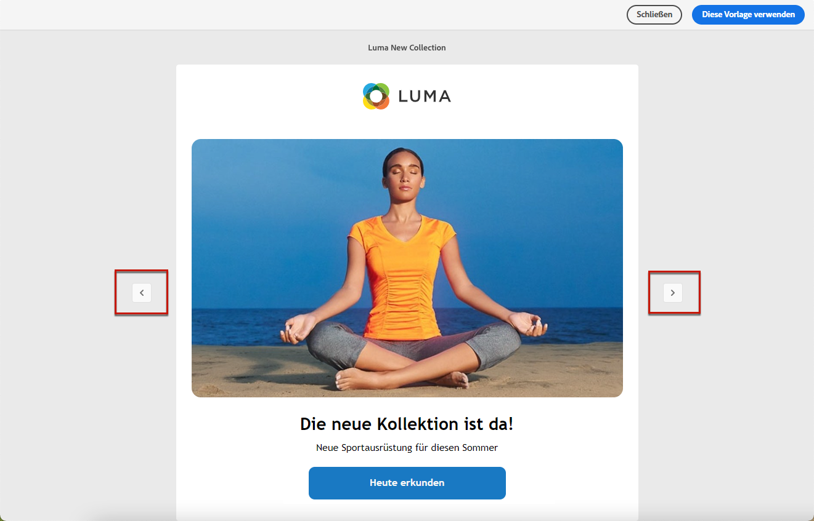
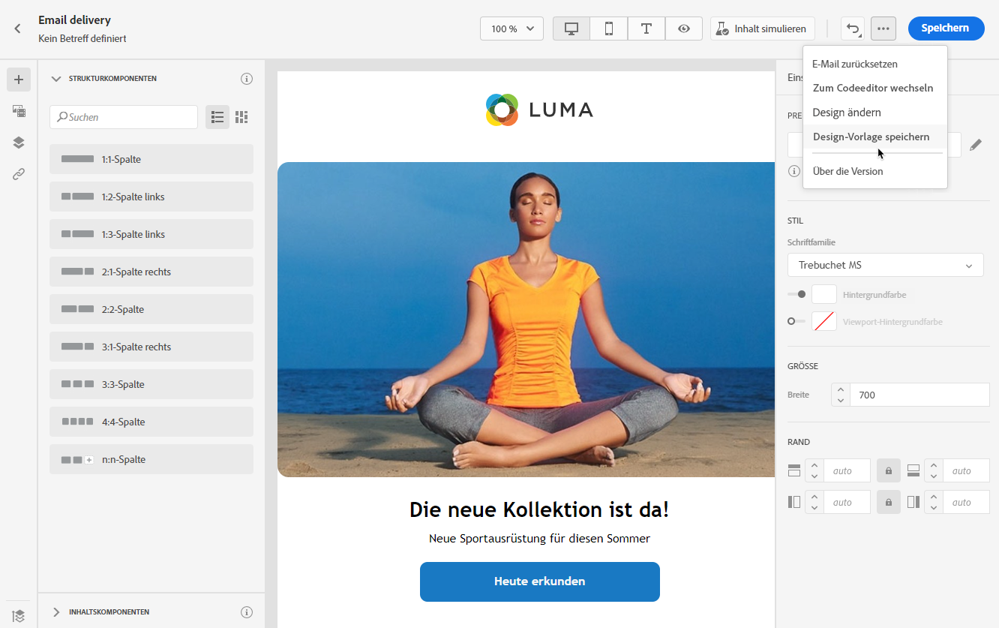
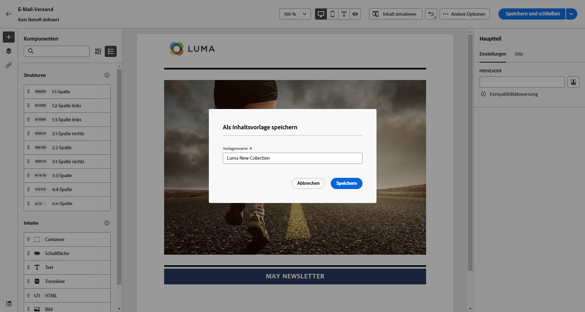
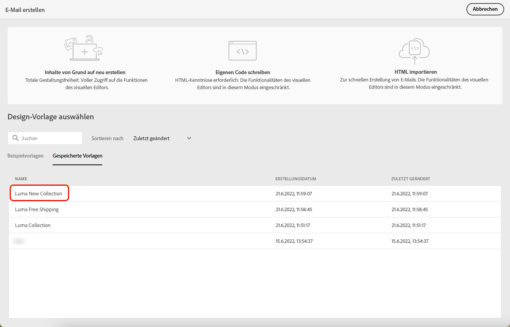

# Arbeiten mit E-Mail-Vorlagen {#email-content-templates}

Wann [E-Mail erstellen](#create-email), verwenden Sie die **[!UICONTROL Designvorlage auswählen]** Abschnitt **[!UICONTROL E-Mail erstellen]** -Oberfläche, um Ihren Inhalt aus einer Vorlage zu erstellen.

Sie können aus folgenden Optionen wählen:

* **Beispielvorlagen**. Campaign verfügt über eine Reihe integrierter Vorlagen, aus denen Sie auswählen können.

* **Gespeicherte Vorlagen**. Sie können auch eine benutzerdefinierte Vorlage verwenden, die Sie als Vorlage aus einem vorhandenen Inhalt gespeichert haben.

In den folgenden Abschnitten erfahren Sie, wie Sie Vorlagen verwenden und E-Mail-Inhalte als Vorlage speichern können.

## Vorlage verwenden {#use-templates}

Gehen Sie wie folgt vor, um mit der Erstellung Ihres Inhalts mit einer der Beispielvorlagen oder gespeicherten Vorlagen zu beginnen.

1. Öffnen Sie die [Email Designer](create-email-content.md).

1. Auf dem Bildschirm **[!UICONTROL E-Mail erstellen]** ist die Registerkarte **[!UICONTROL Beispielvorlagen]** standardmäßig ausgewählt.

1. Um eine vorhandene benutzerdefinierte Vorlage zu verwenden, navigieren Sie zum **[!UICONTROL Gespeicherte Vorlagen]** Registerkarte.

   

1. Die Liste aller [gespeicherten Vorlagen](#save-as-template) wird angezeigt. Sie können sie nach **[!UICONTROL Namen]**, **[!UICONTROL Zuletzt geändert]** und **[!UICONTROL Zuletzt erstellt]** sortieren.

   

1. Wählen Sie eine Vorlage aus der Liste aus, um deren Inhalt anzuzeigen.

1. Verwenden Sie die Rechts- und Linkspfeile, um zwischen den Vorlagen zu navigieren (Beispiel oder je nach Auswahl gespeichert).

   

1. Klicken **[!UICONTROL Verwenden Sie diese Vorlage]** oben rechts auf dem Bildschirm.

1. Bearbeiten Sie Ihren Inhalt wie gewünscht mit dem E-Mail-Designer. [Weitere Informationen](create-email-content.md)

## E-Mail-Inhalt als Vorlage speichern {#save-as-template}

Einmal [E-Mail erstellen](create-email-content.md), können Sie diesen Inhalt als Vorlage zur zukünftigen Wiederverwendung speichern. Gespeicherte Vorlagen stehen allen in Ihrer Adobe Campaign-Umgebung zur Verfügung.

Gehen Sie wie folgt vor, um E-Mail-Inhalte als Vorlage zu speichern:

1. Klicken Sie im E-Mail-Designer oben rechts im Bildschirm auf das Auslassungszeichen.

1. Auswählen **[!UICONTROL Als Inhaltsvorlage speichern]** aus dem Dropdown-Menü.

   

1. Geben Sie einen Namen für diese Vorlage ein und speichern Sie sie.

   

Sie können jetzt [Verwenden Sie diese Vorlage](#use-templates) um einen neuen Inhalt zu erstellen: ist im **[!UICONTROL Gespeicherte Vorlagen]** in Email Designer.

