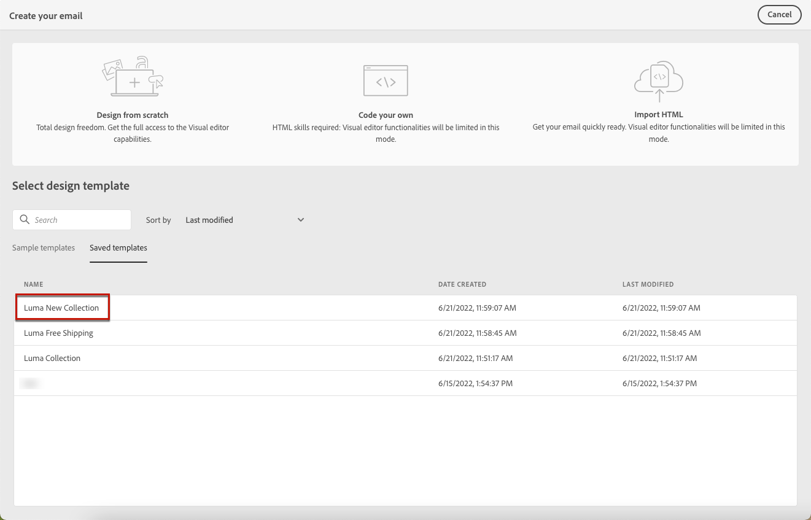

# Arbeiten mit E-Mail-Inhaltsvorlagen {#email-content-templates}

>[!NOTE]
>
>Diese Dokumentation wird derzeit erstellt und häufig aktualisiert. Die endgültige Version dieses Inhalts wird im Januar 2023 vorliegen.

Verwenden Sie die **[!UICONTROL Designvorlage auswählen]** -Abschnitt, um Ihren Inhalt aus einer Vorlage zu erstellen.

## Als Vorlage speichern {#save-as-template}

Nachdem Sie Ihren E-Mail-Inhalt entworfen haben, können Sie ihn zur späteren Wiederverwendung speichern. Gehen Sie dazu wie folgt vor:

1. Klicken Sie oben rechts im Bildschirm auf das Auslassungszeichen.

1. Auswählen **[!UICONTROL Speichern von Designvorlagen]** aus dem Dropdown-Menü.

   

1. Fügen Sie dieser Vorlage einen Namen hinzu.

   

1. Klicken Sie auf **[!UICONTROL Speichern]**.

Wenn Sie das nächste Mal eine E-Mail erstellen, können Sie diese Vorlage verwenden, um Ihren Inhalt zu erstellen. [Weitere Informationen](#use-saved-template)

## Verwenden einer gespeicherten Vorlage {#use-saved-template}

1. Öffnen Sie die [Email Designer](create-email-content.md).

1. Im **[!UICONTROL E-Mail-Bildschirm erstellen]**, die **[!UICONTROL Beispielvorlagen]** ist standardmäßig ausgewählt. Wählen Sie die **[!UICONTROL Gespeicherte Vorlagen]** Registerkarte.

   

1. Die Liste aller zuvor [gespeicherte Vorlagen](#save-as-template) angezeigt. Sie können sie sortieren **[!UICONTROL Nach Name]**, **[!UICONTROL Zuletzt geändert]** und **[!UICONTROL Zuletzt erstellt]**.

   

1. Wählen Sie aus der Liste die gewünschte Vorlage aus.

1. Nach der Auswahl können Sie mithilfe der Rechts- und Linkspfeile zwischen allen gespeicherten Vorlagen navigieren.

   

1. Klicken **[!UICONTROL Verwenden dieser E-Mail]** oben rechts auf dem Bildschirm.

1. Bearbeiten Sie den Inhalt nach Bedarf mit dem E-Mail-Designer.
