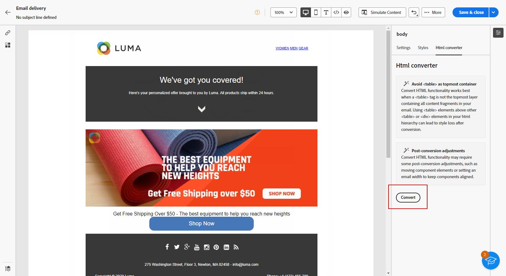

# Importieren Ihrer E-Mail-Inhalte {#existing-content}

>[!CONTEXTUALHELP]
>id="acw_deliveries_email_import_content"
>title="Verwenden eines vorhandenen E-Mail-Inhalts"
>abstract="Der E-Mail-Designer ermöglicht den Import vorhandener HTML-Inhalte. Dieser Inhalt kann eine HTML-Datei mit einem integrierten Stylesheet oder ein ZIP-Ordner mit der HTML-Datei, dem Stylesheet (.css) und Bildern sein."

Sie können vorhandene HTML-Inhalte in den E-Mail-Designer importieren. Dieser Inhalt kann Folgendes sein:

* Eine **HTML-Datei** mit integriertem Stylesheet,
* Ein **komprimierter Ordner** (.zip) mit HTML-Datei, Stylesheet (.css) und Bildern.

  >[!NOTE]
  >
  >Die Struktur des komprimierten Ordners ist freigestellt. Verweise müssen jedoch relativ sein und zur Baumstruktur des ZIP-Ordners passen.

Gehen Sie wie folgt vor, um eine Datei mit HTML-Inhalt zu importieren:

1. Wählen Sie auf der Startseite des [E-Mail-Designers](get-started-email-designer.md) die Option **[!UICONTROL HTML importieren]** aus.

   

1. Ziehen Sie die HTML- oder ZIP-Datei, die Ihren HTML-Inhalt enthält, per Drag-and-Drop und klicken Sie auf **[!UICONTROL Importieren]**.

1. Sobald der HTML-Inhalt hochgeladen wurde, befindet sich Ihr Inhalt im **[!UICONTROL Kompatibilitätsmodus]**.

   In diesem Modus können Sie nur Ihren Text personalisieren, Links hinzufügen oder Assets zu Ihrem Inhalt hinzufügen.

   

1. Um die Inhaltskomponenten des E-Mail-Designers nutzen zu können, gehen Sie zur Registerkarte **[!UICONTROL HTML-Konverter]** und klicken Sie auf **[!UICONTROL Konvertieren]**.

   

   >[!NOTE]
   >
   > Wenn ein `<table>`-Tag als erste Ebene in einer HTML-Datei verwendet wird, kann dies zum Verlust von Stileinstellungen finden, einschließlich der Einstellungen für Hintergrund und Breite im Tag der obersten Ebene.

1. Jetzt können Sie Ihre importierte Datei nach Bedarf mit den Funktionen des E-Mail-Designers personalisieren [Weitere Informationen](content-components.md).

