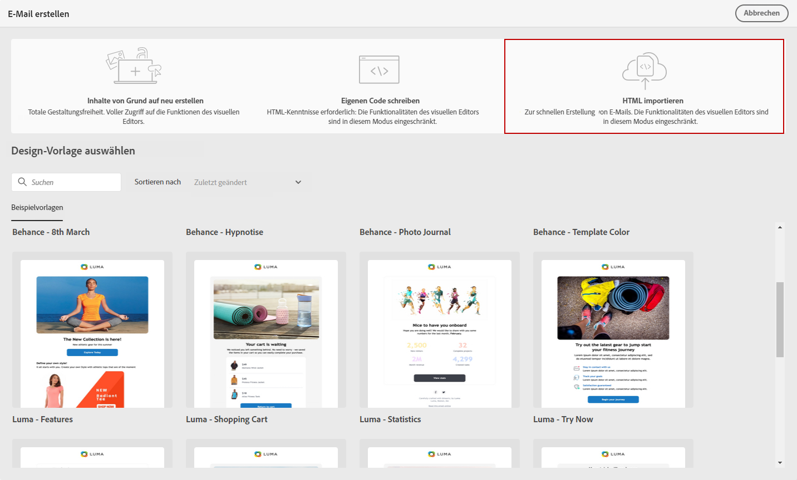
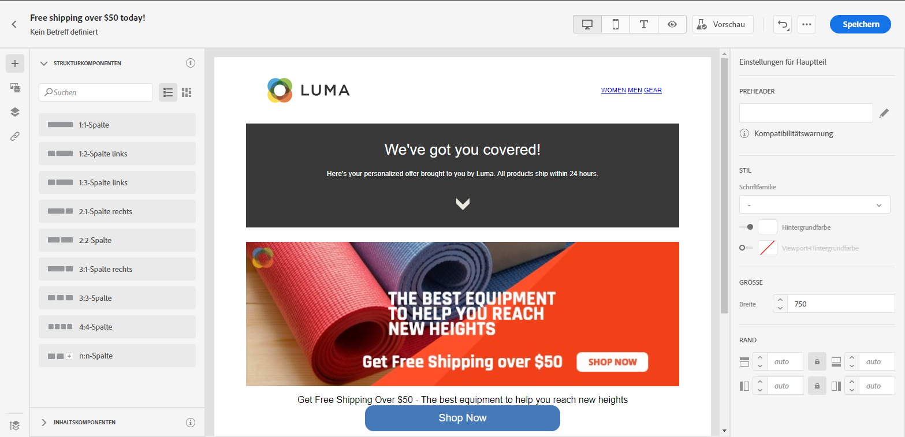

# Importieren Ihrer E-Mail-Inhalte {#existing-content}

E-Mail-Designer ermöglicht den Import vorhandener HTML-Inhalte. Dieser Inhalt kann Folgendes sein:

* Eine **HTML-Datei** mit integriertem Stylesheet,
* Ein **komprimierter Ordner** (.zip) mit HTML-Datei, Stylesheet (.css) und Bildern.

   >[!NOTE]
   >
   >Die Struktur des komprimierten Ordners ist freigestellt. Verweise müssen jedoch relativ sein und zur Baumstruktur des ZIP-Ordners passen.

Gehen Sie wie folgt vor, um eine Datei mit HTML-Inhalt zu importieren:

1. Wählen Sie auf der Startseite von E-Mail-Designer die Option **[!UICONTROL HTML importieren]**.

   

1. Ziehen Sie die HTML- oder ZIP-Datei mit Ihrem HTML-Inhalt per Drag-and-Drop und klicken Sie auf **[!UICONTROL Importieren]**.

1. Nach dem Hochladen des HTML-Inhalts können Sie die Funktionen von E-Mail-Designer nutzen, um Ihre E-Mail zu bearbeiten und in der Vorschau anzuzeigen. [Weitere Informationen finden Sie in diesem Abschnitt](create-email-content.md).

   