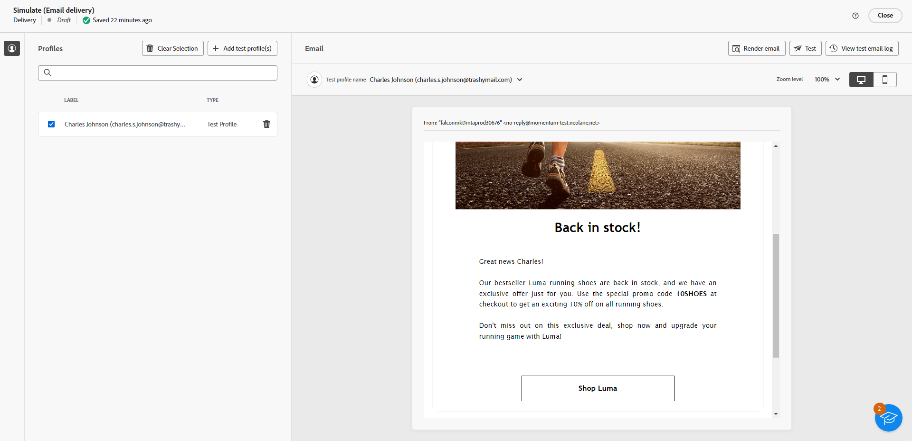

# Texterstellung mit dem Inhaltsassistenten {#generative-content}

Nachdem Sie Ihre E-Mails erstellt und personalisiert haben, verwenden Sie den Inhaltsassistenten mit generativer KI, um Ihren Inhalt auf die nächste Stufe zu bringen.

Der Inhaltsassistent kann Ihnen dabei helfen, die Wirkung Ihrer Sendungen zu optimieren, indem Sie verschiedene Inhalte vorschlagen, die mit größerer Wahrscheinlichkeit bei Ihrer Zielgruppe ankommen.

1. Nachdem Sie Ihren E-Mail-Versand erstellt und konfiguriert haben, klicken Sie auf **[!UICONTROL Inhalt bearbeiten]**.

   Weitere Informationen zur Konfiguration Ihres E-Mail-Versands finden Sie unter [diese Seite](../content/create-email-content.md).

1. Füllen Sie die **[!UICONTROL Grundlegende Details]** für Ihren Versand. Klicken Sie abschließend auf **[!UICONTROL Bearbeiten von E-Mail-Inhalten]**.

1. Personalisieren Sie Ihre E-Mail nach Bedarf.

1. Wählen Sie die **[!UICONTROL Textkomponente]** Sie möchten das Menü Erlebniserstellung aktualisieren und aufrufen.

   

1. Passen Sie den Inhalt an, indem Sie beschreiben, was Sie generieren möchten.

   Aktivieren Sie die **[!UICONTROL Verbesserung mit aktuellem Kontext]** Option für den Inhaltsassistenten, um neuen Inhalt basierend auf Ihrem Versand, dem Versandnamen und der ausgewählten Zielgruppe zu personalisieren.

   

1. Auswählen **[!UICONTROL Datei hochladen]** wenn Sie ein Marken-Asset hinzufügen möchten, das Inhalte enthält, die zusätzlichen Kontext bieten können, den der Inhaltsassistent bietet.

   Sie können auch auf **[!UICONTROL Hochgeladene Inhalte]** um zuvor aktualisierte Dateien zu finden. Beachten Sie, dass der hochgeladene Inhalt ausschließlich für die Wiederverwendung durch den aktuellen Benutzer verfügbar ist.

1. Wählen Sie die **[!UICONTROL Kommunikationsstrategie]** das Ihren Bedürfnissen am besten entspricht. Dies wirkt sich auf den Ton und den Stil des generierten Textes aus.

1. Wählen Sie die **[!UICONTROL Sprache]** und **[!UICONTROL Ton]** , dass der generierte Text enthalten soll. Dadurch wird sichergestellt, dass der Text für Ihre Zielgruppe und Ihren Zweck geeignet ist.

   

1. Verwenden Sie das Regler-Steuerelement, um die Länge des generierten Textes festzulegen.

1. Sobald die Eingabeaufforderung fertig ist, klicken Sie auf **[!UICONTROL Erzeugen]**.

1. Durchsuchen Sie die generierte **[!UICONTROL Varianten]** und klicken **[!UICONTROL Anwenden]** sobald Sie den entsprechenden Inhalt gefunden haben.

   

1. Fügen Sie Personalisierungsfelder ein, um Ihre E-Mail-Inhalte auf der Grundlage von Profildaten anzupassen. [Weitere Informationen über die Personalisierung von Inhalten](../personalization/personalize.md)

   

1. Klicken Sie nach der Definition des Nachrichteninhalts auf die Schaltfläche **[!UICONTROL Inhalt simulieren]** zur Steuerung des Renderings und zur Überprüfung der Personalisierungseinstellungen mit Testprofilen. [Weitere Informationen](../preview-test/preview-content.md)

   

1. Wenn Sie Inhalt, Zielgruppe und Zeitplan definiert haben, können Sie Ihren E-Mail-Versand vorbereiten. [Weitere Informationen](../monitor/prepare-send.md)

