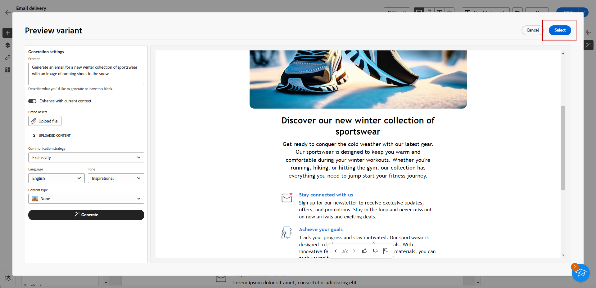

# Generieren einer E-Mail mit dem Inhaltsassistenten {#generative-email}

Der Inhaltsassistent verbessert die Wirkung Ihrer Kommunikation, indem er automatisch komplette E-Mail-Inhalte generiert, was Zeit spart und eine konsistente Qualität gewährleistet. Mit generativer KI können Sie mühelos überzeugende E-Mails verfassen, die auf Ihre Zielgruppe abgestimmt sind, und so Ihre Kommunikation wirkungsvoller und effizienter gestalten.

>[!NOTE]
>
>Bevor Sie mit der Verwendung dieser Funktion beginnen, lesen Sie die entsprechenden Informationen unter [Schutzmechanismen und Begrenzungen](generative-gs.md#guardrails-and-limitations).

Gehen Sie wie folgt vor, um mit dem Inhaltsassistenten E-Mail-Inhalte zu erstellen. Sie können mit dem Inhaltsassistenten auch vorhandene Inhalte verbessern, wie auf [dieser Seite](generative-content.md) beschrieben.

1. Nachdem Sie Ihren E-Mail-Versand erstellt und konfiguriert haben, klicken Sie auf **[!UICONTROL Inhalt erstellen]**.

   Weitere Informationen zur Konfiguration Ihres E-Mail-Versands finden Sie auf [dieser Seite](../content/create-email-content.md).

1. Füllen Sie die **[!UICONTROL grundlegenden Details]** für Ihren Versand aus. Klicken danach auf **[!UICONTROL E-Mail-Text bearbeiten]**.

1. Wählen Sie die Design-Vorlage aus, die der E-Mail-Assistent als Grundlage für die E-Mail verwenden soll.

   Sie können auch eine HTML-Datei importieren.

1. Wählen Sie aus dem Menü auf der rechten Seite die Option **[!UICONTROL Erlebnisgenerierung]** aus.

   

1. Passen Sie den Inhalt an, indem Sie beschreiben, was Sie generieren möchten.

   Hier sind einige Beispiele für Eingabeaufforderungen:

   * Für einen Newsletter: Generieren Sie einen monatlichen Newsletter mit Reiseartikeln, Highlights zu Zielen und exklusive Angebote für Abonnentinnen und Abonnenten.
   * Für Feedbacks und Umfragen: Erstellen Sie eine E-Mail, in der Kundinnen und Kunden eingeladen werden, Feedback zu ihrem letzte Software-Erlebnis zu geben und an einer Umfrage zur Produktverbesserung teilzunehmen.
   * Für Jubiläums- oder Geburtstags-E-Mails: Generieren Sie eine Geburtstags-E-Mail, um den besonderen Tag der Kundin bzw. des Kunden zu feiern und einen Geburtstagsrabatt zu unterbreiten.

   

1. Wählen Sie **[!UICONTROL Datei hochladen]** aus, wenn Sie ein Marken-Asset hinzufügen möchten, das Inhalte enthält, die zusätzlichen Kontext für den Inhaltsassistenten liefern können.

   Sie können auch auf **[!UICONTROL Hochgeladene Inhalte]** klicken, um zuvor aktualisierte Dateien zu finden. Beachten Sie, dass der hochgeladene Inhalt ausschließlich für die Wiederverwendung durch die aktuelle Benutzerin bzw. den aktuellen Benutzer verfügbar ist.

1. Wählen Sie die **[!UICONTROL Kommunikationsstrategie]** aus, die am besten Ihren Anforderungen entspricht. Dies wirkt sich auf den Ton und den Stil der generierten E-Mail aus.

1. Wählen Sie die **[!UICONTROL Sprache]** und den **[!UICONTROL Ton]** aus. die der generierte Text haben soll. Dadurch wird sichergestellt, dass der Text für Ihre Zielgruppe und Ihren Zweck geeignet ist.

   

1. Passen Sie die Asset-Einstellungen des **[!UICONTROL Inhaltstyps]** an, damit sie den gewünschten Asset-Eigenschaften entsprechen.

1. Wenn die Eingabeaufforderung fertig ist, klicken Sie auf **[!UICONTROL Generieren]**.

1. Durchsuchen Sie die **[!UICONTROL Variantenvorschläge]**, um die gewünschte E-Mail zu finden. Klicken Sie auf **[!UICONTROL Vorschau]**, um eine Vollbildversion der ausgewählten Variante anzuzeigen.

   

1. Klicken Sie auf **[!UICONTROL Auswählen]**, sobald Sie den passenden Inhalt gefunden haben.

   

1. Fügen Sie Personalisierungsfelder ein, um Ihren E-Mail-Inhalt auf der Basis von Profildaten anzupassen oder Ihren Inhalt bei Bedarf weiter zu personalisieren. [Weitere Informationen über die Personalisierung von Inhalten](../personalization/personalize.md)

1. Klicken Sie nach der Definition Ihres E-Mail-Inhalts auf die Schaltfläche **[!UICONTROL Inhalt simulieren]**, um das Rendern zu steuern, und überprüfen Sie die Personalisierungseinstellungen mit Testprofilen. [Weitere Informationen](../preview-test/preview-content.md)

   

1. Wenn Sie Inhalt, Zielgruppe und Zeitplan definiert haben, können Sie den E-Mail-Versand vorbereiten. [Weitere Informationen](../monitor/prepare-send.md)
