# Vollständigen Inhalt generieren {#generative-full-content}

>[!IMPORTANT]
>
>Bevor Sie mit der Verwendung dieser Funktion beginnen, lesen Sie die entsprechenden Informationen unter [Schutzmechanismen und Einschränkungen](generative-gs.md#generative-guardrails).
> 
>
>Sie müssen einer [Benutzervereinbarung“ zustimmen, ](https://www.adobe.com/de/legal/licenses-terms/adobe-dx-gen-ai-user-guidelines.html){target="_blank"} KI zum Generieren von Inhalten in Adobe Campaign Web verwenden zu können. Weitere Informationen erhalten Sie beim Adobe-Support.

Verwenden Sie KI in Adobe Campaign Web, um vollständige Inhaltserlebnisse für Ihre E-Mail, Landingpages und Push-Benachrichtigungskanäle zu generieren. Mit KI können Sie die Wirkung Ihrer Sendungen optimieren, indem Sie umfassende Inhalte erstellen, die Ihre Audience ansprechen.

## Für E-Mail und Landingpage {#email-web-channels}

Verwenden Sie KI , um vollständige Inhaltserlebnisse für Ihre E-Mail-Sendungen und Landingpages zu erstellen, wobei sowohl Text als auch Bilder generiert werden. Mit dieser effektiven Funktion können Sie ansprechende, markenkonforme Inhalte erstellen, die über alle digitalen Touchpoints hinweg bei Ihrer Zielgruppe Anklang finden.

### Zugreifen und Konfigurieren {#access-configure}

Bevor Sie mit der Erstellung von Inhalten mit KI beginnen, müssen Sie Ihren Versand einrichten und den Inhaltseditor öffnen. Gehen Sie wie folgt vor, um Ihren Arbeitsbereich vorzubereiten und auf das Bedienfeld „Inhalt generieren“ zuzugreifen.

1. Erstellen Sie einen Versand und konfigurieren Sie ihn:

   * **E-Mail**: Nachdem Sie Ihren E-Mail-Versand erstellt und konfiguriert haben, klicken Sie auf **[!UICONTROL Inhalt bearbeiten]**. [Weitere Informationen](../email/create-email-content.md)
   * **Landingpage**: Nachdem Sie Ihre Landingpage erstellt und konfiguriert haben, klicken Sie auf **[!UICONTROL Inhalt bearbeiten]**. [Weitere Informationen](../landing-pages/create-lp.md)

1. Personalisieren Sie Ihr Layout nach Bedarf und greifen Sie auf das Menü **[!UICONTROL Inhalt generieren]** zu.

   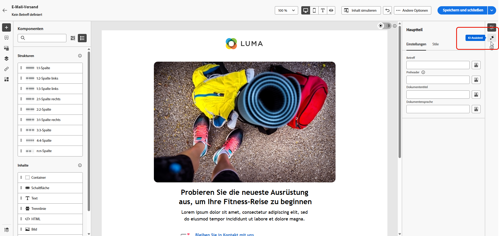{zoomable="yes"}

### Vollständigen Inhalt generieren {#generate-content}

Wenn Inhalt generieren geöffnet ist, können Sie jetzt die Generierungseinstellungen so konfigurieren, dass Inhalte erstellt werden, die Ihren Marken- und Kampagnenzielen entsprechen. Passen Sie Text- und Bildparameter an, fügen Sie Marken-Assets hinzu und geben Sie Prompts ein, um die KI beim Generieren relevanter Varianten für Ihre Zielgruppe zu unterstützen.

1. Wählen Sie Ihre **[!UICONTROL Marke]** aus, um sicherzustellen, dass die von KI generierten Inhalte mit Ihren Markenspezifikationen übereinstimmen. [Weitere Informationen](brands.md) zu Marken.

1. Passen Sie den Inhalt an, indem Sie im Feld **[!UICONTROL Prompt]** beschreiben, was Sie generieren möchten.

   Wenn Sie Hilfe bei der Erstellung Ihres Prompts benötigen, finden Sie in der **[!UICONTROL Prompt-Bibliothek]** eine Vielzahl von Ideen für Prompts, mit denen Sie Ihre Sendungen verbessern können. [Weitere Informationen zu Best Practices für Prompts](ai-assistant-prompting-guide.md)

   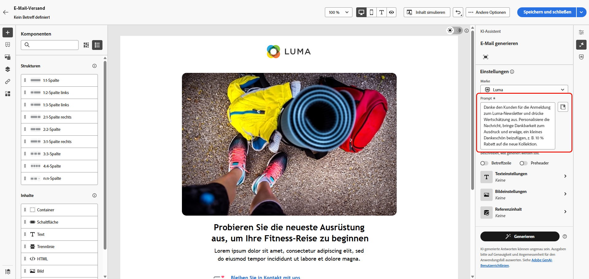{zoomable="yes"}

1. **Bei E-Mails** können Sie die Optionen **[!UICONTROL Betreffzeile]** und **[!UICONTROL Preheader]** umschalten, um sie in die Variantengenerierung einzubeziehen.

1. Passen Sie Ihren Prompt mit der Option **[!UICONTROL Texteinstellungen]** an:

   * **[!UICONTROL Kommunikationsstrategie]**: Wählen Sie den am besten geeigneten Kommunikationsstil für den generierten Text aus.
   * **[!UICONTROL Sprachen]**: Wählen Sie die Sprache Ihrer generierten Inhalte aus.
   * **[!UICONTROL Ton]**: Stellen Sie sicher, dass der Ton Ihrer E-Mail bei Ihrer Zielgruppe ankommt. Egal, ob Sie informativ, verspielt oder überzeugend klingen möchten, KI passt die Nachricht entsprechend an.

     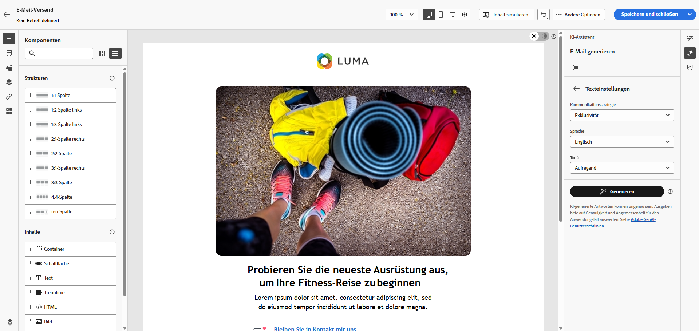{zoomable="yes"}

1. Wählen Sie Ihre **[!UICONTROL Bildeinstellungen]** aus:

   * **[!UICONTROL Inhaltstyp]**: Kategorisieren Sie die Art des visuellen Elements, wobei zwischen verschiedenen Arten der visuellen Darstellung wie Fotos, Grafiken oder Kunst unterschieden wird.
   * **[!UICONTROL Visuelle Intensität]**: Steuern Sie die Wirkung des Bildes durch Anpassen seiner Intensität. Durch eine niedrigere Einstellung (2) wird das Erscheinungsbild weicher, während eine höhere Einstellung (10) das Bild lebendiger macht.
   * **[!UICONTROL Farbe und Ton]**: Passen Sie die Gesamterscheinung der Farben und die vermittelte Stimmung oder Atmosphäre an.
   * **[!UICONTROL Beleuchtung]**: Ändern Sie die Beleuchtung in einem Bild, um dessen Atmosphäre zu prägen und bestimmte Elemente hervorzuheben.
   * **[!UICONTROL Komposition]**: Ordnen Sie Elemente innerhalb des Rahmens eines Bildes an.

1. Klicken Sie im Menü **[!UICONTROL Referenzinhalt]** auf **[!UICONTROL Datei hochladen]**, um jedes Marken-Asset hinzuzufügen, das Inhalte enthält, die zusätzliche Kontext-KI bereitstellen können, oder ein zuvor hochgeladenes Asset auszuwählen.

   Zuvor hochgeladene Dateien sind in der Dropdown-Liste **[!UICONTROL Hochgeladener Referenzinhalt]** verfügbar. Aktivieren Sie einfach die Assets, die in den Generierungsprozess einbezogen werden sollen.

   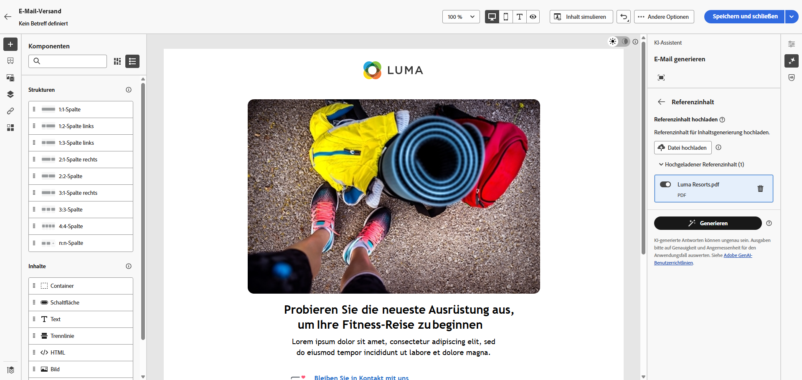{zoomable="yes"}

1. Wenn der Prompt fertig ist, klicken Sie auf **[!UICONTROL Generieren]**.

### Verfeinern und Fertigstellen {#refine-finalize}

Nachdem Sie Inhaltsvarianten generiert haben, können Sie die Ergebnisse anpassen, um sicherzustellen, dass sie genau Ihren Anforderungen entsprechen. Überprüfen Sie die Markenausrichtung, passen Sie den Ton und die Sprache an und bereiten Sie den Inhalt für die Aktivierung in Ihrem Versand vor.

1. Sehen Sie sich nach der Generierung die **[!UICONTROL Varianten]** an.

1. Klicken Sie auf das Prozentsymbol, um den **[!UICONTROL Markenausrichtungswert]** anzuzeigen und Abweichungen von Ihrer Marke zu ermitteln.

   Weitere Informationen finden Sie unter [Markenausrichtungswert](brands-score.md).

   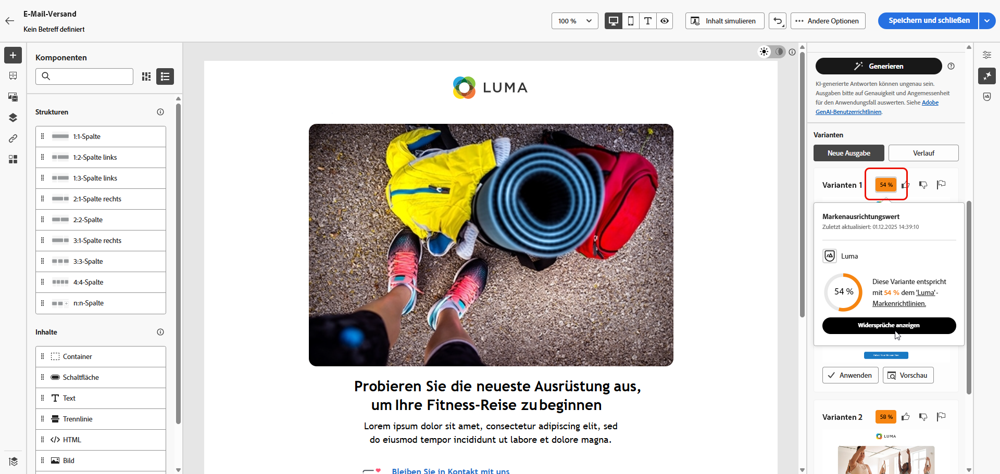{zoomable="yes"}

1. Klicken Sie auf **[!UICONTROL Vorschau]**, um eine Vollbildversion der ausgewählten Variante anzuzeigen, oder auf **[!UICONTROL Anwenden]**, um Ihren aktuellen Inhalt zu ersetzen.

1. Navigieren Sie im Fenster **[!UICONTROL Vorschau]** zur Option **[!UICONTROL Verfeinern]**, um auf zusätzliche Anpassungsfunktionen zuzugreifen:

   * **[!UICONTROL Neu formulieren]**: Schreiben Sie die Nachricht um und behalten Sie dabei ihre Bedeutung bei. Mit dieser Option können Sie alternative Formulierungen generieren, den Lesefluss verbessern oder die Ausdrucksweise anpassen, ohne die Kernbotschaft zu ändern.

   * **[!UICONTROL Einfachere Sprache verwenden]**: Verwenden Sie KI, um Ihre Sprache zu bearbeiten oder zu verfeinern und so für ein breiteres Publikum Klarheit und Barrierefreiheit zu gewährleisten.

   * **[!UICONTROL Übersetzen]**: Vereinfachen Sie Ihren Text, damit er für eine breitere Zielgruppe verständlich und zugänglich ist.

   * **[!UICONTROL Ton ändern]**: Passen Sie den Ton der Nachricht an Ihren Kommunikationsstil an, d. h. lassen Sie sie freundlicher, professioneller, dringender oder inspirierender klingen.

   * **[!UICONTROL Kommunikationsstrategie ändern]**: Ändern Sie den Messaging-Ansatz basierend auf Ihren Zielen, beispielsweise um Dringlichkeit zu erzeugen oder aufregende Anreize zu betonen.

     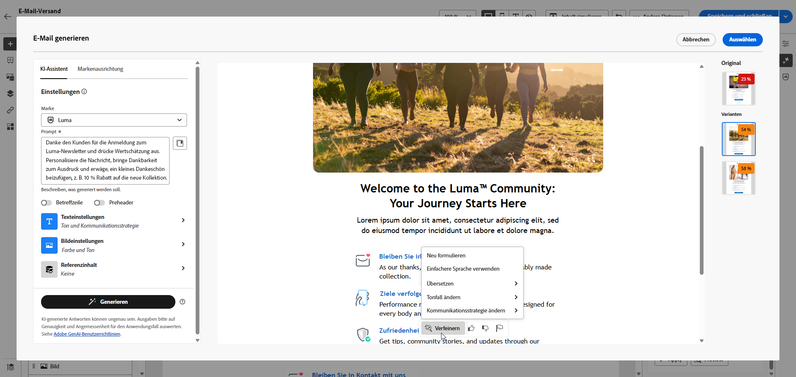{zoomable="yes"}

1. Öffnen Sie die Registerkarte **[!UICONTROL Markenausrichtung]**, um die Übereinstimmung Ihres Inhalts mit den [Markenrichtlinien](brands.md) zu prüfen.

1. Klicken Sie auf **[!UICONTROL Auswählen]**, sobald Sie den passenden Inhalt gefunden haben.

1. Fügen Sie Personalisierungsfelder ein, um Ihre Inhalte auf der Grundlage von Profildaten anzupassen. Klicken Sie danach auf die Schaltfläche **[!UICONTROL Inhalte simulieren]**, um das Rendern zu steuern, und überprüfen Sie die Personalisierungseinstellungen mit Testprofilen. [Weitere Informationen](../preview-test/preview-content.md)

1. Überprüfen und aktivieren Sie Ihren Inhalt:
   * **E-Mail**: Wenn Sie Inhalt, Zielgruppe und Zeitplan definiert haben, können Sie den E-Mail-Versand vorbereiten. [Weitere Informationen](../monitor/prepare-send.md)
   * **Landingpage**: Sobald Ihre Landingpage fertig ist, können Sie sie veröffentlichen, um sie für die Verwendung in einer Nachricht verfügbar zu machen. [Weitere Informationen](../landing-pages/create-lp.md)

## Für Mobile-Kanäle {#mobile-channels}

Generate Content unterstützt auch die Inhaltserstellung für mobile Push-Benachrichtigungen und ermöglicht Ihnen so die Erstellung ansprechender Titel, Nachrichten und Bilder für Ihre Mobile Apps. Dies hilft Ihnen, eine konsistente, hochwertige Kommunikation über alle Kunden-Touchpoints (einschließlich Mobile-Touchpoints) hinweg aufrechtzuerhalten.

### Zugreifen und Konfigurieren {#mobile-access-configure}

Um mithilfe von KI Inhalte für Push-Benachrichtigungen zu generieren, richten Sie zunächst Ihren Push-Versand ein und öffnen Sie den Inhaltseditor. Die folgenden Schritte führen Sie durch die Vorbereitung Ihres Versands und den Zugriff auf die Tools zum Generieren von Inhalten.

1. Nachdem Sie den Versand Ihrer Push-Benachrichtigung erstellt und konfiguriert haben, klicken Sie auf **[!UICONTROL Inhalt bearbeiten]**.

   Weitere Informationen zur Konfiguration Ihres Push-Versands finden Sie auf [dieser Seite](../push/create-push.md).

1. Personalisieren Sie Ihre Push-Benachrichtigung nach Bedarf. [Weitere Informationen](../push/content-push.md)

1. Rufen Sie das Menü **[!UICONTROL Inhalt generieren]** auf.

   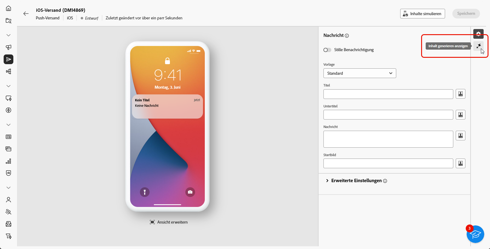{zoomable="yes"}

### Vollständigen Inhalt generieren {#mobile-generate-content}

Nachdem Sie auf Inhalt für Push-Benachrichtigungen generieren zugegriffen haben, können Sie die Generierungseinstellungen konfigurieren, um ansprechende Inhalte für Mobilgeräte zu erstellen. Definieren Sie Ihre Text- und Bildvoreinstellungen, wählen Sie Marken-Assets aus und verwenden Sie Prompts, um Varianten von Push-Benachrichtigungen zu generieren, die Ihre Mobile-Benutzenden ansprechen.

1. Wählen Sie Ihre **[!UICONTROL Marke]** aus, um sicherzustellen, dass die von KI generierten Inhalte mit Ihren Markenspezifikationen übereinstimmen. [Weitere Informationen](brands.md) zu Marken.

1. Passen Sie den Inhalt an, indem Sie im Feld **[!UICONTROL Prompt]** beschreiben, was Sie generieren möchten.

   Wenn Sie Hilfe bei der Erstellung Ihres Prompts benötigen, finden Sie in der **[!UICONTROL Prompt-Bibliothek]** eine Vielzahl von Ideen für Prompts, mit denen Sie Ihren Versand verbessern können. [Weitere Informationen zu Best Practices für Prompts](ai-assistant-prompting-guide.md)

   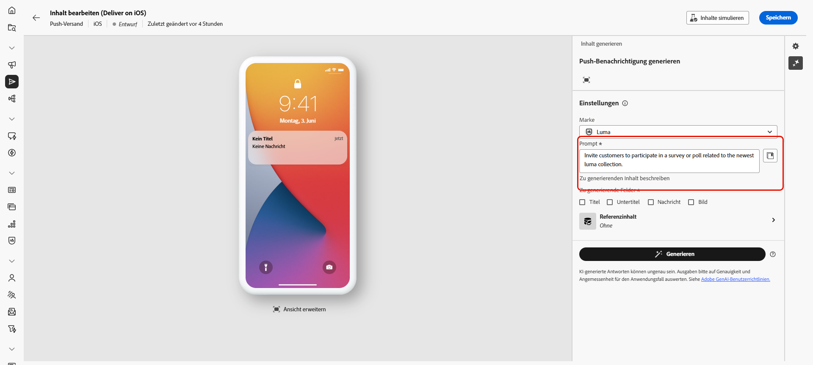{zoomable="yes"}

1. Wählen Sie das zu generierende Feld aus: **[!UICONTROL Titel]**, **[!UICONTROL Untertitel]**, **[!UICONTROL Nachricht]** und/oder **[!UICONTROL Bild]**.

1. Passen Sie Ihr Prompt mit der Option **[!UICONTROL Texteinstellungen]** an:

   * **[!UICONTROL Kommunikationsstrategie]**: Wählen Sie den am besten geeigneten Kommunikationsstil für den generierten Text aus.
   * **[!UICONTROL Sprachen]**: Wählen Sie die Sprache Ihrer generierten Inhalte aus.
   * **[!UICONTROL Ton]**: Der Ton Ihrer Push-Benachrichtigung sollte bei Ihrer Zielgruppe Anklang finden. Egal, ob Sie informativ, verspielt oder überzeugend klingen möchten, KI kann die Nachricht entsprechend anpassen.

     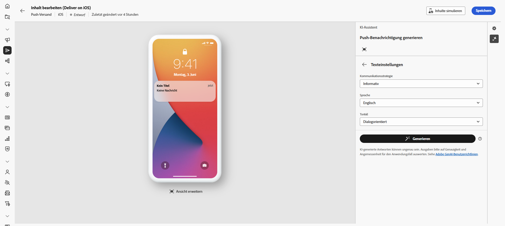{zoomable="yes"}

1. Wählen Sie Ihre **[!UICONTROL Bildeinstellungen]** aus:

   * **[!UICONTROL Inhaltstyp]**: Kategorisieren Sie die Art des visuellen Elements, wobei zwischen verschiedenen Arten der visuellen Darstellung wie Fotos, Grafiken oder Kunst unterschieden wird.
   * **[!UICONTROL Visuelle Intensität]**: Steuern Sie die Wirkung des Bildes durch Anpassen seiner Intensität. Durch eine niedrigere Einstellung (2) wird das Erscheinungsbild weicher, während eine höhere Einstellung (10) das Bild lebendiger und visuell eindringlicher macht.
   * **[!UICONTROL Beleuchtung]**: Passen Sie die Beleuchtung in einem Bild, die dessen Atmosphäre prägt und bestimmte Elemente hervorhebt.
   * **[!UICONTROL Komposition]**: Ordnen Sie Elemente innerhalb des Rahmens eines Bildes an.

     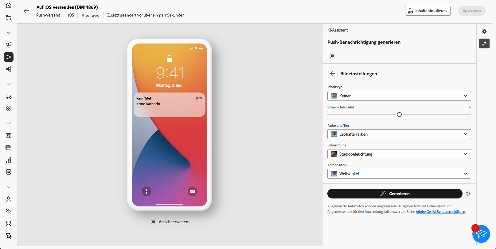{zoomable="yes"}

1. Klicken Sie im Menü **[!UICONTROL Referenzinhalt]** auf **[!UICONTROL Datei hochladen]**, um jedes Marken-Asset hinzuzufügen, das Inhalte enthält, die zusätzliche Kontext-KI bereitstellen können, oder ein zuvor hochgeladenes Asset auszuwählen.

   Zuvor hochgeladene Dateien sind in der Dropdown-Liste **[!UICONTROL Hochgeladener Referenzinhalt]** verfügbar. Aktivieren Sie einfach die Assets, die in den Generierungsprozess einbezogen werden sollen.

1. Wenn der Prompt fertig ist, klicken Sie auf **[!UICONTROL Generieren]**.

### Verfeinern und Fertigstellen {#mobile-refine-finalize}

Nachdem Sie Ihre generierten Varianten für Push-Benachrichtigungen überprüft haben, können Sie den Inhalt bis zur Perfektion anpassen. Verwenden Sie Tools zur Verfeinerung, um Sprache und Ton anzupassen, die Markenausrichtung zu überprüfen und den Inhalt zu personalisieren, bevor Sie Ihre Push-Kampagne aktivieren.

1. Sehen Sie sich die generierten **[!UICONTROL Varianten]** an.

1. Klicken Sie auf das Prozentsymbol, um den **[!UICONTROL Markenausrichtungswert]** anzuzeigen und Abweichungen von Ihrer Marke zu ermitteln.

   Weitere Informationen finden Sie unter [Markenausrichtungswert](brands-score.md).

   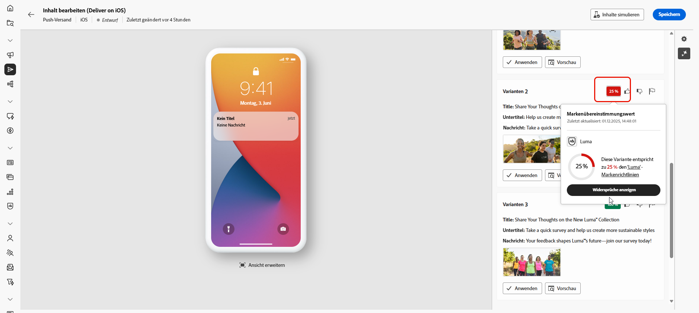{zoomable="yes"}

1. Klicken Sie auf **[!UICONTROL Vorschau]**, um eine Vollbildversion der ausgewählten Variante anzuzeigen, oder auf **[!UICONTROL Anwenden]**, um Ihren aktuellen Inhalt zu ersetzen.

1. Navigieren Sie im Fenster **[!UICONTROL Vorschau]** zur Option **[!UICONTROL Verfeinern]**, um auf zusätzliche Anpassungsfunktionen zuzugreifen:

   * **[!UICONTROL Als Referenzinhalt verwenden]**: Verwenden Sie die gewählte Variante als Referenzinhalt für die Generierung anderer Ergebnisse.
   * **[!UICONTROL Neu formulieren]**: Formulieren Sie Ihre Nachricht auf verschiedene Arten um, sodass Ihr Text frisch und für verschiedene Zielgruppen ansprechend bleibt.
   * **[!UICONTROL Einfachere Sprache verwenden]**: Vereinfachen Sie Ihren Text, damit er für eine breitere Zielgruppe verständlich und zugänglich ist.
   * **[!UICONTROL Übersetzen]**: Vereinfachen Sie Ihren Text, damit er für eine breitere Zielgruppe verständlich und zugänglich ist.

   Sie können auch den **[!UICONTROL Ton]** und die **[!UICONTROL Kommunikationsstrategie]** Ihres Textes ändern.

   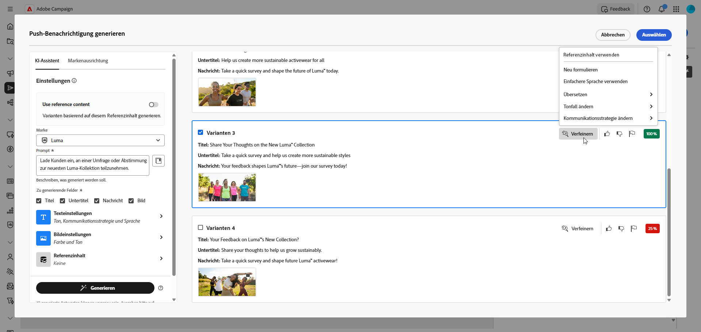{zoomable="yes"}

1. Öffnen Sie die Registerkarte **[!UICONTROL Markenausrichtung]**, um die Übereinstimmung Ihres Inhalts mit den [Markenrichtlinien](brands.md) zu prüfen.

1. Klicken Sie auf **[!UICONTROL Auswählen]**, sobald Sie den passenden Inhalt gefunden haben.

1. Fügen Sie Personalisierungsfelder ein, um Ihre E-Mail-Inhalte auf der Grundlage von Profildaten anzupassen. Klicken Sie danach auf die Schaltfläche **[!UICONTROL Inhalte simulieren]**, um das Rendern zu steuern, und überprüfen Sie die Personalisierungseinstellungen mit Testprofilen. [Weitere Informationen](../preview-test/preview-content.md)

Bereiten Sie den Push-Versand vor, wenn Sie Inhalt, Zielgruppe und Zeitplan definieren. [Weitere Informationen](../monitor/prepare-send.md)

## Anleitungsvideo {#video}

Erfahren Sie, wie Sie mit KI vollständige E-Mail-Inhalte, Texte und Bilder generieren können.

>[!VIDEO](https://video.tv.adobe.com/v/3428984)