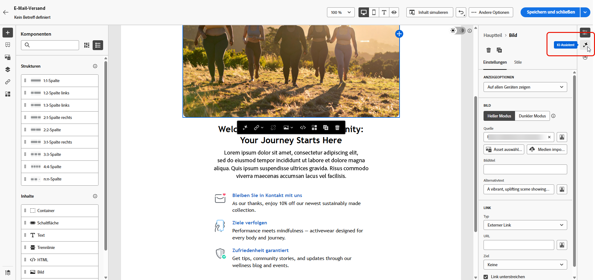
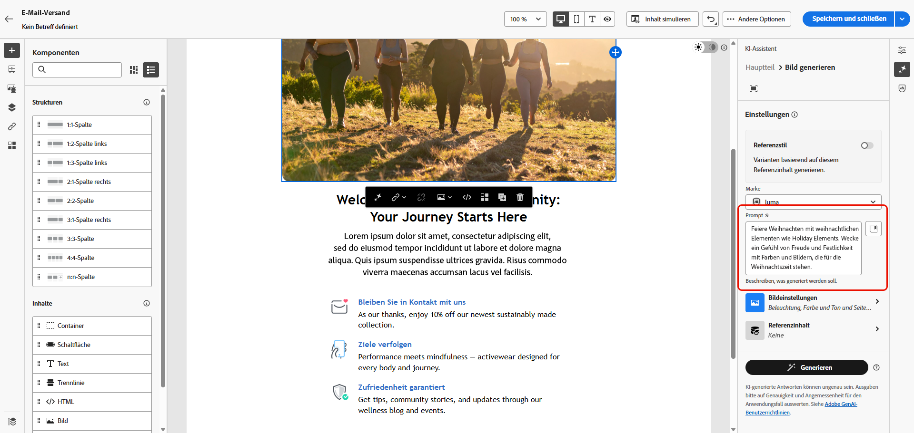
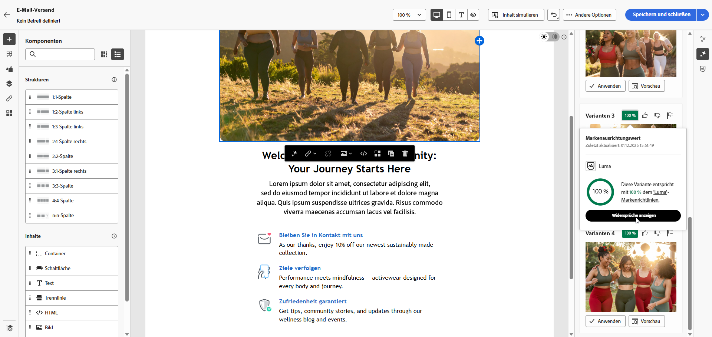

# Generieren von Bildern mit dem Inhaltsassistenten {#generative-image}

Nachdem Sie Ihre E-Mails erstellt und personalisiert haben, können Sie Ihren Inhalt mit dem Inhaltsassistenten erweitern, der auf generativen KI basiert. Diese Funktion vereinfacht den Prozess der Personalisierung und Inhaltsverbesserung.

Im folgenden Beispiel erfahren Sie, wie Sie den Inhaltsassistenten nutzen können, um Ihren Inhalt zu optimieren und zu verbessern und so ein benutzerfreundlicheres Erlebnis zu gewährleisten. Führen Sie folgende Schritte aus:

1. Nachdem Sie Ihren E-Mail-Versand erstellt und konfiguriert haben, klicken Sie auf **[!UICONTROL Inhalt bearbeiten]**.

   Weitere Informationen zur Konfiguration Ihres E-Mail-Versands finden Sie unter [diese Seite](../content/create-email-content.md).

1. Füllen Sie die **[!UICONTROL Grundlegende Details]** für Ihren Versand. Klicken Sie abschließend auf **[!UICONTROL Bearbeiten von E-Mail-Inhalten]**.

1. Wählen Sie mit dem Inhaltsassistenten das Asset aus, das Sie ändern möchten.

1. Wählen Sie aus dem Kontextmenü die Option **[!UICONTROL Erlebniserzeugung]**.

   

1. Fügen Sie eine Eingabeaufforderung hinzu, um Ihre Ergebnisse besser anzupassen.

   

1. Auswählen **[!UICONTROL Datei hochladen]** wenn Sie eine Marketing-Kurzbeschreibung hinzufügen möchten, um mehr Kontext für den Content-Assistenten zu schaffen.

   Sie können auch auf **[!UICONTROL Hochgeladene Inhalte]** um zuvor aktualisierte Dateien zu finden.

1. Wählen Sie die **[!UICONTROL Seitenverhältnis]** des Assets. Dadurch wird die Breite und Höhe des Assets bestimmt.

   Sie können aus gängigen Verhältnissen wie 16:9, 4:3, 3:2 oder 1:1 wählen oder eine benutzerdefinierte Größe eingeben.

1. Anpassen der **[!UICONTROL Farbe und Ton]**, **[!UICONTROL Inhaltstyp]**, **[!UICONTROL Beleuchtung]** und **[!UICONTROL Komposition]** -Einstellungen, um Ihre gewünschten Asset-Eigenschaften anzupassen.

   

1. Sobald Sie mit der Konfiguration der Eingabeaufforderung zufrieden sind, klicken Sie auf **[!UICONTROL Erzeugen]**.

1. Durchsuchen Sie die **[!UICONTROL Variantenvorschläge]** , um das gewünschte Asset zu finden. Klicks **[!UICONTROL Vorschau]** , um eine Vollbildversion der ausgewählten Variante anzuzeigen.

   

1. Klicks **[!UICONTROL Auswählen]** sobald Sie den entsprechenden Inhalt gefunden haben.

   

1. Klicken Sie nach der Definition des Nachrichteninhalts auf die Schaltfläche **[!UICONTROL Inhalt simulieren]** zur Steuerung des Renderings und zur Überprüfung der Personalisierungseinstellungen mit Testprofilen.  [Weitere Informationen](../preview-test/preview-content.md)

   

1. Wenn Sie Inhalt, Zielgruppe und Zeitplan definiert haben, können Sie Ihren E-Mail-Versand vorbereiten. [Weitere Informationen](../monitor/prepare-send.md)