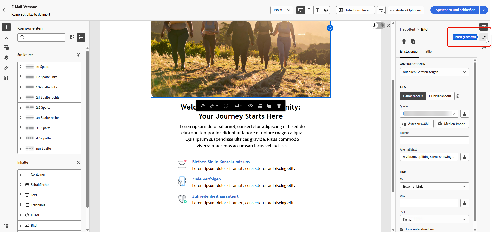
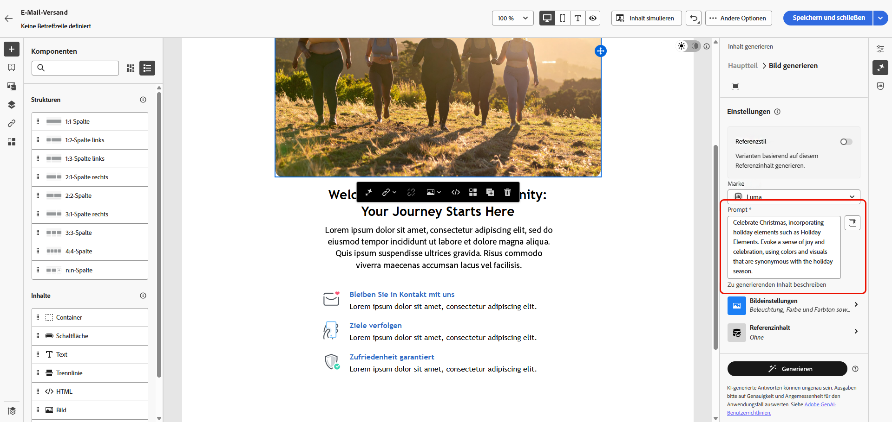
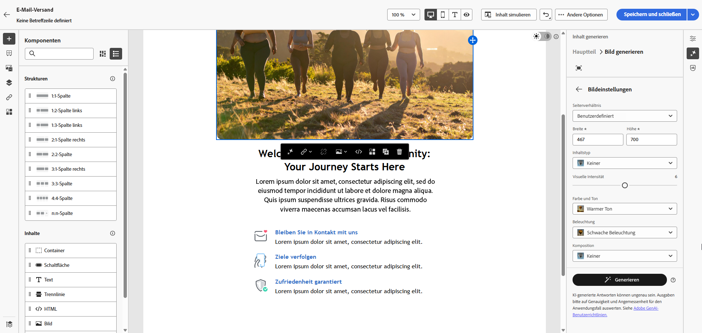
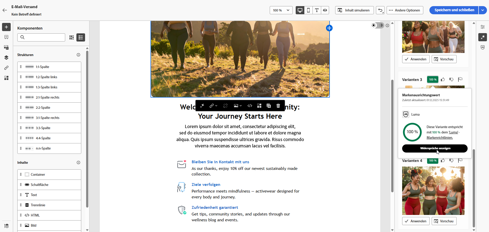
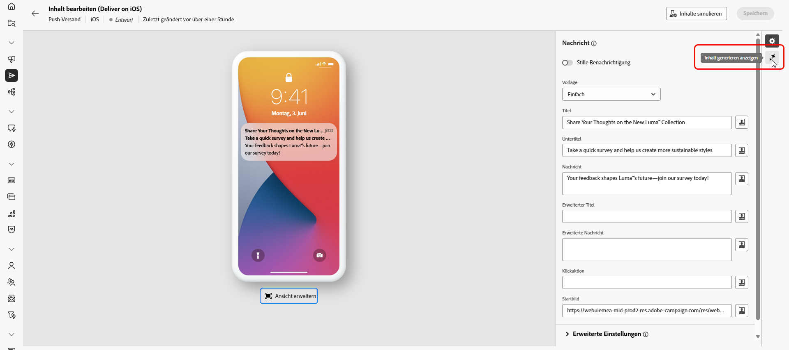
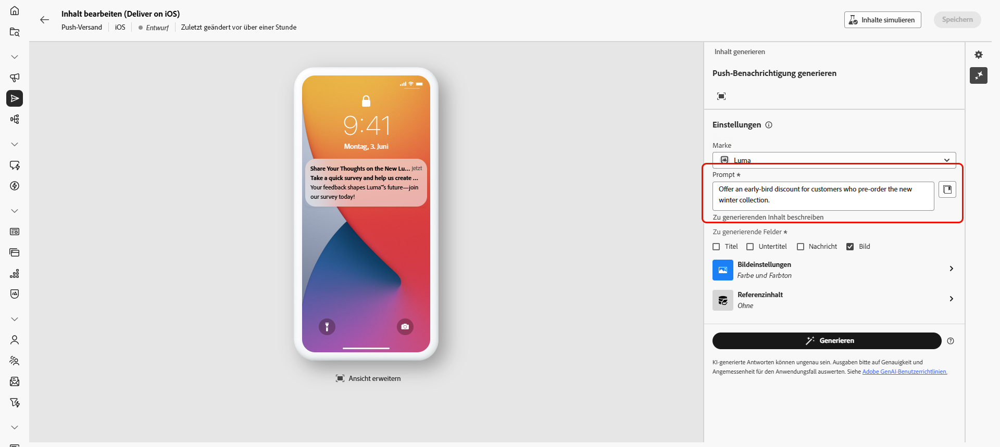
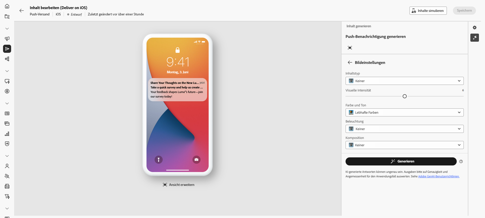
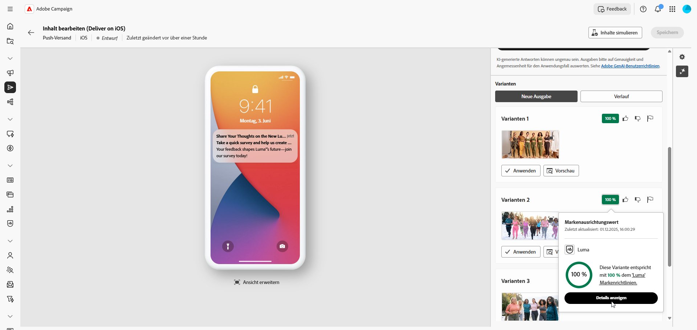

# Erstellen von Bildern {#generative-image}

>[!IMPORTANT]
>
>Bevor Sie mit der Verwendung dieser Funktion beginnen, lesen Sie die entsprechenden Informationen unter [Schutzmechanismen und Einschränkungen](generative-gs.md#generative-guardrails).
> 
>
>Sie müssen einer [Benutzervereinbarung“ zustimmen, &#x200B;](https://www.adobe.com/de/legal/licenses-terms/adobe-dx-gen-ai-user-guidelines.html){target="_blank"} KI zum Generieren von Inhalten in Adobe Campaign Web verwenden zu können. Weitere Informationen erhalten Sie beim Adobe-Support.

Verwenden Sie KI in Adobe Campaign Web, um ansprechende visuelle Inhalte zu erstellen, mit denen Ihre Nachrichten für E-Mails, Landingpages und Push-Benachrichtigungen optimiert werden. KI hilft Ihnen bei der Erstellung und Optimierung von Bildern und stellt sicher, dass Ihr Inhalt visuell ansprechend und auf Ihre Marke abgestimmt ist.

## Für E-Mail und Landingpages {#email-web-channels}

Verwenden Sie KI, um vollständige visuelle Erlebnisse für Ihre E-Mail-Sendungen und Landingpages zu generieren. Mit dieser Funktion können Sie markenkonforme, aufmerksamkeitserregende Bilder erstellen, die über digitale Touchpoints hinweg bei Ihrer Zielgruppe Anklang finden.

### Zugreifen und Konfigurieren {#access-configure}

Um mit der Generierung von Bildern mit KI zu beginnen, richten Sie zunächst Ihren Versand ein und öffnen Sie den Inhaltseditor. Gehen Sie wie folgt vor, um Ihren Arbeitsbereich vorzubereiten und auf das Bedienfeld „Inhalt generieren“ zuzugreifen.

1. Erstellen Sie einen Versand und konfigurieren Sie ihn:

   * **E-Mail**: Nachdem Sie Ihren E-Mail-Versand erstellt und konfiguriert haben, klicken Sie auf **[!UICONTROL Inhalt bearbeiten]**. [Weitere Informationen](../email/create-email-content.md)
   * **Landingpage**: Nachdem Sie Ihre Landingpage erstellt und konfiguriert haben, klicken Sie auf **[!UICONTROL Inhalt bearbeiten]**. [Weitere Informationen](../landing-pages/create-lp.md)

1. Wählen Sie das zu ändernde Asset aus und rufen Sie das Menü **[!UICONTROL Inhalt generieren]** auf.

   {zoomable="yes"}

### Bild erzeugen {#generate-content}

Erfahren Sie, wie Sie effektive Eingabeaufforderungen erstellen und Bildeinstellungen konfigurieren können, um mithilfe von KI visuell überzeugende Bilder zu generieren. Passen Sie Parameter wie Seitenverhältnis, visuelle Intensität und Beleuchtung an, um Bilder zu erstellen, die Ihren Marken- und Kampagnenzielen entsprechen.

1. Aktivieren Sie die Option **[!UICONTROL Referenzstil]**, um mithilfe von KI neue Inhalte basierend auf den ausgewählten Inhalten zu personalisieren.

1. Wählen Sie Ihre **[!UICONTROL Marke]** aus, um sicherzustellen, dass die von KI generierten Inhalte mit Ihren Markenspezifikationen übereinstimmen. [Weitere Informationen](brands.md) zu Marken.

1. Passen Sie den Inhalt an, indem Sie im Feld **[!UICONTROL Prompt]** beschreiben, was Sie generieren möchten.

   Wenn Sie Hilfe bei der Erstellung Ihres Prompts benötigen, finden Sie in der **[!UICONTROL Prompt-Bibliothek]** eine Vielzahl von Ideen für Prompts, mit denen Sie Ihre Sendungen verbessern können. [Weitere Informationen zu Best Practices für Prompts](ai-assistant-prompting-guide.md)

   {zoomable="yes"}

1. Passen Sie Ihren Prompt mit der Option **[!UICONTROL Texteinstellungen]** an:

   * **[!UICONTROL Generatives Modell]**: Wählen Sie das einsatzbereite **[!UICONTROL Adobe-Modell]**, das **[!UICONTROL Partnermodell]** für spezielle Funktionen oder **[!UICONTROL benutzerdefinierte Modelle]** aus, die auf Grundlage Ihrer Marken-Assets trainiert wurden. [Weitere Informationen](generative-models.md)
   * **[!UICONTROL Seitenverhältnis]**: Bestimmen Sie die Breite und Höhe des Assets. Wählen Sie aus gängigen Verhältnissen wie 16:9, 4:3, 3:2 oder 1:1 oder geben Sie eine benutzerdefinierte Größe ein.
   * **[!UICONTROL Inhaltstyp]**: Kategorisieren Sie die Art des visuellen Elements, wobei zwischen verschiedenen Arten der visuellen Darstellung wie Fotos, Grafiken oder Kunst unterschieden wird.
   * **[!UICONTROL Visuelle Intensität]**: Steuern Sie die Wirkung des Bildes durch Anpassen seiner Intensität. Durch eine niedrigere Einstellung (2) wird das Erscheinungsbild weicher, während eine höhere Einstellung (10) das Bild lebendiger macht.
   * **[!UICONTROL Farbe und Ton]**: Passen Sie die Gesamterscheinung der Farben und die vermittelte Stimmung oder Atmosphäre an.
   * **[!UICONTROL Beleuchtung]**: Ändern Sie die Beleuchtung in einem Bild, um dessen Atmosphäre zu prägen und bestimmte Elemente hervorzuheben.
   * **[!UICONTROL Komposition]**: Ordnen Sie Elemente innerhalb des Rahmens eines Bildes an.

     {zoomable="yes"}

1. Klicken Sie im Menü **[!UICONTROL Referenzinhalt]** auf **[!UICONTROL Datei hochladen]**, um jedes Marken-Asset hinzuzufügen, das Inhalte enthält, die zusätzliche Kontext-KI bereitstellen können, oder ein zuvor hochgeladenes Asset auszuwählen.

   Zuvor hochgeladene Dateien sind in der Dropdown-Liste **[!UICONTROL Hochgeladener Referenzinhalt]** verfügbar. Aktivieren Sie einfach die Assets, die in den Generierungsprozess einbezogen werden sollen.

1. Sobald Sie mit der Konfiguration des Prompts zufrieden sind, klicken Sie auf **[!UICONTROL Generieren]**.

### Verfeinern und Fertigstellen {#refine-finalize}

Nachdem Sie Bildvarianten generiert haben, können Sie die Ergebnisse sowie die Markenausrichtung überprüfen und die beste Option für Ihren Inhalt auswählen.

1. Sehen Sie sich die generierten **[!UICONTROL Varianten]** an.

1. Klicken Sie auf das Prozentsymbol, um den **[!UICONTROL Markenausrichtungswert]** anzuzeigen und Abweichungen von Ihrer Marke zu ermitteln.

   Weitere Informationen finden Sie unter [Markenausrichtungswert](../content/brands-score.md).

   {zoomable="yes"}

1. Klicken Sie auf **[!UICONTROL Vorschau]**, um eine Vollbildversion der ausgewählten Variante anzuzeigen, oder auf **[!UICONTROL Anwenden]**, um Ihren aktuellen Inhalt zu ersetzen.

1. Wählen Sie **[!UICONTROL Ähnliche generieren]** aus, wenn Sie dieser Variante ähnliche Bilder anzeigen möchten.

1. Öffnen Sie die Registerkarte **[!UICONTROL Markenausrichtung]**, um die Übereinstimmung Ihres Inhalts mit den [Markenrichtlinien](../content/brands.md) anzuzeigen.

1. Klicken Sie auf **[!UICONTROL Auswählen]**, sobald Sie den passenden Inhalt gefunden haben.

1. Klicken Sie nach der Definition des Nachrichteninhalts auf die Schaltfläche **[!UICONTROL Inhalte simulieren]**, um das Rendern zu steuern, und überprüfen Sie die Personalisierungseinstellungen mit Testprofilen. [Weitere Informationen](../preview-test/preview-content.md)

1. Überprüfen und aktivieren Sie Ihren Inhalt:
   * **E-Mail**: Wenn Sie Inhalt, Zielgruppe und Zeitplan definiert haben, können Sie den E-Mail-Versand vorbereiten. [Weitere Informationen](../monitor/prepare-send.md)
   * **Landingpage**: Sobald Ihre Landingpage fertig ist, können Sie sie veröffentlichen, um sie für die Verwendung in einer Nachricht verfügbar zu machen. [Weitere Informationen](../landing-pages/create-lp.md)

## Für Mobile-Kanäle {#mobile-channels}

Verwenden Sie KI, um ansprechende Bilder für Push-Benachrichtigungen zu generieren und so visuell überzeugende mobile Kommunikationen zu erstellen, die die Aufmerksamkeit Ihrer Zielgruppe auf sich ziehen und sie ansprechen.

### Zugreifen und Konfigurieren {#mobile-access-configure}

Um mit dem Generieren von Bildern für Push-Benachrichtigungen mit KI zu beginnen, richten Sie zunächst Ihren Versand ein und öffnen Sie „Inhalt generieren“.

1. Nachdem Sie Ihren Push-Benachrichtigungsversand erstellt und konfiguriert haben, klicken Sie auf **[!UICONTROL Inhalt bearbeiten]**. [Weitere Informationen](../push/create-push.md)

1. Rufen Sie das Menü **[!UICONTROL Inhalt generieren]** auf.

   {zoomable="yes"}

### Bild erzeugen {#mobile-generate-content}

Nach dem Zugriff auf „Inhalt generieren“ können Sie die Generierungseinstellungen anpassen, um Bilder zu erstellen, die Ihrer Marke entsprechen und Ihre Push-Benachrichtigungsziele unterstützen. Konfigurieren Sie die Prompt- und Bildparameter, um für Mobile-Displays optimierte Visualisierungen zu generieren.

1. Wählen Sie Ihre **[!UICONTROL Marke]** aus, um sicherzustellen, dass die von KI generierten Inhalte mit Ihren Markenspezifikationen übereinstimmen. [Weitere Informationen](brands.md) zu Marken.

1. Passen Sie den Inhalt an, indem Sie im Feld **[!UICONTROL Prompt]** beschreiben, was Sie generieren möchten.

   Wenn Sie Hilfe bei der Erstellung Ihres Prompts benötigen, finden Sie in der **[!UICONTROL Prompt-Bibliothek]** eine Vielzahl von Ideen für Prompts, mit denen Sie Ihre Kampagnen verbessern können. [Weitere Informationen zu Best Practices für Prompts](ai-assistant-prompting-guide.md)

   {zoomable="yes"}

1. Wählen Sie **[!UICONTROL Bild]** aus, um nur Assets zu generieren.

1. Wählen Sie Ihre **[!UICONTROL Bildeinstellungen]** aus:

   * **[!UICONTROL Generatives Modell]**: Wählen Sie das einsatzbereite **[!UICONTROL Adobe-Modell]**, das **[!UICONTROL Partnermodell]** für spezielle Funktionen oder für Ihre Marken-Assets trainierte **[!UICONTROL benutzerdefinierte Modelle]** aus. [Weitere Informationen](generative-models.md)
   * **[!UICONTROL Inhaltstyp]**: Kategorisieren Sie die Art des visuellen Elements, wobei zwischen verschiedenen Arten der visuellen Darstellung wie Fotos, Grafiken oder Kunst unterschieden wird.
   * **[!UICONTROL Visuelle Intensität]**: Steuern Sie die Wirkung des Bildes durch Anpassen seiner Intensität. Durch eine niedrigere Einstellung (2) wird das Erscheinungsbild weicher, während eine höhere Einstellung (10) das Bild lebendiger und visuell eindringlicher macht.
   * **[!UICONTROL Beleuchtung]**: Passen Sie die Beleuchtung in einem Bild, die dessen Atmosphäre prägt und bestimmte Elemente hervorhebt.
   * **[!UICONTROL Komposition]**: Ordnen Sie Elemente innerhalb des Rahmens eines Bildes an.

     {zoomable="yes"}

1. Klicken Sie im Menü **[!UICONTROL Referenzinhalt]** auf **[!UICONTROL Datei hochladen]**, um jedes Marken-Asset hinzuzufügen, das Inhalte enthält, die zusätzliche Kontext-KI bereitstellen können, oder ein zuvor hochgeladenes Asset auszuwählen.

   Zuvor hochgeladene Dateien sind in der Dropdown-Liste **[!UICONTROL Hochgeladener Referenzinhalt]** verfügbar. Aktivieren Sie einfach die Assets, die in den Generierungsprozess einbezogen werden sollen.

1. Wenn der Prompt fertig ist, klicken Sie auf **[!UICONTROL Generieren]**.

### Verfeinern und Fertigstellen {#mobile-refine-finalize}

Nachdem Sie Bildvarianten für Ihre Mobile-Nachrichten generiert haben, können Sie die Ergebnisse verfeinern, um sicherzustellen, dass sie Ihren genauen Anforderungen entsprechen.

1. Sehen Sie sich nach der Generierung die **[!UICONTROL Varianten]** an.

1. Klicken Sie auf das Prozentsymbol, um den **[!UICONTROL Markenausrichtungswert]** anzuzeigen und Abweichungen von Ihrer Marke zu ermitteln.

   Weitere Informationen finden Sie unter [Markenausrichtungswert](../content/brands-score.md).

   {zoomable="yes"}

1. Klicken Sie auf **[!UICONTROL Vorschau]**, um die **[!UICONTROL Varianten]** anzuzeigen.

1. Öffnen Sie die Registerkarte **[!UICONTROL Markenausrichtung]**, um die Übereinstimmung Ihres Inhalts mit den [Markenrichtlinien](brands.md) zu prüfen.

1. Klicken Sie auf **[!UICONTROL Auswählen]**, sobald Sie den passenden Inhalt gefunden haben.

Nachdem Sie Ihren Inhalt, die Zielgruppe und den Zeitplan definiert haben, bereiten Sie den Push-Versand vor. [Weitere Informationen](../monitor/prepare-send.md)
