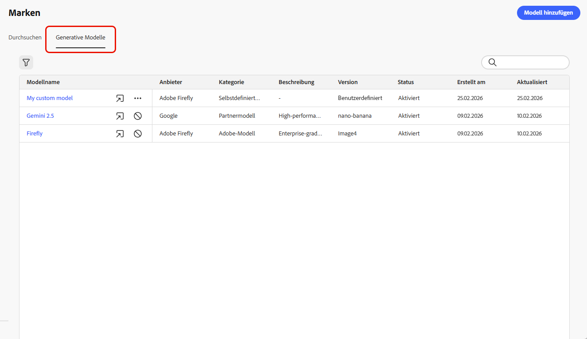
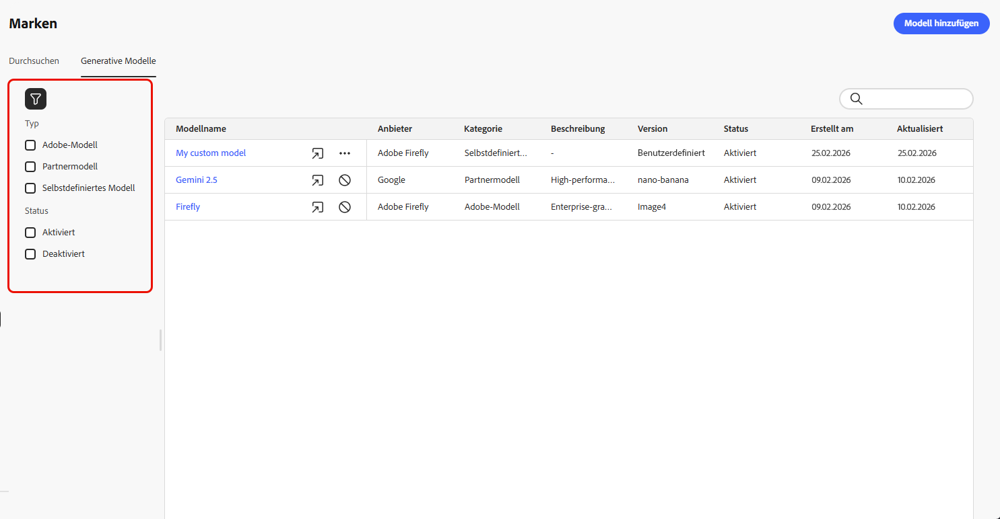
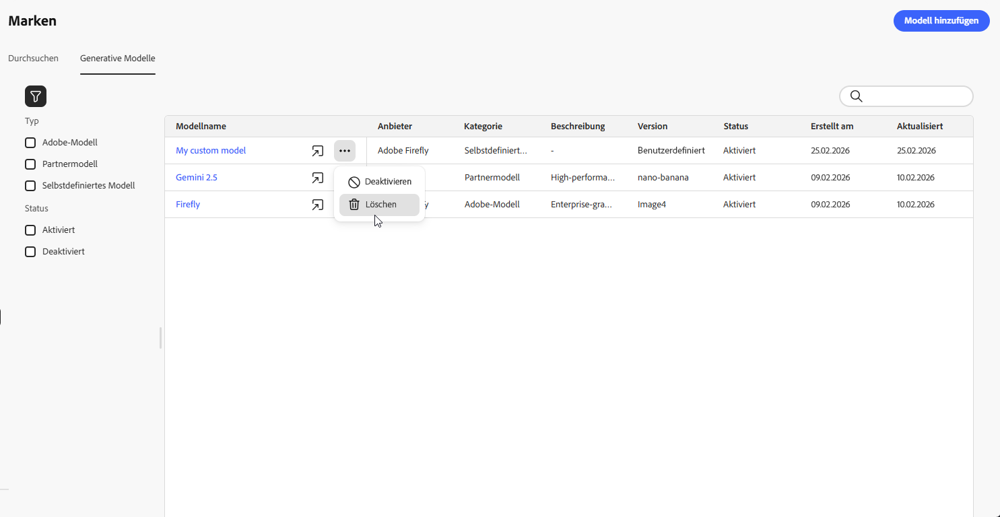
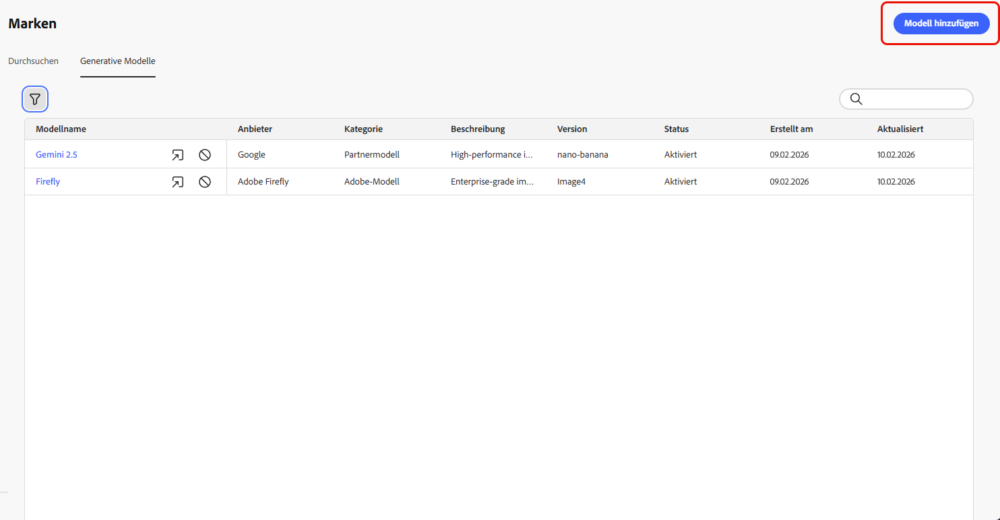
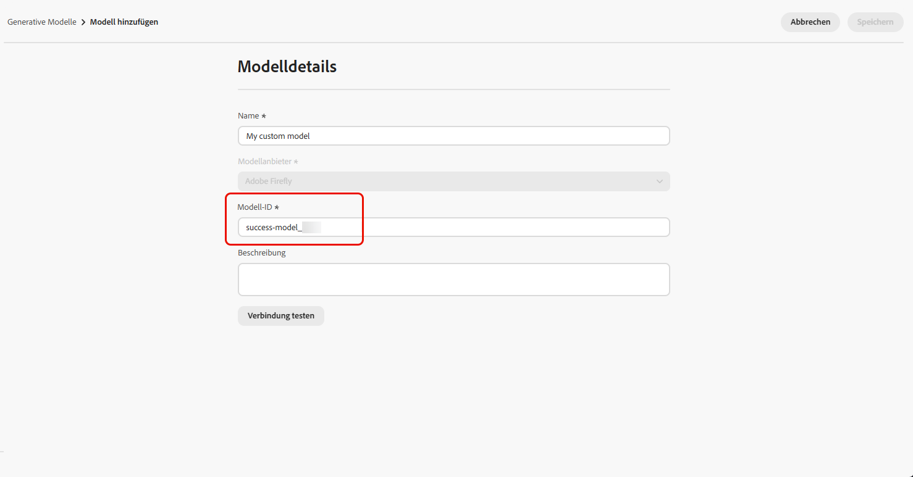
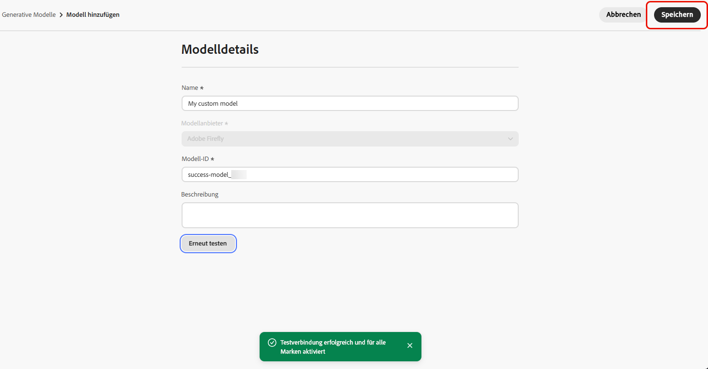
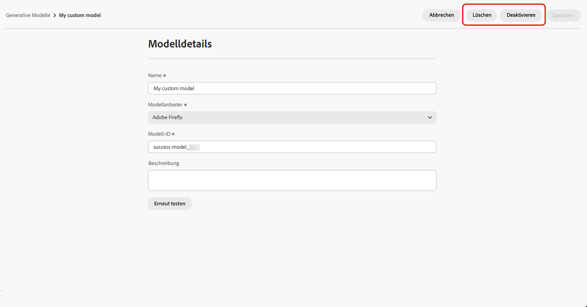
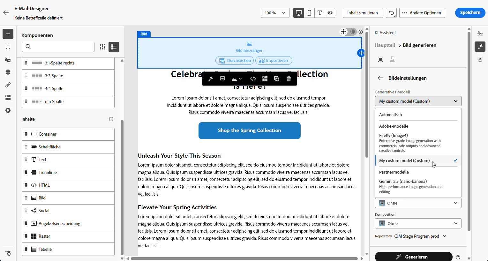

# Erstellen und Verwalten generativer Modelle {#generative-models}

>[!CONTEXTUALHELP]
>id="acw_homepage_welcome_rn3"
>title="Integration von Bilderzeugungsmodellen"
>abstract="Aktivieren Sie die nahtlose Integration von standardmäßigen und benutzerdefinierten Firefly-Modellen zusammen mit genehmigten Bildmodellen von Drittanbietern, um die Flexibilität, Kontrolle und Markenausrichtung beim Erzeugen von Bildern zu verbessern."
>additional-url="https://experienceleague.adobe.com/docs/campaign-web/v8/release-notes/release-notes.html?lang=de" text="Siehe Versionshinweise"

Erweitern Sie Ihre KI-Bilderstellungsfunktionen mit integrierten Modellen, benutzerdefinierten Firefly-Modellen und Drittanbietern für Bildgenerierung, um Ihre spezifischen Anforderungen zu erfüllen und die Markenausrichtung zu verbessern.

Wählen Sie das richtige Modell für Ihre Anforderungen:

- Das **[!UICONTROL Adobe-Modell]** auf Basis von Firefly Image Model 4 ist vorkonfiguriert und kann ohne zusätzliche Einrichtung sofort für die Bildgenerierung verwendet werden.
- Das **[!UICONTROL Partnermodell]** auf Basis von Gemini 2.5 Flash bietet spezielle Funktionen für bestimmte Anwendungsfälle.
- **[!UICONTROL Benutzerdefinierte Modelle]** sind markenspezifische Modelle, die mit Ihren eigenen Assets trainiert und von Ihrem Unternehmen hinzugefügt werden.

  Weitere Informationen zu **[!UICONTROL benutzerdefinierten Modellen]** finden Sie in der Dokumentation zu [Adobe Firefly](https://helpx.adobe.com/de/firefly/web/work-with-enterprise-features/train-custom-models/custom-models-overview.html)

Nach der Konfiguration können Sie jedes Ihrer generativen Modelle auswählen, wenn Sie Bilder in Ihrem Inhalt erstellen. [Weitere Informationen zum Generieren von Bildern](generative-image.md).

## Verwalten generativer Modelle

Verwalten Sie Ihre generativen Modelle von einem zentralen Ort aus. Sehen Sie sich alle verfügbaren Modelle an, filtern und suchen Sie nach bestimmten Modellen und konfigurieren Sie deren Einstellungen für Ihre Marken.

1. Wählen Sie im Menü **[!UICONTROL Marken]** die Registerkarte **[!UICONTROL Generative Modelle]** aus.

   {zoomable="yes"}

1. Klicken Sie auf das Symbol , um auf das Filtermenü zuzugreifen. Filtern Sie Modelle nach **[!UICONTROL Typ]** oder **[!UICONTROL Status]**.

   {zoomable="yes"}

1. Verwenden Sie die Suchleiste, um ein bestimmtes generatives Modell anhand des Namens zu finden.

1. Klicken Sie auf das Symbol , um auf das erweiterte Menü zuzugreifen. Dort können Sie Ihr Modell aktivieren oder deaktivieren oder löschen.

   Beachten Sie, dass nur **[!UICONTROL benutzerdefinierte Modelle]** gelöscht werden können.

   {zoomable="yes"}

1. Klicken Sie auf **[!UICONTROL Modell hinzufügen]**, um ein neues generatives Modell von Grund auf zu erstellen.

Sie können jetzt jedes Ihrer generativen Modelle auswählen, wenn Sie Bilder in Ihrem Inhalt erstellen. [Weitere Informationen zum Generieren von Bildern](generative-image.md).

## Hinzufügen eines generativen Modells

>[!IMPORTANT]
>
>Das Erstellen benutzerdefinierter Firefly-Modelle erfordert einen Firefly ETLA-Vertrag.

Benutzerdefinierte Firefly-Modelle sind markenspezifische KI-Modelle, die mit Ihren eigenen Assets trainiert wurden, sodass Sie markenkonforme Bilder generieren können, die genau auf Ihre Markenidentität, Ihren Stil und Ihre visuellen Richtlinien abgestimmt ist.

Durch die Erstellung benutzerdefinierter Firefly-Modellanbieter können Sie Ihre KI-Funktionen über die Standardmodelle hinaus erweitern und sicherstellen, dass der generierte Inhalt konsistent die individuelle Ästhetik und die Anforderungen Ihrer Marke widerspiegelt.

➡️ [Erfahren Sie, wie Sie Ihr benutzerdefiniertes Modell trainieren](https://helpx.adobe.com/de/firefly/web/work-with-enterprise-features/train-custom-models/train-firefly-custom-models.html)

1. Rufen Sie im Menü **[!UICONTROL Marken]** die Registerkarte **[!UICONTROL Generative Modelle]** auf und klicken Sie auf **[!UICONTROL Modell hinzufügen]**.

   {zoomable="yes"}

1. Geben Sie einen **[!UICONTROL Namen]** für Ihr Modell ein.

1. Geben Sie Ihre **[!UICONTROL Modell-ID]** ein.

   Ihre Firefly-Modell-ID finden Sie, indem Sie die Firefly-Website aufrufen und zu Ihren trainierten Modellen navigieren. Die eindeutige Kennung ist nach der Veröffentlichung im Verwaltungsabschnitt des Modells verfügbar. Weitere Informationen finden Sie in der [Dokumentation zu benutzerdefinierten Firefly-Modellen](https://helpx.adobe.com/de/firefly/web/work-with-enterprise-features/train-custom-models/manage-custom-models.html).

   {zoomable="yes"}

1. Geben Sie optional eine **[!UICONTROL Beschreibung]** ein, um das Modell zu identifizieren.

1. Klicken Sie auf **[!UICONTROL Verbindung testen]**, um die Modellkonfiguration zu prüfen.

1. Klicken Sie nach erfolgreichem Verbindungstest auf **[!UICONTROL Speichern]**, um Ihre Modellkonfiguration zu speichern.

   {zoomable="yes"}

1. Nach dem Speichern wird das benutzerdefinierte Modell zur Modellliste hinzugefügt. Sie können es jederzeit deaktivieren oder löschen.

   {zoomable="yes"}

<!--
1. Once the connection test is successful, choose whether to enable the model for selected brands.

1. Enable or disable the option to connect the model to all brands.

    If disabled, select which brands this model should be applied to.
-->

Nach der Konfiguration können Sie jedes Ihrer benutzerdefinierten generativen Modelle auswählen, wenn Sie Bilder in Ihrem Inhalt erstellen. [Weitere Informationen zum Generieren von Bildern](generative-image.md).

{zoomable="yes"}
