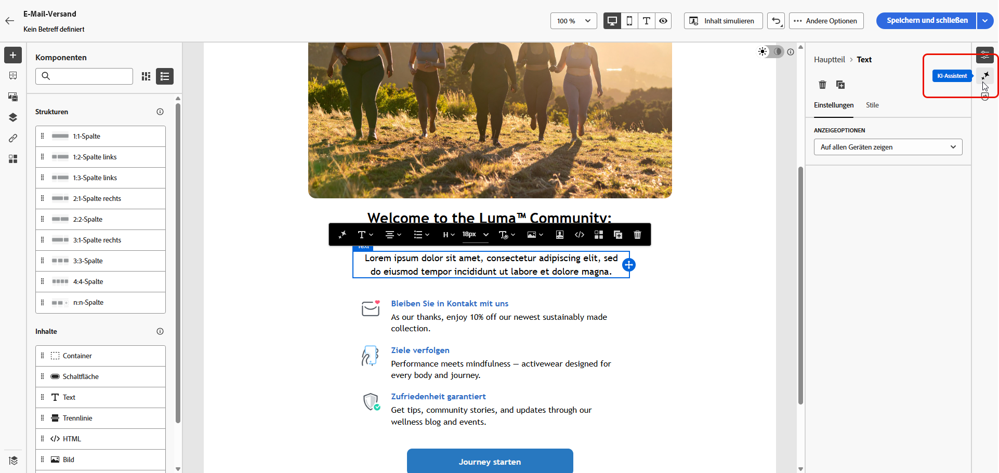
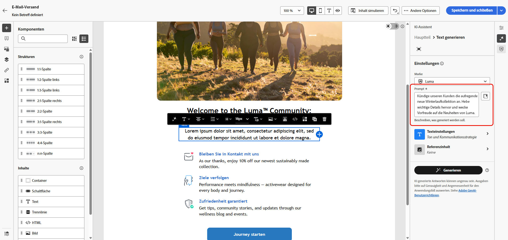
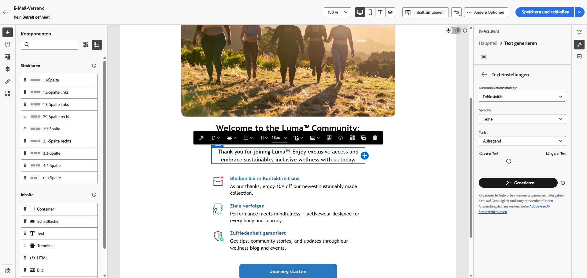
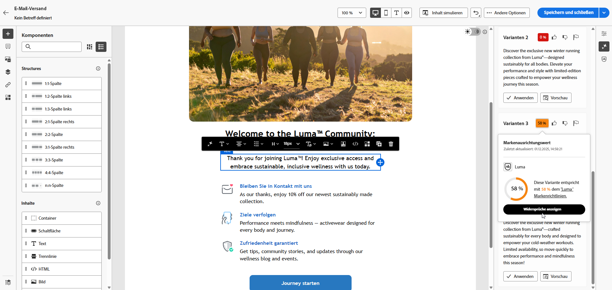
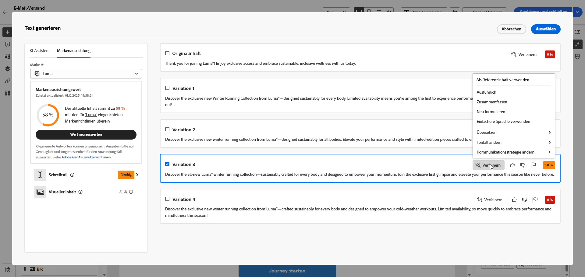
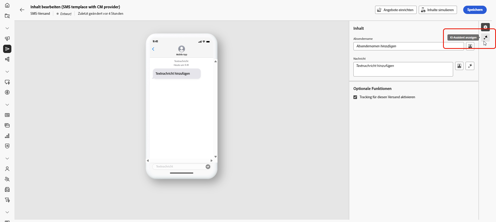
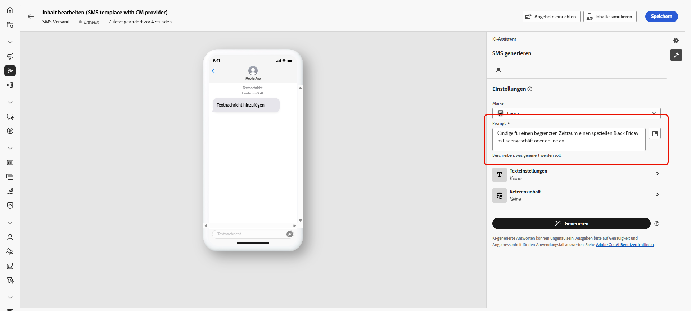
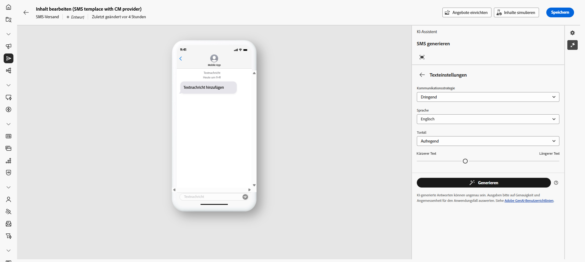
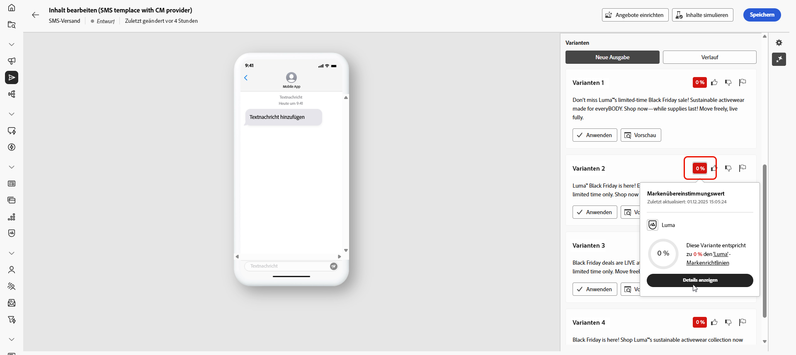
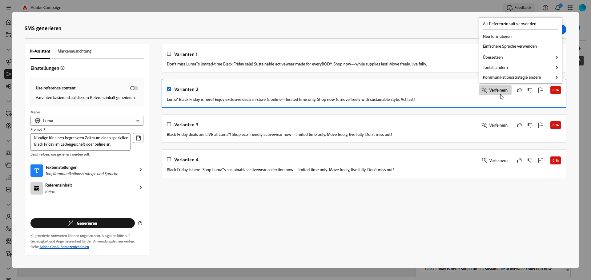

# Generieren von Text mit dem KI-Assistenten {#generative-text}

>[!IMPORTANT]
>
>Bevor Sie mit der Verwendung dieser Funktion beginnen, lesen Sie die entsprechenden Informationen unter [Schutzmechanismen und Einschränkungen](generative-gs.md#generative-guardrails).
> 
>
>Sie müssen einer [Benutzervereinbarung](https://www.adobe.com/de/legal/licenses-terms/adobe-dx-gen-ai-user-guidelines.html){target="_blank"} zustimmen, bevor Sie den KI-Assistenten in Adobe Campaign Web verwenden können. Weitere Informationen erhalten Sie beim Adobe-Support.

Verwenden Sie den KI-Assistenten in Adobe Campaign Web, um ansprechenden Text zu generieren, der bei Ihrer Zielgruppe Anklang findet. Unabhängig davon, ob Sie E-Mail-Kopien verbessern, überzeugende Landingpage-Inhalte erstellen, Push-Benachrichtigungen schreiben oder SMS-Text verfassen, hilft Ihnen der KI-Assistent, eine klare, wirkungsvolle Kommunikation zu liefern.

## Für E-Mail und Landingpages {#email-web-channels}

Der KI-Assistent kann hochwertige Textinhalte für Ihre E-Mail-Sendungen und Landingpages generieren. Mit dieser Funktion können Sie überzeugende Markenbotschaften erstellen, die über digitale Touchpoints hinweg mit Ihrer Audience verbunden werden.

### Zugreifen auf und Konfigurieren {#access-configure}

Bevor Sie mit der Erstellung von Textinhalten mit dem KI-Assistenten beginnen können, müssen Sie Ihren Versand einrichten und auf den Inhaltseditor zugreifen. Führen Sie diese Schritte aus, um Ihren Arbeitsbereich vorzubereiten und das Bedienfeld KI-Assistent zu öffnen.

1. Versand erstellen und konfigurieren:

   * **E-**: Nachdem Sie den E-Mail-Versand erstellt und konfiguriert haben, klicken Sie auf **[!UICONTROL Inhalt bearbeiten]**. [Weitere Informationen](../email/create-email-content.md)
   * **Landingpage**: Klicken Sie nach der Erstellung und Konfiguration Ihrer Landingpage auf **[!UICONTROL Inhalt bearbeiten]**. [Weitere Informationen](../landing-pages/create-lp.md)

1. Wählen Sie eine **[!UICONTROL Textkomponente]** aus, um bestimmte Inhalte zu erfassen, und rufen Sie das Menü **[!UICONTROL KI-Assistent]** auf.

   {zoomable="yes"}

### Inhalt erzeugen {#generate-content}

Erfahren Sie, wie Sie mit dem KI-Assistenten klare Eingabeaufforderungen erstellen, Einstellungen optimieren und maßgeschneiderten Text generieren können, um sicherzustellen, dass Ihre Botschaft mit Ihren Marken- und Kommunikationszielen übereinstimmt.

1. Wählen Sie Ihre **[!UICONTROL Marke]** aus, um sicherzustellen, dass die von KI generierten Inhalte mit Ihren Markenspezifikationen übereinstimmen. [Weitere Informationen](brands.md) zu Marken.

1. Passen Sie den Inhalt an, indem Sie im Feld **[!UICONTROL Prompt]** beschreiben, was Sie generieren möchten.

   Wenn Sie Hilfe bei der Erstellung Ihrer Eingabeaufforderung benötigen, rufen Sie die **[!UICONTROL Eingabeaufforderungsbibliothek]** auf, die eine Vielzahl von Ideen für die Eingabeaufforderung bereitstellt, um Ihre Sendungen zu verbessern. [Erfahren Sie mehr über Best Practices zur Eingabeaufforderung](ai-assistant-prompting-guide.md)

   {zoomable="yes"}

1. Passen Sie Ihren Prompt mit der Option **[!UICONTROL Texteinstellungen]** an:

   * **[!UICONTROL Kommunikationsstrategie]**: Wählen Sie den am besten geeigneten Kommunikationsstil für den generierten Text aus.
   * **[!UICONTROL Languages]**: Wählen Sie die Sprache Ihrer erzeugten Inhalte.
   * **[!UICONTROL Ton]**: Stellen Sie sicher, dass der Ton Ihrer E-Mail bei Ihrer Zielgruppe ankommt. Je nachdem, ob Sie informativ, humorvoll oder überzeugend klingen möchten, passt der KI-Assistent die Nachricht entsprechend an.
   * **Textlänge**: Wählen Sie mit dem Regler die gewünschte Textlänge aus.

     {zoomable="yes"}

1. Klicken Sie im Menü **[!UICONTROL Referenzinhalt]** auf **[!UICONTROL Datei hochladen]**, um jedes Marken-Asset hinzuzufügen, das Inhalte enthält, die zusätzlichen Kontext-KI-Assistenten bereitstellen können oder ein zuvor hochgeladenes Asset auswählen.

   Zuvor hochgeladene Dateien sind in der Dropdown **[!UICONTROL Liste „Hochgeladener]**&quot; verfügbar. Aktivieren Sie einfach die Assets, die in den Generierungsprozess einbezogen werden sollen.

1. Wenn der Prompt fertig ist, klicken Sie auf **[!UICONTROL Generieren]**.

### Verfeinern und abschließen {#refine-finalize}

Erfahren Sie, wie Sie den generierten Text überprüfen, Verfeinerungen vornehmen und Personalisierungen anwenden können, um Ihre Inhalte zu vervollständigen und ansprechende Nachrichten zu erstellen, die versandbereit sind.

1. Durchsuchen Sie die generierte **[!UICONTROL Varianten]**.

1. Klicken Sie auf das Prozentsymbol, um den **[!UICONTROL Markenausrichtungswert]** anzuzeigen und Abweichungen von Ihrer Marke zu ermitteln.

   Weitere Informationen finden Sie unter [Markenausrichtungswert](brands-score.md).

   {zoomable="yes"}

1. Klicken Sie auf **[!UICONTROL Vorschau]**, um eine Vollbildversion der ausgewählten Variante anzuzeigen, oder auf **[!UICONTROL Anwenden]**, um Ihren aktuellen Inhalt zu ersetzen.

1. Navigieren Sie im Fenster **[!UICONTROL Vorschau]** zur Option **[!UICONTROL Verfeinern]**, um auf zusätzliche Anpassungsfunktionen zuzugreifen:

   * **[!UICONTROL Als Referenzinhalt verwenden]**: Die gewählte Variante dient hierbei als Referenzinhalt für die Generierung anderer Ergebnisse.
   * **[!UICONTROL Ausführlich]**: Gehen Sie genauer auf bestimmte Themen ein und liefern Sie zusätzliche Details, um das Verständnis und die Interaktion zu verbessern.
   * **[!UICONTROL Zusammenfassen]**: Fassen Sie die wichtigsten Punkte in klaren, prägnanten Aussagen zusammen, die die Aufmerksamkeit der Leserinnen und Leser wecken und sie zum Weiterlesen animieren.
   * **[!UICONTROL Neu formulieren]**: Formulieren Sie Ihre Nachricht auf verschiedene Arten um, sodass Ihr Text frisch und für verschiedene Zielgruppen ansprechend bleibt.
   * **[!UICONTROL Einfachere Sprache verwenden]**: Vereinfachen Sie Ihren Text, damit er für eine breitere Zielgruppe verständlich und zugänglich ist.
   * **[!UICONTROL Übersetzen]**: Vereinfachen Sie Ihre Sprache, um einer breiteren Zielgruppe Klarheit und Zugänglichkeit zu verschaffen.

   Sie können auch den **[!UICONTROL Ton]** und die **[!UICONTROL Kommunikationsstrategie]** Ihres Textes ändern.

   {zoomable="yes"}

1. Öffnen Sie die Registerkarte **[!UICONTROL Markenausrichtung]**, um die Übereinstimmung Ihres Inhalts mit den [Markenrichtlinien](../content/brands.md) anzuzeigen.

1. Klicken Sie auf **[!UICONTROL Auswählen]**, sobald Sie den passenden Inhalt gefunden haben.

1. Fügen Sie Personalisierungsfelder ein, um Ihren Inhalt auf der Grundlage von Profildaten anzupassen. Klicken Sie danach auf die Schaltfläche **[!UICONTROL Inhalte simulieren]**, um das Rendern zu steuern, und überprüfen Sie die Personalisierungseinstellungen mit Testprofilen. [Weitere Informationen](../preview-test/preview-content.md)

1. Überprüfen und Aktivieren Ihres Inhalts:
   * **E-**: Wenn Sie Inhalt, Zielgruppe und Zeitplan definiert haben, können Sie den E-Mail-Versand vorbereiten. [Weitere Informationen](../monitor/prepare-send.md)
   * **Landingpage**: Sobald Ihre Landingpage fertig ist, können Sie sie veröffentlichen, um sie für die Verwendung in einer Nachricht verfügbar zu machen. [Weitere Informationen](../landing-pages/create-lp.md)

## Für mobile Kanäle {#mobile-channels}

Der KI-Assistent kann ansprechende Textinhalte für Ihre Push-Benachrichtigungen und SMS-Nachrichten generieren und Ihnen dabei helfen, ansprechende mobile Kommunikationen zu erstellen, die über alle mobilen Touchpoints hinweg mit Ihrer Audience verbunden sind.

### Zugreifen auf und Konfigurieren {#mobile-access-configure}

Bevor Sie mit der Generierung von Text mit dem KI-Assistenten für mobile Kanäle beginnen, müssen Sie Ihren Versand einrichten und auf den KI-Assistenten zugreifen.

1. Mobile-Versand erstellen und konfigurieren:
   * **Push-Benachrichtigungen**: Nachdem Sie Ihren Push-Benachrichtigungs-Versand erstellt und konfiguriert haben, klicken Sie auf **[!UICONTROL Inhalt bearbeiten]**. [Weitere Informationen](../push/create-push.md)
   * **SMS**: Nachdem Sie Ihren SMS-Versand erstellt und konfiguriert haben, klicken Sie auf **[!UICONTROL Inhalt bearbeiten]**. [Weitere Informationen](../sms/create-sms.md)

1. Personalisieren Sie Ihre Nachricht nach Bedarf:
   * **Push-Benachrichtigungen**: [Weitere Informationen](../push/content-push.md)
   * **SMS**: [Weitere Informationen](../sms/content-sms.md)

1. Rufen Sie das Menü **[!UICONTROL KI-Assistenten anzeigen]** auf.

   {zoomable="yes"}

### Inhalt erzeugen {#mobile-generate-content}

Nachdem Sie auf den KI-Assistenten zugegriffen haben, können Sie die Generierungseinstellungen so konfigurieren, dass mobile Inhalte erstellt werden, die Ihren Marken- und Bereitstellungszielen entsprechen. Passen Sie Textparameter an, fügen Sie Marken-Assets hinzu und geben Sie Aufforderungen an, um die KI bei der Generierung relevanter Varianten zu unterstützen.

1. Wählen Sie Ihre **[!UICONTROL Marke]** aus, um sicherzustellen, dass die von KI generierten Inhalte mit Ihren Markenspezifikationen übereinstimmen. [Weitere Informationen](brands.md) zu Marken.

1. Passen Sie den Inhalt an, indem Sie im Feld **[!UICONTROL Prompt]** beschreiben, was Sie generieren möchten.

   Wenn Sie Hilfe bei der Erstellung Ihrer Eingabeaufforderung benötigen, rufen Sie die **[!UICONTROL Eingabeaufforderungsbibliothek]** auf, die eine Vielzahl von Ideen für die Eingabeaufforderung bereitstellt, um Ihren Versand zu verbessern. [Erfahren Sie mehr über Best Practices zur Eingabeaufforderung](ai-assistant-prompting-guide.md)

   {zoomable="yes"}

1. **Wählen Sie** das Textfeld aus, das Sie generieren möchten: **[!UICONTROL Titel]**, **[!UICONTROL Untertitel]** und/oder **[!UICONTROL Nachricht]**.

1. Passen Sie Ihr Prompt mit der Option **[!UICONTROL Texteinstellungen]** an:

   * **[!UICONTROL Kommunikationsstrategie]**: Wählen Sie den am besten geeigneten Kommunikationsstil für den generierten Text aus.
   * **[!UICONTROL Languages]**: Wählen Sie die Sprache Ihrer erzeugten Inhalte.
   * **[!UICONTROL Ton]**: Der Ton sollte bei Ihrer Audience Anklang finden. Je nachdem, ob Sie informativ, humorvoll oder überzeugend klingen möchten, kann der KI-Assistent die Nachricht entsprechend anpassen.
   * **[!UICONTROL Länge]**: Legen Sie die Länge Ihres Inhalts mit dem Schieberegler fest.

     {zoomable="yes"}

1. Klicken Sie im Menü **[!UICONTROL Referenzinhalt]** auf **[!UICONTROL Datei hochladen]**, um jedes Marken-Asset hinzuzufügen, das Inhalte enthält, die zusätzlichen Kontext-KI-Assistenten bereitstellen können oder ein zuvor hochgeladenes Asset auswählen.

   Zuvor hochgeladene Dateien sind in der Dropdown **[!UICONTROL Liste „Hochgeladener]**&quot; verfügbar. Aktivieren Sie einfach die Assets, die in den Generierungsprozess einbezogen werden sollen.

1. Wenn der Prompt fertig ist, klicken Sie auf **[!UICONTROL Generieren]**.

### Verfeinern und abschließen {#mobile-refine-finalize}

Nachdem Sie Textvarianten für Ihre Mobile-Nachrichten generiert haben, können Sie die Ergebnisse optimieren, um sicherzustellen, dass sie genau Ihren Anforderungen entsprechen. Überprüfen Sie die Markenausrichtung, passen Sie den Ton und die Sprache an und bereiten Sie den Inhalt für die Aktivierung vor.

1. Navigieren Sie nach der Generierung durch **[!UICONTROL Varianten]**.

1. Klicken Sie auf das Prozentsymbol, um den **[!UICONTROL Markenausrichtungswert]** anzuzeigen und Abweichungen von Ihrer Marke zu ermitteln.

   Weitere Informationen finden Sie unter [Markenausrichtungswert](brands-score.md).

   {zoomable="yes"}

1. Klicken Sie auf **[!UICONTROL Vorschau]**, um eine Vollbildversion der ausgewählten Variante anzuzeigen, oder klicken Sie auf **[!UICONTROL Anwenden]**, um Ihren aktuellen Inhalt zu ersetzen.

1. Navigieren Sie zur Option **[!UICONTROL Verfeinern]** im Fenster **[!UICONTROL Vorschau]**, um auf zusätzliche Anpassungsfunktionen zuzugreifen:

   * **[!UICONTROL Als Referenzinhalt verwenden]**: Die gewählte Variante dient hierbei als Referenzinhalt für die Generierung anderer Ergebnisse.

   * **[!UICONTROL Umformulieren]**: Schreiben Sie die Nachricht neu, ohne ihre Bedeutung zu verlieren. Mit dieser Option können Sie alternative Formulierungen erstellen, den Fluss verbessern oder die Formulierungen anpassen, ohne die Kernbotschaft zu ändern.

   * **[!UICONTROL Einfachere Sprache verwenden]**: Nutzen Sie den KI-Assistenten, um Ihren Text zu vereinfachen, damit er für eine breitere Zielgruppe verständlich und zugänglich ist.

   * **[!UICONTROL Übersetzen]**: Vereinfachen Sie Ihre Sprache, um einer breiteren Zielgruppe Klarheit und Zugänglichkeit zu verschaffen.

   * **[!UICONTROL Ton ändern]**: Passen Sie den Ton der Nachricht an Ihren Kommunikationsstil an, d. h. sie freundlicher, professioneller, dringender oder inspirierender zu gestalten.

   * **[!UICONTROL Kommunikationsstrategie ändern]**: Ändern Sie den Messaging-Ansatz basierend auf Ihren Zielen, z. B. der Schaffung von Dringlichkeit oder der Betonung aufregender Attraktivität.

     {zoomable="yes"}

1. Öffnen Sie die Registerkarte **[!UICONTROL Markenausrichtung]**, um die Übereinstimmung Ihres Inhalts mit den [Markenrichtlinien](brands.md) zu prüfen.

1. Klicken Sie auf **[!UICONTROL Auswählen]**, sobald Sie den passenden Inhalt gefunden haben.

1. Fügen Sie Personalisierungsfelder ein, um Ihren Inhalt auf der Grundlage von Profildaten anzupassen. Klicken Sie danach auf die Schaltfläche **[!UICONTROL Inhalte simulieren]**, um das Rendern zu steuern, und überprüfen Sie die Personalisierungseinstellungen mit Testprofilen. [Weitere Informationen](../personalization/personalize.md)

1. Überprüfen und Aktivieren Ihres Inhalts:
   * **Push-Benachrichtigung**: Wenn Sie Inhalt, Zielgruppe und Zeitplan definiert haben, können Sie den Versand Ihrer Push-Benachrichtigung vorbereiten. [Weitere Informationen](../push/send-push.md)
   * **SMS**: Sobald Ihre SMS fertig ist, können Sie sie veröffentlichen, um sie für die Verwendung in einer Nachricht verfügbar zu machen. [Weitere Informationen](../sms/send-sms.md)
