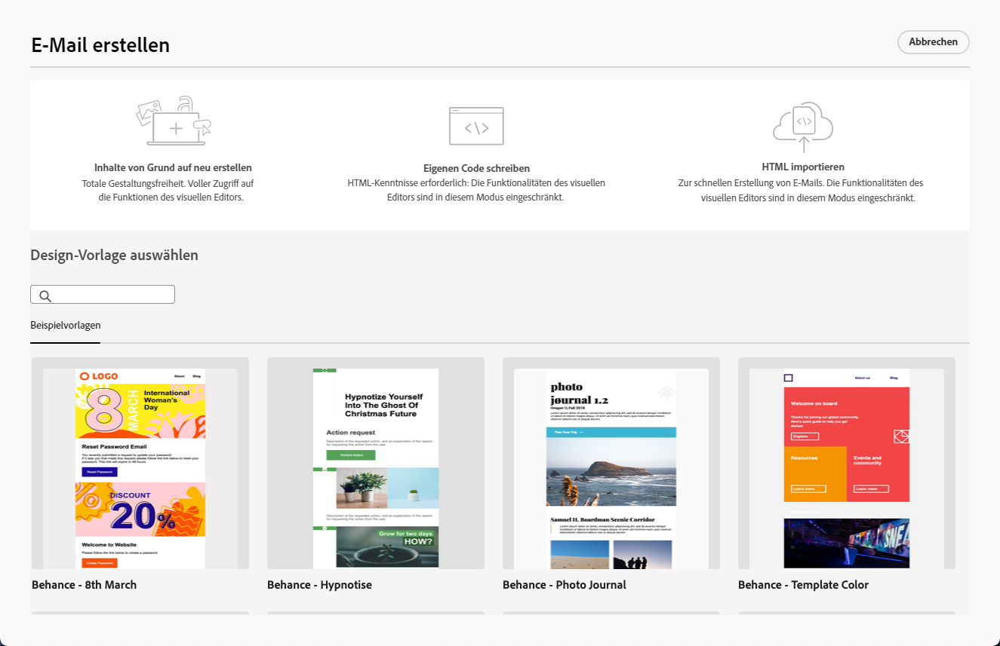

# Erste Schritte mit E-Mail-Designer {#get-started-email-designer}

Nach der Erstellung einer E-Mail in Adobe Campaign müssen Sie deren Inhalt definieren.

Mit Email Designer können Sie durch eine intuitive Drag &amp; Drop-Oberfläche faszinierende, individuell zugeschnittene E-Mails erstellen. Egal ob Sie mit einer leeren Vorlage beginnen, einen vorhandenen Inhalt importieren oder vorhandene Vorlagen nutzen, alle Inhalte für jede E-Mail erstellen und verfeinern, ob für Werbung oder Transaktionen.

<!--Built to deliver HTML optimized for responsive design, the Email Designer allows you to easily define and apply visibility conditions and dynamic content to an email, template, or fragment directly through the user interface. You can seamlessly switch between the drag and drop interface and HTML code at the click of a button.

The Email Designer allows you to create email content and email content templates. It is compatible with simple emails, transactional emails, A/B test emails, multilingual emails, and recurring emails.-->

* Verwendung [!DNL Campaign] Funktionen zum einfachen Erstellen responsiver E-Mails. [Weitere Informationen](create-email-content.md)

* Verbessern Sie das Kundenerlebnis, indem Sie personalisierte auf der Basis ihrer Profilattribute erstellen. [Weitere Informationen](../personalization/personalize.md)

* Konfigurieren Sie bedingte Inhaltsfelder, um eine dynamische Personalisierung basierend auf dem Empfängerprofil zu erstellen. [Weitere Informationen](../personalization/conditions.md)

## Best Practices bei der Erstellung von E-Mails {#best-practices}

Beim Versand von E-Mails ist es wichtig zu beachten, dass die Empfänger sie weiterleiten können, was manchmal Probleme mit dem Rendering der E-Mail verursachen kann. Dies gilt insbesondere bei der Verwendung von CSS-Klassen, die vom E-Mail-Anbieter, der für die Weiterleitung verwendet wird, möglicherweise nicht unterstützt werden, z. B. wenn Sie die CSS-Klasse &quot;ist-Desktop-ausgeblendet&quot;verwenden, um ein Bild auf Mobilgeräten auszublenden.

Um diese Rendering-Probleme zu minimieren, empfehlen wir, Ihre E-Mail-Design-Struktur so einfach wie möglich zu halten. Versuchen Sie, ein einzelnes Design zu verwenden, das sowohl für Desktop- als auch für Mobilgeräte gut funktioniert, und vermeiden Sie die Verwendung komplexer CSS-Klassen oder anderer Design-Elemente, die möglicherweise nicht von allen E-Mail-Clients vollständig unterstützt werden. Mithilfe dieser Best Practices können Sie sicherstellen, dass Ihre E-Mails konsistent gerendert werden, unabhängig davon, wie sie von Empfängern angezeigt oder weitergeleitet werden.

## Inhaltserstellung starten {#start-authoring}

Gehen Sie im Dashboard des E-Mail-Versands durch den [Inhalt bearbeiten](edit-content.md) angezeigt, um die Startseite von Email Designer zu öffnen. Wählen Sie dort aus den folgenden Optionen aus, wie Sie Ihre E-Mail gestalten möchten:

* **E-Mail von Grund auf neu erstellen** über die Benutzeroberfläche des E-Mail-Designers. Erfahren Sie, wie Sie E-Mail-Inhalte erstellen in [diesem Abschnitt](create-email-content.md).

* **Rohes HTML kodieren oder einfügen** direkt im E-Mail-Designer. Erfahren Sie, wie Sie Ihren eigenen Inhalt kodieren in [diesem Abschnitt](code-content.md).

* **Vorhandenen HTML-Inhalt importieren** aus einer Datei oder einem ZIP-Ordner. Erfahren Sie, wie Sie E-Mail-Inhalte importieren in [diesem Abschnitt](existing-content.md).

* **Existierenden Inhalt auswählen** aus einer Liste integrierter oder benutzerdefinierter Vorlagen. Erfahren Sie, wie Sie mit E-Mail-Vorlagen arbeiten. [diesem Abschnitt](email-templates.md).

  

