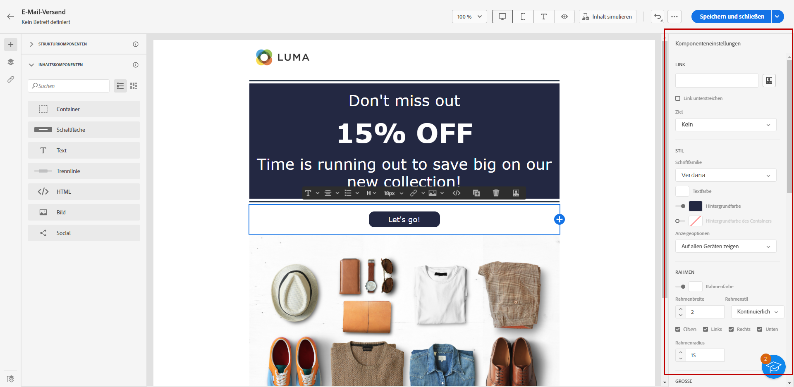

# Erste Schritte mit E-Mail-Stil {#get-started-email-style}

>[!NOTE]
>
>Diese Dokumentation wird derzeit erstellt und häufig aktualisiert. Die endgültige Version dieses Inhalts wird im Januar 2023 vorliegen.

Sobald Sie mit der Erstellung Ihres E-Mail-Inhalts in [!DNL Journey Optimizer] begonnen haben, können Sie eine Reihe von Stilparametern und Attributen im Einstellungsbereich von E-Mail-Designer anpassen.

Sie können Ihre Änderungen entweder auf den E-Mail-Textkörper, auf eine Strukturkomponente oder auf eine Inhaltskomponente anwenden.

Folgen Sie den unten stehenden Links, um zu erfahren, wie Sie einige Stileinstellungen in Ihrer E-Mail anpassen können.

* Erfahren Sie, wie Sie Ihren [E-Mail-Hintergrund personalisieren](backgrounds.md)
* Erfahren Sie, wie Sie [senkrechte Ausrichtung und Abstand verwalten](alignment-and-padding.md)
* Erfahren Sie, wie Sie [einen Stil für die Links in Ihrer E-Mail definieren](styling-links.md)
* Erfahren Sie, wie Sie [Inline-Styling-Attribute anpassen](inline-styling.md)
