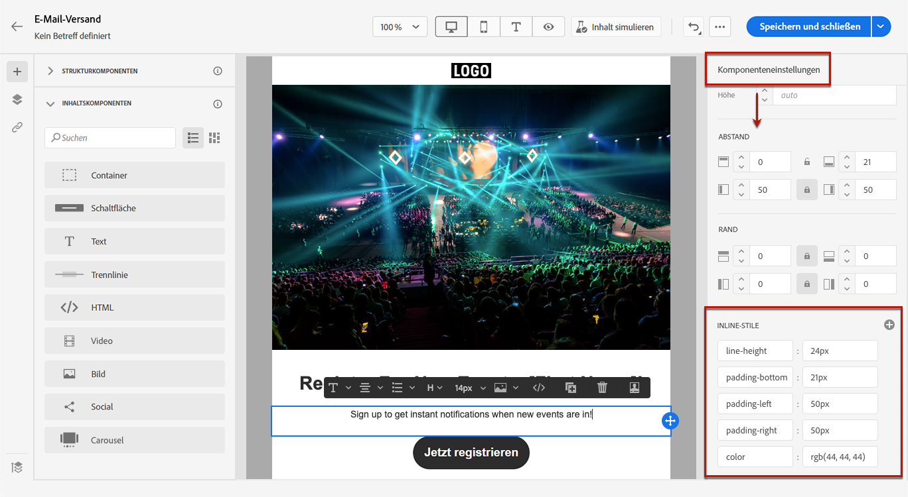
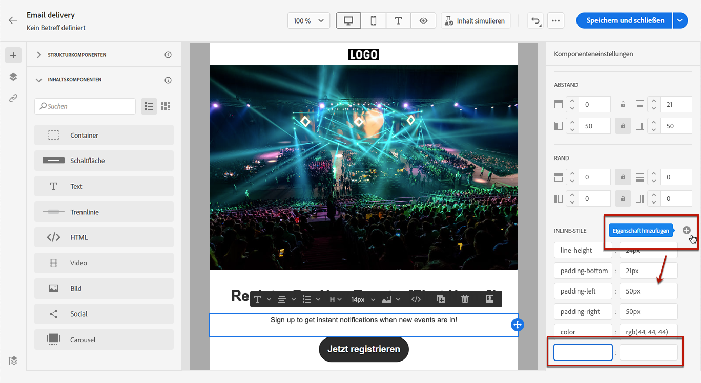

# Hinzufügen von Inline-Styling-Attributen {#adding-inline-styling-attributes}

Wenn Sie in der Benutzeroberfläche von E-Mail-Designer ein Element auswählen und im rechten Bereich dessen Einstellungen anzeigen, können Sie für dieses Element die Inline-Attribute und deren Werte ändern.

1. Wählen Sie eine Komponente direkt in Ihrem Inhalt aus oder verwenden Sie den **[!UICONTROL Navigationsbaum]** im linken Bereich.

1. Suchen Sie im Menü **[!UICONTROL Komponenteneinstellungen]** auf der rechten Seite nach dem Abschnitt **[!UICONTROL Inline-Stile]**.

   

1. Ändern Sie die Werte der vorhandenen Attribute.

1. Sie können neue Eigenschaften mithilfe der Schaltfläche **+** hinzufügen. Sie können alle Attribute und Werte hinzufügen, die CSS-kompatibel sind.

   

Der Stil wird auf das ausgewählte Element angewendet.

>[!NOTE]
>
>Wenn für die untergeordneten Elemente keine speziellen Stilattribute definiert sind, wird der Stil des übergeordneten Elements verwendet.

