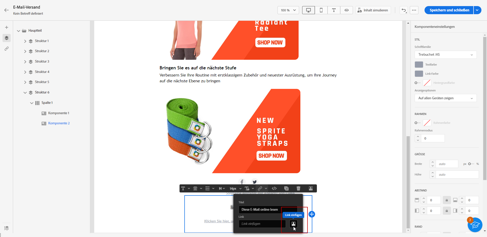
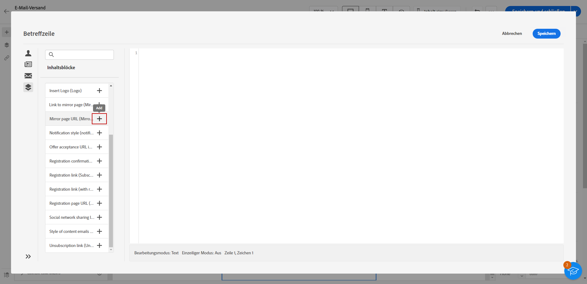
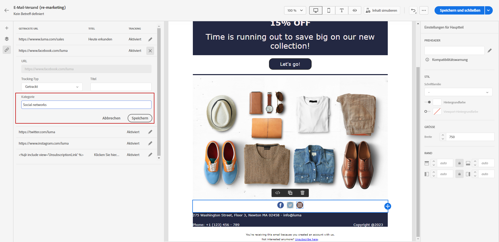

# Hinzufügen von Links und Verfolgen von Nachrichten {#tracking}

>[!NOTE]
>
>Diese Dokumentation wird derzeit erstellt und häufig aktualisiert. Die endgültige Version dieses Inhalts wird im Januar 2023 vorliegen.

Verwenden Sie E-Mail-Designer, um Links zu Ihrem Inhalt hinzuzufügen und die gesendeten Nachrichten zu verfolgen, um das Verhalten Ihrer Empfänger zu überwachen.

## Einfügen von Links {#insert-links}

Beim Erstellen einer Nachricht können Sie Links zu Ihrem Inhalt hinzufügen.

>[!NOTE]
>
>Wenn das Tracking aktiviert ist, werden alle im Nachrichteninhalt enthaltenen Links verfolgt.

Gehen Sie wie folgt vor, um Links in Ihren E-Mail-Inhalt einzufügen:

1. Wählen Sie ein Element aus und klicken Sie in der kontextbezogenen Symbolleiste auf **[!UICONTROL Link einfügen]**.

   

1. Fügen Sie eine **[!UICONTROL Bezeichnung]** und einen **[!UICONTROL Link]** hinzu.

1. Speichern Sie Ihre Änderungen.

1. Sobald der Link erstellt ist, können Sie ihn im Bereich **[!UICONTROL Komponenteneinstellungen]** auf der rechten Seite noch ändern.

   * Sie können den Link bearbeiten und seine **[!UICONTROL Zielgruppe]** ändern.
   * Sie können den Link unterstreichen oder nicht, indem Sie die entsprechende Option auswählen.

   

>[!NOTE]
>
>E-Mail-Nachrichten vom Typ Marketing müssen einen Ausschluss-Link enthalten, der für Transaktionsnachrichten nicht erforderlich ist. Die Nachrichten-Kategorie (**[!UICONTROL Marketing]** oder **[!UICONTROL Transaktion]**) wird auf Ebene der Kanal-Benutzeroberfläche (d. h. der Nachrichtenvoreinstellung) und beim Erstellen der Nachricht definiert.

## Link zu einer Mirror-Seite {#mirror-page}

Bei der Mirror-Seite handelt es sich um eine HTML-Seite, auf die online über einen Webbrowser zugegriffen werden kann. Ihr Inhalt ist identisch mit dem Inhalt Ihrer E-Mail.

So fügen Sie in Ihrer E-Mail einen Link zu einer Mirror-Seite hinzu:

1. Wählen Sie ein Element aus und klicken Sie in der kontextbezogenen Symbolleiste auf **[!UICONTROL Link einfügen]**.

   

1. Wählen Sie das Symbol **[!UICONTROL Link einfügen]**, um auf das Personalisierungsmenü zuzugreifen.

   

1. Wählen Sie im Menü **[!UICONTROL Inhaltsbaustein]** die Option **[!UICONTROL URL der Mirror-Seite]** und klicken Sie auf **[!UICONTROL Hinzufügen]**.

   

Die Mirror-Seite wird automatisch erstellt.

>[!IMPORTANT]
>
>Links zu Mirror-Seiten werden automatisch generiert und können nicht bearbeitet werden. Sie enthalten alle verschlüsselten personalisierten Daten, die zum Rendern der ursprünglichen E-Mail erforderlich sind. Daher kann die Verwendung personalisierter Attribute mit großen Werten zu langen Mirror-Seiten-URLs führen, wodurch der Link in Webbrowsern mit einer maximalen URL-Länge eventuell nicht funktioniert.

Wenn die Empfänger nach dem Versand der E-Mail auf den Link zur Mirror-Seite klicken, wird der Inhalt der E-Mail in ihrem Standard-Webbrowser angezeigt.

>[!NOTE]
>
>Im Testversand an die Testprofile ist der Link zur Mirror-Seite nicht aktiv. Er wird nur in den endgültigen Nachrichten aktiviert.

Die Beibehaltungsdauer für eine Mirror-Seite beträgt 60 Tage. Danach ist die Mirror-Seite nicht mehr verfügbar.

## Verwalten von Tracking {#manage-tracking}

Der [E-Mail-Designer](create-email-content.md) ermöglicht Ihnen die Verwaltung der getrackten URLs, z. B. die Bearbeitung des Tracking-Typs für jeden Link.

1. Klicken Sie auf das Symbol **[!UICONTROL Links]** im linken Bereich, um die Liste aller getrackten URLs Ihres Inhalts anzuzeigen.

   Diese Liste bietet einen guten Überblick und ermöglicht das Auffinden aller im E-Mail-Inhalt vorhandenen URLs.

1. Um einen Link zu bearbeiten, wählen Sie das entsprechende Stiftsymbol aus.

   

1. Sie können den **[!UICONTROL Tracking-Typ]** bei Bedarf ändern:

   

   Für jede getrackte URL können Sie einen der folgenden Werte für den Tracking-Modi auswählen:

   * **[!UICONTROL Getrackt]**: aktiviert das Tracking dieser URL.
   * **[!UICONTROL Opt-out]** Diese URL wird als Opt-out- oder Abmeldungs-URL behandelt.
   * **[!UICONTROL Mirror-Seite]**: Diese URL wird als URL der Mirror-Seite behandelt.
   * **[!UICONTROL Nie]**: Das Tracking dieser URL wird nie aktiviert. <!--This information is saved: if the URL appears again in a future message, its tracking is automatically deactivated.-->

1. Hinzufügen einer **[!UICONTROL Kategorie]** zu Ihrem Link zu gruppierten verfolgten Links klicken und **[!UICONTROL Speichern]**.

   

1. Öffnen Sie nach dem Versand den Versandbericht. Unter dem **[!UICONTROL Tracking]** Menü, **[!UICONTROL URLs und Clickstreams]** zeigt an, welche URLs aus Ihrem Versand am häufigsten besucht werden. [Weitere Informationen](../reporting/reports.md)
