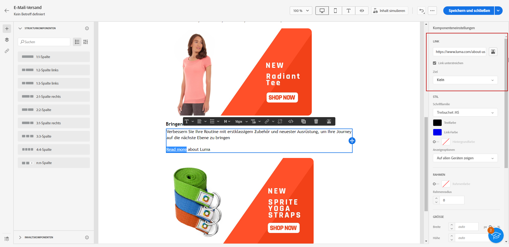
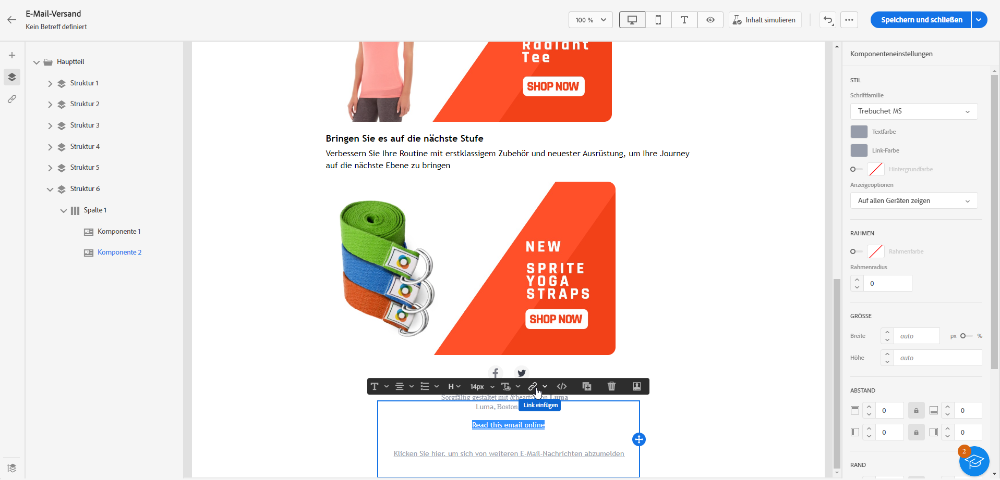
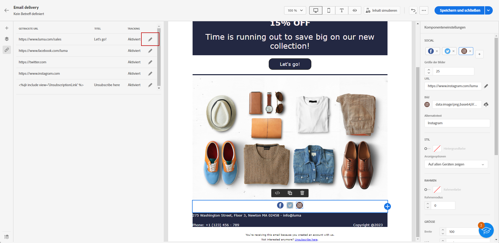
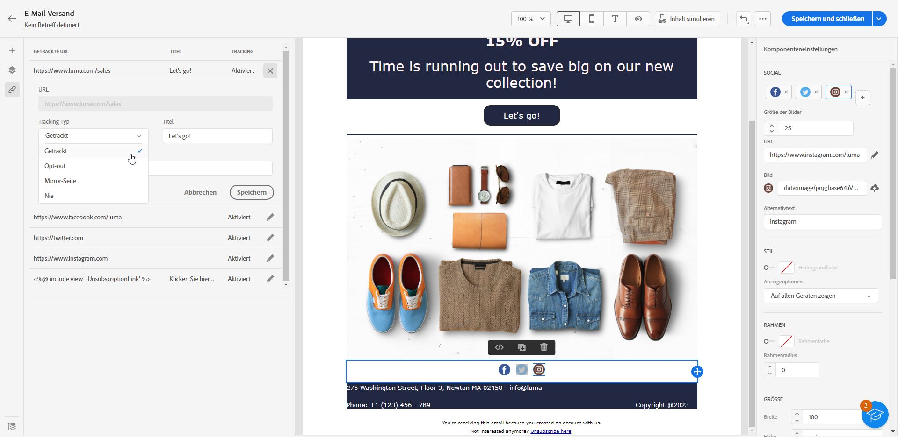

# Links hinzufügen und Nachrichten verfolgen {#tracking}

>[!NOTE]
>
>Diese Dokumentation wird derzeit erstellt und häufig aktualisiert. Die endgültige Version dieses Inhalts wird im Januar 2023 vorliegen.

Verwendung [!DNL Journey Optimizer] um Links zu Ihrem Inhalt hinzuzufügen und die gesendeten Nachrichten zu verfolgen, um das Verhalten Ihrer Empfänger zu überwachen.

## Tracking aktivieren {#enable-tracking}

Sie können das Tracking auf E-Mail-Meldungsebene aktivieren, indem Sie die Option **[!UICONTROL E-Mail-Öffnungen]** und/oder **[!UICONTROL E-Mail anklicken]** Optionen beim Erstellen der Nachricht.

>[!NOTE]
>
>Beide Optionen sind standardmäßig aktiviert.

Auf diese Weise können Sie das Verhalten Ihrer Empfänger verfolgen:

* **[!UICONTROL E-Mail-Öffnungen]**: Nachrichten, die geöffnet wurden.
* **[!UICONTROL E-Mail anklicken]**: Klicks auf Links in einer E-Mail.

## Einfügen von Links {#insert-links}

Beim Erstellen einer Nachricht können Sie Links zu Ihrem Inhalt hinzufügen.

>[!NOTE]
>
>Wann [Tracking ist aktiviert](#enable-tracking), werden alle im Nachrichteninhalt enthaltenen Links verfolgt.

Gehen Sie wie folgt vor, um Links in Ihren E-Mail-Inhalt einzufügen:

1. Wählen Sie zuerst ein Element aus und danach in der dedizierten Symbolleiste die Option **[!UICONTROL Link einfügen]**.

   

1. Wählen Sie den gewünschten Linktyp aus.

   * **[!UICONTROL Externer Link]**: Fügen Sie einen Link zu einer externen URL ein.

   * **[!UICONTROL Landingpage]**: Fügen Sie einen Link zu einer Landingpage ein.

   * **[!UICONTROL Opt-out mit einem Klick]**: Fügen Sie einen Link ein, über den sich Benutzer schnell von Ihrer Nachricht abmelden können, ohne sich abmelden zu müssen.

   * **[!UICONTROL Externes Opt-in/Abonnement]**: Fügen Sie einen Link ein, um den Erhalt von Nachrichten Ihrer Marke zu akzeptieren.

   * **[!UICONTROL Externes Opt-out/Abmeldung]**: Fügen Sie einen Link ein, um sich vom Erhalt von Nachrichten Ihrer Marke abzumelden.

   * **[!UICONTROL Mirrorseite]**: Fügen Sie einen Link ein, um den E-Mail-Inhalt in einem Webbrowser anzuzeigen. Weiterführende Informationen finden Sie in [diesem Abschnitt](#mirror-page).

   

1. Sie können Ihre Links personalisieren.

1. Speichern Sie Ihre Änderungen.

1. Nachdem der Link erstellt wurde, können Sie ihn dennoch im **[!UICONTROL Komponenteneinstellungen]** rechts.

   * Sie können den Link bearbeiten und seinen Typ ändern.
   * Sie können den Link unterstreichen oder nicht, indem Sie die entsprechende Option aktivieren.

   

>[!NOTE]
>
>E-Mail-Nachrichten vom Typ Marketing müssen einen Ausschluss-Link enthalten, der für Transaktionsnachrichten nicht erforderlich ist. Die Kategorie der Nachricht (**[!UICONTROL Marketing]** oder **[!UICONTROL Transactional]**) wird auf der Kanaloberfläche (d. h. der Nachrichtenvorgabe) und beim Erstellen der Nachricht definiert.

## Link zu einer Mirrorseite {#mirror-page}

Die Mirrorseite ist eine HTML-Seite, auf die online über einen Webbrowser zugegriffen werden kann. Der Inhalt entspricht dem Inhalt Ihrer E-Mail.

So fügen Sie in Ihrer E-Mail einen Link zu einer Mirrorseite hinzu: [Link einfügen](#insert-links) und wählen Sie **[!UICONTROL Mirrorseite]** als Typ des Links.

Die Mirrorseite wird automatisch erstellt.

>[!IMPORTANT]
>
>Mirrorseiten-Links werden automatisch generiert und können nicht bearbeitet werden. Sie enthalten alle verschlüsselten personalisierten Daten, die zum Rendern der ursprünglichen E-Mail erforderlich sind. Daher kann die Verwendung personalisierter Attribute mit großen Werten zu langen Mirrorseiten-URLs führen, was verhindert, dass der Link in Webbrowsern mit einer maximalen URL-Länge funktioniert.

Wenn die Empfänger nach dem Versand der E-Mail auf den Mirrorseiten-Link klicken, wird der Inhalt der E-Mail in ihrem Standard-Webbrowser angezeigt.

>[!NOTE]
>
>Im Testversand an die Testprofile ist der Link zur Mirrorseite nicht aktiv. Sie wird nur in den endgültigen Nachrichten aktiviert.

Die Aufbewahrungsfrist für eine Mirrorseite beträgt 60 Tage. Nach dieser Verzögerung ist die Mirrorseite nicht mehr verfügbar.

## Tracking verwalten {#manage-tracking}

Die [Email Designer](create-email-content.md) ermöglicht Ihnen die Verwaltung der getrackten URLs, z. B. die Bearbeitung des Trackingtyps für jeden Link.

1. Klicken Sie auf **[!UICONTROL Links]** im linken Bereich, um die Liste aller getrackten URLs Ihres Inhalts anzuzeigen.

   Diese Liste bietet einen guten Überblick und ermöglicht das Auffinden aller im E-Mail-Inhalt vorhandenen URLs.

1. Um einen Link zu bearbeiten, wählen Sie das entsprechende Stiftsymbol aus.

   

1. Sie können die **[!UICONTROL Tracking-Typ]** bei Bedarf:

   

   Für jede getrackte URL können Sie den Tracking-Modus auf einen der folgenden Werte einstellen:

   * **[!UICONTROL Getrackt]**: Aktiviert das Tracking dieser URL.
   * **[!UICONTROL Opt-out]**: Betrachtet diese URL als Ausschluss- oder Abmelde-URL.
   * **[!UICONTROL Mirrorseite]**: betrachtet diese URL als Mirrorseiten-URL.
   * **[!UICONTROL Nie]**: Aktiviert nie das Tracking dieser URL. <!--This information is saved: if the URL appears again in a future message, its tracking is automatically deactivated.-->

Berichte zu Öffnungen und Klicks sind im Live-Bericht und im Global -Bericht verfügbar.
