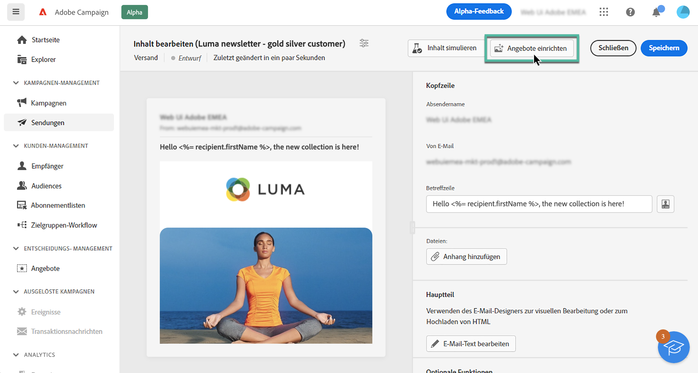
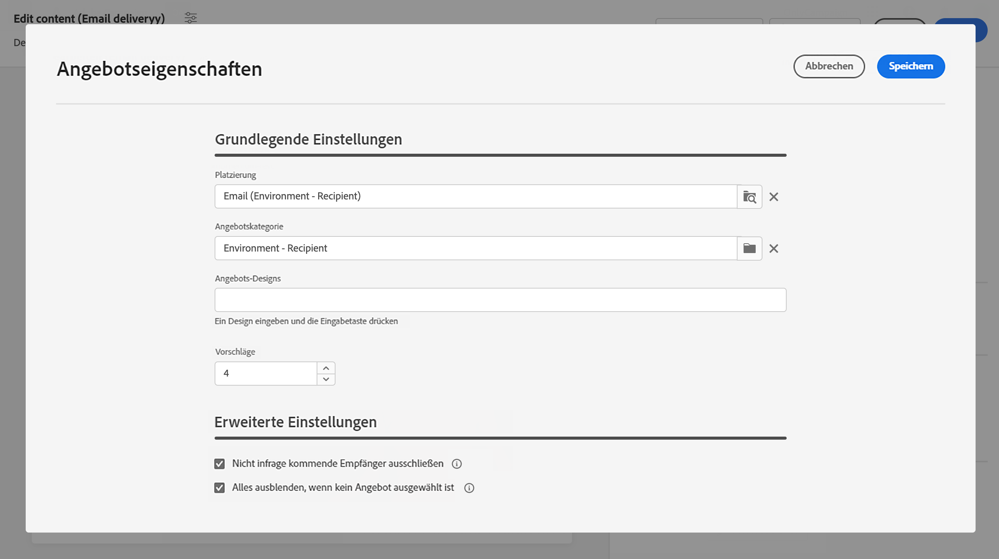
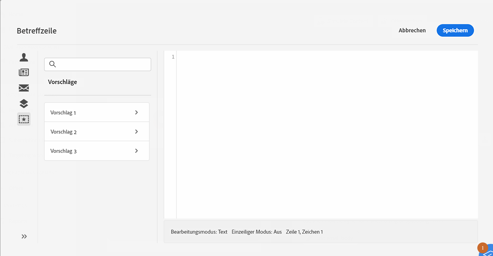
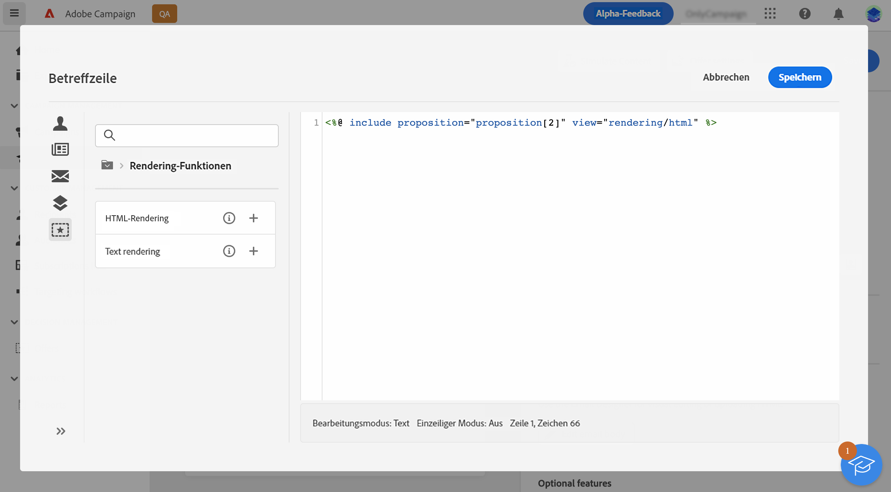

# Senden von Angeboten {#offers-content}

Adobe Campaign v8 Web ermöglicht es Ihnen, mit Ihren E-Mails Angebote zu senden, die in der Konsole mithilfe des Moduls **[!UICONTROL Interaction]** erstellt wurden. Weitere Informationen zu Interaction und zur Verwaltung eines Angebotskatalogs in der Konsole finden Sie in der [Dokumentation zu Campaign V8](https://experienceleague.adobe.com/docs/campaign/campaign-v8/offers/interaction.html?lang=de){target="_blank"}.

Die wichtigsten Schritte zum Senden von Angeboten mit einer E-Mail sind:

1. [Zu unterbreitende Angebote konfigurieren](#configure),
1. [Angebote in E-Mail einfügen](#insert).

## Zu unterbreitende Angebote konfigurieren {#configure}

>[!CONTEXTUALHELP]
>id="acw_deliveries_email_offers_settings"
>title="Angebotseinstellungen"
>abstract="Konfigurieren Sie, welche Angebote den Empfängerinnen und Empfängern unterbreitet werden sollen."

>[!CONTEXTUALHELP]
>id="acw_deliveries_email_offers_advanced_settings"
>title="Erweiterte Einstellungen für Angebote"
>abstract="Konfigurieren Sie die erweiterten Optionen für Angebote."

1. Um die Angebote auszuwählen, die in Ihrer E-Mail unterbreitet werden sollen, klicken Sie auf die Schaltfläche **[!UICONTROL Angebote]** auf dem Bildschirm zur Bearbeitung des E-Mail-Inhalts.

   

1. Konfigurieren Sie, welche Angebote den Empfängerinnen und Empfängern unterbreitet werden sollen. Wählen Sie zunächst die **[!UICONTROL Platzierung]** entsprechend Ihrer Angebotsumgebung.

   

1. Um die Angebotsauswahl des Moduls zu verfeinern, wählen Sie eine spezifische **[!UICONTROL Angebotskategorie]**, in der die Angebote gruppiert sind.

   Wenn keine Kategorie spezifiziert wird, werden alle in der Umgebung enthaltenen Angebote von der Angebots-Engine berücksichtigt, es sei denn, es wurde ein **[!UICONTROL Angebotsthema]** ausgewählt.

   >[!NOTE]
   >
   >Themen sind Schlüsselwörter, die zuvor in den Kategorien definiert wurden. Sie dienen als Filter und ermöglichen es Ihnen, die Anzahl der zu unterbreitenden Angebote durch Auswahl in einer Reihe von Kategorien zu verfeinern.

1. Verwenden Sie das Feld **[!UICONTROL Vorschläge]**, um die Anzahl der Angebote anzugeben, die Sie in die E-Mail einfügen möchten.

1. Wählen Sie bei Bedarf die Option **[!UICONTROL Nicht infrage kommende Empfänger ausschließen]** aus.

   Mit dieser Option können Sie den Ausschluss von Empfängern aktivieren oder deaktivieren, für die nicht genügend geeignete Angebote vorhanden sind.

   * Wenn die Option aktiviert ist, werden Empfängerinnen und Empfänger, für die nicht genügend geeignete Angebote vorhanden sind, vom Versand ausgeschlossen.
   * Wenn die Option deaktiviert ist, werden diese Empfängerinnen und Empfänger nicht vom Versand ausgeschlossen, ihnen wird aber nicht die angefragte Anzahl von Angeboten unterbreitet.

1. Wählen Sie bei Bedarf die Option **[!UICONTROL Alles ausblenden, wenn kein Angebot ausgewählt ist]**.

   Mit dieser Option können Sie festlegen, wie die Nachricht verarbeitet werden soll, wenn eine der Vorschläge nicht existiert.

   * Wenn die Option aktiviert ist, wird keine Darstellung des fehlenden Vorschlags angezeigt und es wird auch kein Inhalt für diesen Vorschlag in der Nachricht angezeigt.
   * Wenn die Option deaktiviert ist, wird die der Versand der Nachricht abgebrochen und die Empfänger und Empfängerinnen können keine Nachrichten mehr empfangen.

Nachdem Sie die Angebote konfiguriert haben, die in Ihrer E-Mail vorgeschlagen werden sollen, können Sie sie mit dem Ausdruckseditor in die E-Mail einfügen. [Erfahren Sie, wie Sie Angebote in die E-Mail einfügen](#insert)

## Einfügen von Angeboten in die E-Mail {#insert}

Angebote können mit dem Ausdruckseditor zur E-Mail hinzugefügt werden. Sie können wie folgt eingefügt werden:

* in der Betreffzeile der E-Mail,
* im Textkörper der E-Mail durch die Aktivierung der Personalisierung in einer beliebigen Inhaltskomponente. [Erfahren Sie, wie Sie Inhaltskomponenten hinzufügen](content-components.md)

>[!NOTE]
>
>Stellen Sie vor dem Einfügen eines Angebots sicher, dass Sie [konfiguriert haben, welche Angebote mit der E-Mail vorgeschlagen werden sollen](#configure).

Gehen Sie wie folgt vor, um ein Angebot mit dem Ausdruckseditor einzufügen:

1. Öffnen Sie den Ausdruckseditor und wählen Sie dann das Menü **[!UICONTROL Vorschläge]**.

   Die verfügbaren Vorschläge werden in der Liste angezeigt. Die Anzahl der Vorschläge wird bei der Konfiguration der zu unterbreitenden Angebote bestimmt.

   

1. Fügen Sie die Vorschläge mithilfe der Personalisierungsfelder, Rendering-Funktionen oder Angebotsattribute, die für jeden Vorschlag verfügbar sind, zum Betreff oder Text der E-Mail hinzu.

   
