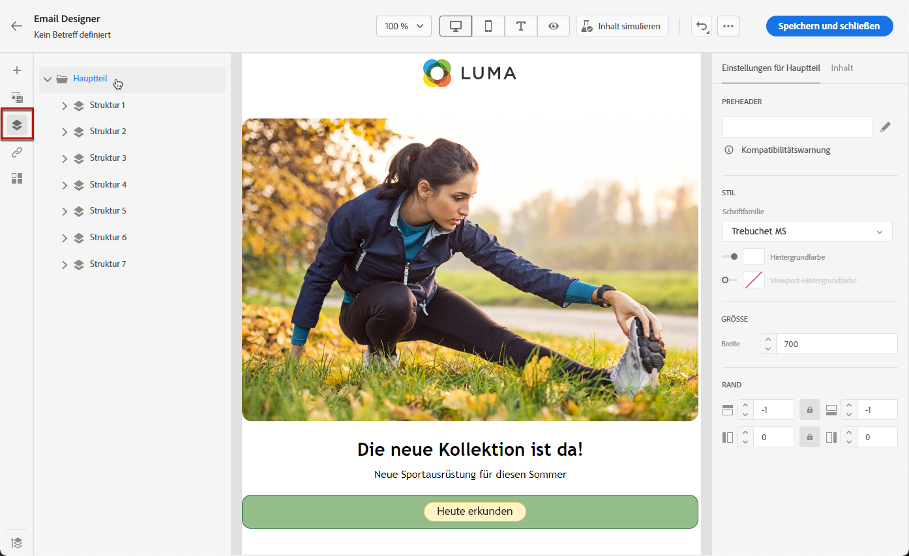
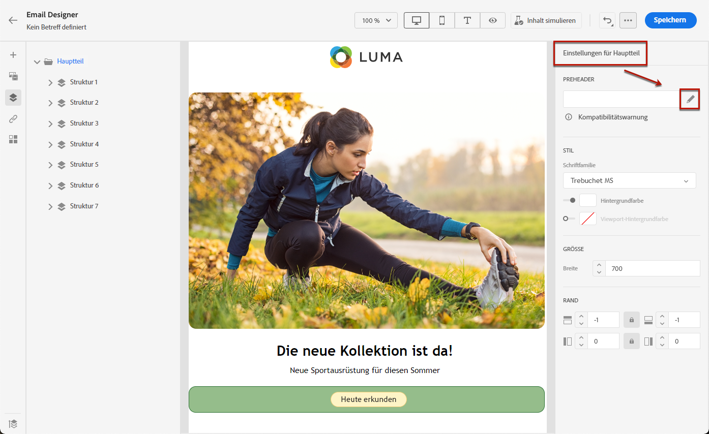

# Hinzufügen eines Preheaders zu einer E-Mail {#preheader}

>[!CONTEXTUALHELP]
>id="ac_edition_preheader"
>title="Hinzufügen eines Preheaders"
>abstract="Ein Preheader ist ein kurzer Zusammenfassungstext, der beim Anzeigen einer E-Mail über Ihren E-Mail-Client der Betreffzeile folgt. In vielen Fällen handelt es sich um eine kurze Zusammenfassung der E-Mail, die in der Regel einen Satz lang ist."

Ein Preheader ist ein kurzer Text, der beim Anzeigen einer E-Mail von einem gängigen E-Mail-Client der Betreffzeile folgt.

In vielen Fällen bietet es eine kurze Zusammenfassung des Inhalts und ist normalerweise ein Satz lang.

>[!NOTE]
>
>Preheader werden nicht von allen E-Mail-Clients unterstützt. Wenn der Preheader nicht unterstützt wird, wird er nicht angezeigt.

Gehen Sie wie folgt vor, um den Preheader einer E-Mail zu definieren.

1. Aus dem [Email Designer](create-email-content.md)Fügen Sie mindestens eine **[!UICONTROL Struktur]** -Komponente, um mit der Erstellung Ihrer E-Mail zu beginnen.

1. Klicken Sie auf das Symbol **[!UICONTROL Navigationsbaum]** im linken Bereich und wählen Sie **[!UICONTROL Text]**.

   

1. Aus dem **[!UICONTROL Einstellungen]** eingeben, geben Sie Text für Ihren Preheader ein.

1. Klicken Sie auf die Schaltfläche **[!UICONTROL Personalisierung hinzufügen]** Symbol links neben dem **[!UICONTROL Preheader]** -Feld.

   

1. Aus dem **[!UICONTROL Personalisierung bearbeiten]** Fenster, können Sie [Personalisierungsfelder](../personalization/personalize.md), [Inhaltsbausteine](../personalization/content-blocks.md) und [Bedingter Inhalt](../personalization/conditions.md) mithilfe der entsprechenden Einträge auf der linken Seite.

   

1. Klicken Sie auf **[!UICONTROL Bestätigen]**.

Ihr Preheader für Ihre E-Mail ist jetzt konfiguriert.
