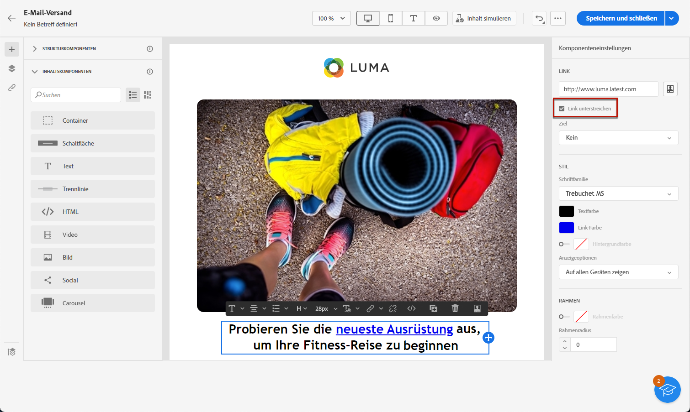
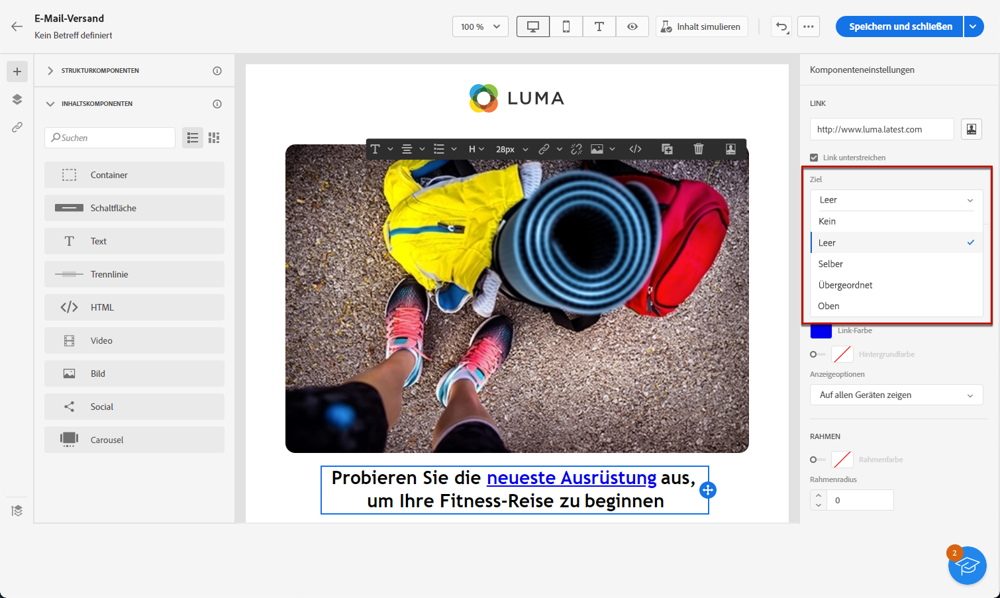
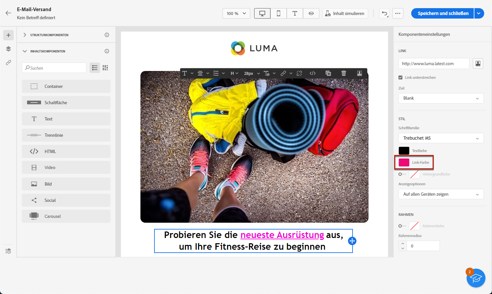

# Definieren eines Stils für Links {#styling-links}

Sie können in E-Mail-Designer einen Link unterstreichen und dessen Farbe und Zielgruppe auswählen.

1. Wählen Sie in einer **[!UICONTROL Text]**-Komponente, in die ein Link eingefügt ist, Ihren Link aus.

1. Aktivieren Sie im Menü **[!UICONTROL Komponenteneinstellungen]** das Kontrollkästchen **[!UICONTROL Link unterstreichen]**, um den Titel zu unterstreichen.

   

1. Wählen Sie in der Drop-Down-Liste **[!UICONTROL Zielgruppen]**, wie Ihre Audience umgeleitet werden soll:

   * **[!UICONTROL Keine]**: Öffnet den Link im selben Fenster, in dem er angeklickt wurde (Standard).
   * **[!UICONTROL Leer]**: Öffnet den Link in einem neuen Fenster oder einer neuen Registerkarte.
   * **[!UICONTROL Selbst]**: Öffnet den Link im selben Fenster, in dem er angeklickt wurde.
   * **[!UICONTROL Übergeordnet]**: Öffnet den Link im übergeordneten Fenster.
   * **[!UICONTROL Oben]**: Öffnet den Link im vollständigen Textkörper des Fensters.

   

1. Um die Farbe Ihres Links zu ändern, klicken Sie auf **[!UICONTROL Link-Farbe]** im rechten Bereich

   

1. Speichern Sie Ihre Änderungen.
