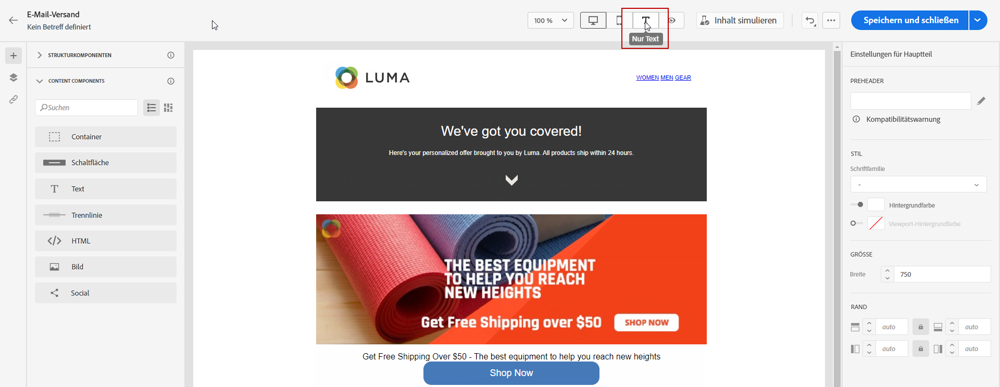
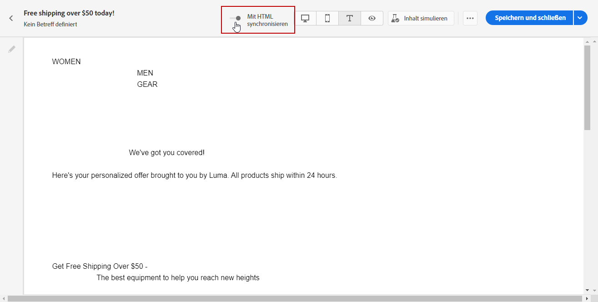
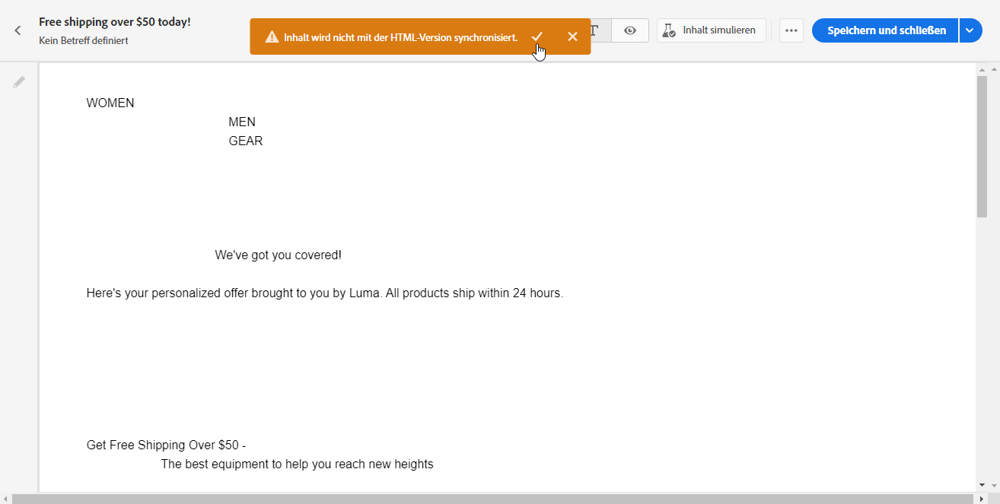

# Textversion einer E-Mail erstellen {#text-version-email}

>[!NOTE]
>
>Diese Dokumentation wird derzeit erstellt und häufig aktualisiert. Die endgültige Version dieses Inhalts wird im Januar 2023 vorliegen.

Es wird empfohlen, eine Textversion Ihres E-Mail-Textkörpers zu erstellen, die verwendet wird, wenn keine HTML-Inhalte angezeigt werden können.

Standardmäßig erstellt Email Designer eine **[!UICONTROL Nur Text]** Version Ihrer E-Mail, einschließlich Personalisierungsfeldern. Diese Version wird automatisch erzeugt und mit der HTML-Version Ihres Inhalts synchronisiert.

Wenn Sie lieber einen anderen Inhalt für die Textversion verwenden möchten, führen Sie die folgenden Schritte aus:

1. Wählen Sie aus Ihrer E-Mail die **[!UICONTROL Nur Text]** Registerkarte.

   

1. Verwenden Sie die **[!UICONTROL Mit HTML synchronisieren]** Umschalten, um die Synchronisierung zu deaktivieren.

   

1. Klicken Sie auf das Häkchen, um Ihre Auswahl zu bestätigen.

   

1. Sie können die Textversion dann nach Belieben bearbeiten.

>[!CAUTION]
>
>* Änderungen in **[!UICONTROL Nur Text]** -Ansicht nicht in der HTML-Ansicht angezeigt.
>
>* Wenn Sie die **[!UICONTROL Mit HTML synchronisieren]** nach der Aktualisierung Ihres Textinhalts gehen Ihre Änderungen verloren und werden durch Textinhalte ersetzt, die von der HTML-Version generiert wurden.

