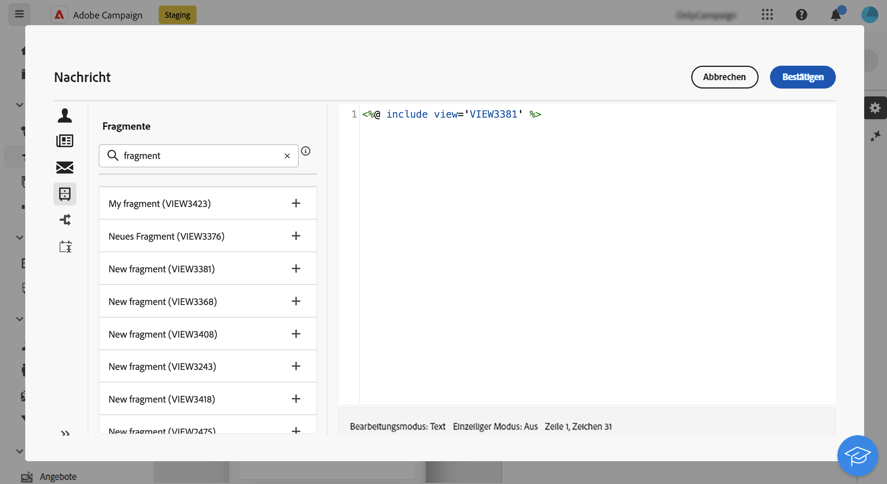

# Hinzufügen von Ausdrucksfragmenten im Ausdruckseditor {#expression}

>[!CONTEXTUALHELP]
>id="acw_fragments_list"
>title="Fragmente"
>abstract="In dieser Liste werden alle in der aktuellen Sandbox erstellten Ausdrucksfragmente angezeigt. Um ein Fragment zu verwenden, klicken Sie auf die Schaltfläche &quot;+&quot;, um die Fragment-ID zum Editor hinzuzufügen."

<!-- pas vu dans l'UI-->

Ausdrucksfragmente können in jedem Feld verwendet werden, das mit dem Ausdruckseditor bearbeitet werden kann. Gehen Sie wie folgt vor, um dem Inhalt Ausdrucksfragmente hinzuzufügen.

1. Öffnen Sie den [Ausdruckseditor](../personalization/gs-personalization.md) und wählen Sie das Menü **[!UICONTROL Fragmente]** im linken Bereich aus.

   Die Liste zeigt alle Ausdrucksfragmente an, die in der aktuellen Sandbox erstellt wurden.

1. Klicken Sie auf das Symbol `+` neben einem Ausdrucksfragment, um es zu Ihrem Inhalt hinzuzufügen.

   

1. Die Fragment-ID wird dem Editor hinzugefügt. Wenn Sie das entsprechende Ausdrucksfragment öffnen und über die Benutzeroberfläche bearbeiten, werden die Änderungen automatisch synchronisiert. Sie werden an alle **[!UICONTROL Entwurf]**-Sendungen weitergegeben, die diese Fragment-ID enthalten.