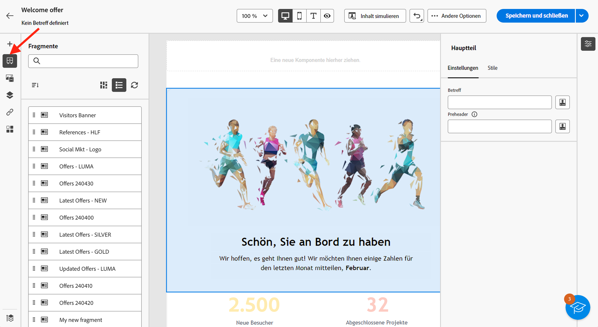
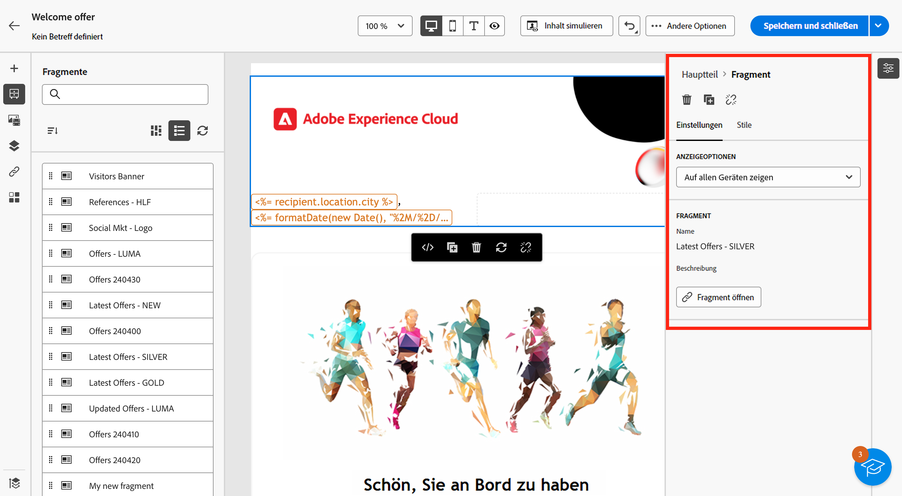
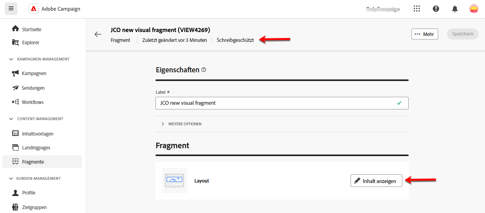
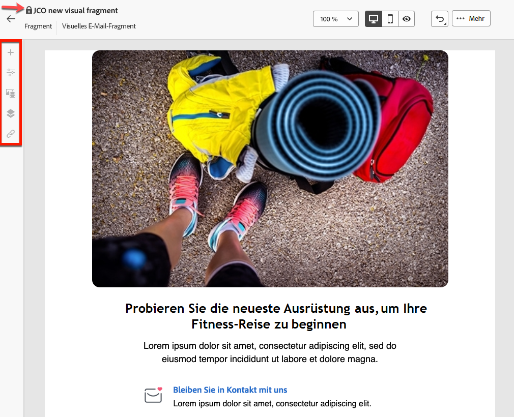
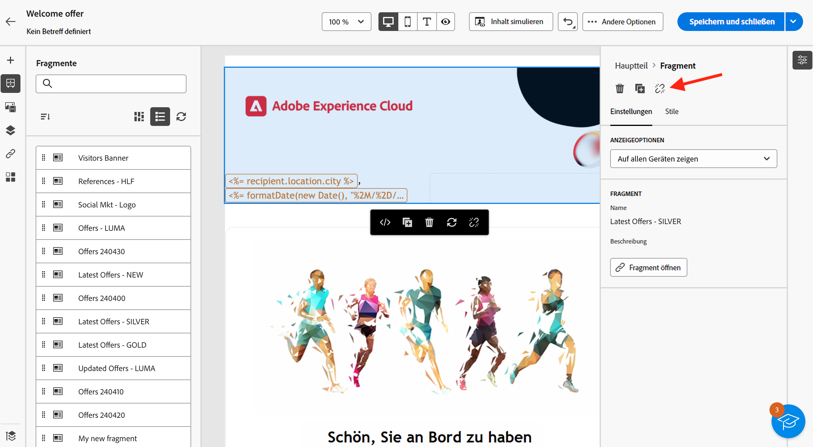

# Hinzufügen visueller Fragmente zu E-Mails {#use-visual-fragments}

>[!AVAILABILITY]
>
>Diese Funktion erfordert ein Update auf Campaign v8.6.4. Weitere Informationen finden Sie in den [Versionshinweisen zur Client Console von Campaign v8](https://experienceleague.adobe.com/de/docs/campaign/campaign-v8/releases/release-notes).

In der Web-Benutzeroberfläche von Campaign **visuelle Fragmente** vordefinierte visuelle Blöcke, die Sie in mehreren E-[-Sendungen ](../email/get-started-email-designer.md) in [Inhaltsvorlagen](../email/use-email-templates.md) wiederverwenden können. Weitere Informationen zur Erstellung und Verwaltung von Inhaltsfragmenten finden Sie in [diesem Abschnitt](fragments.md).

## Verwenden eines visuellen Fragments {#use-fragment}

>[!CONTEXTUALHELP]
>id="acw_fragments_details"
>title="Fragmentoptionen"
>abstract="Dieser Bereich enthält Optionen für das ausgewählte Fragment. Damit können Sie die Geräte auswählen, auf denen das Fragment angezeigt werden soll, und den Inhalt dieses Fragments öffnen. Verwenden Sie die Registerkarte **[!UICONTROL Stile]** , um Ihr Fragment weiter anzupassen. Sie können die Vererbung auch mit dem ursprünglichen visuellen Fragment unterbrechen."

<!-- pas vu dans l'UI-->

Gehen Sie wie folgt vor, um ein visuelles Fragment in E-Mail-Inhalt einzufügen:

1. Öffnen Sie eine E-Mail oder eine Inhaltsvorlage mit [E-Mail-Designer](../email/get-started-email-designer.md).

1. Wählen Sie in der linken Leiste das Symbol **[!UICONTROL Fragmente]** aus.

   

1. Es wird eine Liste mit allen in der aktuellen Sandbox erstellten visuellen Fragmente angezeigt. Sie haben folgende Möglichkeiten:

   * Suchen Sie nach einem bestimmten Fragment, indem Sie dessen Titel eingeben.
   * Sortieren Sie Fragmente in auf- oder absteigender Reihenfolge.
   * Ändern Sie die Anzeige der Fragmente (Karten- oder Listenansicht).

   >[!NOTE]
   >
   >Fragmente werden nach Erstellungsdatum sortiert. Kürzlich hinzugefügte Fragmente werden in der Liste zuerst angezeigt.

   Wenn visuelle Fragmente während der Bearbeitung des Inhalts geändert oder hinzugefügt werden, klicken Sie auf das Symbol **Aktualisieren**, um die Liste mit den neuesten Änderungen zu aktualisieren.

1. Ziehen Sie ein beliebiges visuelles Fragment aus der Liste in den Bereich, in den es eingefügt werden soll. Wie jede andere Komponente können Sie das Fragment innerhalb Ihres Inhalts verschieben.

1. Wählen Sie das Fragment aus, um die zugehörigen Optionen im rechten Bereich anzuzeigen.

   

   Auf der Registerkarten **[!UICONTROL Einstellungen]** haben Sie folgende Möglichkeiten:

   * Wählen Sie die Geräte aus, auf denen das Fragment angezeigt werden soll.
   * Klicken Sie auf die Schaltfläche **Inhalt bearbeiten**, um den Inhalt dieses Fragments zu öffnen. [Weitere Informationen](../content/fragments.md#edit-fragments)

     Sie können Ihr Fragment mit der Registerkarte **[!UICONTROL Stile]** weiter anpassen.

1. Unterbrechen Sie bei Bedarf die Vererbung mit dem ursprünglichen visuellen Fragment. [Weitere Informationen](#break-inheritance)

   Sie können das Fragment auch aus Ihrem Inhalt löschen oder duplizieren. Führen Sie diese Aktionen direkt über das Kontextmenü aus, das über dem Fragment angezeigt wird.

1. Fügen Sie so viele visuelle Fragmente wie nötig hinzu und **[!UICONTROL Sie]** Änderungen.

### Visuelles Fragment im schreibgeschützten Modus {#fragment-readonly}

Zugriffsrechte können für visuelle Fragmente gelten.

Wenn für ein bestimmtes visuelles Fragment keine Berechtigung zur Bearbeitung erteilt wurde, wird die Inhaltsvorlage im **schreibgeschützten Modus)**. In diesem Fall wird die Schaltfläche **[!UICONTROL Inhalt bearbeiten]** durch die Schaltfläche **[!UICONTROL Inhalt anzeigen]** ersetzt, sodass Sie das Fragment ohne Änderungen anzeigen können.

{zoomable="yes"}

Wie unten gezeigt, sind alle Funktionssymbole deaktiviert, sodass die Interaktion auf die Anzeige beschränkt ist.

{zoomable="yes"}

## Unterbrechen der Vererbung {#break-inheritance}

Wenn Sie ein visuelles Fragment bearbeiten, werden die Änderungen synchronisiert und automatisch auf alle E-Mail-Sendungen und Inhaltsvorlagen übertragen, die dieses Fragment enthalten.

Standardmäßig werden Fragmente synchronisiert, wenn sie zu einer E-Mail oder Inhaltsvorlage hinzugefügt werden.

Sie können jedoch die Vererbung vom ursprünglichen Fragment unterbrechen. In diesem Fall wird der Inhalt des Fragments in das aktuelle Design kopiert, und die Änderungen werden nicht mehr synchronisiert.

Gehen Sie wie folgt vor, um die Vererbung zu unterbrechen:

1. Wählen Sie das visuelle Fragment aus.

1. Klicken Sie in der kontextbezogene Symbolleiste auf das Entsperrsymbol.

   

1. Das Fragment wird dann zu einem eigenständigen Element, das nicht mehr mit dem ursprünglichen Fragment verknüpft ist. Bearbeiten Sie es wie jede andere Inhaltskomponente in Ihrem Inhalt. [Weitere Informationen](../email/content-components.md)