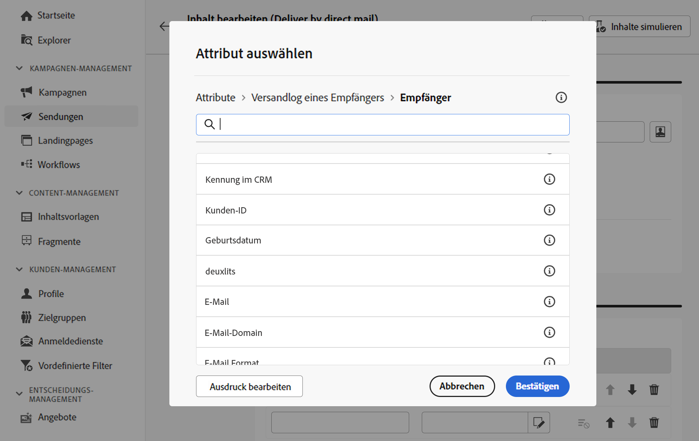

# Gestalten der Extraktionsdatei {#design-direct-mail}

>[!CONTEXTUALHELP]
>id="acw_directmail_content"
>title="Inhalt der Extraktionsdatei"
>abstract="Klicken Sie auf die Schaltfläche **Inhalt bearbeiten**, um mit der Gestaltung der für Ihren Briefpost-Dienstleister erforderlichen Extraktionsdatei zu beginnen. So können Sie die Dateieigenschaften wie Titel und Format definieren und die Spalten angeben, die in der Datei aufgenommen werden sollen."

>[!CONTEXTUALHELP]
>id="acw_directmail_properties_file"
>title="Dateieigenschaften"
>abstract="Konfigurieren Sie die Eigenschaften der Extraktionsdatei, wie ihren Namen und ihr Format. Sie können mithilfe des Ausdruckseditors den Dateinamen mit Attributen aus der Datenbank personalisieren."

>[!CONTEXTUALHELP]
>id="acw_directmail_properties_content"
>title="Content"
>abstract="Geben Sie in diesem Abschnitt die Spalten an, die in der Extraktionsdatei angezeigt werden sollen. Anschließend können Sie die Extraktionsdatei mit der Schaltfläche **Inhalt simulieren** in einer Vorschau anzeigen."

Um den Inhalt der durch Ihren Briefpostversand generierten Extraktionsdatei zu gestalten, klicken Sie auf Ihrer Versandseite auf die Schaltfläche **[!UICONTROL Inhalt bearbeiten]** und konfigurieren Sie dann die Dateieigenschaften und den Inhalt.

## Konfigurieren der Eigenschaften der Extraktionsdatei {#properties}

1. Geben Sie im Feld **[!UICONTROL Dateiname]** den gewünschten Namen für die Extraktionsdatei an. Sie können den Dateinamen mithilfe von Attributen aus der Datenbank personalisieren. Klicken Sie dazu auf das Symbol **[!UICONTROL Personalisierungsdialog öffnen]**, um den Ausdruckseditor zu öffnen. [Erfahren Sie, wie Sie Ihren Inhalt personalisieren können](../personalization/personalize.md)

1. Wählen Sie im Feld **[!UICONTROL Dateiformat]** das gewünschte Format für die Extraktionsdatei aus: **Text**, **Text in festen Spalten**, **CSV (Excel)** oder **XML**.

1. Erweitern Sie den Abschnitt **[!UICONTROL Extraktionsformat]**, um auf bestimmte Optionen im Zusammenhang mit dem Format der Extraktionsdatei zuzugreifen. Die verfügbaren Werte hängen vom ausgewählten Format ab.

+++ Verfügbare Optionen für das Extraktionsformat

   * **[!UICONTROL Erste Zeile enthält die Spaltentitel]** (Text/CSV(Excel)-Format): Schalten Sie diese Option ein, um die erste Spalte als Kopfzeile zu verwenden.
   * **[!UICONTROL Spaltentrennzeichen]** (Textformat): Geben Sie das Zeichen an, das in der Extraktionsdatei als Spaltentrennzeichen verwendet werden soll.
   * **[!UICONTROL Zeichenfolgen-Trennzeichen]** (Textformat): Geben Sie an, wie Zeichenfolgen in der Extraktionsdatei getrennt werden sollen.
   * **[!UICONTROL Zeilenumbruch]** (Textformat): Geben Sie an, wie das Zeilenende in der Extraktionsdatei getrennt werden soll.
   * **[!UICONTROL Kodierung]**: Wählen Sie die Kodierung für die Extraktionsdatei aus.
   * **[!UICONTROL Datumsformat und Trennzeichen]**: Geben Sie an, wie Datumsangaben in der Extraktionsdatei formatiert werden sollen.
   * **[!UICONTROL Zahlenformat]**: Geben Sie an, wie Zahlen in der Extraktionsdatei formatiert werden sollen.
   * **[!UICONTROL Titel anstelle der internen Werte der Auflistungen exportieren]**: Schalten Sie diese Option ein, wenn Sie Auflistungswerte exportieren und Spaltentitel abrufen möchten, die leichter verständlich sind als interne IDs.

+++

1. Schalten Sie die Option **[!UICONTROL Anzahl abzurufender Datensätze]** ein, um die Anzahl der Empfängerinnen und Empfänger für Ihren Versand zu begrenzen.

   {zoomable="yes"}

## Konfigurieren der Spalten der Extraktionsdatei {#content}

Geben Sie im Abschnitt **[!UICONTROL Inhalt]** die Spalten an, die in der Extraktionsdatei angezeigt werden sollen. Gehen Sie dazu wie folgt vor:

1. Klicken Sie auf die Schaltfläche **[!UICONTROL Attribut hinzufügen]**, um eine neue Spalte zu erstellen.
1. Wählen Sie das Attribut aus, das in der Spalte angezeigt werden soll, und bestätigen Sie dann die Auswahl. Beachten Sie, dass Sie mit dem Ausdruckseditor das zu verwendende Attribut auswählen können, indem Sie auf die **[!UICONTROL Ausdruck bearbeiten]** Schaltfläche.

   

1. Nachdem die Spalte hinzugefügt wurde, können Sie den Titel ändern und das zugehörige Attribut mithilfe des Bearbeitungssymbols ändern.
1. Wiederholen Sie diese Schritte, um so viele Spalten hinzuzufügen, wie Sie für Ihre Extraktionsdatei benötigen.
1. Um die Extraktionsdatei anhand einer der Spalten zu sortieren, klicken Sie auf das Symbol in der Spalte **[!UICONTROL Sortierung]** und wählen Sie die gewünschte Sortiermethode aus.
1. Um die Position einer Spalte zu ändern, verwenden Sie die Pfeile nach oben und unten.

Nun können Sie die Extraktionsdatei in einer Vorschau anzeigen und den Versand starten, um die Extraktionsdatei zu erstellen. [Erfahren Sie, wie Sie Briefpostnachrichten testen und senden](send-direct-mail.md)
