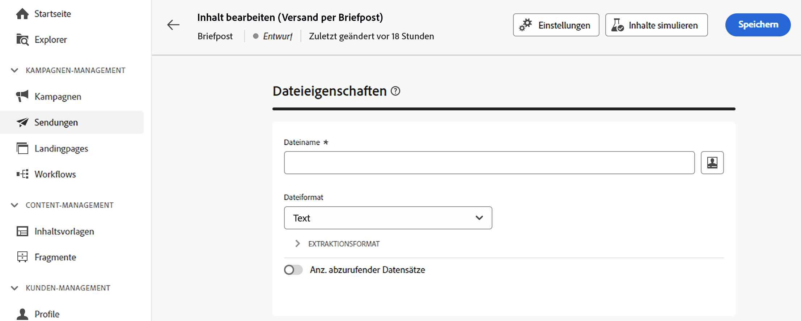
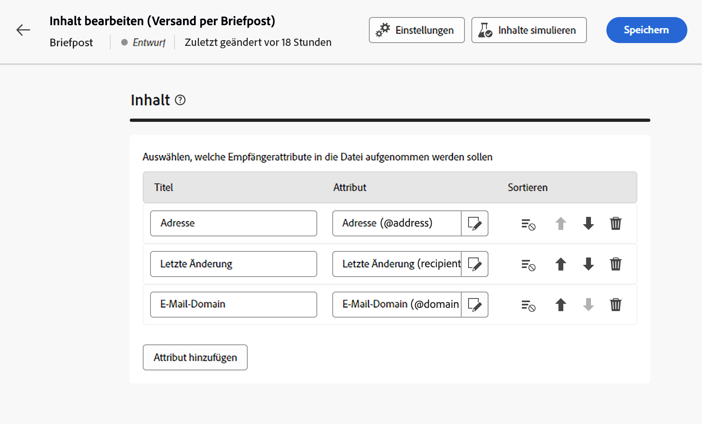

# Extraktionsdatei erstellen {#design-direct-mail}

>[!CONTEXTUALHELP]
>id="acw_directmail_content"
>title="Dateiinhalt extrahieren"
>abstract="Klicken Sie auf **Inhalt bearbeiten** -Schaltfläche, um mit der Erstellung der für Ihren Briefpost-Dienstleister erforderlichen Extraktionsdatei zu beginnen. Auf diese Weise können Sie die Dateieigenschaften wie Titel und Format definieren und die Spalten angeben, die Sie in die Datei aufnehmen möchten."

>[!CONTEXTUALHELP]
>id="acw_directmail_properties_file"
>title="Dateieigenschaften"
>abstract="Konfigurieren Sie die Eigenschaften der Extraktionsdatei, z. B. ihren Namen und ihr Format. Sie können den Dateinamen mithilfe von Attributen aus der Datenbank mithilfe des Ausdruckseditors personalisieren."

>[!CONTEXTUALHELP]
>id="acw_directmail_properties_content"
>title="Content"
>abstract="Geben Sie in diesem Abschnitt die Spalten an, die in der Extraktionsdatei angezeigt werden sollen. Nach Abschluss des Vorgangs können Sie mit der **Inhalt simulieren** Schaltfläche."

Um den Inhalt der von Ihrem Briefpost-Versand generierten Extraktionsdatei zu erstellen, klicken Sie auf die Schaltfläche **[!UICONTROL Inhalt bearbeiten]** auf Ihrer Versandseite und konfigurieren Sie dann die Dateieigenschaften und den Inhalt.

## Eigenschaften der Extraktionsdatei konfigurieren {#properties}

1. Im **[!UICONTROL Dateiname]** Geben Sie den gewünschten Namen für die Extraktionsdatei an. Sie können den Dateinamen mithilfe von Attributen aus der Datenbank personalisieren. Klicken Sie dazu auf die Schaltfläche **[!UICONTROL Personalisierungsdialogfeld öffnen]** -Symbol, um den Ausdruckseditor zu öffnen. [Erfahren Sie, wie Sie Ihren Inhalt personalisieren können](../personalization/personalize.md)

1. Im **[!UICONTROL Dateiformat]** das gewünschte Format für die Extraktionsdatei auswählen; **Text**, **Text mit festen Spalten**, **CSV (Excel)** oder **XML**.

1. Erweitern Sie die **[!UICONTROL Extraktionsformat]** um auf spezifische Optionen im Zusammenhang mit dem Format der Extraktionsdatei zuzugreifen. Die verfügbaren Werte hängen vom ausgewählten Format ab.

+++ Verfügbare Optionen für das Extraktionsformat

   * **[!UICONTROL Erste Zeile als Spaltenüberschrift verwenden]** (Format Text/CSV (Excel)): Schalten Sie diese Option ein, um die erste Spalte als Kopfzeile zu verwenden.
   * **[!UICONTROL Spaltentrennzeichen]** (Textformat): Geben Sie das Zeichen an, das in der Extraktionsdatei als Spaltentrennzeichen verwendet werden soll.
   * **[!UICONTROL Zeichenfolgentrennzeichen]** (Textformat): Geben Sie an, wie Zeichenfolgen in der Extraktionsdatei getrennt werden sollen.
   * **[!UICONTROL Zeilenende]** (Textformat): Geben Sie an, wie das Ende der Zeilen in der Extraktionsdatei getrennt werden soll.
   * **[!UICONTROL Kodierung]**: Wählen Sie die Kodierung der Extraktionsdatei aus.
   * **[!UICONTROL Datumsformat und Trennzeichen]**: Geben Sie an, wie Datumsangaben in der Extraktionsdatei formatiert werden sollen.
   * **[!UICONTROL Zahlenformat]**: Geben Sie an, wie Zahlen in der Extraktionsdatei formatiert werden sollen.
   * **[!UICONTROL Exportieren von Bezeichnungen anstelle der internen Werte von Auflistungen]**: Schalten Sie diese Option ein, wenn Sie Auflistungswerte exportieren und Spaltenbezeichnungen abrufen möchten, die leichter verständlich sind als interne IDs.

+++

1. Ein-/Ausschalten der **[!UICONTROL Beantragte Menge]** -Option, um die Anzahl der Empfänger für Ihren Versand zu begrenzen.

   {zoomable=&quot;yes&quot;}

## Extraktionsdateispalten konfigurieren {#content}

Im **[!UICONTROL Inhalt]** die Spalten angeben, die in der Extraktionsdatei angezeigt werden sollen. Gehen Sie dazu wie folgt vor:

1. Klicken Sie auf **[!UICONTROL Attribut hinzufügen]** -Schaltfläche, um eine neue Spalte zu erstellen.
1. Wählen Sie das Attribut aus, das in der Spalte angezeigt werden soll, und bestätigen Sie dann die Auswahl. Nachdem die Spalte hinzugefügt wurde, können Sie den Titel ändern und das zugehörige Attribut mithilfe des Bearbeitungssymbols ändern.
1. Wiederholen Sie diese Schritte, um so viele Spalten hinzuzufügen, wie für Ihre Extraktionsdatei benötigt werden.
1. Um die Extraktionsdatei anhand einer der Spalten zu sortieren, klicken Sie auf das Symbol im **[!UICONTROL Sortierung]** und wählen Sie die gewünschte Sortiermethode aus.
1. Um die Position einer Spalte zu ändern, verwenden Sie die Nach-oben- und Nach-unten-Pfeile.

Jetzt können Sie eine Vorschau der Extraktionsdatei anzeigen und den Versand starten, um die Extraktionsdatei zu erstellen. [Erfahren Sie, wie Sie Briefpost-Nachrichten testen und senden.](send-direct-mail.md)
