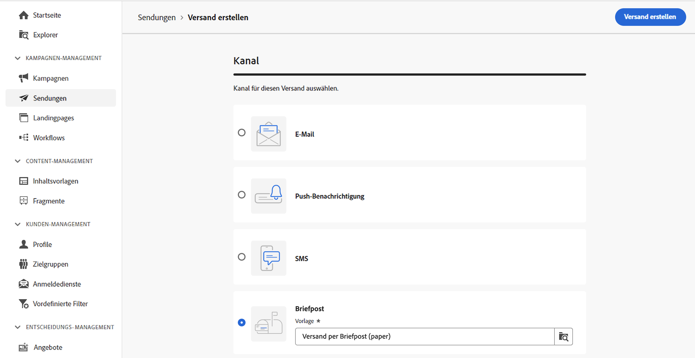
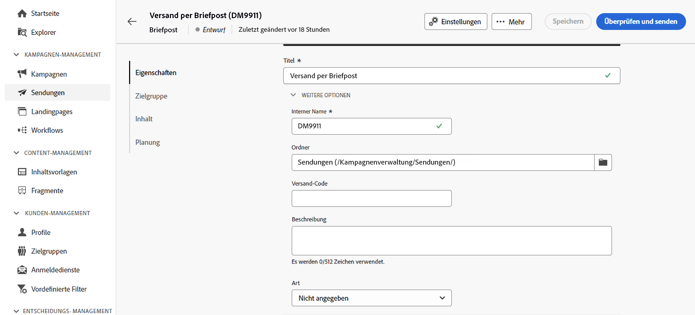
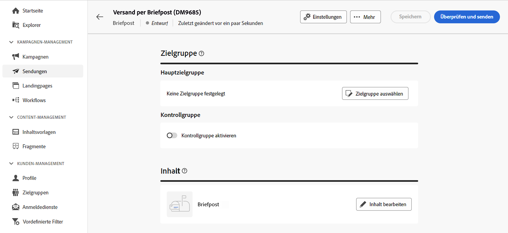
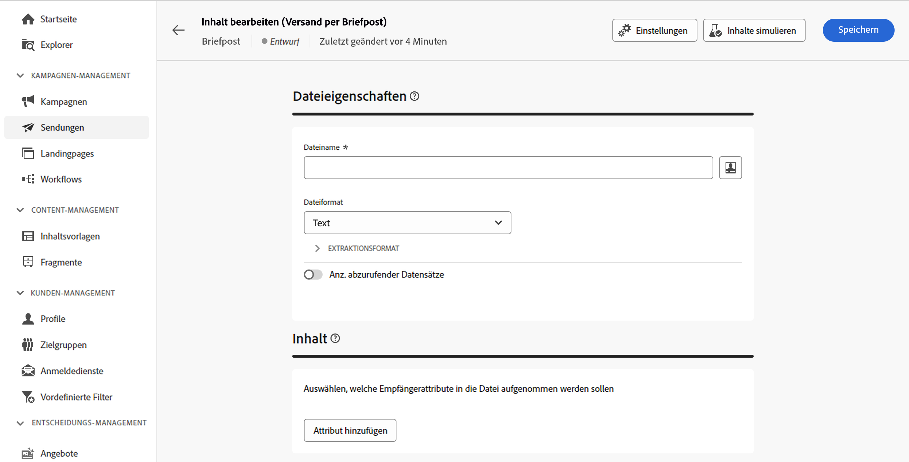
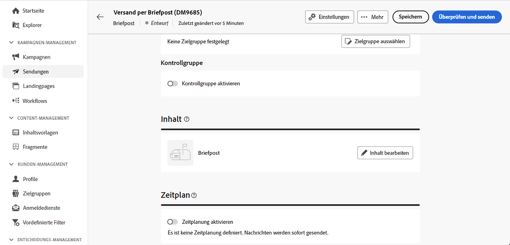

# Erstellen eines Briefpostversands {#create-direct-mail}

Sie können einen eigenständigen Briefpostversand erstellen oder einen Briefpostversand im Kontext eines Kampagnen-Workflows erstellen. Die folgenden Schritte beschreiben die Vorgehensweise für einen eigenständigen (einmaligen) Briefpostversand. Wenn Sie im Kontext eines Kampagnen-Workflows arbeiten, werden in [diesem Abschnitt](../workflows/activities/channels.md#create-a-delivery-in-a-campaign-workflow) die Schritte beschrieben, die zum Erstellen eines solchen Versands erforderlich sind.

Gehen Sie wie folgt vor, um einen neuen eigenständigen Briefpostversand zu erstellen:

1. Navigieren Sie zum Menü **[!UICONTROL Sendungen]** in der linken Leiste und klicken Sie auf die Schaltfläche **[!UICONTROL Versand erstellen]**.

1. Wählen Sie im Abschnitt **[!UICONTROL Kanal]** die Option **[!UICONTROL Briefpost]** als Kanal und dann eine Vorlage aus. [Weitere Informationen zu Vorlagen](../msg/delivery-template.md)

1. Klicken Sie zur Bestätigung auf **[!UICONTROL Versand erstellen]**.

   {zoomable="yes"}

1. Geben Sie einen **[!UICONTROL Titel]** für den Versand ein und rufen Sie die **[!UICONTROL Zusätzliche Optionen]** Dropdown-Liste auf. Wenn Ihr Versand auf einem erweiterten Schema basiert, stehen spezifische Felder für **Benutzerdefinierte Optionen** zur Verfügung.

   {zoomable="yes"}

   +++Konfigurieren Sie die folgenden Einstellungen entsprechend Ihren Anforderungen.
   * **[!UICONTROL Interner Name]**: Weisen Sie dem Versand eine eindeutige Kennung zu.
   * **[!UICONTROL Ordner]**: Speichern Sie den Versand in einem bestimmten Ordner.
   * **[!UICONTROL Versand-Code]**: Verwenden Sie dieses Feld, um Ihre Sendungen basierend auf Ihrer eigenen Namenskonvention zu organisieren.
   * **[!UICONTROL Beschreibung]**: Geben Sie eine Beschreibung für den Versand an.
   * **[!UICONTROL Art]**: Geben Sie die Art des Versands zu Klassifizierungszwecken an.
+++

1. Klicken Sie auf die Schaltfläche **[!UICONTROL Zielgruppe auswählen]**, um eine vorhandene Zielgruppe anzusprechen oder eine eigene zu erstellen. 

   * [Erfahren Sie, wie Sie eine vorhandene Zielgruppe auswählen.](../audience/add-audience.md)
   * [Erfahren Sie, wie Sie eine neue Zielgruppe erstellen.](../audience/one-time-audience.md)

   {zoomable="yes"}

   >[!NOTE]
   >
   >Die Empfängerinnen und Empfänger von Briefpost müssen mindestens den Namen und die Anschrift umfassen. Eine Anschrift gilt als vollständig angegeben, wenn die Felder Name, Postleitzahl und Ort nicht leer sind. Empfängerinnen und Empfänger mit unvollständigen Adressen werden von Direkt-Mail-Sendungen ausgeschlossen.

1. Aktivieren Sie die Option **[!UICONTROL Kontrollgruppe aktivieren]**, um eine Kontrollgruppe zum Messen der Wirkung Ihres Versands einzurichten. Nachrichten werden nicht an diese Kontrollgruppe gesendet. Sie können also das Verhalten der Population, die die Nachricht erhalten hat, mit dem Verhalten der Kontakte vergleichen, die die Nachricht nicht erhalten haben. [Erfahren Sie, wie Sie mit Kontrollgruppen arbeiten](../audience/control-group.md)

1. Klicken Sie auf **[!UICONTROL Inhalt bearbeiten]**, um die Informationen (Spalten) zu definieren, die in die Extraktionsdatei exportiert werden sollen. [Weitere Informationen](content-direct-mail.md)

   {zoomable="yes"}

1. Um den Versand für ein bestimmtes Datum und eine bestimmte Uhrzeit zu planen, aktivieren Sie die Option **[!UICONTROL Zeitplan aktivieren]**. Nach dem Start des Versands wird die Extraktionsdatei automatisch zu dem von Ihnen festgelegten Datum und zu der von Ihnen festgelegten Uhrzeit generiert. [Erfahren Sie, wie Sie Sendungen planen](../msg/gs-deliveries.md#gs-schedule).

   >[!NOTE]
   >
   >Wenn ein Versand im Rahmen eines Workflows durchgeführt wird, müssen Sie die **Planungs**-Aktivität verwenden. Weitere Informationen finden Sie auf [dieser Seite](../workflows/activities/scheduler.md).

1. Klicken Sie auf **[!UICONTROL Einstellungen]**, um auf die erweiterten Optionen für Ihre Versandvorlage zuzugreifen. [Weitere Informationen](../advanced-settings/delivery-settings.md)

   {zoomable="yes"}

1. Sobald Ihr Briefpostversand fertig ist, klicken Sie auf die Schaltfläche **[!UICONTROL Überprüfen und senden]**, um den Versand zu validieren und zu versenden und die Extraktionsdatei zu generieren. [Erfahren Sie, wie Sie einen Briefpostversand in einer Vorschau anzeigen und durchführen](send-direct-mail.md).