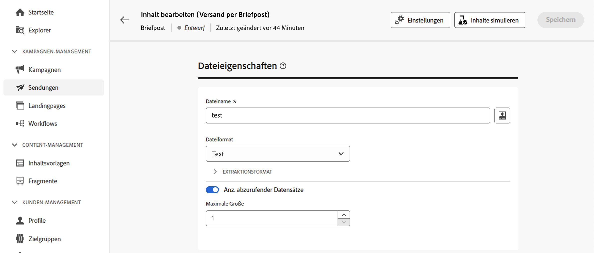
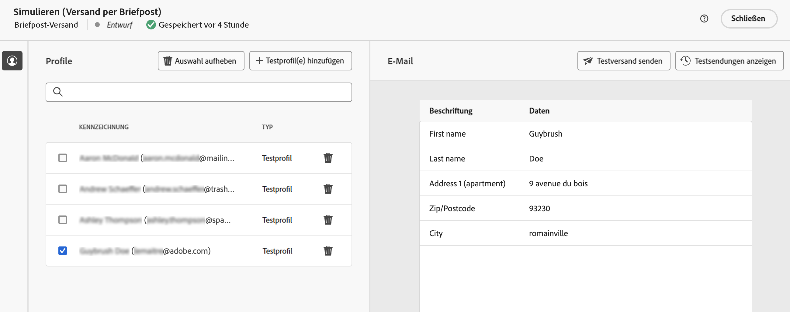
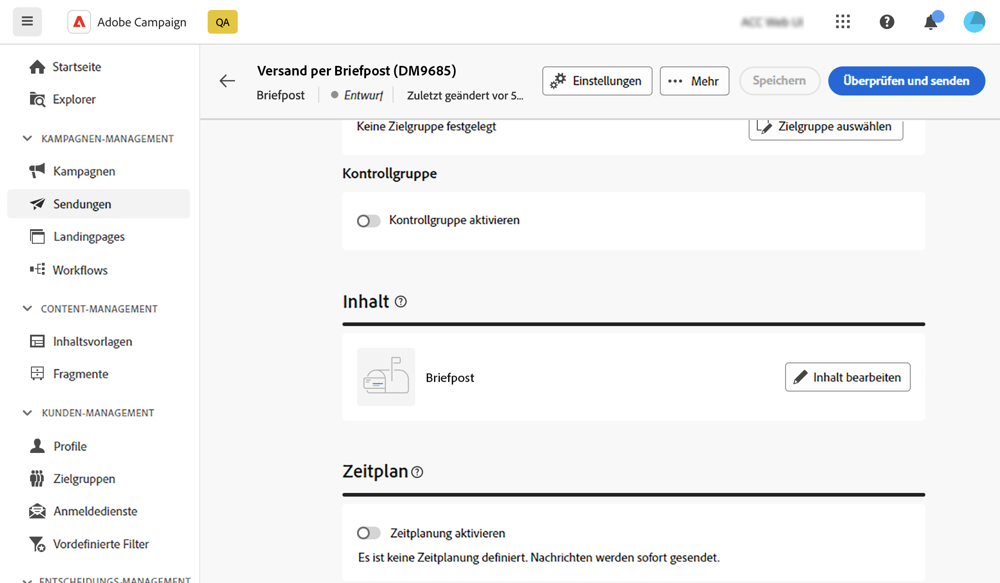
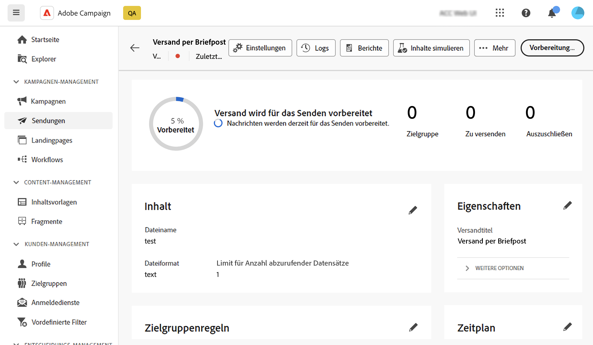

# Vorschau und Senden eines Briefpostversands {#send-direct-mail}

Nachdem Sie die Extraktionsdatei für den Briefpost-Versand konfiguriert haben, können Sie sie mit Testprofilen in der Vorschau anzeigen. Wenn personalisierte Inhalte enthalten sind, überprüfen Sie mithilfe von Testprofildaten, wie diese Inhalte in den Spalten angezeigt werden. Dadurch wird sichergestellt, dass der Dateiinhalt korrekt wiedergegeben und personalisierte Elemente entsprechend integriert werden.

Wenn die Extraktionsdatei bereit ist, senden Sie den Briefpost-Versand, um die Datei zu generieren und sie für Ihren Briefpostanbieter freizugeben. [Erfahren Sie, wie Sie einen Briefpostversand durchführen](#dm-send).

## Anzeigen der Extraktionsdatei in einer Vorschau {#preview-dm}

Die wichtigsten Schritte, um die Extraktionsdatei in einer Vorschau anzuzeigen, werden im Folgenden beschrieben. Weitere Informationen über die Vorschau von Sendungen finden Sie in [diesem Abschnitt](../preview-test/preview-content.md).

1. Auf der Seite für den Versandinhalt können Sie über die Option **[!UICONTROL Inhalt simulieren]** personalisierten Inhalt in einer Vorschau anzeigen.

   {zoomable="yes"}

1. Klicken Sie **[!UICONTROL Testprofil(e) hinzufügen]**, um ein oder mehrere Profile auszuwählen und eine Vorschau ihrer Daten im Inhalt der Extraktionsdatei anzuzeigen.

1. Im rechten Bereich sehen Sie sich eine Vorschau der Extraktionsdatei an, wo personalisierte Elemente dynamisch durch Daten aus dem ausgewählten Profil ersetzt werden.

   {zoomable="yes"}

## Durchführen von Testsendungen {#test-dm}

Führen Sie mit **Adobe Campaign** Testsendungen durch, bevor Sie sie an Ihre Hauptzielgruppe senden. Dieser Schritt validiert Ihren Versand und identifiziert alle Probleme. Empfängerinnen und Empfänger von Testsendungen überprüfen Elemente wie Personalisierungseinstellungen, um eine optimale Leistung sicherzustellen und Fehler zu erkennen. Dieser Prozess verfeinert und optimiert Ihre Extraktionsdatei, bevor sie Ihre Hauptzielgruppe erreicht.

Beim Briefpostversand wird durch Testsendungen eine Beispieldatei der Extraktionsdatei anhand von Daten aus den ausgewählten Testprofilen generiert. Gehen Sie wie folgt vor, um darauf zuzugreifen:

1. Klicken Sie im Bildschirm „Inhalt simulieren“ auf die Schaltfläche **[!UICONTROL Testversand durchführen]** und führen Sie dieselben Schritte aus wie bei jedem anderen Versandtyp, um einen Testversand durchzuführen. [Durchführen eines Testversands](../preview-test/test-deliveries.md)

1. Sobald der Testversand gesendet wurde, greifen Sie über die Schaltfläche **[!UICONTROL Testsendungen anzeigen]** oder über die Versandliste darauf zu. [Erfahren Sie, wie Sie auf durchgeführte Testsendungen zugreifen](../preview-test/test-deliveries.md#access-test-deliveries).

1. Klicken Sie im Dashboard des Testversands auf die Schaltfläche **[!UICONTROL Vorschau der Datei]**, um auf eine Vorschau der Extraktionsdatei zuzugreifen.

   {zoomable="yes"}

   >[!NOTE]
   >
   >Nur die ersten 100 Zeilen werden in der Vorschaudatei dargestellt.

## Durchführen eines Briefpostversands {#send-dm}

Sobald Ihre Briefpost für den Versand an Ihre Kunden bereit ist, senden Sie den Versand, um die Datenextraktion in der angegebenen Extraktionsdatei zu starten. Gehen Sie dazu wie folgt vor:

1. Nachdem Sie den Inhalt Ihrer Extraktionsdatei gestaltet haben, klicken Sie auf der Seite **[!UICONTROL Versand]** auf **[!UICONTROL Überprüfen und senden]**.

   {zoomable="yes"}

1. Klicken Sie auf **[!UICONTROL Vorbereiten]** und überwachen Sie den Fortschritt und die bereitgestellten Statistiken.

   Wenn Fehler auftreten, finden Sie im Menü **[!UICONTROL Protokolle]** detaillierte Informationen zum Fehler.

   {zoomable="yes"}

1. Senden Sie die Nachrichten, indem Sie **[!UICONTROL Senden]** klicken, um mit dem endgültigen Versandprozess fortzufahren.

1. Bestätigen Sie den Sendevorgang durch Klicken auf **[!UICONTROL Senden]**.

   Wenn der Briefpost-Versand geplant ist, klicken Sie auf die Schaltfläche **[!UICONTROL Nach Zeitplan senden]**. Weitere Informationen zur Versandplanung finden Sie in [diesem Abschnitt](../msg/gs-messages.md#schedule-the-delivery-sending).

Nach dem Versand wird die Extraktionsdatei automatisch generiert und an den Speicherort exportiert, der im in den [erweiterten Einstellungen](../advanced-settings/delivery-settings.md) der Versandvorlage ausgewählten externen Konto **[!UICONTROL Routing]** angegeben ist.

Verfolgen Sie Ihre KPI-Daten (Key Performance Indicator) von Ihrer Versandseite und Daten über das Menü **[!UICONTROL Protokolle]**.

Beginnen Sie mit der Messung der Wirkung Ihrer Nachricht mit integrierten Berichten. [Weitere Informationen](../reporting/direct-mail.md)