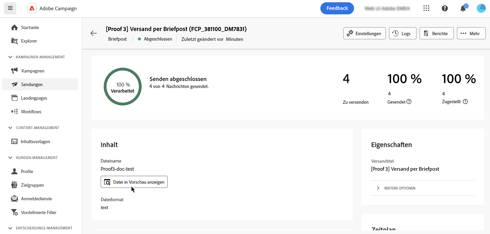

# Vorschau und Senden eines Briefpostversands {#send-direct-mail}

Nachdem Sie die Extraktionsdatei für den Briefpostversand konfiguriert haben, können Sie anhand von Testprofilen eine Vorschau davon anzeigen. Wenn personalisierte Inhalte enthalten sind, überprüfen Sie mithilfe von Testprofildaten, wie diese Inhalte in den Spalten angezeigt werden. Dadurch wird sichergestellt, dass der Dateiinhalt korrekt gerendert wird und dass die personalisierten Elemente entsprechend integriert werden.

Wenn die Extraktionsdatei fertig ist, können Sie den Briefpostversand durchführen, um die Datei zu generieren und an Ihren Briefpost-Dienstleister weiterzugeben. [Erfahren Sie, wie Sie einen Briefpostversand durchführen](#dm-send).

## Anzeigen der Extraktionsdatei in einer Vorschau {#preview-dm}

Die wichtigsten Schritte, um die Extraktionsdatei in einer Vorschau anzuzeigen, werden im Folgenden beschrieben. Weitere Informationen über die Vorschau von Sendungen finden Sie in [diesem Abschnitt](../preview-test/preview-content.md).

1. Auf der Seite für den Versandinhalt können Sie über die Option **[!UICONTROL Inhalt simulieren]** personalisierten Inhalt in einer Vorschau anzeigen.

   {zoomable="yes"}

1. Klicken Sie auf **[!UICONTROL Testprofil(e) hinzufügen]**, um mindestens ein Profil auszuwählen und die zugehörigen Daten im Inhalt der Extraktionsdatei in einer Vorschau anzuzeigen.

1. Zeigen Sie im rechten Bereich eine Vorschau der Extraktionsdatei an, in der personalisierte Elemente dynamisch durch Daten aus dem ausgewählten Profil ersetzt werden.

   {zoomable="yes"}

## Senden von Testsendungen {#test-dm}

Mit **Adobe Campaign** können Sie Testsendungen senden, bevor sie an Ihre Hauptzielgruppe gesendet werden. Dieser Schritt validiert den Versand und identifiziert Probleme. Empfängerinnen und Empfänger von Testsendungen können überprüfen Elemente wie Personalisierungseinstellungen, um eine optimale Leistung sicherzustellen und Fehler zu erkennen. Durch diesen Prozess wird Ihre Extraktionsdatei verfeinert und optimiert, bevor sie Ihre Hauptzielgruppe erreicht.

Beim Briefpostversand wird durch Testsendungen eine Beispieldatei der Extraktionsdatei anhand von Daten aus den ausgewählten Testprofilen generiert. Gehen Sie wie folgt vor, um darauf zuzugreifen:

1. Klicken Sie im Bildschirm „Inhalt simulieren“ auf die Schaltfläche **[!UICONTROL Testversand durchführen]** und führen Sie dieselben Schritte aus wie bei jedem anderen Versandtyp, um einen Testversand durchzuführen. [Durchführen eines Testversands](../preview-test/test-deliveries.md)

1. Sobald der Testversand versendet wurde, können Sie über die Schaltfläche **[!UICONTROL Testsendungen anzeigen]** oder die Versandliste darauf zugreifen. [Erfahren Sie, wie Sie auf durchgeführte Testsendungen zugreifen](../preview-test/test-deliveries.md#access-test-deliveries).

1. Klicken Sie im Testversand-Dashboard auf die Schaltfläche **[!UICONTROL Datei in Vorschau anzeigen]**, um eine Vorschau der Extraktionsdatei anzuzeigen.

   {zoomable="yes"}

   >[!NOTE]
   >
   >Nur die ersten 100 Zeilen werden in der Vorschaudatei dargestellt.

## Durchführen eines Briefpostversands {#send-dm}

Sobald Ihre Briefpost für den Versand an Ihre Kundinnen und Kunden bereit ist, können Sie den Versand durchführen, um mit der Datenextraktion in der angegebenen Extraktionsdatei zu beginnen. Gehen Sie dazu wie folgt vor:

1. Nachdem Sie den Inhalt Ihrer Extraktionsdatei gestaltet haben, klicken Sie auf der Seite **[!UICONTROL Versand]** auf **[!UICONTROL Überprüfen und senden]**.

   {zoomable="yes"}

1. Klicken Sie auf **[!UICONTROL Vorbereiten]** und überwachen Sie den Fortschritt und die bereitgestellten Statistiken.

   Wenn Fehler auftreten, finden Sie im Menü **[!UICONTROL Protokolle]** detaillierte Informationen zum Fehler.

   {zoomable="yes"}

1. Senden Sie die Nachrichten, indem Sie auf **[!UICONTROL Senden]** klicken, um mit dem endgültigen Versandprozess fortzufahren.

1. Bestätigen Sie den Sendevorgang durch Klicken auf **[!UICONTROL Senden]**.

   Wenn der Briefpostversand zeitlich geplant wurde, klicken Sie auf die Schaltfläche **[!UICONTROL Nach Zeitplan senden]**. Weitere Informationen zur Versandplanung finden Sie in [diesem Abschnitt](../msg/gs-messages.md#schedule-the-delivery-sending).

Nach dem Versand wird die Extraktionsdatei automatisch generiert und an den Speicherort exportiert, der im in den [erweiterten Einstellungen](../advanced-settings/delivery-settings.md) der Versandvorlage ausgewählten externen Konto **[!UICONTROL Routing]** angegeben ist.

Verfolgen Sie die Daten Ihrer KPIs (Key Performance Indicators) über Ihre Versandseite und weitere Daten über das Menü **[!UICONTROL Logs]**.

Messen Sie die Wirkung Ihrer Nachricht mit integrierten Berichten. [Weitere Informationen](../reporting/direct-mail.md)