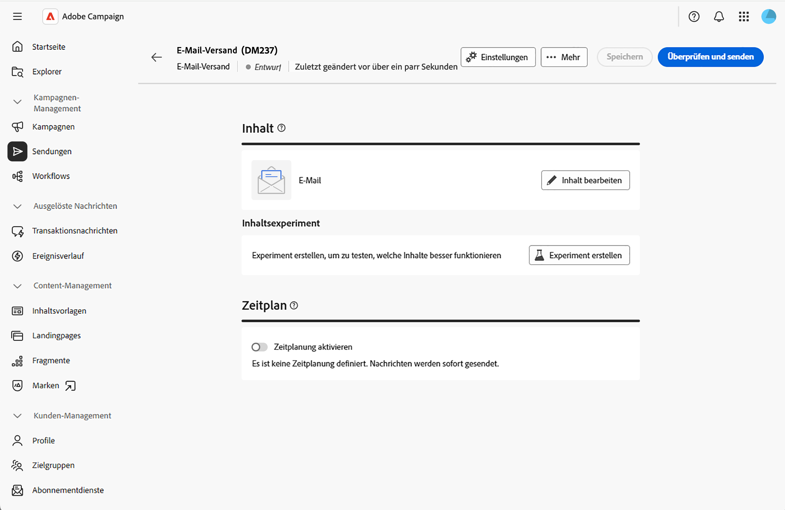
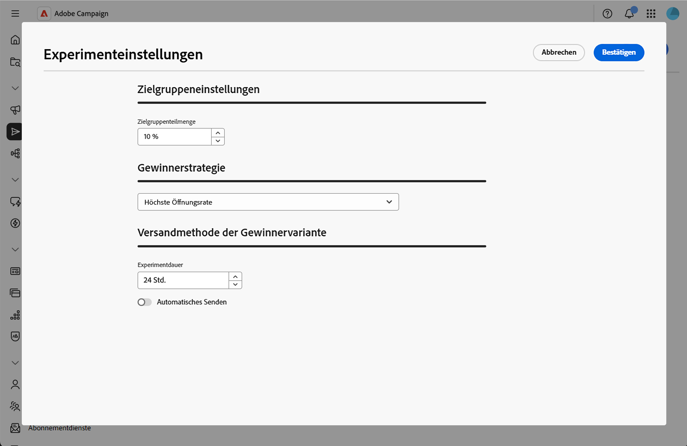
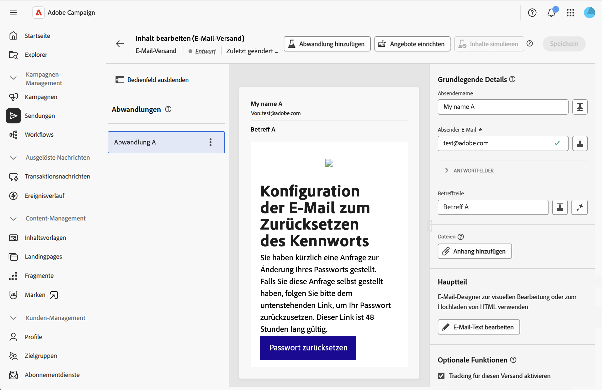
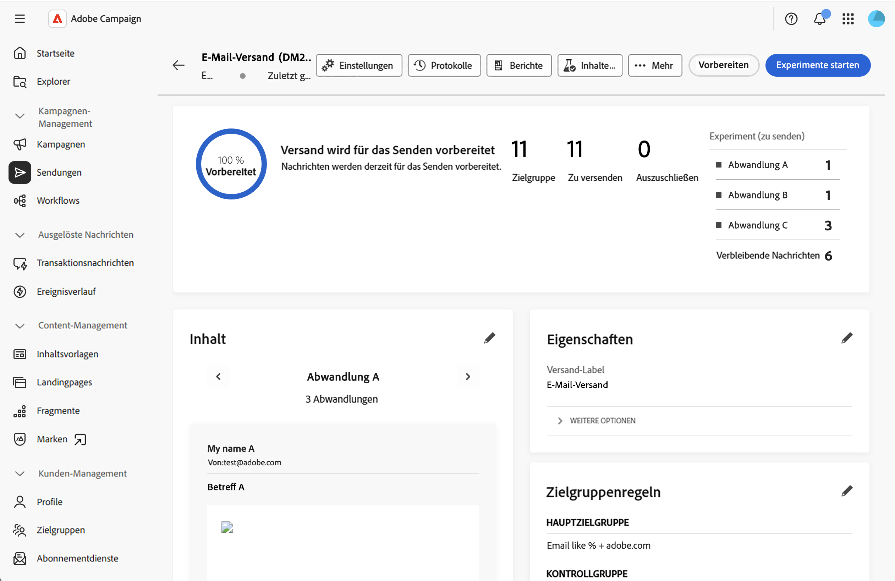

# Erstellen von Inhaltsexperimenten {#content-experiment}

>[!CONTEXTUALHELP]
>id="acw_deliveries_email_content_experiment"
>title="Experimente mit Inhalten"
>abstract="Mit Inhaltsexperimenten können Sie mehrere Varianten von A/B-Tests für den Versand definieren, um zu messen, welche für Ihre Zielgruppe am besten geeignet ist. Sie können Versandinhalt, Betreff oder Absender variieren, um verschiedene Versionen zu testen und festzustellen, welche Variante die besten Ergebnisse erzielt."

## Informationen zu Inhaltsexperimenten {#about-content-experiment}

Mit Inhaltsexperimenten in Adobe Campaign Web können Sie mehrere Varianten von A/B-Tests für den Versand definieren, um zu messen, welche für Ihre Zielgruppe am besten geeignet ist. Sie können Versandinhalt, Betreff oder Absender variieren, um verschiedene Versionen zu testen und festzustellen, welche Variante die besten Ergebnisse erzielt.

Sie können A/B-Tests für verschiedene E-Mail-Elemente durchführen, z. B.:

* **Betreffzeile**: Testen Sie verschiedene E-Mail-Betreffzeilen, um zu sehen, welche die höchste Öffnungsrate generiert
* **Absendername**: Experimentieren Sie mit verschiedenen Absenderkombinationen
* **E-Mail-Textinhalt**: Erstellen Sie mehrere Inhaltsversionen, um zu ermitteln, welche die beste Klickrate erzielt

>[!NOTE]
>
>* Inhaltsexperimente sind derzeit nur für den E-Mail-Kanal verfügbar.
>* A/B-Tests werden für Transaktionsnachrichten nicht unterstützt.
>* Maximal 3 Abwandlungen (Varianten) pro Experiment.

## Erstellen eines Inhaltsexperiments {#create-content-experiment}

Gehen Sie wie folgt vor, um Ihrem E-Mail-Versand ein Inhaltsexperiment hinzuzufügen:

1. Erstellen Sie einen E-Mail-Versand oder öffnen Sie einen vorhandenen Versandentwurf. [Erfahren Sie, wie Sie eine E-Mail erstellen](create-email.md)

1. Klicken Sie auf der Seite mit den Eigenschaften des E-Mail-Versands im Abschnitt **[!UICONTROL Inhalt]** auf die Schaltfläche **[!UICONTROL Experiment erstellen]**.

   {zoomable="yes"}

## Konfigurieren der Experimenteinstellungen {#configure-experiment}

Konfigurieren Sie Ihr Experiment anhand der folgenden Abschnitte:

{zoomable="yes"}

### Zielgruppeneinstellungen {#audience-settings}

Definieren Sie den Prozentsatz Ihrer Zielpopulation, der die Experimentvarianten erhalten soll.

Geben Sie einen Wert ein, um die Zielgruppengröße festzulegen. Dies stellt den Anteil der Empfängerinnen und Empfänger dar, die während der Testphase eine der Experimentvarianten erhalten.

* **Minimum**: 1 %
* **Maximum**: 100 %
* **Standard**: 10 %

Die verbleibende Zielgruppe (standardmäßig 90 %) erhält die erfolgreichste Variante, sobald das Experiment abgeschlossen und ein Gewinner ermittelt wurde.

Bei einer Zielgruppe von 10.000 Empfängerinnen und Empfängern und einer Zielgruppengröße von 10 % werden beispielsweise 1.000 Empfängerinnen und Empfänger nach dem Zufallsprinzip für die Teilnahme am Experiment ausgewählt. Die restlichen 9.000 Empfängerinnen und Empfänger erhalten die Gewinnervariante nach Ablauf des Experiments.

### Gewinnerstrategie {#winning-strategy}

Definieren Sie die Metrik, auf der die Auswahl der Gewinnervariante basiert:

* **[!UICONTROL Höchste Öffnungsrate]** (Standard): Die Variante mit dem höchsten Prozentsatz an E-Mail-Öffnungen gewinnt
* **[!UICONTROL Höchste Klickrate]**: Die Variante mit dem höchsten Prozentsatz an Klicks in der E-Mail gewinnt
* **[!UICONTROL Niedrigste Abmelderate]**: Die Variante mit dem niedrigsten Prozentsatz an Abmeldungen gewinnt

Das System verfolgt diese Metriken während des Experiments automatisch nach und berechnet, welche Variante gemäß Ihrem ausgewählten Kriterium am besten abschneidet.

### Versandmethode der Gewinnervariante {#sending-method}

Legen Sie fest, wie lange das Experiment ausgeführt werden soll, und wählen Sie die Versandmethode aus:

1. Geben Sie den Wert für die Dauer in Stunden ein. Das Experiment wird für diesen Zeitraum ausgeführt, bevor die erfolgreichste Variante ermittelt wird.

   * **Minimum**: 3 Stunden
   * **Maximum**: 240 Stunden (10 Tage)
   * **Standard**: 24 Stunden

   >[!NOTE]
   >
   >Stellen Sie sicher, dass die Experimentdauer lang genug ist, um aussagekräftige Daten zu erfassen. Eine kurze Dauer liefert möglicherweise keine ausreichende statistische Signifikanz, insbesondere bei Metriken wie der Klickrate, deren Akkumulation länger dauern kann.

1. Wählen Sie, wie die Gewinnervariante an die verbleibende Population gesendet werden soll:

   * **[!UICONTROL Automatisches Senden]** aktiviert: Nach Abschluss des Experiments sendet das System die erfolgreichste Variante automatisch an die verbleibende Zielgruppe.
   * **[!UICONTROL Automatisches Senden]** deaktiviert: Sie müssen manuell auf die Schaltfläche **[!UICONTROL Senden]** klicken, um die erfolgreichste Variante nach Prüfung der Ergebnisse des Experiments zu senden.

Wenn am Ende des Experiments keine Variante signifikant bessere Ergebnisse erzielt als die anderen, sendet das System die erste Variante an die verbleibende Population. Weitere Informationen finden Sie in diesem [Abschnitt](#send-deliveries).

## Definieren der Inhaltsabwandlungen {#define-content}

Nach dem Speichern der Experimenteinstellungen wird standardmäßig eine erste Abwandlung erstellt. Jetzt müssen Sie Ihre anderen Abwandlungen (bis zu drei) hinzufügen und deren spezifischen Inhalt definieren.

1. Klicken Sie in den Versandeigenschaften auf die Schaltfläche **[!UICONTROL Inhalt bearbeiten]**. Abwandlungen werden auf der linken Seite angezeigt.

   {zoomable="yes"}

1. Klicken Sie auf die Schaltfläche **[!UICONTROL Abwandlung hinzufügen]** und definieren Sie ihren Namen. Wiederholen Sie diesen Vorgang für alle Abwandlungen, die Sie hinzufügen müssen. Sie können dann ihren Namen ändern, sie duplizieren und entfernen.

1. Klicken Sie auf die einzelnen Abwandlungen und passen Sie die folgenden Elemente an:

   * **Absendername**: Passen Sie an, welcher Absendername für die E-Mail verwendet wird
   * **Betreffzeile**: Erstellen Sie für jede Abwandlung eine eindeutige Betreffzeile
   * **E-Mail-Text**: Erstellen Sie verschiedene Inhaltsversionen mit dem E-Mail-Designer

   {zoomable="yes"}

1. Zeigen Sie eine Vorschau jeder Abwandlung an, indem Sie auf die gewünschte Abwandlung und dann auf **[!UICONTROL Inhalte simulieren]** klicken.

## Starten des Experiments und Überwachen der Ergebnisse {#validate-start}

Nachdem Sie alle Inhaltsabwandlungen definiert haben, können Sie das Experiment validieren und starten.

1. Klicken Sie in den Versandeigenschaften auf **[!UICONTROL Überprüfen und senden]** und dann auf **[!UICONTROL Vorbereiten]**.

1. Klicken Sie dann auf **[!UICONTROL Experimente starten]**, um den A/B-Test zu starten.

   {zoomable="yes"}

1. Sobald Ihr Experiment ausgeführt wird, überwachen Sie die verschiedenen Metriken, die im Versand-Dashboard angezeigt werden.

Während des Experiments können Sie auf **[!UICONTROL Versand stoppen]** klicken, um das Experiment zu beenden. Sie können auch manuell vor dem Ende des Experiments senden, indem Sie auf **[!UICONTROL Auswählen und an Gewinner senden]** klicken.

>[!NOTE]
>
>Die Ergebnisse werden nahezu in Echtzeit aktualisiert, wenn Empfangende mit Ihrer E-Mail interagieren. Frühzeitige Ergebnisse haben jedoch möglicherweise keine statistische Signifikanz – es wird empfohlen, zu warten, bis die Experimentdauer abgeschlossen ist, bevor endgültige Entscheidungen getroffen werden.

## Senden der Sendungen {#send-deliveries}

Der Versand kann automatisch oder manuell durchgeführt werden, je nachdem, was Sie in den Einstellungen unter **[!UICONTROL Versandmethode der Gewinnervariante]** ausgewählt haben. Weitere Informationen finden Sie in diesem [Abschnitt](#sending-method).

### Automatisches Senden {#automatic-sending}

Für den automatischen Versand analysiert das System die Ergebnisse basierend auf Ihrer Gewinnstrategie und bestimmt die erfolgreichste Abwandlung. Die erfolgreichste Abwandlung wird automatisch an die verbleibende Zielgruppe gesendet. Sollte sich kein eindeutiger Gewinner herausstellen, wird die erste Variante gewählt.

### Manuelles Senden {#manual-sending}

Wenn Sie den manuellen Versand konfiguriert haben, überprüfen Sie die Ergebnisse am Ende des Experiments und klicken Sie auf **[!UICONTROL Senden]**, um die erfolgreichste Abwandlung zu senden. Wenn kein eindeutiger Gewinner ermittelt wurde, wird standardmäßig die erste Abwandlung ausgewählt, Sie können jedoch eine andere wählen.

## Anzeigen der endgültigen Ergebnisse {#final-results}

Nachdem Ihr Experiment abgeschlossen und der Versand vollständig abgeschlossen ist, können Sie auf umfassende Berichte zugreifen:

1. Klicken Sie im Versand-Dashboard auf **[!UICONTROL Berichte]**.

1. Navigieren Sie zur Berichtsregisterkarte **[!UICONTROL Experimente]**, um die wichtigsten Leistungsmetriken für jede Abwandlung anzuzeigen.

## Best Practices {#best-practices}

Beachten Sie beim Erstellen von Inhaltsexperimenten die folgenden Empfehlungen:

* **Testen Sie jeweils ein Element**: Um möglichst klare Ergebnisse zu erzielen, testen Sie Varianten eines einzelnen Elements (z. B. nur die Betreffzeile oder nur den Inhalt) und nicht mehrerer Elemente gleichzeitig.

* **Wählen Sie eine angemessene Dauer**: Erlauben Sie genügend Zeit für statistische Signifikanz:
   * Bei Tests der Öffnungsrate: 12–24 Stunden sind normalerweise ausreichend
   * Bei Tests der Klickrate: 24–48 Stunden oder mehr können erforderlich sein
   * Größere Zielgruppen benötigen möglicherweise weniger Zeit; kleinere Zielgruppen benötigen möglicherweise mehr Zeit

* **Wählen Sie eine angemessene Größe der Zielgruppe**:
   * Stellen Sie sicher, dass die Zielgruppe für Ihr Experiment (der Prozentsatz, der den Tests zugewiesen wird) groß genug ist, um aussagekräftige Ergebnisse zu erzielen
   * Allgemeine Richtlinie: Mindestens 1.000 Empfängerinnen und Empfänger pro Abwandlung für zuverlässige Ergebnisse

* **Testen Sie regelmäßig, aber nicht übermäßig**: Führen Sie Experimente an wichtigen Kampagnen durch, vermeiden Sie jedoch, jeden einzelnen Versand zu testen, um Ressourcen auf wirkungsvolle Entscheidungen zu konzentrieren.

* **Dokumentieren Sie Ihre Erkenntnisse**: Führen Sie Aufzeichnungen über die Ergebnisse der Experimente, um sich in zukünftigen Kampagnenstrategien darauf stützen zu können.

## Verwandte Themen {#related-topics}

* [Erstellen Ihrer ersten E-Mail](create-email.md)
* [Konfigurieren von E-Mail-Inhalten](edit-content.md)
* [Anzeigen der Vorschau und Senden einer E-Mail](../monitor/prepare-send.md)
* [E-Mail-Versandberichte](../reporting/email-report.md)
